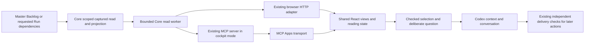

# SD: Embedded AGDF Cockpit for Codex

Status: draft
Gate: SD
Gate approval: open
Based on: PRD
Date: 2026-10-07
Owner: Arndt Gold
Run: agdf-cockpit-mcp-app-20261005-01
Traceability contract: criteria-chain-v1
Design Decisions contract: sd-decisions-v1

## 1. Solution Overview

Extend the existing MCP server implementation with an explicit local cockpit mode. That mode exposes only cockpit rendering and reads; the ordinary server retains its current dispatch/inspection tools. Both modes use the same trusted runtime composition and existing Core ownership. The local cockpit server is a separately named project connection so it does not replace the installed governance server or create another dispatcher in the host.

Reuse React navigation, reading state, document rendering and DTO validation through a transport interface. Browser transport retains its existing loopback session. Embedded transport uses MCP Apps via a bundled, pinned frontend SDK. Both consume the same bounded Core projection and dependency-scoped immutable capture, with explicit Context Graph references and context preparation. The initial overview reads only the Master Backlog; visible rows may then enrich their displayed titles from explicitly linked UR headings through a bounded immutable title transition; an explicitly named Run opens directly through Core without first building an all-Run inventory. Registered source/context views load deliberately and replace the current read scope. No canonical control writer is reachable through the cockpit mode. One owned MCP server remains running per connection; each opened view receives an independent bounded ephemeral read session. Rendering another view never retires an existing view. Context publication has one connection-wide ephemeral owner, separate from read ownership.

This revised design is proposed, not implementation or installed evidence for linked UR titles. The PRD remains the sole acceptance source. Previously implemented scoped reads and area navigation retain their dated evidence but require renewed TP qualification.

## 2. Ownership And Source Of Truth

| Concern | Authoritative owner | Change/reuse boundary |
|---|---|---|
| Run, approval, artefact and graph facts | .agdf/control/runs/, registered artefacts and CONTEXT_GRAPH.md | Read original target only; no new database or graph writer |
| Overview orientation | .agdf/control/MASTER_BACKLOG.md; existing shared backlog parser | Membership, counts, row order and stored status/next step remain backlog facts; no gate evaluation, Run-validity claim or complete Run inventory |
| Displayed list title | The unique explicitly linked UR heading, read by the existing Core capture/projection; original backlog title as fallback | Passive observed heading with source/hash/time; no writer projection, inferred UR path, full Run evaluation or title database |
| Effective delivery state | Existing Core readers/evaluators and validators | No new gate rules; observation and selection never confer authority |
| Captured bytes and read limits | packages/core/lib/control-read/ | Extend existing containment/capture/revalidation owner with bounded dependency recording and frozen replay; no duplicate filesystem reader |
| Cockpit projection and source selection | packages/core/lib/control-inspect/cockpit.js | Extend existing owner with graph/context operations; retain opaque scoped selectors |
| Async read worker and queue | Core control-read/control-inspect seam, extracted from packages/control-ui/server/pool.mjs and read-worker.mjs | One shared implementation; browser wrappers preserve old imports/call behavior |
| Runtime service composition | packages/core/lib/index.js and packages/cli/lib/mcp-dispatch-runtime.js | Expose the same cockpit read service via the existing explicit resource context |
| MCP wire schema, registration and response shaping | packages/mcp-server/src/ | Typed render/read definitions and app resource metadata; no business evaluation here |
| UI navigation and temporary state | packages/control-ui/src/App.tsx, state.ts and shared views | Transport injection and context-selection controller; no copied dashboard |
| UI data validation | packages/control-ui/src/api.ts and types.ts | Extract/share envelope and operation DTO checks across transports |
| Local assembly/provenance | scripts/assemble-npm.mjs; existing local-source preparation and mcp-lifecycle/package.js | Separate opt-in output; reuse exact-version/digest ownership marker |
| Human decisions and later execution | Existing installed AGDF workflow | Separate connection, exact target/run/revision checks; never infer approval from UI |

No source-of-truth ownership changes. Planned file names below describe additions under these owners, not a replacement architecture.

## 3. Architecture Decisions

- SDD-001: Extend the existing shared Core capture/projection with immutable dependency-scoped read transitions: Master-Backlog-only initial overview followed by bounded visible linked-UR title transitions, direct named-Run evaluation, then registered document/context scope on demand, recording and replaying the existing readers/evaluator dependency closure and revalidating files/absence/enumerations; rationale: unrelated historical evidence must not prevent a small view from opening or require every Run to be evaluated; consequence: private cockpit DTOs, UI/HTTP adapters and snapshot/resource transitions change together while Core rules, fixed byte bounds and default governance interfaces remain unchanged.
- SDD-002: Use the portable MCP Apps protocol with @modelcontextprotocol/ext-apps 2.0.3 in the private frontend only and SDK-2 native server registration; rationale: reuse maintained bridge lifecycle while preserving the existing owned server SDK graph; consequence: exact package availability, lockfile and host interoperability must be proven, with no unreviewed version fallback or handwritten general bridge.
- SDD-003: Preserve the opt-in cockpit-only server, fixed resource, explicit initial Run focus and bounded read tool; use up to four independent ephemeral view sessions per connection with scoped close/expiry and bounded private workers/captures; rationale: opening a second card must not expire another visible card or multiply processes without a fixed budget; consequence: capacity rejection preserves existing views; session/snapshot/resource isolation and per-view release require fresh tests, while ordinary MCP/browser behavior remains a separate regression lane.
- SDD-004: Resolve only run-owned explicit graph references to exact maintained Markdown node headings and issue opaque graph selectors; rationale: relevance must come from maintained relationships without filesystem expansion or inferred graph edges; consequence: unknown reference forms remain identifiable unsupported/unresolved states.
- SDD-005: Prepare one bounded server-validated context packet containing source bytes, hashes and provenance, then acknowledge model-context update before a deliberate question; rationale: visible selection and model-facing evidence must agree and transport acknowledgement is not authorization; consequence: preparation may reject large sources, and context/message failures have separate recovery states.
- SDD-006: Bind each handoff controller immutably to its view session, serialize that view's publication/question/invalidation requests, and coordinate them through one exclusive Core publication owner per connection. Release ownership only after acknowledged host invalidation and checked server completion; rationale: independent iframe queues cannot order each other; one view must not clear another view's context; consequence: competing handoffs are explicitly busy, uncertain owner cleanup blocks new handoff without disabling reads, and historical messages remain outside app control.
- SDD-007: Assemble and qualify one separate owned local Codex cockpit runtime, with inline assets inside its server digest and unchanged default/public profiles; rationale: actual-host proof needs reproducible UI/runtime provenance without replacing the installed governance plugin; consequence: explicit connection/setup read-back and cleanup evidence are required, with no publication or automatic global installation.

## 4. Integration Points

### 4.1 Shared read execution and frontend transport

Move the existing bounded ReadWorkerPool implementation and reader worker entry to their Core owners. Preserve one active request plus one queued request, current cancellation behavior and the ten-second queue/active deadline. A timeout or worker failure replaces the worker and invalidates all its selectors. Browser modules re-export/delegate rather than keep a copied pool. Ordinary native/live CLI and dispatch reads remain unchanged.

Expose a transport-neutral interface for scoped snapshot, run, document, freshness, related context and prepared context results. Overview and explicit named opening use separate discriminated projections, not an unvalidated Run list. Each deliberate scope transition returns its fresh immutable snapshot and matching parent data; frontend accepts snapshot replacement only at that transition. The initial overview performs no linked-source read. Only the bounded visible-row UR title transition in section 4.1.2 may add explicitly linked UR files for list headings; it never performs Run or gate evaluation. The browser adapter maps supported reading methods to existing HTTP routes; the new graph read may add a bounded read-only route. The browser does not gain host-message/context privileges. The MCP adapter maps the same semantic operations to the read tool. Abort signals, operation DTO validation, target/snapshot checks and generation checks remain shared. Host bridge state and context publication orchestration belong in a focused controller, outside document rendering and the generic reading reducer.

The shared compact card fills its available container; narrower surfaces stack content, while container widths at least 640px arrange selection and status/evidence in two columns. The shared brand header has a compact variant, preserving the original Pages logo, decorative image, fonts and theme tokens. Large backlog overviews retain the three counted Active/Planned/Archive switches and one-column lists. Each area displays stored rows in reverse source order and supports temporary filtering of backlog title/key/stored status plus already observed UR titles; this neither navigates nor removes the inspected selection. The visible search scope note states that UR titles are searched only once loaded, without claiming a complete UR search. Backlog limitations stay visible as a counted expandable notice with affected pointer/source identities and explicit diagnostics; never represent unchecked pointer rows as evaluated Runs. Expanded embedded detail responds to its own container width. The browser card may use a centered 1100px ceiling; native card width follows the host. Content height follows readable wrapping and available content, never a forced fixed viewport height or compressed type.

The embedded UI has a separate entrypoint and compact launcher; it mounts the common cockpit views only when the user enters an adequate supported larger surface. Prefer a supported expanded display mode. If the host supplies a native panel, its actual usability must be observed; the display-mode label alone is insufficient. When only a narrow inline card is available, keep the compact entry and offer the existing browser path instead of squeezing deep navigation into that card. Readability/focus checks determine qualification; no fixed Codex pixel width is assumed.

### 4.1.1 Scoped reads and immutable observation

**Overview.** With no requested Run, read only `.agdf/control/MASTER_BACKLOG.md` and its containment anchors. Reuse `markdownSection` and `parseBacklogSection` for supported active/planned layouts/statuses, and the existing table helpers for completed/superseded pointers. Keep section, original key/title/status, scope, priority, stored next step and source links identifiable. Escape/passively render text. Initial snapshot never reads linked artefacts; only the bounded title enrichment described below may subsequently read a uniquely explicit linked UR, without inspecting its Run. A pointer key is a requested reading selector only after a deliberate click; it is not proof of Run existence, current gate or permission. Stored status/next step is visibly labelled as such. Backlog entries that have no selectable canonical Run remain identifiable rather than being synthesized as valid Runs. Missing, unsupported, duplicate or malformed entries produce explicit incomplete/unavailable feedback; do not silently enumerate all Runs as fallback. Count visible backlog entries, not active/total Runs. No Core gate evaluation occurs in this scope. Display order reverses rows independently within each area without changing the parser/source or claiming timestamps as chronology. Archive includes completed and superseded pointers; counts are membership facts, not live lifecycle evaluation.

**Named Run.** A strict requested `run_id` enters the selected Run scope directly, without requiring backlog membership or loading the overview projection. Reuse existing Core Run resolution, `readRunState`, `evaluateGateCheck`, seals, bindings and registration. Evaluate only the requested Run, not every discovered Run. These owners may legitimately inspect global control configuration, inventory/transaction metadata, legacy projection, backlog, graph consistency, approved source hashes or history. Capture their actual dependencies faithfully; never bypass global checks or fabricate an unread path as missing. A missing/malformed/unreadable initially requested Run stays identified with matching Core diagnostics and never substitutes a different Run. When an already inspected valid Run is positively confirmed removed, return to the backlog overview with its removed identity and explanation, preserving PRD recovery behavior. Other failures do not silently load a different scope. A backlog issue may still affect Core assessment where existing policy requires it; missing backlog membership alone does not prohibit direct reading.

**Capture owner.** Add the scoped operation to the existing `control-read` capture/FS seam. A bounded recording pass reads only paths requested by the existing Core projection; it captures bytes, stat identities, directory enumerations and observed absent paths, and checks contained non-symlink ancestors and descriptor stability before/after each read. Freeze that dependency set, revalidate it and replay the projection solely from captured inputs before publication. Unexpected new dependencies during frozen replay are rejected, not read live or treated absent. No native-filesystem fallback after a scoped denial; the existing sticky-denial/memo semantics remain. Preserve file/count/byte/depth/deadline checks, strict UTF-8/preview handling and full source bytes. Directory entries need metadata only until a consumer requests their contents. Do not recursively walk `.agdf/control/artefacts` or load historical images/logs as a snapshot precondition. An unobserved subtree can change without invalidating a view; an observed file, absence or directory enumeration change invalidates it. Revalidation compares only this exact dependency set, including containment anchors. The default broad `captureControl` API for other consumers remains under the same owner and is not silently weakened.

**Transitions.** One read session retains one immutable current capture and one set of opaque selectors. Opening another Run, a registered document or the context view validates the incoming target/session/snapshot/Run/resource selectors against that capture first. Then invalidate its packet, discard the previous retained capture and selectors, and build the requested replacement scope. A successful transition publishes a fresh snapshot ID/source digest/time and matching Run/document/context bundle; resource IDs are reissued and rebound to that new capture. Response publication checks the same session identity and request generation. A failed or cancelled replacement cannot revive old selectors; previous UI content is labelled previous and a deliberate reload is required. Invalid foreign selectors are rejected before discarding the legitimate current scope. Do not retain a second source capture while constructing the candidate; the four-view retained-source ceiling remains valid. Independent views remain unchanged.

A document transition captures only the requested registered original plus the selected Run's genuine Core dependencies, returning matching Run and document observations. Core seal evaluation may need some registered source bytes before the user opens their body; this is validation, not eager document presentation. A context transition captures the current inspected source when present, the selected Run dependencies and explicitly referenced graph source/node content, returning the matching parent document/Run and graph observation. It does not load referenced evidence files recursively. Preparing/validating a packet uses only the latest current immutable scope. Deliberate transition follows the existing owned host-context invalidation sequence; read capture replacement never releases another view's exclusive publication owner or claims that old chat context was erased.

**UI and HTTP.** Share the new scope DTOs, validation, navigation and reducer across embedded and browser transports. Store the latest matching parents from each transition instead of keeping an old inventory snapshot as authority. Explicit initial `run_id` requests the direct Run scope once. Backlog selection requests a Run scope, source selection a registered document scope, and context opening a context scope. Expected-target/Run/resource checks and cancellation/generation behavior remain. Return focus resolves the inspected source's stable registered identity (Run/type/registered reference) in the newly issued manifest, rather than trying to reuse an obsolete opaque resource ID; preserve matching heading/approval-disclosure fallback if the source disappeared. Refresh builds the requested current scope deliberately; source selection is resolved anew from the fresh manifest, never from an arbitrary path supplied to Core. A read failure shows the requested identity, readable reason and retry; hide zero counters, empty selector, search and unrelated selection/next-step prompts when no inventory has been read. Pages fonts/colors/spacing, existing brand header and summary/detail/navigation behavior remain.

### 4.1.2 Bounded linked UR titles and stored row order

**Reuse and source selection.** Keep the existing passive backlog projection and shared link helpers as the owner of membership and pointer fields. Its original source order remains available; React reverses rows separately for Active, Planned and Archive before filtering. Label the order as last stored entries first, not confirmed creation chronology. A unique explicit Markdown link labelled UR in that row's artefact/source links or Current spec identifies the candidate; duplicated identical links are deduplicated, conflicting UR targets are ambiguous. Reuse markdownLink and resolvedBacklogLinkTarget, then enforce the existing contained non-symlink control-read boundary. Require a contained Markdown UR source below .agdf/control/artefacts/; deny absolute, external, fragment-only, backslash and encoded/decoded escape targets. Do not infer a path from the key, follow historical record/OR links to find a UR, enumerate directories/Runs, call readRunState/evaluateGateCheck or follow links inside the UR. A linked heading does not prove registration, approval, current Run validity or authority. No canonical writer or additional title projection is introduced.

**Demand and operation.** The backlog-only snapshot supplies opaque row selectors bound to session, snapshot, exact backlog digest, area and original row identity. After rendering, observe intersecting rows in the app's actual scroll container; when hidden, pause new requests and resume on visibility return. Debounce/coalesce visible rows with at most one neighbouring row of prefetch and at most twelve distinct rows per batch. One title request is active per view; changes to section, filter, route, bootstrap or snapshot cancel/discard obsolete generations. Already observed or failed candidates are not automatically retried in a loop. Refresh or a deliberate retry permits another attempt. Overscan does not authorize a complete section scan. Selecting a Run cancels title work and retains the existing direct checked Run path.

Add one private transport-neutral read operation, backlog_titles, with strict session_id, snapshot_id and one-to-twelve unique opaque row_ids; clients cannot send filesystem paths, source bytes, authoritative digests, Run selectors or arbitrary operation fields. A request from any other scope or with a foreign/obsolete row selector is rejected before discarding the legitimate current capture. For valid input, resolve approved row candidates from the current captured backlog, retain only bounded selector metadata, discard that capture/selectors and build a fresh immutable capture containing the same backlog plus the deduplicated candidate URs. Revalidate/freeze/replay through the existing capture owner and return data.kind backlog with matching entries/counts/diagnostics, fresh selectors, snapshot/digest/time and typed per-row title observations. A changed backlog digest during the transition rejects the response as changed, without mixing old rows with new headings; deliberate refresh rebuilds membership. No mutable capture expansion, second retained source capture or retained offscreen UR bodies.

**Heading and fallback.** Capture the complete bounded UR bytes, not an unverifiable partial filesystem prefix. Existing individual-file/aggregate/deadline limits apply, with a 2 MiB per-UR text preview bound. Extract the first nonempty genuine level-one Markdown heading, supporting ATX or Setext syntax outside fenced code, front matter and comments. Implement this passive extraction once under the existing Core projection/Markdown owner; do not weaken or globally change approval/evaluator semantics. Return literal text, never executable HTML or interpreted instructions, and remove a leading UR: only from the displayed text. Limit a displayed heading to 512 Unicode code points and 2 KiB UTF-8; an oversized heading falls back with an explicit reason rather than silently truncated success. Retain the original heading and original backlog title in the closed source disclosure. Per-row results distinguish available, missing link/source, ambiguous, denied, unsupported text/heading and resource limit. A failed title leaves the original backlog title and stored row usable; it does not manufacture zero counts or make an otherwise readable whole area unavailable. A source race or whole-scope/worker failure remains an explicit changed/unavailable transition requiring refresh.

**Provenance and temporary metadata.** List titles are observed stored source content, never current delivery evidence. Each successful title includes exact relative UR location, full captured content digest, observation time and originating backlog digest. Closed row disclosures explain Title from linked UR or Backlog title: UR unavailable with a reason, preserving existing readability; loading is announced once for the batch. Revalidate only the current capture's genuine dependencies. Previously observed title metadata may be kept temporarily for scrolling and filtering, explicitly as an earlier observation rather than a currently captured source. Bound that UI-only LRU cache to 128 row records and 256 KiB UTF-8 serialized metadata, with no source body or opaque selector reuse; evicted rows fall back and may load again when visible. Clear it on refresh, new backlog digest, changed/unavailable freshness, new session or close. The server retains no cross-batch UR body/title store. Search covers stored backlog title/key/status and already observed cached headings only; pending/unloaded headings are outside the stated search scope. Sorting and counts always remain based on the complete readable backlog area, independently of title availability.

**Navigation and qualification.** Accept a fresh title result only for the same target/session, overview route and generation, then replace the current snapshot/row selectors together while keeping selected area/filter/scroll. A title response cannot reopen an overview after Run navigation. Run entry/return rebuilds the appropriate scope and resolves stable row identity/focus rather than reviving an obsolete title selector. No title observation is usable by prepare_context: actual source inspection and deliberate handoff require the current registered Run/document capture and existing publication protocol. Shared Core, strict DTO validation, HTTP and MCP adapters and compiled UI change together. Pages typography, palette, spacing, branding, sticky header and supported navigation remain unchanged. TP must prove lazy source sets, bounded queues/capacities/cache, fallback and stale/race isolation in both transports and separately qualify the actual native tuple.

### 4.2 MCP mode and wire contract

Keep `agdf-mcp --surface <supported-host>` behavior unchanged. Add a strict opt-in invocation `agdf-mcp --surface codex --cockpit-dir <absolute-project-root>`. Require an explicit absolute existing root, canonicalize it once and bind all reads to that root; do not infer cwd or widen the target from tool arguments. Missing/mismatched UI manifest or owned runtime rejects cockpit-mode startup. Only Codex local qualification is in this delivery.

In cockpit mode, register these new semantic operations in the existing server composition:

| Interface | Inputs | Outputs and effect |
|---|---|---|
| agdf_cockpit | Strict object with optional run_id matching the existing bounded Run ID schema; empty object remains supported | Render tool, model-visible; create a new ephemeral session and return minimal project/bootstrap metadata plus optional requested initial run focus, with authorizes false and the UI resource association |
| agdf_cockpit_read | Strict discriminated operation plus session/snapshot/run/source/context selectors; snapshot permits only optional strict run_id, backlog_titles only one-to-twelve bound row_ids | Read tool visible to model and app; bounded scoped Core DTOs or explicit typed failures; no render metadata and no control mutation |
| ui://agdf/cockpit/v1.html | Exact fixed resource URI | Self-contained trusted compiled HTML, text/html;profile=mcp-app; no project content inserted into executable HTML |

Read operations are `snapshot`, `backlog_titles`, `run`, `document`, `context`, `prepare_context`, `validate_context`, `invalidate_context`, `complete_context_invalidation`, `freshness` and `close`. The private cockpit DTO revision uses `data.kind` to distinguish `backlog`, `run`, `document` and `context`; no undifferentiated success-shaped list is returned. `snapshot` requires operation/session and permits only optional `run_id`: absent means a backlog capture, present means a direct checked Run capture. A backlog success carries entries, parser diagnostics, exact source path/digest and captured counts; a title transition carries the same backlog projection plus per-row heading/provenance/fallback results, fresh row selectors and unchanged backlog identity; a Run success carries `run: Detail`. `run` keeps the incoming session/snapshot/run selectors and returns the replacement Run scope. `document` keeps its strict session/snapshot/run/resource selectors and returns `run: Detail` plus `document: DocumentData` under one new envelope. `context` keeps session/snapshot/run selectors and returns matching `run`, nullable inspected `document` and `context: GraphData`. Parents/resources all belong to the returned new snapshot; no caller-supplied path, digest or source text is accepted. Preparation, validation, owned invalidation/completion, freshness and close keep their existing semantic inputs and effects. `freshness` revalidates the current dependency set and never discovers a fresh inventory. The additional completion operation accepts only the active view session and its server-issued invalidation ID; it releases ephemeral publication ownership, never canonical state or a human approval. Unknown operations/fields, unregistered selectors, cross-session/run/snapshot inputs and arbitrary paths are rejected. Context/session invalidation changes only ephemeral read memory, never canonical files. Defaults do not acquire app tools/resources. Cockpit mode does not register `agdf_dispatch` or `agdf_inspect`; a malicious tool name cannot access those handlers in this connection. The existing governance connection retains them unchanged.

Use one schema definition and serializer owner per operation; MCP registration derives from that definition. Return authorizes false in every cockpit result. The render result keeps its opaque session bootstrap in UI metadata and returns minimal readable fallback text; snapshot/source data are requested intentionally through the read tool. Session IDs are scoped selectors, not human identity, authentication or delivery authority.

One running server per connection manages at most four independent ephemeral view sessions in the existing Core session service. A render allocates its own opaque session ID and optional initial Run focus without retiring any other session. Concurrent allocation is atomic against the fixed capacity. At capacity, return the existing typed `resource_limit` result with explicit view-capacity feedback; reject the new opening and leave every existing session, selection and capture unchanged. Close an unused card and deliberately open again; no hidden eviction, automatic retry loop or additional server process is allowed.

Each session owns its worker/pool, one current immutable dependency capture, scoped document registrations, latest packet, read generation, idle timer and absolute lifetime. Keep 30-minute idle and eight-hour absolute expiry independently per session; only an accepted request for that same active session refreshes its idle time. Closing or expiring A releases only A and its queued reads/packet/worker; B continues reading its own unchanged capture. Connection shutdown marks the service closed first, retires all owned sessions and rejects subsequent/pending allocations. A delayed completion checks exact session identity/generation before returning; it cannot revive an expired/closed view. Worker failure invalidates only that session's capture/selectors, requires a new snapshot and leaves other workers/sessions available.

Bound resources explicitly: four live or retiring session slots, one lazy worker per slot, 64 MiB actual captured dependency bytes per view (256 MiB aggregate retained-source ceiling), and a 256 MiB worker old-generation ceiling per MCP view. These are source/worker limits, not a claim about total process RSS or a filesystem sandbox. Existing file-count, 32 MiB individual-file, 2 MiB preview, 8 MiB response and ten-second read deadline remain upper bounds. One active plus one queued read per worker means at most eight outstanding worker jobs across the connection. An oversized relevant read scope fails visibly without truncation. Unrelated historical control files do not count unless an unchanged Core operation actually reads them. No limit increase or source deletion is part of this revision. The browser retains its existing capture/pool limits. A slot is reusable only after owned worker teardown settles; a retiring worker never frees capacity early. Allocation/read failure must release partial state or retain a counted retiring slot until cleanup, rather than create unbounded retries/workers.

The Core service holds only bounded ephemeral session/publication records. No persistent session store, additional daemon, global target registry, worker manager owned by the UI or shared mutable document-registration map is added. Session IDs remain scoped selectors, not human authentication or governance authority.

### 4.2.1 Explicit initial Run focus

The opening call may supply run_id only when the user request or established explicit conversation identity names that Run for viewing. This is an initial display request, not delivery-run assignment. Never derive it from cwd, recency, inventory cardinality or inferred relevance. Empty arguments retain the overview and deliberate selection. No alternate project/path/URL, raw source content or approval field is accepted. The one existing wire-schema owner defines the optional identifier with the same 1–128 ASCII letters/digits/underscore/hyphen rule as the run read; unknown fields and malformed identifiers are rejected.

Pass the parsed identifier through the existing runtime/session composition as initial_run_id in the UI bootstrap metadata. It is a requested selector, not a validated status or authority. Do not add an eager render read: the React reader calls snapshot once with that strict run_id and receives a checked direct Run scope. It does not first load or evaluate all Runs, require backlog membership, or discard focus on a read error. Core resolution/evaluation supplies validation and provenance. The visible card becomes the requested Run only after this checked read succeeds. An initially unknown/removed/invalid/unavailable Run remains visibly identified with precise feedback and never falls back to another Run. Confirmed removal of a previously valid inspected Run returns to the backlog overview with its identity/explanation as required by PRD. An explicit overview action separately requests backlog-only snapshot.

The embedded entry accepts the identifier only from the current render result's scoped metadata and starts its shared App with that explicit initial route. A newer bootstrap delivered to the same view remounts only that view's reader, cancels its obsolete reads and explicitly retires its own previous session through the checked cleanup sequence; rendering another view does not supersede this session. Bootstrap generation guards ordering within that receiving view and never become global session validity. Stale ignored bootstrap sessions owned by that receiving view are closed through the same scoped cleanup; foreign target metadata cannot cause a close. A display-mode change preserves the same reading instance and selection. Reads, manual selection and freshness keep their existing generation protection. No URL/storage persistence, model-context publication, question, approval or delivery operation occurs merely from opening a named Run.

The optional input is backward compatible for empty-object consumers, but the owned runtime schema and HTML must be prepared together. A fresh actual host connection must discover the new descriptor; an old descriptor or old UI is not qualification. TP must test empty/direct/unknown/invalid Run, malformed/extra/foreign selectors, stale bootstrap/session replacement, scoped replacement capture and parent/snapshot consistency, unchanged byte inventory and actual native direct opening.

### 4.3 Context Graph projection

The canonical run parser already exposes `context_graph.refs`. Use that field; do not scan all node refs for run-name matches. Support semicolon-separated references, optionally wrapped in backticks, with these forms: bare exact `CG-...` node ID, or `.agdf/control/CONTEXT_GRAPH.md#CG-...`. The explicit graph file with no fragment may be shown as a source reference, but is not silently expanded into every related node. Other/malformed forms remain visible unsupported references.

Resolve an exact unique `### CG-...` heading in the captured canonical graph. A node ends at the next node/section heading at the same or higher level. Duplicate headings are ambiguous and rejected. Do not recursively follow textual relationships, external URLs or node refs. Associated maintained refs/evidence are passive text with source identity, not a generic file navigation permission.

Add graph registrations scoped to the selected run and snapshot, with opaque source IDs, reference origin, graph path, node ID, captured graph digest and node-content digest. Preserve empty, unresolved, missing, denied, unsupported and oversized states. Existing containment/UTF-8/preview checks apply. Support at most 64 parsed references per run and at most 16 chosen node entries in a handoff; exceeding a bound is explicit `resource_limit`, not silent omission. Unavailable references can be excluded only through a visible deliberate selection decision and remain listed as excluded/unavailable in the packet.

### 4.4 Checked context packet and question

`prepare_context` takes the current session, snapshot ID, explicit run ID and revision, the currently inspected registered artefact selector and zero to sixteen chosen graph selectors. It does not accept raw source content, arbitrary paths or client-supplied authoritative digests. The Core service reads the already registered captured bytes, revalidates the capture before and after composition and checks run/revision/selector membership.

The packet contains schema version, target identity/display path, run/revision, snapshot/source digest, observation and preparation timestamps, generation/context ID, artefact registration/path/content digest and passive selected content, graph node IDs/source locations/digests/content, included/excluded reference records and authorizes false. The full serialized model-facing packet, including provenance, must be at most 64 KiB UTF-8. If it does not fit, return `context_limit` and size information; do not truncate source bytes or send only a success-shaped summary. One latest packet is retained per session for bounded revalidation, superseded by that session's new preparation or invalidation. Successful preparation additionally owns the connection's exclusive publication slot as described below. Cross-session snapshot, resource, context and invalidation selectors are rejected even when both sessions inspect the same Run and identical source bytes.

`validate_context` checks that packet's session/generation and source identity again, returning current/changed/unavailable/expired. Later use must perform a fresh check; a timestamp/hash is not a lock against subsequent external edits. A later governed change independently uses the existing governance connection and canonical target/run/revision/approval checks. Neither packet validity nor its content authorizes that action.

The frontend uses the SDK App bridge for initialization, tool calls and context updates. ServerTools availability is checked from negotiated host capabilities. Context-update/message methods are not presumed available from host name or a fabricated capability flag: a supported protocol result and actual-host observation establish them, and a denied/unknown method disables the relevant action. No OpenAI-specific alias fallback silently changes semantics.

After server preparation, send the packet through `ui/update-model-context`; require a successful response before offering the default contextual question. The neutral question asks Codex to explain the selected run/source, identify gaps and cite the supplied sources; it contains no approval, continue-delivery or implementation instruction. A separate deliberate send uses `ui/message` and includes the context ID/run identity, with the existing host composer serving custom follow-up questions. Host acknowledgement means submission accepted, not answer produced or evidence independently verified. Show preparation, context accepted, question accepted and uncertain outcomes separately. No automatic question retry.

### 4.5 Supersession, race handling and lifecycle

Maintain a monotonically increasing UI selection generation. Capture it for each read, preparation, publication and question. Discard stale completions and serialize host context publications; no concurrent update requests may reorder the current packet. Source/run switch, refresh, observed staleness and app teardown invalidate the server packet and replace the current host context with a small explicit invalid-selection record before a new handoff. There is no implicit transfer merely from reading a source.

If an earlier publication is pending during a switch, wait for its bounded result, then send the newer invalidation; keep handoff disabled until invalidation is acknowledged. A lost acknowledgement leaves transfer uncertain and blocks subsequent misleading success. Teardown clears server state and attempts host invalidation, but cannot guarantee host receipt after process loss or erase historical chat. Packets remain timestamped observations; later validation handles expired/missing sessions honestly. Closing/reopening starts a new temporary view and cannot reactivate a prior packet from URL or browser storage.

Bridge requests time out after ten seconds and hold at most eight pending requests. Read responses keep the existing 8 MiB serialized ceiling, 2 MiB passive preview ceiling and captured-file/total limits. UI resource HTML is bounded to 4 MiB at assembly and startup. Source freshness retains the visible five-second/visibility-return observation strategy; it is advisory detection, with mandatory revalidation at preparation/validation.

### 4.6 Build, trusted local activation and rollback

Pin @modelcontextprotocol/ext-apps 2.0.3 as a private UI dependency, with @modelcontextprotocol/client 2.0.0, @modelcontextprotocol/core 2.0.0 and zod 4.2.0 explicitly locked in the private frontend dependency graph. Use its supported App API; server registration uses the already pinned @modelcontextprotocol/server 2.0.0 without adding frontend/client SDK dependencies to the owned server runtime. No server helper importing an undeclared runtime graph is needed. Verify exact registry availability and integrity during the planned dependency/build step; if a chosen version is unavailable or incompatible, revise SD rather than silently substitute another version.

Vite produces a dedicated self-contained app HTML bundle from the existing React code and inline compiled JS/CSS. No CDN, external connect/resource/frame domains, executable user HTML, remote fonts or dynamic file URLs. Escape closing-script hazards during inlining. Passive Markdown continues skipping raw HTML/images and unregistered links. Apply known theme variables as validated values with local fallbacks; do not inject arbitrary host font CSS or fetch external styles. Browser build output and session handling remain separate.

Extend the existing assembly owner with an opt-in Codex cockpit profile into `dist/local/codex-cockpit/`, separate from `dist/local/codex/` and default/public output. Copy the compiled HTML plus digest/size manifest into that profile's MCP server directory; its existing server directory digest binds UI bytes. Reuse the existing exact-version local source preparation and owned MCP package preparation, including marker generation/validation, rather than hand-author trust markers or relax runtime checks. Missing, changed or unowned UI/runtime must fail before serving resources.

Prepare a project connection entry named `agdf-cockpit-local` with absolute Node/runtime paths and the explicit project root. Generate reviewable config under the scoped local output; do not silently edit global config, plugin cache or an unrelated project. Activate that entry through the supported host configuration workflow only within explicit user authorization and host permissions, then read back the loaded server/tool/resource identity. Existing installed AGDF governance remains untouched. If connection activation is unavailable in the current host turn, report the precise host-evidence gap; no browser fixture substitutes for it.

Rollback stops/removes only this named owned project connection and its owned local output after needed evidence is preserved. Do not uninstall the governance plugin, alter foreign config, stop the existing browser service or remove shared runtimes. Document an explicit start/connect/verify/disconnect path. This design does not authorize publication, commit, push or release.

### 4.5.1 Connection-wide publication ownership

Independent reading must not imply uncoordinated context writes. Reuse the existing Core session service as the sole owner of one bounded publication record per connection. No client-side global singleton, inter-iframe broadcast bus or durable lock is introduced. Local reading/navigation and opening another view acquire no publication ownership and send no model-context update.

`prepare_context` reserves the publication slot for its exact session before asynchronous preparation. A different owner receives typed `busy` with visible context-ownership feedback and may continue reading; it cannot steal ownership or invalidate the other packet. An unavailable preparation releases a reservation that could not yet have been returned/published. A successful packet response retains ownership through publication, validation and deliberate question until confirmed invalidation. Validation checks both the session-owned packet and current publication ownership. The slot never expires into a new owner's permission merely because a timer elapsed. Competing preparations within one view retain existing generation/queue protection.

Change `invalidate_context` into the beginning of a two-sided release for a publication owner. It invalidates that session's server packet immediately but retains the slot, returning a fresh opaque invalidation ID and whether a host invalidation is required. A view that owns no publication receives a scoped no-publication result and must not send an invalid-selection host update. It cannot affect another owner. Repeated beginning for the same pending release returns the same invalidation ID; an older completed release cannot start another host update.

The owner sends its invalid-selection record through the negotiated host bridge, waits for acknowledgement, and then calls `complete_context_invalidation` with its same session and exact pending invalidation ID. Only that matched completion releases the publication slot. Foreign/stale/malformed completion never releases another owner's slot. Retain at most one completion receipt per live session for idempotent completion retry: if the completion response was lost, retry only that server completion, never repeat an already acknowledged host update. A denial/timeout of beginning means do not publish a host invalidation; a lost/denied host acknowledgement leaves the release uncertain and cannot be committed as acknowledged. The completion is a cooperative report of an actual host response, not independent proof of human authority.

Bind port operations and publication/invalidation callbacks to an immutable session ID. A replacement bootstrap creates a new controller; delayed old cleanup still addresses its old session and cannot read the mutable current bridge session. Serialize each view's prepare/update/question/cleanup through its existing bounded controller. While an owner publishes or sends a question, other views cannot acquire the slot. A source switch immediately disables that view's actions, then completes its ordered invalidation before a new handoff.

Close/idle/lifetime expiry or failed worker cleanup without completed host invalidation releases the view's read resources but leaves the one publication record quarantined as uncertain. Independent reads and opening slots continue; subsequent handoff is explicitly blocked. A still-active owner may complete an acknowledged pending invalidation. After owner loss, require a fresh connection and actual host-context qualification before claiming a clean handoff; no timeout takeover or claim that old chat was erased. Connection shutdown clears only owned ephemeral memory and cannot promise host receipt. Recovery text must distinguish expired read session, view capacity, another active context owner and uncertain context cleanup.

The portable MCP Apps specification permits deferred context delivery and deduplication and describes overwriting previous context sent by a view. Do not assume different views share a JavaScript queue or that a successful acknowledgement proves conversation-wide replacement. Fresh native two-view evidence must establish the supported behavior. Ownership plus exact packet identity/fresh validation and a deliberately named contextual question are conservative coordination, not a guarantee that the model ignores historical context.

## 5. Constraints And Compatibility

Default MCP CLI invocation, two tool schemas and canonical results remain compatible. New app behavior is explicitly opt-in; resources and UI bytes are absent from ordinary/public profiles. Core source changes still use existing synchronization, integrity and payload-budget checks. Existing browser routes/session/bootstrap remain under their existing owners and consume the same new scoped Core transitions. This intentionally changes private cockpit DTO shapes and initial overview provenance; preserve HTTP authentication, transport behavior and navigation outcomes. Rebuild browser/MCP UI and read contracts together. Do not claim old cockpit HTML/DTO compatibility; a fresh named runtime/resource tuple is required. Custom context transfer remains host-only.

No gate, approval, persisted schema or delivery lifecycle migration. Node engines remain the existing supported baseline. The UI SDK-2 compatibility claim comes from current primary package/docs and still needs exact dependency/build/protocol proof. Host compatibility remains unverified until the actual tuple is observed. A native panel/display transition cannot be accepted solely from a simulated bridge.

## 6. Test And Evidence Strategy

TP must first cover the minimal opt-in runtime/resource/bridge vertical path and actual Codex capability feasibility before extensive view work. That is implementation under approved TP, not a permission to prototype now. If required host capability fails, retain the explicit fallback and route the unmet evidence/earliest affected design decision; do not claim the first journey complete.

Use deterministic temporary controls for Core parity, graph resolution, selector containment, packet size/source identity, before/after source changes, worker failure and session expiry. Add a real control tree above 64 MiB dominated by unrelated historical evidence; small backlog and named Run scopes must still open under the unchanged MCP bound. Instrument read sets to prove Master-Backlog-only start, bounded visible linked-UR title transitions and no other linked source/Run read, no overview evaluator, only selected Run evaluation, genuine required Core dependency capture and deliberate source/graph presentation. Test each fresh snapshot/parent bundle, discarded old/foreign selectors, absent-to-present and enumerated-directory mutations, symlink/ancestor swaps, capture/replay/revalidation races, oversized relevant scope, interrupted replacement, missing/malformed backlog and zero-count/selection-free failure UI. Do not weaken relevant seal/evaluator checks to pass these tests. Add two-to-four independent render/read/source/context sessions under one server; concurrent allocation, fifth-view capacity without eviction, scoped close/expiry/worker failure and late replies; foreign selectors across equal-Run views; per-view/aggregate capture and worker-job limits; close during allocation and complete shutdown. Replace historical tests that assert render B expires A. Add exclusive publication contention, ownership-preserving invalidation, acknowledged completion, delayed/lost response, idempotent completion-only retry, foreign tokens, stale controller binding and owner-loss quarantine. Capacity feedback must preserve existing views. Retained read-only control bytes are compared across the complete multi-view window. Bridge integration tests must cover pending generations, ordered invalidation, unknown/denied methods, rejected context, uncertain message delivery and no automatic resend. Browser regressions cover HTTP/session, reducer/navigation, passive rendering, freshness/removal and supported sizes/focus. MCP tests cover unchanged default discovery, cockpit-only tool/resource inventory, two supported protocol eras where applicable, owned runtime/UI digests, operation schema rejection and absence of writer handlers.

Title-specific tests cover reverse source order in all areas; initial capture only backlog; at most twelve visible row selectors and deduplicated explicit UR files; full-byte integrity/heading syntax/fences/front matter/comments and passive hostile data; malformed/missing/ambiguous/remote/encoded/symlink references; per-row missing/oversized fallback versus whole-scope capacity; truthful loaded-title search, cache eviction/reset; backlog/UR mutation before/after capture, generation cancellation on filter/section/navigation and foreign/stale selectors; unchanged counts/control bytes, four-view isolation, both adapters and Pages light/dark narrow/wide keyboard/scroll/focus behavior. Existing broader source/context/publication obligations remain required.

Actual Codex evidence records host version, protocol/capabilities, exact local server/UI digests, open/select/inspect/question journey, published source identity and visible failure/recovery. A closed app-only observation window compares canonical control bytes before and after; exclude separate agent bookkeeping from that window. Keep source/protocol/browser/host evidence distinct. Package/default-profile inventory and existing payload limits must pass. Record self-review as cooperative, not independent proof. For this revision, the actual host must show two independent cards reading distinct or identical Runs through one server, scoped source/close behavior, a refused competing handoff, acknowledged release and a subsequent deliberate handoff without wrong-view clearing. Record exact current server/UI digests and context/answer identity; fixture/protocol success alone is not native qualification.

## 7. Acceptance Traceability

| criterion_id | design_response | source_of_truth | design_decision_ids | compatibility_risk |
|---|---|---|---|---|
| AC-001 | Compact SDK entry, supported larger presentation and shared adaptive views/focus | UI presentation owner packages/control-ui/src/; actual host context | SDD-002, SDD-003 | Unsupported display remains compact/fallback; actual rendered usability required |
| AC-002 | Stored Master Backlog overview, reverse area order and bounded linked UR title observations, then directly selected Core Run scope through shared transport | Master Backlog for membership/stored facts; explicitly linked UR for observed title; Core control-inspect/cockpit.js and canonical Run for effective state | SDD-001 | Distinguish backlog facts/observed heading from current evaluation; title fallback preserves membership; no inferred validity, membership requirement or unrelated full-Run evaluation |
| AC-003 | Opaque registered document selection, new scoped capture with matching parent Run and passive renderer | Core cockpit/read boundary; UI DocumentView | SDD-001 | Fresh snapshot rebinds parent/resource identities; shared DTO checks reject mismatches; document restrictions retained |
| AC-004 | Exact explicit graph reference parser and scoped node resources | Canonical context_graph.refs and CONTEXT_GRAPH.md; Core projection | SDD-004 | Unknown/duplicate/empty reference states explicit; no inferred relevance or filesystem expansion |
| AC-005 | Server preparation and full serialized packet limit with provenance | Core captured bytes, registrations and prepare_context | SDD-004, SDD-005 | Revalidate before/after, reject oversize; no silent truncation |
| AC-006 | Session-owned packet, exclusive publication owner, acknowledged context then deliberate neutral question | Core packet/session publication owner; immutable UI handoff controller; host transport | SDD-002, SDD-005, SDD-006 | Competing handoff is busy; ownership releases only after confirmed invalidation; acknowledgment is not authority or answer |
| AC-007 | Generations, ordered invalidation, packet validation and teardown | Shared reading reducer; focused handoff controller; Core session | SDD-001, SDD-006 | Title generations/cache are bound to backlog identity and never transfer context; old chat cannot be erased; uncertain invalidation blocks new handoff and requires fresh validation |
| AC-008 | Typed failures, capability checks and existing browser fallback | Core failure DTOs, UI feedback and SDK host observation | SDD-002, SDD-003, SDD-006 | No invisible question retries or browser-as-embedded success |
| AC-009 | Cockpit-only handler inventory, contained reads and passive data packets | Core read owner; MCP mode registration; existing approval validators | SDD-001, SDD-003, SDD-005 | Ephemeral state only; unknown tool names denied; no claim of generic model enforcement |
| AC-010 | Isolated local profile and owned runtime/UI provenance; actual host qualification | Existing assembly, local package preparation, MCP runtime owner and evidence | SDD-002, SDD-007 | Default/public profile unchanged; activation may need new session; no inferred host support |

## 8. Risks And Open Questions

No material design question remains open for presentation. Linked-title alternatives rejected: scanning every Run/UR on entry recreates the source-growth bottleneck; projecting duplicated UR titles through the canonical backlog writer adds an unnecessary write dependency and synchronisation responsibility. The chosen bounded visible-row operation costs extra fresh backlog reads, keeps explicit provenance for earlier observations and intentionally limits title search to already loaded headings. Those trade-offs are visible, fixed and testable. The rejected alternative is raising the full-tree limit or moving/deleting old evidence: it retains the growth coupling and does not respect the requested source scope. A mutable lazily expanded snapshot is also rejected because old provenance/selectors could appear to identify a changed dependency set. Fresh immutable transition snapshots require coordinated UI/DTO updates and may reread genuine dependencies; this is the bounded correctness trade-off owned by the existing Core/UI implementers, with exit condition passing scoped-read/resource/parity/race and fresh-native scenarios before QA. No permanent compatibility fork or debt waiver is introduced. Runtime/API assumptions are explicit hypotheses with a fail-closed verification path, not proof of installed capability. Exact package registry availability, browser bundle behavior, host capability/update/message interoperability and named local connection loading remain TP evidence obligations. Host loss can prevent context invalidation acknowledgement and historical context cannot be erased; source identity/fresh validation and visible uncertainty are the mitigations. No debt exception or parallel store is accepted.

The existing Context Graph reconciliation remains open until verified implementation knowledge is curated into its existing nodes before clean closeout. This design does not update the graph or source-of-truth registry merely from planning.

## Design Decisions

| Decision | Timing | Status | Resolution | Owner |
|---|---|---|---|---|
| Shared read/view ownership | before_sd | resolved | SDD-001: shared Core dependency recording/freeze/replay/revalidation; backlog-only initial overview, at-most-twelve visible explicitly linked UR title reads per immutable transition, direct Run evaluation and deliberate registered document/context transitions; no duplicated evaluator/dashboard | Arndt Gold, SD Owner; Core/UI implementing agent |
| SDK and bridge | before_sd | resolved | SDD-002: pinned private ext-apps 2.0.3 frontend, SDK-2 native server resource/tool registration; no handwritten general protocol or runtime SDK expansion | Arndt Gold, SD Owner; UI/MCP implementing agent |
| Tool/target/session boundary | before_sd | resolved | SDD-003: one owned server per connection; four independent/retiring view slots maximum; no render eviction; scoped close/expiry/selectors, 30-minute idle/eight-hour lifetime, 64 MiB capture and 256 MiB worker old-generation ceiling per MCP view; browser limits unchanged | Arndt Gold, SD Owner; Core/MCP implementing agent |
| Graph relevance and capacity | before_sd | resolved | SDD-004: only canonical explicit exact node references, 64 parsed refs/16 selected nodes; unavailable forms disclosed | Arndt Gold, SD Owner; Core implementing agent |
| Context transport and bounds | before_sd | resolved | SDD-005: current registered artefact plus selected nodes, 64 KiB full packet, two-sided revalidation, context acknowledgment before deliberate question | Arndt Gold, SD Owner; Core/UI implementing agent |
| Race/lifecycle/uncertainty | before_sd | resolved | SDD-006: immutable session-bound handoff controllers; one Core publication owner per connection; invalidate_context begins release, matched complete_context_invalidation releases only after host acknowledgement; no cross-view clearing, timed takeover or message resend; owner loss quarantines handoff while reads continue | Arndt Gold, SD Owner; Core/UI implementing agent |
| Explicit initial Run focus | before_sd | resolved | SDD-003: optional strict run_id becomes ephemeral requested focus; snapshot(run_id) directly validates/evaluates that bound-project Run once; empty snapshot reads only backlog; unknown/unavailable states remain identified without another Run or zero-inventory claim, and no delivery/context action follows opening | Arndt Gold, SD Owner; Core/UI/MCP implementing agent |
| Adaptive compact space use | before_sd | resolved | SDD-002: fill the actual container, stack narrow content and use two columns from 640px, preserve readable typography/brand assets, temporary backlog filtering and countable expandable source notices | Arndt Gold, SD Owner; UI implementing agent |
| Local assembly/activation/rollback | before_sd | resolved | SDD-007: separate owned dist/local/codex-cockpit profile and named project connection; bind UI in server digest and preserve installed/default/public runtime | Arndt Gold, SD Owner; assembly/MCP implementing agent |
| Scoped observation and transitions | before_sd | resolved | SDD-001: one immutable dependency capture per view; discard old source capture before replacement, publish fresh snapshot and matching parents, reject foreign selectors before invalidation, revalidate observed bytes/absence/enumeration, no fallback to unread/live data | Arndt Gold, SD Owner; Core/UI implementing agent |
| Private cockpit compatibility and failed start | before_sd | resolved | SDD-001/SDD-003: strict optional snapshot Run selector and discriminated scope DTOs rebuilt with both adapters; retain default governance APIs, fixed capacities, requested identity and explicit error, no empty-count/selector fallback | Arndt Gold, SD Owner; Core/UI/MCP implementing agent |
| List order and linked title boundary | before_sd | resolved | SDD-001/SDD-003: reverse original rows within each area; backlog-only start; serialized visible-row batches of at most twelve opaque selectors; unique explicit contained UR link, passive H1 extraction and per-row provenance/fallback; unchanged byte/session bounds; UI-only observed metadata cache of at most 128 records/256 KiB, search scope disclosed, no Run evaluation or writer | Arndt Gold, SD Owner; Core/UI/MCP implementing agent |
| Concrete executable scenarios and host feasibility sequence | later_tp | deferred | Define task/scenario/evidence mappings and put minimal actual-host feasibility first; all architectural choices above remain binding | TP author through gate-check |

## 9. Next Step

Review and approve only with `Approval: SD`. Valid approval permits Task/Test Plan drafting. Code changes and host activation require applicable later prerequisites and permissions.

## Source and Derivation Evidence

Approved source: PRD.md SHA-256 `8f372986651c47aa376accb9044bdc2ad822db101270f1c76ac0ab08e41dcb1c`. Subordinate inputs: completed Brownfield Review and ready UX Intent Definition for this same run. Current source reads on 2026-10-05 confirm HTTP construction in App, bounded browser read worker, default MCP tool-only registration, strict default bin arguments, exact-version/provenance composition and Core graph refs.

Primary sources inspected on 2026-10-05: https://modelcontextprotocol.io/extensions/apps/overview; https://github.com/modelcontextprotocol/ext-apps/blob/main/specification/2026-01-26/apps.mdx; https://apps.extensions.modelcontextprotocol.io/api/; https://raw.githubusercontent.com/modelcontextprotocol/ext-apps/main/package.json (2.0.3 and SDK-2 peers). The package source is not a registry-install or live-host proof. Earlier current-run OpenAI documentation establishes the presentation/context distinction; actual Codex qualification remains planned.

## Revision And Retained Evidence

This revision follows operation f6b28d16-82bb-41f6-8b56-0d99dd738938 at reopened revision 96, e98a6e56-cb32-4ff4-bc8a-541d00ae0d24. Canonical revision archived the exact former SD/TP, approvals, bindings, presentations and Run before reopening. UR/PRD and applicable Brownfield/UX sources remain byte-identical and approved. BACKLOG_UR_TITLE_IMPACT-19.md and the bound proposal/preview/applied receipt identify the explicit request, source conflict and resolved read/cache/search boundaries. No source-history or approved-byte edits substitute for that revision.

Current production already implements dependency-scoped reading, direct selected Run, independent read sessions/exclusive publication, three-area overview and source-oriented UI, with dated checkpoints SCOPED_READ_IMPLEMENTATION-13.md, HOST_SCOPED_FEASIBILITY-16.json, BACKLOG_UI_EVIDENCE-17.json and BACKLOG_VISUAL_EVIDENCE-18.json. Reverse ordering and lazy linked UR-title enrichment are not implemented. Retained code/tests and older native/browser evidence do not inherit renewed TP fulfilment, full native qualification or QA/UAT/OR. The renewed TP must preserve ten PRD criteria/seven SDD IDs and existing broader open obligations, add title-scope/order/fallback/race/search/cache tests, and require renewed post-TP preparation before code.

No capacity increase, historical-evidence deletion/relocation, canonical title writer/projection, global/plugin-cache installation, new host adapter, persisted migration, automatic context question, transferred approval, VCS or release action is included. Current architecture documentation describes new title behavior only when implemented and verified.

## AGDF Approval Summary (de; source=en)

Diese Designänderung betrifft die Listen: Jeder Bereich zeigt seine zuletzt eingetragenen Zeilen zuerst. Als Titel erscheint die Überschrift der ausdrücklich verlinkten UR. Die Änderung ist vorbereitet, noch nicht umgesetzt.

- Einstieg und Orientierung: Zunächst wird nur das Masterbacklog gelesen. Aktiv, Geplant und Archiv behalten ihre gespeicherten Einträge und Zähler. Reihenfolge, Status und nächster Schritt stammen weiterhin aus dem Backlog; sie bestätigen keine aktuellen Voraussetzungen. Eine ausdrücklich benannte Run-ID öffnet weiterhin direkt den ausgewählten Run über Core.
- UR-Titel: Nur sichtbare Einträge und höchstens eine benachbarte Zeile werden in gebündelten Anfragen nachgeladen, maximal zwölf je Anfrage. Der Server löst ausschließlich eindeutige, ausdrücklich gespeicherte UR-Verweise innerhalb der bestehenden sicheren Pfadgrenzen auf. Keine Suche durch alle Runs oder Nachweise. Angezeigt wird die erste echte Hauptüberschrift; der technische Vorsatz UR: entfällt nur in der Anzeige. Quelle, Inhaltskennung und Lesezeit bleiben aufklappbar.
- Rückfall und Suche: Ohne eindeutigen lesbaren UR-Titel bleibt der Backlog-Titel erhalten; der Grund ist sichtbar. Zähler und andere Einträge bleiben nutzbar. Die Suche berücksichtigt Backlog-Angaben und bereits geladene UR-Titel; dieser Umfang wird erklärt. Frühere Titelbeobachtungen bleiben nur begrenzt im Speicher: höchstens 128 Einträge und 256 KiB, keine Dokumentkörper oder dauerhafte Kopie. Aktualisieren oder geänderte Quellen verwerfen sie.
- Schutz und Aktualität: Jede Titelanfrage ersetzt den einen unveränderlichen Quelldatenstand durch Backlog plus benötigte URs. Geänderte Backlog-Zuordnung, fremde Kennungen und verspätete Ergebnisse dürfen keine Titel vermischen oder eine verlassene Ansicht zurückholen. Vollständige begrenzte Quelldateien werden geprüft; es wird kein unprüfbarer Dateiausschnitt als aktuelle Quelle ausgegeben. Vier unabhängige Ansichten, 64 MiB je MCP-Ansicht und 256 MiB zusammen sowie vorhandene Datei-, Vorschau-, Antwort- und Zeitgrenzen bleiben bestehen.
- Zuständigkeiten: Bestehende Core-Leseprojektion, gemeinsame React-Ansichten, Browser-/MCP-Adapter und ihre privaten Datenverträge werden gemeinsam erweitert. Kopf, Logo, Bild, Pages-Schriften, Farben und Abstände bleiben. Kein neuer Backlog-Schreiber, keine Run-Auswertung für Listentitel und keine Kontextübergabe durch Nachladen. Bewusste Quellenfragen und die exklusive Kontextübergabe behalten ihre eigenen Prüfungen.
- Prüfung und Entscheidung: Der erneuerte TP muss Reihenfolge, sichtbares Nachladen, Rückfälle, Herkunft, Grenzen, geänderte Quellen, Suchumfang, Navigation, mehrere Ansichten und Hell/Dunkel prüfen; Browser, Protokoll und aktuelle native Codex-Anzeige bleiben getrennte Nachweise. UR und PRD bleiben genehmigt. Weil die bisherige SD zusätzliche UR-Zugriffe in der Übersicht verbietet, wurden SD/TP über den vorgesehenen Revisionsweg neu geöffnet. Neue Approval: SD erlaubt den erneuerten TP; erst dessen Approval: TP und Vorbereitung erlauben die Umsetzung. CR/QA/UAT/OR bleiben offen.
