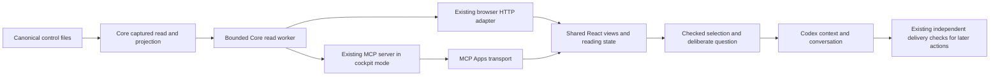

# SD: Embedded AGDF Cockpit for Codex

Status: draft
Gate: SD
Gate approval: open
Based on: PRD
Date: 2026-10-06
Owner: Arndt Gold
Run: agdf-cockpit-mcp-app-20261005-01
Traceability contract: criteria-chain-v1
Design Decisions contract: sd-decisions-v1

## 1. Solution Overview

Extend the existing MCP server implementation with an explicit local cockpit mode. That mode exposes only cockpit rendering and reads; the ordinary server retains its current dispatch/inspection tools. Both modes use the same trusted runtime composition and existing Core ownership. The local cockpit server is a separately named project connection so it does not replace the installed governance server or create another dispatcher in the host.

Reuse React navigation, reading state, document rendering and DTO validation through a transport interface. Browser transport retains its existing loopback session. Embedded transport uses MCP Apps via a bundled, pinned frontend SDK. Both consume the same bounded Core projection, extended with explicit Context Graph references and context preparation. No canonical control writer is reachable through the cockpit mode.

This is a design, not implemented or installed evidence. The PRD remains the sole acceptance source.

## 2. Ownership And Source Of Truth

| Concern | Authoritative owner | Change/reuse boundary |
|---|---|---|
| Run, approval, artefact and graph facts | .agdf/control/runs/, registered artefacts and CONTEXT_GRAPH.md | Read original target only; no new database or graph writer |
| Effective delivery state | Existing Core readers/evaluators and validators | No new gate rules; observation and selection never confer authority |
| Captured bytes and read limits | packages/core/lib/control-read/ | Reuse containment, immutable capture and revalidation |
| Cockpit projection and source selection | packages/core/lib/control-inspect/cockpit.js | Extend existing owner with graph/context operations; retain opaque scoped selectors |
| Async read worker and queue | Core control-read/control-inspect seam, extracted from packages/control-ui/server/pool.mjs and read-worker.mjs | One shared implementation; browser wrappers preserve old imports/call behavior |
| Runtime service composition | packages/core/lib/index.js and packages/cli/lib/mcp-dispatch-runtime.js | Expose the same cockpit read service via the existing explicit resource context |
| MCP wire schema, registration and response shaping | packages/mcp-server/src/ | Typed render/read definitions and app resource metadata; no business evaluation here |
| UI navigation and temporary state | packages/control-ui/src/App.tsx, state.ts and shared views | Transport injection and context-selection controller; no copied dashboard |
| UI data validation | packages/control-ui/src/api.ts and types.ts | Extract/share envelope and operation DTO checks across transports |
| Local assembly/provenance | scripts/assemble-npm.mjs; existing local-source preparation and mcp-lifecycle/package.js | Separate opt-in output; reuse exact-version/digest ownership marker |
| Human decisions and later execution | Existing installed AGDF workflow | Separate connection, exact target/run/revision checks; never infer approval from UI |

No source-of-truth ownership changes. Planned file names below describe additions under these owners, not a replacement architecture.

## 3. Architecture Decisions

- SDD-001: Extend Core cockpit projection and extract its bounded read-worker execution into Core for both consumers; rationale: one captured-read/evaluation path must own parity, containment and freshness; consequence: browser pool/entry wrappers become compatibility delegations and require regression verification.
- SDD-002: Use the portable MCP Apps protocol with @modelcontextprotocol/ext-apps 2.0.3 in the private frontend only and SDK-2 native server registration; rationale: reuse maintained bridge lifecycle while preserving the existing owned server SDK graph; consequence: exact package availability, lockfile and host interoperability must be proven, with no unreviewed version fallback or handwritten general bridge.
- SDD-003: Provide opt-in cockpit-only server mode with one fixed HTML resource, one render tool with optional explicit initial Run focus and one bounded read tool; rationale: the app connection must have no dispatch/writer tool and must not alter default tool discovery; consequence: explicit local registration and teardown are required, and ordinary server behavior stays a separate regression lane.
- SDD-004: Resolve only run-owned explicit graph references to exact maintained Markdown node headings and issue opaque graph selectors; rationale: relevance must come from maintained relationships without filesystem expansion or inferred graph edges; consequence: unknown reference forms remain identifiable unsupported/unresolved states.
- SDD-005: Prepare one bounded server-validated context packet containing source bytes, hashes and provenance, then acknowledge model-context update before a deliberate question; rationale: visible selection and model-facing evidence must agree and transport acknowledgement is not authorization; consequence: preparation may reject large sources, and context/message failures have separate recovery states.
- SDD-006: Serialize context publication, cancel obsolete generations and invalidate the previous server packet plus host context on selection/lifecycle changes; rationale: late responses and retained chat state cannot silently rebind the user's question; consequence: invalidation failure disables a new handoff until recovery, while historical messages remain outside app control.
- SDD-007: Assemble and qualify one separate owned local Codex cockpit runtime, with inline assets inside its server digest and unchanged default/public profiles; rationale: actual-host proof needs reproducible UI/runtime provenance without replacing the installed governance plugin; consequence: explicit connection/setup read-back and cleanup evidence are required, with no publication or automatic global installation.

## 4. Integration Points

### 4.1 Shared read execution and frontend transport

Move the existing bounded ReadWorkerPool implementation and reader worker entry to their Core owners. Preserve one active request plus one queued request, current cancellation behavior and the ten-second queue/active deadline. A timeout or worker failure replaces the worker and invalidates all its selectors. Browser modules re-export/delegate rather than keep a copied pool. Ordinary native/live CLI and dispatch reads remain unchanged.

Expose a transport-neutral interface for snapshot, run, document, freshness, related context and prepared context results. The browser adapter maps supported reading methods to existing HTTP routes; the new graph read may add a bounded read-only route. The browser does not gain host-message/context privileges. The MCP adapter maps the same semantic operations to the read tool. Abort signals, operation DTO validation, target/snapshot checks and generation checks remain shared. Host bridge state and context publication orchestration belong in a focused controller, outside document rendering and the generic reading reducer.

The shared compact card fills its available container; narrower surfaces stack content, while container widths at least 640px arrange selection and status/evidence in two columns. The shared brand header has a compact variant, preserving the original Pages logo, decorative image, fonts and theme tokens. Large inventories support temporary title/Run-ID/gate filtering that neither navigates nor removes the inspected selection. Inventory limitations stay visible as a counted expandable notice with exact affected Run/source identities and explicit diagnostic navigation. Expanded embedded detail responds to its own container width. The browser card may use a centered 1100px ceiling; native card width follows the host. Content height follows readable wrapping and available content, never a forced fixed viewport height or compressed type.

The embedded UI has a separate entrypoint and compact launcher; it mounts the common cockpit views only when the user enters an adequate supported larger surface. Prefer a supported expanded display mode. If the host supplies a native panel, its actual usability must be observed; the display-mode label alone is insufficient. When only a narrow inline card is available, keep the compact entry and offer the existing browser path instead of squeezing deep navigation into that card. Readability/focus checks determine qualification; no fixed Codex pixel width is assumed.

### 4.2 MCP mode and wire contract

Keep `agdf-mcp --surface <supported-host>` behavior unchanged. Add a strict opt-in invocation `agdf-mcp --surface codex --cockpit-dir <absolute-project-root>`. Require an explicit absolute existing root, canonicalize it once and bind all reads to that root; do not infer cwd or widen the target from tool arguments. Missing/mismatched UI manifest or owned runtime rejects cockpit-mode startup. Only Codex local qualification is in this delivery.

In cockpit mode, register these new semantic operations in the existing server composition:

| Interface | Inputs | Outputs and effect |
|---|---|---|
| agdf_cockpit | Strict object with optional run_id matching the existing bounded Run ID schema; empty object remains supported | Render tool, model-visible; create a new ephemeral session and return minimal project/bootstrap metadata plus optional requested initial run focus, with authorizes false and the UI resource association |
| agdf_cockpit_read | Strict discriminated operation plus session/snapshot/run/source/context selectors | Read tool visible to model and app; bounded Core DTOs or explicit typed failures; no render metadata and no control mutation |
| ui://agdf/cockpit/v1.html | Exact fixed resource URI | Self-contained trusted compiled HTML, text/html;profile=mcp-app; no project content inserted into executable HTML |

Read operations are `snapshot`, `run`, `document`, `context`, `prepare_context`, `validate_context`, `invalidate_context`, `freshness` and `close`. Unknown operations/fields, unregistered selectors, cross-session/run/snapshot inputs and arbitrary paths are rejected. Context/session invalidation changes only ephemeral read memory, never canonical files. Defaults do not acquire app tools/resources. Cockpit mode does not register `agdf_dispatch` or `agdf_inspect`; a malicious tool name cannot access those handlers in this connection. The existing governance connection retains them unchanged.

Use one schema definition and serializer owner per operation; MCP registration derives from that definition. Return authorizes false in every cockpit result. The render result keeps its opaque session bootstrap in UI metadata and returns minimal readable fallback text; snapshot/source data are requested intentionally through the read tool. Session IDs are scoped selectors, not human identity, authentication or delivery authority.

One active session/read capture per server connection. A new render session expires the previous one, which receives `session_expired` on further reads. Session idle limit is 30 minutes and absolute lifetime eight hours; reads refresh idle activity. Stop/close/expiry releases the worker/capture and pending packet. Worker failures require a new snapshot; there is no permanent session/snapshot store. Limits prevent retained captures from multiplying across repeated widgets. Multiple server processes retain host OS permissions and are not described as a filesystem sandbox.

### 4.2.1 Explicit initial Run focus

The opening call may supply run_id only when the user request or established explicit conversation identity names that Run for viewing. This is an initial display request, not delivery-run assignment. Never derive it from cwd, recency, inventory cardinality or inferred relevance. Empty arguments retain the overview and deliberate selection. No alternate project/path/URL, raw source content or approval field is accepted. The one existing wire-schema owner defines the optional identifier with the same 1–128 ASCII letters/digits/underscore/hyphen rule as the run read; unknown fields and malformed identifiers are rejected.

Pass the parsed identifier through the existing runtime/session composition as initial_run_id in the UI bootstrap metadata. It is a requested selector, not a validated status or authority. Do not add an eager render snapshot or repeat expensive inventory capture: the React reader reads its ordinary current snapshot once, checks exact membership in that bound project and requests the existing run operation with session/snapshot/run selectors. The Core read owner supplies validation, evaluation and provenance. The visible card becomes the requested Run only after this checked read succeeds. Unknown/removed Run returns to overview with the requested identity and explicit missing feedback; invalid/unavailable Run remains visibly identified and never falls back to another Run.

The embedded entry accepts the identifier only from the current render result's scoped metadata and starts its shared App with that explicit initial route. A new render session remounts the reader, cancels its obsolete reads and supersedes the previous session; a display-mode change preserves the same reading instance and selection. Reads, manual selection and freshness keep their existing generation protection. No URL/storage persistence, model-context publication, question, approval or delivery operation occurs merely from opening a named Run.

The optional input is backward compatible for empty-object consumers, but the owned runtime schema and HTML must be prepared together. A fresh actual host connection must discover the new descriptor; an old descriptor or old UI is not qualification. TP must test empty/direct/unknown/invalid Run, malformed/extra/foreign selectors, stale bootstrap/session replacement, one-capture navigation, unchanged byte inventory and actual native direct opening.

### 4.3 Context Graph projection

The canonical run parser already exposes `context_graph.refs`. Use that field; do not scan all node refs for run-name matches. Support semicolon-separated references, optionally wrapped in backticks, with these forms: bare exact `CG-...` node ID, or `.agdf/control/CONTEXT_GRAPH.md#CG-...`. The explicit graph file with no fragment may be shown as a source reference, but is not silently expanded into every related node. Other/malformed forms remain visible unsupported references.

Resolve an exact unique `### CG-...` heading in the captured canonical graph. A node ends at the next node/section heading at the same or higher level. Duplicate headings are ambiguous and rejected. Do not recursively follow textual relationships, external URLs or node refs. Associated maintained refs/evidence are passive text with source identity, not a generic file navigation permission.

Add graph registrations scoped to the selected run and snapshot, with opaque source IDs, reference origin, graph path, node ID, captured graph digest and node-content digest. Preserve empty, unresolved, missing, denied, unsupported and oversized states. Existing containment/UTF-8/preview checks apply. Support at most 64 parsed references per run and at most 16 chosen node entries in a handoff; exceeding a bound is explicit `resource_limit`, not silent omission. Unavailable references can be excluded only through a visible deliberate selection decision and remain listed as excluded/unavailable in the packet.

### 4.4 Checked context packet and question

`prepare_context` takes the current session, snapshot ID, explicit run ID and revision, the currently inspected registered artefact selector and zero to sixteen chosen graph selectors. It does not accept raw source content, arbitrary paths or client-supplied authoritative digests. The Core service reads the already registered captured bytes, revalidates the capture before and after composition and checks run/revision/selector membership.

The packet contains schema version, target identity/display path, run/revision, snapshot/source digest, observation and preparation timestamps, generation/context ID, artefact registration/path/content digest and passive selected content, graph node IDs/source locations/digests/content, included/excluded reference records and authorizes false. The full serialized model-facing packet, including provenance, must be at most 64 KiB UTF-8. If it does not fit, return `context_limit` and size information; do not truncate source bytes or send only a success-shaped summary. One latest packet is retained per session for bounded revalidation, superseded by a new preparation or invalidation.

`validate_context` checks that packet's session/generation and source identity again, returning current/changed/unavailable/expired. Later use must perform a fresh check; a timestamp/hash is not a lock against subsequent external edits. A later governed change independently uses the existing governance connection and canonical target/run/revision/approval checks. Neither packet validity nor its content authorizes that action.

The frontend uses the SDK App bridge for initialization, tool calls and context updates. ServerTools availability is checked from negotiated host capabilities. Context-update/message methods are not presumed available from host name or a fabricated capability flag: a supported protocol result and actual-host observation establish them, and a denied/unknown method disables the relevant action. No OpenAI-specific alias fallback silently changes semantics.

After server preparation, send the packet through `ui/update-model-context`; require a successful response before offering the default contextual question. The neutral question asks Codex to explain the selected run/source, identify gaps and cite the supplied sources; it contains no approval, continue-delivery or implementation instruction. A separate deliberate send uses `ui/message` and includes the context ID/run identity, with the existing host composer serving custom follow-up questions. Host acknowledgement means submission accepted, not answer produced or evidence independently verified. Show preparation, context accepted, question accepted and uncertain outcomes separately. No automatic question retry.

### 4.5 Supersession, race handling and lifecycle

Maintain a monotonically increasing UI selection generation. Capture it for each read, preparation, publication and question. Discard stale completions and serialize host context publications; no concurrent update requests may reorder the current packet. Source/run switch, refresh, observed staleness and app teardown invalidate the server packet and replace the current host context with a small explicit invalid-selection record before a new handoff. There is no implicit transfer merely from reading a source.

If an earlier publication is pending during a switch, wait for its bounded result, then send the newer invalidation; keep handoff disabled until invalidation is acknowledged. A lost acknowledgement leaves transfer uncertain and blocks subsequent misleading success. Teardown clears server state and attempts host invalidation, but cannot guarantee host receipt after process loss or erase historical chat. Packets remain timestamped observations; later validation handles expired/missing sessions honestly. Closing/reopening starts a new temporary view and cannot reactivate a prior packet from URL or browser storage.

Bridge requests time out after ten seconds and hold at most eight pending requests. Read responses keep the existing 8 MiB serialized ceiling, 2 MiB passive preview ceiling and captured-file/total limits. UI resource HTML is bounded to 4 MiB at assembly and startup. Source freshness retains the visible five-second/visibility-return observation strategy; it is advisory detection, with mandatory revalidation at preparation/validation.

### 4.6 Build, trusted local activation and rollback

Pin @modelcontextprotocol/ext-apps 2.0.3 as a private UI dependency, with @modelcontextprotocol/client 2.0.0, @modelcontextprotocol/core 2.0.0 and zod 4.2.0 explicitly locked in the private frontend dependency graph. Use its supported App API; server registration uses the already pinned @modelcontextprotocol/server 2.0.0 without adding frontend/client SDK dependencies to the owned server runtime. No server helper importing an undeclared runtime graph is needed. Verify exact registry availability and integrity during the planned dependency/build step; if a chosen version is unavailable or incompatible, revise SD rather than silently substitute another version.

Vite produces a dedicated self-contained app HTML bundle from the existing React code and inline compiled JS/CSS. No CDN, external connect/resource/frame domains, executable user HTML, remote fonts or dynamic file URLs. Escape closing-script hazards during inlining. Passive Markdown continues skipping raw HTML/images and unregistered links. Apply known theme variables as validated values with local fallbacks; do not inject arbitrary host font CSS or fetch external styles. Browser build output and session handling remain separate.

Extend the existing assembly owner with an opt-in Codex cockpit profile into `dist/local/codex-cockpit/`, separate from `dist/local/codex/` and default/public output. Copy the compiled HTML plus digest/size manifest into that profile's MCP server directory; its existing server directory digest binds UI bytes. Reuse the existing exact-version local source preparation and owned MCP package preparation, including marker generation/validation, rather than hand-author trust markers or relax runtime checks. Missing, changed or unowned UI/runtime must fail before serving resources.

Prepare a project connection entry named `agdf-cockpit-local` with absolute Node/runtime paths and the explicit project root. Generate reviewable config under the scoped local output; do not silently edit global config, plugin cache or an unrelated project. Activate that entry through the supported host configuration workflow only within explicit user authorization and host permissions, then read back the loaded server/tool/resource identity. Existing installed AGDF governance remains untouched. If connection activation is unavailable in the current host turn, report the precise host-evidence gap; no browser fixture substitutes for it.

Rollback stops/removes only this named owned project connection and its owned local output after needed evidence is preserved. Do not uninstall the governance plugin, alter foreign config, stop the existing browser service or remove shared runtimes. Document an explicit start/connect/verify/disconnect path. This design does not authorize publication, commit, push or release.

## 5. Constraints And Compatibility

Default MCP CLI invocation, two tool schemas and canonical results remain compatible. New app behavior is explicitly opt-in; resources and UI bytes are absent from ordinary/public profiles. Core source changes still use existing synchronization, integrity and payload-budget checks. Existing browser routes/session/bootstrap retain behavior; graph support is additive read-only behavior, and custom context transfer remains host-only.

No gate, approval, persisted schema or delivery lifecycle migration. Node engines remain the existing supported baseline. The UI SDK-2 compatibility claim comes from current primary package/docs and still needs exact dependency/build/protocol proof. Host compatibility remains unverified until the actual tuple is observed. A native panel/display transition cannot be accepted solely from a simulated bridge.

## 6. Test And Evidence Strategy

TP must first cover the minimal opt-in runtime/resource/bridge vertical path and actual Codex capability feasibility before extensive view work. That is implementation under approved TP, not a permission to prototype now. If required host capability fails, retain the explicit fallback and route the unmet evidence/earliest affected design decision; do not claim the first journey complete.

Use deterministic temporary controls for Core parity, graph resolution, selector containment, packet size/source identity, before/after source changes, worker failure and session expiry. Bridge integration tests must cover pending generations, ordered invalidation, unknown/denied methods, rejected context, uncertain message delivery and no automatic resend. Browser regressions cover HTTP/session, reducer/navigation, passive rendering, freshness/removal and supported sizes/focus. MCP tests cover unchanged default discovery, cockpit-only tool/resource inventory, two supported protocol eras where applicable, owned runtime/UI digests, operation schema rejection and absence of writer handlers.

Actual Codex evidence records host version, protocol/capabilities, exact local server/UI digests, open/select/inspect/question journey, published source identity and visible failure/recovery. A closed app-only observation window compares canonical control bytes before and after; exclude separate agent bookkeeping from that window. Keep source/protocol/browser/host evidence distinct. Package/default-profile inventory and existing payload limits must pass. Record self-review as cooperative, not independent proof.

## 7. Acceptance Traceability

| criterion_id | design_response | source_of_truth | design_decision_ids | compatibility_risk |
|---|---|---|---|---|
| AC-001 | Compact SDK entry, supported larger presentation and shared adaptive views/focus | UI presentation owner packages/control-ui/src/; actual host context | SDD-002, SDD-003 | Unsupported display remains compact/fallback; actual rendered usability required |
| AC-002 | Existing Core inventory/detail projections through injected transport | Core control-inspect/cockpit.js and canonical run | SDD-001 | Preserve evaluator parity and observation/revision distinction |
| AC-003 | Existing opaque document registration and passive renderer | Core cockpit/read boundary; UI DocumentView | SDD-001 | Shared DTO checks reject mismatched target/snapshot/source; existing document restrictions retained |
| AC-004 | Exact explicit graph reference parser and scoped node resources | Canonical context_graph.refs and CONTEXT_GRAPH.md; Core projection | SDD-004 | Unknown/duplicate/empty reference states explicit; no inferred relevance or filesystem expansion |
| AC-005 | Server preparation and full serialized packet limit with provenance | Core captured bytes, registrations and prepare_context | SDD-004, SDD-005 | Revalidate before/after, reject oversize; no silent truncation |
| AC-006 | SDK model-context acknowledgement followed by deliberate neutral question | Core packet content; UI handoff controller; host transport | SDD-002, SDD-005 | Context/message methods can fail independently; acknowledgment is not authority or answer |
| AC-007 | Generations, ordered invalidation, packet validation and teardown | Shared reading reducer; focused handoff controller; Core session | SDD-001, SDD-006 | Old chat cannot be erased; uncertain invalidation blocks new handoff and requires fresh validation |
| AC-008 | Typed failures, capability checks and existing browser fallback | Core failure DTOs, UI feedback and SDK host observation | SDD-002, SDD-003, SDD-006 | No invisible question retries or browser-as-embedded success |
| AC-009 | Cockpit-only handler inventory, contained reads and passive data packets | Core read owner; MCP mode registration; existing approval validators | SDD-001, SDD-003, SDD-005 | Ephemeral state only; unknown tool names denied; no claim of generic model enforcement |
| AC-010 | Isolated local profile and owned runtime/UI provenance; actual host qualification | Existing assembly, local package preparation, MCP runtime owner and evidence | SDD-002, SDD-007 | Default/public profile unchanged; activation may need new session; no inferred host support |

## 8. Risks And Open Questions

No material design question remains open for presentation. Runtime/API assumptions are explicit hypotheses with a fail-closed verification path, not proof of installed capability. Exact package registry availability, browser bundle behavior, host capability/update/message interoperability and named local connection loading remain TP evidence obligations. Host loss can prevent context invalidation acknowledgement and historical context cannot be erased; source identity/fresh validation and visible uncertainty are the mitigations. No debt exception or parallel store is accepted.

The existing Context Graph reconciliation remains open until verified implementation knowledge is curated into its existing nodes before clean closeout. This design does not update the graph or source-of-truth registry merely from planning.

## Design Decisions

| Decision | Timing | Status | Resolution | Owner |
|---|---|---|---|---|
| Shared read/view ownership | before_sd | resolved | SDD-001: Core worker/projection shared; browser wrappers and frontend transport injection, no duplicated evaluator/dashboard | Arndt Gold, SD Owner; Core/UI implementing agent |
| SDK and bridge | before_sd | resolved | SDD-002: pinned private ext-apps 2.0.3 frontend, SDK-2 native server resource/tool registration; no handwritten general protocol or runtime SDK expansion | Arndt Gold, SD Owner; UI/MCP implementing agent |
| Tool/target/session boundary | before_sd | resolved | SDD-003: explicit cockpit-only mode/root, render/read tools, one session per connection, 30-minute idle/eight-hour absolute expiry and bounded worker | Arndt Gold, SD Owner; MCP implementing agent |
| Graph relevance and capacity | before_sd | resolved | SDD-004: only canonical explicit exact node references, 64 parsed refs/16 selected nodes; unavailable forms disclosed | Arndt Gold, SD Owner; Core implementing agent |
| Context transport and bounds | before_sd | resolved | SDD-005: current registered artefact plus selected nodes, 64 KiB full packet, two-sided revalidation, context acknowledgment before deliberate question | Arndt Gold, SD Owner; Core/UI implementing agent |
| Race/lifecycle/uncertainty | before_sd | resolved | SDD-006: ordered publication/invalidation, generations and packet validation; disable new handoff on uncertain invalidation, no automatic message resend | Arndt Gold, SD Owner; UI implementing agent |
| Explicit initial Run focus | before_sd | resolved | SDD-003: optional strict run_id becomes ephemeral requested focus; current captured Core reads validate exact bound-project membership and identity before display; empty/unknown/unavailable states never silently select another Run, and no delivery or context action follows opening | Arndt Gold, SD Owner; Core/UI/MCP implementing agent |
| Adaptive compact space use | before_sd | resolved | SDD-002: fill the actual container, stack narrow content and use two columns from 640px, preserve readable typography/brand assets, temporary inventory filtering and countable expandable source notices | Arndt Gold, SD Owner; UI implementing agent |
| Local assembly/activation/rollback | before_sd | resolved | SDD-007: separate owned dist/local/codex-cockpit profile and named project connection; bind UI in server digest and preserve installed/default/public runtime | Arndt Gold, SD Owner; assembly/MCP implementing agent |
| Concrete executable scenarios and host feasibility sequence | later_tp | deferred | Define task/scenario/evidence mappings and put minimal actual-host feasibility first; all architectural choices above remain binding | TP author through gate-check |

## 9. Next Step

Review and approve only with `Approval: SD`. Valid approval permits Task/Test Plan drafting. Code changes and host activation require applicable later prerequisites and permissions.

## Source and Derivation Evidence

Approved source: PRD.md SHA-256 `8f372986651c47aa376accb9044bdc2ad822db101270f1c76ac0ab08e41dcb1c`. Subordinate inputs: completed Brownfield Review and ready UX Intent Definition for this same run. Current source reads on 2026-10-05 confirm HTTP construction in App, bounded browser read worker, default MCP tool-only registration, strict default bin arguments, exact-version/provenance composition and Core graph refs.

Primary sources inspected on 2026-10-05: https://modelcontextprotocol.io/extensions/apps/overview; https://github.com/modelcontextprotocol/ext-apps/blob/main/specification/2026-01-26/apps.mdx; https://apps.extensions.modelcontextprotocol.io/api/; https://raw.githubusercontent.com/modelcontextprotocol/ext-apps/main/package.json (2.0.3 and SDK-2 peers). The package source is not a registry-install or live-host proof. Earlier current-run OpenAI documentation establishes the presentation/context distinction; actual Codex qualification remains planned.

## Revision And Retained Work

Source revision operation: 8af83d43-0552-4490-8870-368a64853335. Exact approved UR/PRD and applicable Brownfield/UX inputs are retained. The previous SD and TP approvals are superseded; historical source bytes and proofs are archived by the canonical revision service. This draft modifies the opening contract from an empty-only object to optional explicit initial Run focus. Existing acceptance and all seven stable SDD IDs remain; no source, authority, graph, context or packaging owner is added.

Adaptive layout and search work was completed before reopening at the approved CD+Tests boundary; ADAPTIVE_LAYOUT_EVIDENCE.md records browser-only geometry/reading plus 20 UI and five service tests. The parameter is not implemented. Retained code and tests do not inherit execution fulfillment: the renewed TP must assess them and add direct-opening boundary/native scenarios. User-supplied native screenshot demonstrates the old resource displays; no claim of updated native layout or context/message completion is made.

## AGDF Approval Summary (de; source=en)

- Änderung: agdf_cockpit erhält optional eine ausdrücklich benannte run_id. Ohne ID bleibt die Auswahl. Die ID ist ein vorläufiger Anzeige-Wunsch; vorhandene Core-Leseoperationen prüfen das gebundene Projekt, Run-Zugehörigkeit und Datenstand vor der Anzeige. Unbekannte, entfernte oder nicht lesbare Runs bleiben identifizierbar; ein anderer Run wird niemals still ausgewählt. Kein Schluss aus Verzeichnis, Aktualität oder Anzahl der Runs.
- Platz und Orientierung: Die Karte nutzt ihre Containerbreite. Schmale Ansichten stapeln Inhalte; ab 640 Pixeln stehen Auswahl beziehungsweise Status und Nachweise nebeneinander. Große Inventare bieten vorübergehende Suche nach Titel, Run-ID und Gate; sie verändert die betrachtete Auswahl nicht. Aufklappbare Inventarhinweise nennen Anzahl und betroffene Quellen. Logo, dekoratives Hintergrundbild, Schriften und Farben kommen weiterhin aus Pages.
- Architektur: React verwendet gemeinsame Ansichten und Transport-Validierung. Core besitzt Lesedienst, begrenzten Worker, Quellenprüfung und Status. Der ausdrücklich aktivierte lokale MCP-Cockpit-Modus stellt nur Render-/Lesewerkzeuge und eine selbst enthaltene HTML-Ressource bereit. Die bestehende Governance-Anbindung behält Freigaben und Ablaufsteuerung. Private UI-Bibliothek 2.0.3 und serverseitige SDK-2-Basis bleiben festgelegt.
- Kontext und Grenzen: Ausschließlich ausdrückliche Run-Verweise auf gepflegte Graph-Knoten; höchstens 64 Verweise und 16 gewählte Knoten. Core prüft registrierte Quellen erneut und bereitet das vollständige Paket mit Run/Revision, Quellen, Inhalten, Zeiten und Digests vor: maximal 64 KiB, ohne stilles Kürzen. Erst bestätigte Kontextübergabe erlaubt die separat bewusst gesendete neutrale Frage. Eigene Fragen bleiben im Codex-Composer. Öffnen und Lesen lösen keine Übergabe, Nachricht oder Freigabe aus.
- Wechsel und Betrieb: Generationen und geordnete Invalidierung schützen vor verspäteten oder fremden Ergebnissen. Unklare Zustellung wird nicht automatisch wiederholt. Historische Chatnachrichten bleiben historische Beobachtungen. Eine Sitzung pro Verbindung; 30 Minuten Inaktivität, acht Stunden Gesamtdauer, zehn Sekunden Bridge-Frist und maximal acht offene Anfragen. HTML maximal 4 MiB; vorhandene Lesegrenzen, Browser-Weg und Standardprofile bleiben erhalten. Aktivierung und Rücknahme betreffen nur die benannte lokale Anbindung.
- Stand und Nachweise: Die Layoutänderung ist umgesetzt: 20 UI- und fünf Diensttests bestehen; echte Browser-Prüfungen bei 320 bis 1280 Pixeln zeigen keinen horizontalen Überlauf. Der neue Run-Parameter ist noch nicht implementiert; die aktualisierte native Karte ist noch nicht aktiviert. Der Benutzer-Screenshot belegt die bisherige native Darstellung. Kontext-/Nachrichtenprüfung und die vollständige eingebettete Abnahme bleiben offen. Browser-Erfolg ersetzt diese Nachweise nicht. Alle zehn PRD-Kriterien bleiben den sieben bestehenden Designentscheidungen zugeordnet; keine neue Produktakzeptanz oder Freigabezuständigkeit.
- Entscheidung: UR und PRD bleiben gültig. Diese SD-Revision ersetzt den bisherigen Öffnungsvertrag; die bisherige SD- und TP-Freigabe gilt dafür nicht weiter. Nach Approval: SD folgt der erneuerte Aufgaben- und Testplan. Erst dessen gültige Freigabe und erforderliche Vorbereitung erlauben die Run-ID-Implementierung und erneute Prüfung der behaltenen Umsetzung. Keine Veröffentlichung, Release- oder Git-Aktion.
