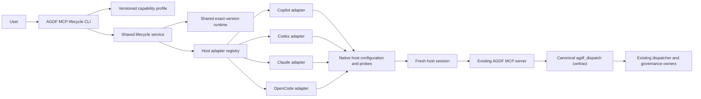

# SD: Common AGDF MCP Lifecycle Across Coding-Agent Hosts

Status: approved
Gate: SD
Gate approval: Exact `Approval: SD` for Revision 2 was accepted on 2026-09-08 after
same-target, same-run, same-gate and run revision
`2E1B7AA5-DE70-4E48-81FA-D4BE87535168` revalidation.
Previous approval: Exact `Approval: SD` for Revision 1 was accepted on 2026-09-06 after
same-target, same-run, same-gate and run revision
`2CEBCE1F-ED4D-4FFF-827E-65B90C0F22DB` revalidation. That approval remains historical and does
not cover PRD Revision 2.
Revision: 2
Date: 2026-09-08
Owner: Arndt Gold / Codex
Run: agdf-cross-host-mcp-integration
Based on: approved PRD Revision 2, approved UR Revision 1, passed Brownfield Review, ready UX Intent Definition and language-contract review findings CHMCP-CR-07 through CHMCP-CR-12
Delivery depth: Structured Delivery

## 1. Solution Overview

Extend the existing AGDF MCP lifecycle into one project-first integration layer for GitHub Copilot,
Codex, Claude Code and OpenCode. The solution keeps the existing `@agdf/mcp-server` process and the
canonical `agdf_dispatch` tool identity, authority boundary and schema shape stable. Revision 2
corrects the existing `presentation_language` meaning and validation without adding a tool or
protocol version. It retains one versioned lifecycle result contract, one declarative capability
profile and four thin host adapters behind the existing lifecycle service.

The lifecycle owns inspection, explicit registration, exact read-back, reference accounting,
rollback and removal. Each adapter owns only its native host configuration, precedence and probe
rules. Plugin installation stays a separate lifecycle. A plugin can recommend `mcp status` or
`mcp enable`, but it cannot configure MCP or claim discovery.

For presentation language, the design creates three explicit stages. The host selects one language
tag from the latest natural-language user request. The dispatch boundary strictly validates that
external tag before activation, target or gate work. The presentation layer then resolves a valid
tag to an exact or primary-language pack and otherwise to the complete English pack. POSIX-style
system locale cleanup remains a separate CLI-only input path and cannot repair MCP input.



The arrows show data flow and process launch only. They do not transfer AGDF activation, target,
gate, approval or durable-state authority.

## 2. Ownership And Source Of Truth

| Concern | Canonical owner | Design consequence |
|---|---|---|
| Tool name, description, input schema, output schema, annotations and `presentation_language` selection meaning | `create-agdf/lib/skill-dispatch/contract.js` | Adapters and generated Skills consume its exact semantic description and schemas. They never maintain their own language precedence or supported-pack list. |
| Strict external language-tag validation and pack resolution mechanics | `create-agdf/lib/interaction-presentation.js` | One strict parser accepts exactly one BCP 47 tag for dispatch. Pack lookup uses exact tag, then primary language, then the enforced English fallback. |
| Complete installed locale packs and fallback declaration | `plugin/meta/agdf-interaction-locales.json` | The registry is the only installed-pack inventory. Validation requires canonical unique keys, structurally complete packs and exact fallback `en`. |
| Trusted system-locale adaptation | `create-agdf/lib/cli/runtime-context.js` | Only detected operating-system locale values may use POSIX cleanup before strict canonicalization. Explicit CLI and MCP values use the strict path. |
| Dispatch behavior | `create-agdf/lib/skill-dispatch/service.js` through the existing narrow MCP runtime export | The lifecycle does not create another dispatcher or shell wrapper. |
| MCP serving, protocol generations, worker and process boundary | `agdf-mcp-server/` | This run does not change the server protocol or tool count. |
| Request applicability and AGDF activation | Existing request-activation contract and dispatcher | MCP registration and discovery cannot activate AGDF. |
| Target resolution | `create-agdf/lib/task-target-resolution.js` | `--dir` is an explicit lifecycle target; cwd alone remains non-authorizing context. |
| Gate evaluation and approval | `.agdf/control/` and existing control-evaluation owners | Every lifecycle and MCP result remains `authorizes: false`. |
| Declarative integration contract | `plugin/meta/agdf-mcp-capability.json` | One schema-versioned profile defines stable surfaces, scopes, result vocabulary, runtime identity and qualified evidence references. |
| Executable lifecycle orchestration | `create-agdf/lib/mcp-lifecycle/service.js` | One service composes all probes, transactions, references and results. |
| Host-native configuration | One adapter per surface under `create-agdf/lib/mcp-lifecycle/adapters/` | Each adapter implements the common interface while retaining native paths, scopes and precedence. |
| Runtime acquisition, provenance and reference accounting | `create-agdf/lib/mcp-lifecycle/package.js` | One exact runtime is shared by registrations in the same lifecycle scope root. |
| Lifecycle result construction and presentation | New `create-agdf/lib/mcp-lifecycle/result.js` and `presentation.js`, using the canonical locale registry | JSON uses stable codes. English and German text derive from the same registered meanings. |
| Plugin install, activation, updates and removal | Existing host installers and lifecycle owners | Plugin state and MCP state remain separate fields and actions. |
| Release qualification | Immutable release profile plus linked direct evidence | Static qualification never replaces inspection of the current host or fresh-session evidence. |

Generated copies consume these owners and are never edited independently. The public OpenAI
skills-only plugin continues to exclude MCP runtime and lifecycle metadata.

## 3. Architecture Decisions

### AD-01: Extend The Existing Lifecycle, Do Not Add A Second Service

`create-agdf/lib/mcp-lifecycle/service.js` remains the only orchestration owner for `status`,
`enable` and `disable`. It selects an adapter from a closed registry, builds one desired registration
from the exact runtime, executes one transaction and returns one common result. Host modules contain
no package installation, semantic dispatch, approval or cross-host branching.

The existing `host-config.js` becomes a compatibility facade that exports the registry-backed public
functions during this release. New implementation lives in:

```text
create-agdf/lib/mcp-lifecycle/
  adapters/
    claude.js
    codex.js
    copilot.js
    opencode.js
  adapter-contract.js
  host-config.js
  package.js
  presentation.js
  profile.js
  result.js
  service.js
```

There is no host-specific lifecycle service and no copied MCP function contract.

### AD-02: Use One Versioned Declarative Capability Profile

Upgrade `plugin/meta/agdf-mcp-capability.json` to schema version 2. The profile contains only stable
release facts:

- capability and result-contract versions;
- canonical semantic and dispatcher owner paths;
- exact package, Node, SDK, transport and protocol identity;
- supported surface identifiers and requested scope vocabulary;
- adapter and native configuration variants;
- common state and diagnostic vocabularies;
- release qualification tuples and links to immutable evidence, when present;
- explicit false claims for automatic activation, gate authorization, OS sandboxing and universal
  cross-host support.

`create-agdf/lib/mcp-lifecycle/profile.js` validates the source profile and its generated runtime
copy against a closed schema. `runtime-context.js` exposes the validated generated profile to the
CLI. Missing fields, unknown state values, version skew or a mismatched semantic owner fail before
host inspection or mutation.

The profile does not determine current registration, trust, policy, loaded-tool or permission state.
Those facts come from the selected adapter and direct host evidence.

### AD-03: Introduce Lifecycle Result Contract Version 2

Version the current three-host lifecycle envelope as one four-host schema version 2 before the
common lifecycle is released. Keep no parallel v1 execution path. The result has this stable shape:

```json
{
  "schema_version": 2,
  "operation": "mcp.status | mcp.enable | mcp.disable",
  "result": "not_configured | configured_pending_restart | configured_unverified | discovered_ready | unchanged | disabled | degraded | failed",
  "surface": "copilot | codex | claude | opencode",
  "target": "/absolute/repository/path",
  "authorizes": false,
  "capability": "supported | manual_compatible | unavailable | unsupported | unverified",
  "scope": "project | user",
  "effective_scope": "project | user | null",
  "native_scope": "host-specific value or null",
  "scope_effect": "registered localized meaning",
  "host": {},
  "runtime": {},
  "registration": {
    "status": "absent | matched | foreign | owned_mismatch | precedence_conflict | invalid",
    "selected_status": "same vocabulary",
    "selected_source": "native source",
    "effective_source": "native source or null",
    "checked_sources": []
  },
  "discovery": {
    "status": "not_checked | pending_restart | discovered | not_discovered | unavailable",
    "source": "configuration | native_status | direct_host | none",
    "evidence_ref": null
  },
  "permission_effect": {},
  "changes": [],
  "fallback": { "code": "version_matched_cli_dispatch", "text": "localized text" },
  "next_action": { "code": "stable_code", "parameters": {}, "text": "localized text" },
  "diagnostics": []
}
```

`registration.status` describes the effective entry after native precedence. `selected_status`
describes the source selected by `--scope`. This distinction prevents a successful project disable
from claiming that MCP is absent when a lower-precedence user registration remains effective.

Unknown combinations fail contract validation. Human output is a projection of the same result and
does not create new state names. `next_action.code`, parameters and locale registry entry are the
semantic owner of every next action; free-form evaluator or adapter text is prohibited.

### AD-04: Use One Closed Host Adapter Contract

Every adapter implements and is conformance-tested against:

```text
surface
probeHost({ target, env, exec })
resolveSources({ scope, target, env })
inspect({ scope, target, desired, sources, env, exec })
createTransaction({ action, inspection, desired, previousOwned, env, exec })
referenceIdentity({ scope, target, selectedSource })
permissionEffect({ scope, inspection })
```

`probeHost` returns observed executable, version and native variant without authentication or
mutation. `resolveSources` returns selected and precedence-relevant sources. `inspect` reports both
selected and effective registrations. `createTransaction` may change only an exact selected source.
The adapter returns facts and stable codes; common result mapping and localization stay in the
lifecycle owner.

An absent host still permits read-only file/config inspection during `status`. `enable` fails before
runtime preparation when the required host or configuration generation cannot be verified. No
minimum host version is invented. A supported configuration generation must be established by a
documented native schema or a successful closed native capability probe; direct support remains
`unverified` until the required evidence tuple passes.

### AD-05: Share One Exact Runtime Across Hosts Within A Scope Root

Remove the surface segment from new runtime roots:

```text
<AGDF_DATA_ROOT>/mcp/project/<sha256-canonical-target>/<agdf-version>/
<AGDF_DATA_ROOT>/mcp/user/<agdf-version>/
```

One project runtime can serve all four host registrations for the same target. One user runtime can
serve all user-scoped host registrations. The runtime marker remains the exact package, Node,
server, dispatcher and SDK provenance owner and stores a sorted set of references.

A reference identity is derived from surface, effective native scope and canonical selected
configuration source. A target digest is included only when the native registration is
project-specific. User references do not vary by the incidental target from which the user-scoped
operation was invoked.

Legacy surface-specific roots remain inspectable for safe migration and disablement:

```text
<AGDF_DATA_ROOT>/mcp/project/<target-digest>/<surface>/<version>/
<AGDF_DATA_ROOT>/mcp/user/<surface>/<version>/
```

`status` reports an exact owned legacy layout as `owned_mismatch` with next action `mcp enable` for
an explicit migration. `enable` prepares and verifies the shared runtime, repoints only the exact
owned registration, adds its shared reference, removes its verified legacy reference and retires
the legacy runtime only at zero references. `disable` can remove an exact legacy registration and
runtime directly. No operation scans arbitrary directories or adopts an unverified runtime.

### AD-06: Preserve One Reversible Transaction Order

`status` performs only target canonicalization, profile validation, host probing, native source
inspection and runtime inspection. It creates no directory and runs no package manager, login,
trust, restart or model command.

`enable` executes:

1. validate the profile, target, host, requested scope and source precedence;
2. stop on invalid, foreign or higher-precedence conflict before mutation;
3. inspect any exact owned current or legacy runtime;
4. prepare and verify the shared exact-version runtime;
5. prepare the native registration transaction without applying it;
6. apply the registration and read back selected and effective state;
7. add the runtime reference;
8. retire a superseded exact owned reference and runtime only when unreferenced;
9. commit all phases and return `configured_pending_restart` or `unchanged`.

`disable` executes:

1. validate and inspect the exact selected registration;
2. stop on foreign, ambiguous or invalid ownership before mutation;
3. remove only that selected registration and verify its absence;
4. remove its runtime reference;
5. retire the runtime only when the final valid reference is absent;
6. commit and report any lower-precedence registration that becomes effective.

Failure rolls back applied phases in reverse order and verifies the restored selected source,
directory presence, raw configuration bytes and runtime references. Failed rollback returns
`failed` with blocking diagnostic `rollback_incomplete` and never a clean or support result.

### AD-07: Add The Copilot Adapter Through Native Files And Read-Back

The Copilot adapter manages these sources:

| Requested scope | Managed source | Precedence inspection |
|---|---|---|
| `project` | `<target>/.github/mcp.json` under `mcpServers.agdf` | `<target>/.mcp.json` first, then the managed source, then `~/.copilot/mcp-config.json` |
| `user` | `~/.copilot/mcp-config.json` under `mcpServers.agdf` | `<target>/.mcp.json`, `<target>/.github/mcp.json`, then the selected user source |

The target-root `.mcp.json` takes precedence over `.github/mcp.json`. Any effective foreign or
different owned `agdf` entry in a higher-precedence source returns `precedence_conflict` without
mutation. Qualification records the exact fresh-session working directory because a closer nested
project configuration can change Copilot precedence outside the target-root lifecycle context.

The owned entry is:

```json
{
  "type": "local",
  "command": "/absolute/node",
  "args": ["/absolute/agdf-mcp.js", "--surface", "copilot"],
  "env": {
    "AGDF_MCP_OWNER": "create-agdf:mcp-runtime",
    "AGDF_MCP_VERSION": "<exact-version>",
    "AGDF_MCP_DIGEST": "<exact-digest>"
  },
  "tools": ["agdf_dispatch"]
}
```

Mutation uses the common atomic JSON transaction for both scopes. `copilot mcp add/remove` is not
used because native removal addresses user configuration only and would create two different
rollback models. When available, `copilot mcp list/get --json` supplies supplemental effective
read-back. Unknown native JSON shapes fail closed and cannot prove discovery or support.

Project trust and organization registry or allowlist policy remain host-owned. A matching file with
unobserved trust or policy returns `configured_pending_restart` or `configured_unverified`, never
`supported` or `discovered_ready`.

### AD-08: Preserve Codex Native Semantics

The Codex adapter continues to manage `<target>/.codex/config.toml` for project scope and the native
user config for explicit user scope. It keeps the delimited AGDF ownership marker and exact
structural section handling. It adds `codex --version` probing and inspects both selected and
precedence-relevant project/user sources before claiming effective state.

The adapter never changes repository trust, MCP enablement policy or per-tool approval. Native
`codex mcp list/get` observations can supplement registration evidence but do not prove loaded tool
discovery in a fresh Desktop or CLI session.

### AD-09: Preserve Claude Code Native Scope Mapping

The Claude adapter keeps native CLI mutation and read-back:

- requested `project` maps to Claude native `local`, private to the selected repository;
- requested `user` maps to Claude native `user`;
- shared repository `project` scope is outside this lifecycle and is never selected silently.

`claude mcp get agdf` supplies the effective native scope. If a higher-precedence local or shared
project entry masks a selected user entry, inspection returns `precedence_conflict`. Transaction
failure restores the exact prior native entry through the existing remove/add rollback. Login and
model authentication are direct-host evidence prerequisites, not registration prerequisites or
gate authority.

### AD-10: Preserve Explicit OpenCode Configuration Generations

The OpenCode adapter retains version detection and reports the observed variant:

- 1.x: `mcp.agdf` with `enabled: true`;
- 2.x: `mcp.servers.agdf` with `disabled: false`.

Project scope uses `<target>/opencode.json`; explicit user scope uses the documented user
configuration root. Both variants preserve permission rules and unrelated MCP servers. A second
variant, custom higher-precedence configuration or inline configuration that defines `agdf` is a
conflict, not an update target.

The lifecycle never changes general `bash`, `edit`, file or network permission rules. Only direct
OpenCode evidence may determine whether bounded MCP dispatch eliminates the recurring shell prompt
and whether the separate `opencode-native-dispatch-tool` draft remains necessary.

### AD-11: Separate Registration, Discovery And Release Qualification

Native configuration read-back proves registration only. A native connection status proves that a
server process can start only for the observed host command. `discovery: discovered` requires the
fresh host session to expose the exact canonical tool. `result: discovered_ready` additionally
requires one bounded dispatch result with exact target/run evidence and `authorizes: false`.

The direct evidence harness may emit a contract-valid result with `discovery.source: direct_host`.
Ordinary `mcp status` remains `not_checked`, `pending_restart` or `unavailable` unless the host
offers a documented loaded-tool observation. Past release qualification is not presented as current
session discovery.

A release qualification tuple includes:

- host client and exact version;
- client variant, model or session type when relevant;
- operating system and architecture;
- requested and native scope plus exact configuration source;
- Node, AGDF server, dispatcher, SDK and entrypoint identity;
- fresh-session tool discovery, bounded dispatch, failure and cleanup evidence references.

Each host qualifies independently. Controlled MCP protocol tests, package integrity, another host,
another OS or human UAT cannot fill a missing tuple field.

### AD-12: Keep Plugin Installation And MCP Activation Independent

Existing Copilot, Codex, Claude Code and OpenCode installers do not call the MCP lifecycle. Their
successful result may include a registered next-action code for `mcp status` or explicit
`mcp enable`. The installer continues to report plugin installation, activation and restart state
without setting MCP registration, discovery or support fields.

No plugin manifest gains an MCP server entry in this run. This avoids a second automatically started
registration source and keeps OpenCode on the same explicit activation model as the other hosts.

### AD-13: Derive Human Text From Stable Codes

Add an `mcpLifecycle` section to `plugin/meta/agdf-interaction-locales.json` for English and German.
It owns result labels, scope effects, permission effects, diagnostics, fallback and next-action
templates. Adapter output contains only registered codes and bounded parameters.

The renderer validates every result before presentation. JSON and human output are produced from
the same normalized object. A supported request uses exactly one complete selected pack. A valid
unsupported request uses exactly one complete English pack. No field-by-field language fallback is
allowed. Tests assert that every reachable code exists in every registered pack, that no English
fallback appears in supported German output and that unsupported input contains no German
human-facing text. This prevents both the earlier `next_step_unlocalized` class and mixed-card
output from recurring.

### AD-14: Keep Permission And Approval Boundaries Explicit

All lifecycle results and direct MCP calls contain `authorizes: false`. The visible permission effect
states that the local server inherits the launching host user's operating-system access. Enablement
does not grant or widen shell, edit, file or network permission and does not imply an OS sandbox.

Host trust, plugin consent, server start, tool discovery or a successful call never persists
`Approval: <GateName>`. The existing gate evaluator revalidates target, run, gate and revision for
every exact approval.

### AD-15: Keep The Compatible Path Explicit And Inactive

Unavailable, unsupported, unverified and disabled results identify the version-matched AGDF CLI
skill-dispatch path through registered fallback code `version_matched_cli_dispatch`. The lifecycle
does not execute it, search caches, use PATH to select another Node runtime, start `npx` inside a
host or silently change scope.

### AD-16: Separate Strict Dispatch Tags From Detected System Locales

`create-agdf/lib/interaction-presentation.js` exports one strict
`canonicalizeLanguageTag(value)` for public and programmatic request values. It accepts only a
string whose original bytes contain one tag matching the bounded AGDF BCP 47 lexical grammar. It
does not coerce types, trim whitespace, replace underscores, remove dot suffixes, remove modifiers
or select one value from a list. It then uses `Intl.getCanonicalLocales` to reject structurally
invalid tags and returns the canonical lower-case representation.

The function schema imports the same lexical pattern for its `pattern` constraint. Missing,
wrong-type and lexically malformed MCP arguments are therefore rejected by SDK v2 before the tool
handler. `normalizeSkillDispatchInput` applies the strict parser again because CLI, tests and
embedded callers can invoke the service without MCP schema validation. A failure returns
`invalid_input` with diagnostic `dispatch_input_invalid`, field
`presentation_language` and a fixed English input-recovery line. It contains no target, control or
governance presentation. Request activation, target resolution and gate evaluation are not called.

`create-agdf/lib/cli/runtime-context.js` owns a separate
`canonicalizeDetectedSystemLocale(value)`. It may convert trusted detected values such as
`de_DE.UTF-8` before passing the result into the strict parser. Only
`detectSystemLocale` output uses this adapter. Explicit `--language`, function arguments,
configuration values and host-supplied MCP input never use it.

### AD-17: Make Complete English Fallback A Registry Invariant

`validateLocaleRegistry` validates language metadata before any pack can be resolved:

1. `schemaVersion` remains `1` and `fallbackLocale` is exactly `en`;
2. a complete `locales.en` pack exists and supplies the baseline key set;
3. every locale key is one strict canonical lower-case tag;
4. two raw keys cannot normalize to the same canonical tag;
5. every registered pack contains exactly the complete English baseline key set and satisfies the
   existing value and length constraints.

`resolvePresentationLocale` accepts a previously validated strict tag and selects in order: an
exact complete registry pack, the complete primary-language pack, then the constant `en` pack.
The last step does not read a mutable fallback choice after registry validation. Generic internal
rendering that has no request-specific locale must ask for the explicit constant `en`; it is not
the behavior of a missing public `presentation_language` argument.

`localePack` returns one whole pack for the resolved locale. Renderers may not fall back per field.
Any missing selected-pack key invalidates the registry or presentation instead of creating a hybrid
card. Stable JSON keys, identifiers, enum values and diagnostic codes remain unchanged.

### AD-18: Keep Language Meaning In The Semantic Function Description

`create-agdf/lib/skill-dispatch/contract.js` replaces the hardcoded `de or en` text with this
semantic contract:

> Required presentation language for the latest natural-language user request as one well-formed
> BCP 47 tag. If the request explicitly asks for a response language, use that tag; otherwise use
> the dominant request language. Use en when mixed or ambiguous. A valid unsupported tag renders
> through the complete English pack. Missing or invalid input fails before governance evaluation.

The description deliberately does not enumerate installed packs. The validated registry is their
only inventory. If a later model-facing projection names installed packs, it must derive them from
the registry. `renderSkillDispatchLanguageProjection`, the executable binding grammar, generated
Skills and MCP `tools/list` continue to consume the exact function-owned description.

The server does not inspect conversation text. It validates only the supplied tag. Whether Copilot,
Codex, Claude Code or OpenCode followed the explicit-instruction, dominant-language and
mixed-or-ambiguous precedence is a loaded-host evidence question. Repository and controlled MCP
tests prove the contract and submitted value, not host classification accuracy.

### AD-19: Use One Shared Language Matrix Across Both MCP Protocols

One table-driven fixture owner supplies the contract, service, presentation and production MCP
tests. It contains:

| class | representative values | expected boundary |
|---|---|---|
| missing | absent property | MCP schema error; handler is not entered |
| wrong type or empty | `null`, `0`, `""` | MCP schema error or direct-service `invalid_input`; no target/control |
| malformed | `" de "`, `de_DE`, `de-DE.UTF-8`, `de-DE.!!!`, `de,en`, `de--DE` | strict rejection; no coercion, rendering, target or control |
| supported | `de`, `en` | complete matching pack |
| supported regional | `de-DE`, `en-US` | complete primary-language pack |
| valid unsupported | `fr-FR`, `es` while no matching pack is registered | complete English pack |
| registry mutation | fallback `de`, missing `en`, alias key `DE`, incomplete pack | registry validation failure before presentation |

`agdf-mcp-server/test/protocol.test.js` runs the applicable rows unchanged against
`2025-11-25` and `2026-07-28`. It asserts SDK error behavior for schema failures, exact
`structuredContent` for successful dispatch, `authorizes: false`, whole-pack language
consistency and empty STDERR. A service test injects target and gate spies and proves zero calls for
every invalid row. Registry and presentation tests prove exact/primary/English resolution and reject
all invalid mutations. Function-contract and generated-projection tests prove the exact semantic
description reaches every host binding.

## 4. Integration Points And Planned Source Changes

| Area | Planned change |
|---|---|
| `create-agdf/lib/skill-dispatch/contract.js` | Keep the function as semantic owner; add the shared strict tag pattern, replace the hardcoded locale list with the approved selection/failure/fallback description and preserve required input. |
| `create-agdf/lib/interaction-presentation.js` | Make public tag canonicalization strict, enforce exact English registry fallback and canonical complete packs, and resolve only exact pack, primary pack or complete English pack. |
| `create-agdf/lib/cli/runtime-context.js` | Isolate permissive POSIX system-locale adaptation from explicit CLI and MCP request validation. |
| `create-agdf/lib/skill-dispatch/service.js` | Preserve pre-target `invalid_input`; return a fixed English input error with no governance presentation when direct callers bypass MCP schema validation. |
| `plugin/meta/agdf-interaction-locales.json` | Remain the sole complete installed-pack inventory and declare the validator-enforced exact `en` fallback. |
| `plugin/meta/contracts/interaction.md` | Separate missing public dispatch input, invalid input, valid unsupported fallback and non-dispatch internal default behavior. |
| `agdf-mcp-server/test/protocol.test.js` | Run the shared language matrix on both supported protocol versions and assert schema-error versus successful whole-pack behavior. |
| `plugin/meta/agdf-mcp-capability.json` | Upgrade to profile schema v2 with four surfaces, lifecycle vocabulary, adapter variants and immutable evidence references. |
| generation and runtime-integrity owners | Generate, package and validate the internal capability profile; continue excluding it from the public skills-only candidate. |
| `create-agdf/lib/cli/runtime-context.js` | Load and expose the validated generated capability profile. |
| `create-agdf/lib/cli/command-registry.js` | Accept `copilot` for the existing MCP command and keep explicit absolute target and scope validation. |
| `create-agdf/lib/cli/application.js` | Route all four surfaces through the same lifecycle and common renderer. |
| `create-agdf/lib/mcp-lifecycle/profile.js` | Validate the schema, exact release coherence and closed vocabularies. |
| `create-agdf/lib/mcp-lifecycle/adapter-contract.js` | Define the closed adapter interface and shared conformance checks. |
| `create-agdf/lib/mcp-lifecycle/adapters/*.js` | Split existing Codex, Claude and OpenCode leaves and add Copilot native inspection and transactions. |
| `create-agdf/lib/mcp-lifecycle/host-config.js` | Retain a compatibility facade over the adapter registry. |
| `create-agdf/lib/mcp-lifecycle/package.js` | Add shared scope roots, stable references and exact legacy-layout migration/cleanup. |
| `create-agdf/lib/mcp-lifecycle/result.js` | Own lifecycle schema v2, state-combination validation and stable codes. |
| `create-agdf/lib/mcp-lifecycle/presentation.js` | Render English/German human output from the validated result and canonical locale registry. |
| `create-agdf/lib/mcp-lifecycle/service.js` | Compose profile, host probe, all-source inspection, shared runtime and reversible transaction. |
| existing plugin installers and result presentation | Add only explicit MCP next-action projection where useful; do not activate MCP. |
| lifecycle, release and payload tests | Add four-host, shared-runtime, profile, presentation, installer-separation and public-boundary regressions. |
| direct-host evidence artefacts | Record four independent host matrices and separate protocol, package, OS and UAT evidence. |
| Context Graph `CG-MCP-DISPATCH-ADAPTER` | Update only after implementation and direct evidence establish the final lifecycle and support boundaries. |

No change is planned for MCP transport, protocol generations, tool count, property names, required
input set, output schema, dispatcher authority, target resolution, gate evaluation or approval
persistence. The `presentation_language` schema constraint, description, validation and pack
resolution change as approved in PRD Revision 2.

## 5. Constraints And Compatibility

- `create-agdf` and `@agdf/cli` remain Node.js 18 compatible; MCP enablement and server execution
  require Node.js 20 or later.
- `@agdf/mcp-server`, `create-agdf`, `@agdf/cli`, capability profile and plugin release versions
  remain exact and release-coherent.
- The registered command is the selected absolute Node executable plus the exact owned server
  entrypoint and closed `--surface` argument. There is no registered shell string or `npx` startup.
- Project remains the default requested scope. User scope requires explicit selection.
- Configuration writes preserve unrelated semantic values. Rollback restores original raw bytes or
  native entries and original file/directory absence.
- Static metadata may qualify an immutable tested tuple but cannot state current host discovery.
- Copilot CLI, app, IDE integration and cloud agent remain distinct evidence variants.
- OpenCode 1.x and 2.x remain distinct configuration variants. Unobserved variants stay unverified.
- macOS evidence does not qualify Windows or Linux. Architecture is part of the evidence tuple.
- Direct test registration is allowed only in an approved implementation phase and must finish with
  independent cleanup proof.
- The existing public OpenAI plugin candidate remains skills-only.

## 6. Test And Evidence Strategy

### 6.1 Profile, Result And Semantic Ownership

- Reject missing, unknown, skewed and malformed capability-profile fields before adapter use.
- Validate every capability, registration, discovery and result state plus allowed combinations.
- Prove that all four registrations launch the same exact server and that discovered tool metadata
  derives from `SKILL_DISPATCH_FUNCTION_DEFINITION` with no adapter copy.
- Cover every English and German result, diagnostic, fallback and next-action code.
- Prove JSON and human output communicate the same normalized result and remain non-authorizing.
- Prove that the semantic function description contains the approved current-request precedence,
  names no independent installed-pack list and reaches every generated binding byte-for-byte.
- Reject every non-English fallback, non-canonical or duplicate locale key and incomplete pack.

### 6.2 Adapter Conformance

Run the same suite for all four adapters:

- absent, matched, foreign, owned mismatch, invalid and precedence-conflict states;
- project default and explicit user scope;
- missing host and unrecognized native generation without mutation;
- exact read-back, idempotent enable and status;
- unrelated setting preservation;
- failure before mutation and fault injection after every mutation phase;
- exact reverse rollback;
- ownership-safe disable and lower-precedence effective-state reporting.

Copilot adds fixtures for `.mcp.json` versus `.github/mcp.json`, user precedence, trust/policy
unknowns, native JSON read-back and unknown read-back schema. Codex covers TOML structural conflict
and created-directory restoration. Claude covers local/user scope mapping and native command
rollback. OpenCode covers both config generations, generated shell cleanup and unchanged general
permissions.

### 6.3 Runtime And Migration

- Prove that several host registrations for the same target/scope share one exact runtime.
- Prove stable, deduplicated reference identities and user references independent of invocation
  target.
- Retain a runtime while any valid reference exists and remove it after the final reference.
- Migrate only exact owned legacy roots through explicit enable and disable exact legacy state.
- Fault every prepare, registration, read-back, reference, retirement and rollback phase.
- Confirm status creates no filesystem or package-manager effect.

### 6.4 Plugin And Release Separation

- Verify all host plugin installers leave MCP registration unchanged.
- Verify no generated plugin manifest contains a bundled MCP server.
- Verify the internal runtime plugin includes the capability profile and the public skills-only
  candidate excludes it.
- Run package inventory, runtime integrity, version coherence, release preparation and installation
  smoke tests from an ungenerated checkout.

### 6.5 Separate Protocol And Package Lanes

Retain the existing controlled child-process tests that negotiate MCP `2026-07-28` and
`2025-11-25`. Apply the AD-19 language matrix to both negotiations instead of proving only one
normal unresolved call. Retain exact SDK v2 dependency, Node boundary, package inventory,
provenance, read-only application graph, worker timeout and shutdown evidence. These lanes prove
the server and package only and do not qualify a host.

### 6.6 Direct Four-Host Evidence

For Copilot, Codex, Claude Code and OpenCode separately, capture:

1. exact host executable, version, client variant, operating system, architecture, model/session,
   Node, AGDF and package provenance;
2. baseline plugin, native registration, configuration-container and permission state;
3. explicit project enable and exact selected/effective source;
4. native read-back and fresh-session canonical tool discovery;
5. one bounded dispatch with exact target/run evidence and `authorizes: false`;
6. one controlled failure or terminal recovery where the host can execute it;
7. lifecycle status after host observation;
8. explicit disable, runtime-reference cleanup and independent post-removal comparison.

User-scope evidence is run only where separately authorized and required by TP. A missing Copilot
executable, Claude authentication, OpenCode version, trust or organization policy remains an
explicit gap for that host. It cannot be replaced with fixtures or another host.

For OpenCode, the record also compares general shell and edit permissions plus recurring prompt
behavior before and after the bounded MCP path. The separate native-tool draft stays open until this
evidence supports a decision.

### 6.7 OS And Human UAT Lanes

Native macOS evidence qualifies only the observed architecture. Windows and Linux require native
execution or remain unverified. Human UAT starts only after applicable deterministic and direct-host
lanes pass and evaluates the visible status, enable, restart/trust, recovery and disable journey. It
does not replace machine evidence.

### 6.8 Presentation-Language Boundary

- Contract tests assert the required property, shared strict lexical pattern and exact semantic
  description.
- Direct-service tests inject target and gate spies and assert zero calls for all missing or invalid
  values.
- Registry tests enforce `fallbackLocale === "en"`, a complete English baseline, canonical unique
  keys and exact pack completeness.
- Presentation tests assert complete German for `de` and `de-DE`, complete English for `en`,
  `en-US`, `fr-FR` and `es`, and no hybrid field-level fallback.
- Production STDIO tests run missing, wrong-type, empty, malformed, supported, regional and valid
  unsupported rows against both supported MCP protocol versions.
- Generated Skill and binding tests compare the language projection with the function-owned
  description. Loaded-host evidence separately records the submitted tag where observable and does
  not claim that the server detected conversation language.

## 7. Acceptance Traceability

| Criterion | Design and required evidence |
|---|---|
| CHMCP-AC-01 | AD-01, AD-03, CLI grammar and four-surface contract tests |
| CHMCP-AC-02 | AD-03, AD-04, AD-06 and read-only filesystem/command spies |
| CHMCP-AC-03 | AD-04, AD-15 and negative host, version, policy and Node tests |
| CHMCP-AC-04 | AD-04, AD-06 through AD-10 and per-host project-scope tests |
| CHMCP-AC-05 | AD-04, AD-06 through AD-10 and explicit user-scope tests |
| CHMCP-AC-06 | AD-03, AD-05, AD-06, AD-13 and transaction/direct enable evidence |
| CHMCP-AC-07 | AD-03, AD-11 and configuration-versus-discovery tests |
| CHMCP-AC-08 | Existing server boundary, AD-11, AD-14 and four direct-host records |
| CHMCP-AC-09 | AD-05, AD-06 and exact idempotency/reference snapshots |
| CHMCP-AC-10 | AD-04 and AD-07 through AD-10 with all-source conflict fixtures |
| CHMCP-AC-11 | AD-05, AD-06 and fault injection at every mutation/rollback phase |
| CHMCP-AC-12 | AD-05, AD-06 and per-host ownership-safe removal evidence |
| CHMCP-AC-13 | AD-05, AD-06 and independent post-removal comparison |
| CHMCP-AC-14 | AD-12 and installer/plugin-versus-MCP state regressions |
| CHMCP-AC-15 | AD-01, AD-02 and canonical semantic-owner/discovery metadata tests |
| CHMCP-AC-16 | AD-10, AD-14 and permission/control-state before/after evidence |
| CHMCP-AC-17 | AD-02, AD-11 and exact immutable host qualification tuples |
| CHMCP-AC-18 | AD-11 and separate protocol, package, lifecycle, host, OS and UAT reports |
| CHMCP-AC-19 | AD-10, AD-11 and direct OpenCode permission/prompt evidence |
| CHMCP-AC-20 | AD-03, AD-13 and complete English/German contract snapshots |
| CHMCP-AC-21 | AD-16 through AD-19 and supported/regional service, presentation and dual-protocol MCP rows |
| CHMCP-AC-22 | AD-17, AD-19 and complete unsupported-to-English snapshots plus non-English fallback mutation rejection |
| CHMCP-AC-23 | AD-16, AD-19 and schema/service negative rows with zero target and gate calls |
| CHMCP-AC-24 | AD-18, semantic-owner/generated-projection tests and separate loaded-host argument evidence |

## 8. Risks And Open Questions

| Risk | Design control | TP obligation |
|---|---|---|
| Copilot project precedence changes with session working directory. | Manage target-root `.github/mcp.json`, inspect target-root `.mcp.json`, record exact fresh-session cwd. | Test root and nested conflicts; do not qualify unobserved cwd variants. |
| Copilot organization policy is not fully visible from files. | Preserve host policy authority and keep discovery/support unverified without direct evidence. | Capture native denial or record the policy gap explicitly. |
| Shared runtime migration deletes a still-used package. | Exact reference identities, zero-reference retirement and legacy ownership validation. | Multi-host and mixed legacy/current fault-injection matrix. |
| Result v2 drifts from existing three-host behavior. | One common constructor, closed vocabulary and adapter conformance suite. | Map every previous lifecycle scenario and every PRD criterion. |
| Host probe output changes. | Closed parser, unknown-schema failure and config evidence retained separately. | Positive and unknown-version/output fixtures for every native command. |
| Human text diverges from JSON or locales. | Code-based presentation and locale completeness validation. | Exhaustive English/German snapshots and no free-form adapter text. |
| Permissive POSIX cleanup accepts malformed MCP input. | Separate strict external canonicalization from detected system-locale adaptation. | Prove every malformed AD-19 row stops before target and gate on all direct and protocol paths. |
| Registry fallback changes from English or a pack becomes partial. | Exact `en` invariant and complete English baseline in registry validation. | Mutation tests for fallback, missing baseline, canonical alias and incomplete pack. |
| Function wording and installed pack metadata drift. | Function contract owns meaning; registry owns installed packs; the description enumerates none. | Exact projection tests across MCP metadata, binding grammar and generated Skills. |
| A valid host-supplied tag does not match the current conversation. | The server makes no unverifiable detection claim and records only the supplied/resolved tag. | Keep loaded-host argument selection as separate direct evidence and fail support claims closed. |
| Registration is mistaken for current discovery. | Independent registration/discovery fields and direct-evidence source. | Assert matched config never yields `discovered_ready` alone. |
| Plugin installation creates a second MCP lifecycle. | No bundled MCP manifest and no installer lifecycle call. | Cross-host installer state-diff tests. |
| Direct host tests leave user or repository state behind. | Exact baseline snapshots, reversible operations and independent cleanup. | Host-by-host cleanup proof is mandatory and blocks qualification when incomplete. |

No architecture question blocks Task Plan drafting. TP must provide task-level migration ordering,
source ownership, acceptance mapping and test/host evidence checkpoints. If Brownfield Analysis after
TP finds a conflict with these owners or native host contracts, work returns to SD before product
source changes.

## 9. Context Graph Impact

Update existing node `CG-MCP-DISPATCH-ADAPTER` after implementation and direct evidence establish
the delivered paths:

> AGDF uses one explicit project-first MCP lifecycle across host-native adapters. The lifecycle may
> inspect, register, verify, migrate and remove an exact owned runtime, but it may not redefine the
> canonical `agdf_dispatch` semantics, activate AGDF, select a target implicitly, approve a gate or
> treat plugin installation as MCP discovery. Host and operating-system support claims require
> separate exact direct evidence.

The Context Graph already records the reopened language-contract gap. It must be revised again only
after implementation, evidence and reviews confirm the delivered correction.

## 10. Next Step

Solution Design Revision 2 is approved through exact `Approval: SD`. Review Task Plan Revision 2
and provide exact `Approval: TP`, request revision or decline. Implementation, host registration,
permission changes, direct test mutations, publication and release remain blocked until the revised
TP is approved and the required pre-implementation Brownfield Analysis passes.

## Sources

- `https://learn.chatgpt.com/docs/extend/mcp?surface=cli`
- `https://code.claude.com/docs/en/mcp`
- `https://code.claude.com/docs/en/plugins-reference`
- `https://opencode.ai/v2/docs/mcp-servers`
- `https://opencode.ai/docs/tools/`
- `https://docs.github.com/en/copilot/how-tos/copilot-cli/customize-copilot/add-mcp-servers`
- `https://docs.github.com/en/copilot/reference/copilot-cli-reference/cli-plugin-reference`
