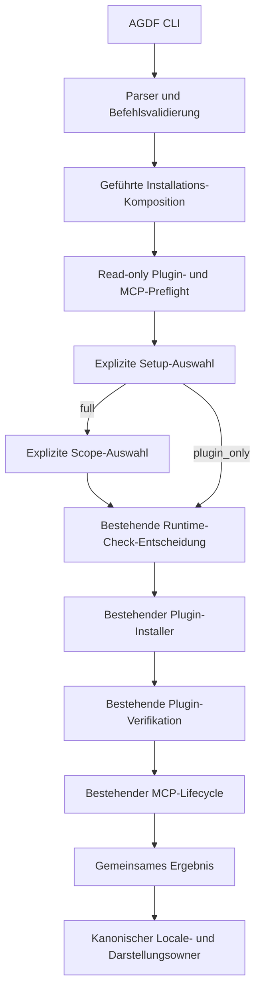

# SD: Geführte MCP-Aktivierung während der AGDF-Installation

Status: approved
Gate: SD
Gate approval: Exact `Approval: SD` accepted on 2026-09-09 after same-target, same-run, same-gate
and run revision `D6E900DA-A645-4CB9-A505-5DEF352E125D` revalidation. Revision 1 approval remains
historical.
Revision: 2
Date: 2026-09-09
Owner: Arndt Gold / Codex
Run: agdf-guided-mcp-activation
Based on: approved PRD Revision 2, approved UR Revision 1, completed Brownfield Review and ready UX Intent Definition
Delivery depth: Structured Delivery

## 1. Lösungsübersicht

Die vorhandenen Installationsbefehle für Codex, Claude Code, GitHub Copilot und OpenCode erhalten
eine gemeinsame geführte Komposition. Sie entscheidet vor der ersten Mutation zwischen
vollständiger Einrichtung, Plugin-only und Abbruch. Nach vollständiger Einrichtung erfasst sie in
einem zweiten Schritt den Scope `project` oder `user`; zurück führt ohne Mutation zur ersten
Entscheidung. Erst danach führt sie den bestehenden Plugin-Installer aus und verwendet nach dessen
Verifikation den bestehenden MCP-Lifecycle für `status` und `enable`.

Die Komposition besitzt keine Plugin-, Host- oder MCP-Semantik. Sie normalisiert Eingaben, ruft die
vorhandenen Owner in fester Reihenfolge auf und bildet deren unveränderte Resultate auf einen
gemeinsamen Installationszustand ab. Plugin-Lifecycle und MCP-Lifecycle behalten ihre eigenen
Transaktions- und Rollback-Grenzen. Ein erfolgreicher Plugin-Zustand wird bei einem späteren
MCP-Fehler nicht zurückgerollt und als `partial` ausgegeben.



Die Pfeile zeigen nur Aufrufreihenfolge und Datenfluss. Keine technische Operation aktiviert AGDF,
wählt einen Governance-Run oder erteilt eine Gate-Freigabe.

## 2. Owner und Quellen der Wahrheit

| Belang | Kanonischer Owner | Designfolge |
|---|---|---|
| CLI-Ziel und Optionen | `create-agdf/lib/cli/parse-args.js` und `command-registry.js` | Neue Optionen werden einmal geparst und durch eine geschlossene Kombinationsmatrix geprüft. |
| Installations-Komposition | neu: `create-agdf/lib/install-setup/service.js` | Koordiniert Preflight, Auswahl, bestehende Operationen und Ergebnisaggregation. Enthält keine Hostkonfiguration. |
| Setup-Vertrag | neu: `create-agdf/lib/install-setup/contract.js` | Besitzt Setup-Modi, Gesamtzustände, Fehlerphasen, Next-Action-Codes und Schema-Prüfung. |
| Setup-Darstellung | neu: `create-agdf/lib/install-setup/presentation.js` | Projiziert ausschließlich den validierten Setup-Vertrag in Text oder JSON. |
| Setup-Interaktion | `create-agdf/lib/install-setup/interaction.js` | Rendert Preflight, Setup-Auswahl und bei `full` eine getrennte Scope-Auswahl. Mutation und Persistenz sind ausgeschlossen. |
| Plugin-Installation | bestehende Module unter `create-agdf/lib/installers/` | Jeder Host verwendet unverändert seinen bestehenden Installer und seine bestehende Rücklesung. |
| Runtime-Check-Zustimmung | `create-agdf/lib/runtime-check-consent/` | Bleibt eine getrennte Entscheidung mit eigenem Zustand, Receipt und Rollback. |
| Plugin-Lifecycle-Ergebnis | `create-agdf/lib/lifecycle/result.js` | Bleibt vollständiger Owner des Plugin-, Hook-, Runtime-Check- und Neustartzustands. |
| MCP-Status, Aktivierung und Entfernung | `create-agdf/lib/mcp-lifecycle/service.js` | Wird über `status`, `enable` und `disable` aufgerufen. Die Setup-Komposition schreibt keine Hostkonfiguration. |
| MCP-Ergebnis | `create-agdf/lib/mcp-lifecycle/result.js` | Bleibt vollständiger Owner von Runtime, Registrierung, Discovery, Herkunft, Scope, Rollback und Capability. |
| Sprache | `plugin/meta/agdf-interaction-locales.json` und `create-agdf/lib/interaction-presentation.js` | Ein vollständiges Locale-Paket rendert die gesamte Setup-Interaktion. Unbekannte Codes scheitern sichtbar. |
| Lokale Entwicklungsinstallation | `create-agdf/scripts/install-local-plugin.js` | Validiert das ursprüngliche npm-Aufrufverzeichnis, injiziert es als Parser-cwd, bereitet Release-Assets vor und reicht dieselben CLI-Argumente weiter. |
| Status und Plugin-Entfernung | `create-agdf/lib/lifecycle/status.js` und `operations.js` | Bestehende Inspektion, Preview, Herkunftsprüfung und Verifikation werden komponiert, nicht kopiert. |
| MCP-Fähigkeitsprofil | `plugin/meta/agdf-mcp-capability.json` | Setup darf Capability- oder Supportaussagen nicht selbst erfinden. |
| Dispatch-Semantik | `create-agdf/lib/skill-dispatch/contract.js` | Bleibt unverändert und alleiniger semantischer Owner von `agdf_dispatch`. |

`application.js` verdrahtet die Owner und injiziert Hostoperationen. Es wird nicht zum zweiten
Setup-Vertrag. Generierte und installierte Dateien konsumieren diese Quellen und werden nicht
unabhängig geändert.

## 3. Öffentlicher CLI-Vertrag

### AD-01: Setup-Absicht als eigenes Feld

`parseArgs` ergänzt:

```text
setupRequest: undefined | plugin_only | full
dirInput: string
dirInputAbsolute: boolean
mcpScope: undefined | project | user
```

`--with-mcp` setzt `setupRequest=full`. `--plugin-only` setzt
`setupRequest=plugin_only`. Beide Optionen gemeinsam sind ein Nutzungsfehler. Das aufgelöste
`options.dir` bleibt absolut, während `dirInputAbsolute` belegt, ob der Nutzer tatsächlich einen
absoluten Wert eingegeben hat.

Die Installationsbefehle verwenden `--scope project|user` als MCP-Scope nur zusammen mit
`--with-mcp`. Nichtinteraktiv gilt ohne Scope weiterhin `project`. Interaktiv bleibt der Scope bis
zur zweiten bewussten Auswahl `undefined`; der Parser erzeugt dafür keinen Default. Nichtinteraktives
`--with-mcp` erfordert ein ausdrücklich übergebenes und bereits in der Eingabe absolutes `--dir`.
Fehlendes TTY, JSON-Ausgabe oder fehlende Setup-Option ergibt `plugin_only`.

### AD-02: OpenCode-Kompatibilität ohne stille Umdeutung

`opencode --dir <pfad>` bezeichnet heute bei bestehenden Plugin-only-Aufrufen das
OpenCode-Konfigurationsverzeichnis. Dieses Verhalten bleibt erhalten.

| Aufruf | Plugin-Konfiguration | MCP-Ziel |
|---|---|---|
| `opencode` ohne neue Setup-Option | Standard beziehungsweise `OPENCODE_CONFIG_DIR` | nicht gebunden |
| `opencode --dir <config>` ohne `--with-mcp` | `<config>` wie bisher | nicht gebunden |
| `opencode --plugin-only --dir <config>` | `<config>` wie bisher | nicht gebunden |
| `opencode --with-mcp --dir <projekt>` | Standard beziehungsweise `OPENCODE_CONFIG_DIR` | `<projekt>` |
| interaktive Auswahl `full`, danach `project` | bisheriger OpenCode-Konfigurationspfad | sichtbares ursprüngliches Aufrufverzeichnis |
| interaktive Auswahl `full`, danach `user` | bisheriger OpenCode-Konfigurationspfad | benutzerweite native Quelle; Aufrufverzeichnis bleibt nur Precedence- und Startkontext |

Damit wird kein bereits gültiger Aufruf neu interpretiert. Beim neuen vollständigen OpenCode-Aufruf
zeigt der Preflight sowohl den Plugin-Konfigurationspfad als auch das davon getrennte Projektziel.
Ein abweichendes Konfigurationsverzeichnis wird weiterhin über `OPENCODE_CONFIG_DIR` gebunden.

### AD-03: Kombinationsmatrix

| Befehl | Neue Kombination | Ergebnis |
|---|---|---|
| Installationsoberfläche, interaktiv, keine Option | Setup-Auswahl erforderlich | noch keine Mutation |
| interaktives `full` | Scope-Auswahl `project | user | back` erforderlich | noch keine Mutation |
| Installationsoberfläche, nichtinteraktiv, keine Option | Plugin-only | kompatibler bisheriger Ablauf |
| Installationsoberfläche mit `--plugin-only` | Plugin-only | keine MCP-Mutation |
| Installationsoberfläche mit `--with-mcp --dir <absolut>` | vollständig | Projekt-Scope, sofern nicht anders angegeben |
| `--with-mcp` ohne absolutes ausdrückliches `--dir` im nichtinteraktiven Modus | Nutzungsfehler | keine Mutation |
| `--scope` ohne `--with-mcp` bei Installation | Nutzungsfehler | keine Mutation |
| `--with-mcp` und `--plugin-only` | Nutzungsfehler | keine Mutation |
| JSON ohne Setup-Option | Plugin-only | keine interaktive Eingabe |

## 4. Setup-Preflight und Auswahl

### AD-04: Read-only Preflight vor jeder Entscheidung

`inspectInstallSetup` erzeugt einen unveränderlichen Preflight:

```json
{
  "schema_version": 1,
  "surface": "codex",
  "version": "<unreleased-development-version>",
  "interaction": "required",
  "plugin": { "status": "observed", "evidence": [] },
  "mcp_by_scope": {
    "project": {
      "status": "not_configured",
      "capability": "unverified",
      "selected_status": "absent",
      "effective_source": "user | project | none",
      "registration_path": "/absolute/native/path",
      "available": true,
      "block_reason": "none",
      "removal_command": "..."
    },
    "user": {
      "status": "not_configured",
      "capability": "unverified",
      "selected_status": "absent",
      "effective_source": "user | project | none",
      "registration_path": "/absolute/native/path",
      "available": true,
      "block_reason": "none",
      "removal_command": "..."
    }
  },
  "target": "/absolute/project",
  "target_source": "explicit_dir | interactive_invocation_cwd_proposal | none",
  "invocation_directory_source": "explicit_dir | npm_init_cwd | process_cwd | none",
  "requested_scope": null,
  "effective_scope": null,
  "plugin_configuration": null,
  "local_execution": true,
  "package_acquisition_required": true,
  "removal_overview": "...",
  "authorizes": false
}
```

Plugin-Status stammt aus der bestehenden Installationsinspektion. `mcp_by_scope` stammt
ausschließlich aus je einem read-only
`runMcpLifecycle({action: "status", scope: "project" | "user"})`, wenn ein sichtbarer Zielkandidat
sicher auflösbar ist. Jede Scope-Zeile besitzt ihren eigenen Konflikt- und Verfügbarkeitsstatus.
Für `project` wird ein vorhandener benutzerweiter Eintrag als wirksamer Fallback gezeigt; er sperrt
die bewusste höher priorisierte Projektregistrierung nicht. Für `user` sperrt ein vorhandener
höher priorisierter Projekteintrag die Mutation als `precedence_conflict`. Fremde und ungültige
Einträge sperren ebenfalls nur die betroffene Option. Die Komposition leitet Verfügbarkeit aus
`selected_status`, `effective_source`, nativer Priorität und den vorhandenen Lifecycle-Codes ab,
nicht aus frei interpretiertem Text. `full` bleibt auswählbar, wenn mindestens ein Scope sicher
verfügbar ist. Fehlt ein gebundener Zielkandidat, lauten beide Einträge `not_checked`; die
Komposition verwendet kein technisches Unterverzeichnis still als wirksames Ziel.

Die erste Karte zeigt den allgemeinen Entfernungspfad. Die Scope-Karte zeigt vor ihrer Auswahl den
exakten, shell-sicher dargestellten Entfernungspfad und die native Konfigurationsquelle je Option.
Damit entsteht kein vorgetäuschter `project`-Scope, nur um im ersten Schritt einen kopierbaren Befehl
anzeigen zu können.

Der MCP-Status darf kein Paket vorbereiten, Verzeichnis anlegen, Login ausführen oder eine
Konfiguration schreiben. Die Tests injizieren alle Owner und belegen die Nullmutation.

### AD-05: Geschlossene Entscheidung

Die erste Interaktion akzeptiert intern nur:

```text
full | plugin_only | cancel
```

Die sichtbare Reihenfolge kommt aus dem Locale-Paket und lautet `full`, `plugin_only`, `cancel`.
`full` ist als empfohlen gekennzeichnet, aber der Interaktionsadapter erhält keinen Defaultwert.
Leere, ungültige und mehrdeutige Eingaben werden erneut angefordert. EOF, Abbruchsignal und
explizites Cancel ergeben `cancel`.

Bei `full` ruft der Service anschließend denselben Interaktionsowner mit einem zweiten geschlossenen
Entscheidungsraum auf:

```text
project | user | back
```

Die sichtbare Reihenfolge lautet `project`, `user`, `back`. `project` ist bei einer Neuinstallation
empfohlen, aber nie vorselektiert. Bei einem Update wird der aktuell passende Scope zusätzlich als
vorhanden gekennzeichnet. `back` kehrt ohne Mutation zur ersten Auswahl zurück. EOF oder
Abbruchsignal beendet die gesamte Reise als `cancel`. Leere und ungültige Eingabe werden erneut
angefordert. Der Service erhält als Ergebnis ein geschlossenes Objekt
`{ setup_request, requested_scope }`; nur `full` besitzt einen Scope.

Ein fremder, ungültiger oder höher priorisierter MCP-Zustand sperrt nur den betroffenen Scope und
nennt dort den konkreten Grund. Sind beide Scopes gesperrt, ist `full` gesperrt. Interaktiv bleiben
Plugin-only und Abbruch auswählbar. Nichtinteraktives `--with-mcp` prüft nur den ausdrücklich
angeforderten beziehungsweise kompatibel standardmäßigen Scope und stoppt bei dessen Konflikt vor
jeder Plugin- oder MCP-Mutation.

## 5. Ausführungsreihenfolge und Transaktionsgrenzen

### AD-06: Eine feste Kompositionsreihenfolge

`runInstallSetup` führt aus:

1. CLI-Kombination, Host und Zielkandidat validieren; nichtinteraktiv zusätzlich den Scope binden;
2. Plugin- und, sofern zielgebunden, beide MCP-Scope-Ausgangszustände read-only ermitteln;
3. Setup-Absicht aus expliziter Option oder interaktiver Auswahl bestimmen;
4. bei interaktivem `full` den Scope bewusst auswählen; `back` springt zu Schritt 3;
5. bei `cancel` ohne weitere Operation ein Abbruchergebnis ausgeben;
6. die bestehende Runtime-Check-Entscheidung getrennt anzeigen und erfassen;
7. bei deren `cancel` vor Mutation abbrechen;
8. den bestehenden Plugin-Installer ausführen und dessen Verifikation übernehmen;
9. die Runtime-Check-Entscheidung über den bestehenden Owner anwenden und verifizieren;
10. nur bei verifiziertem Plugin und gebundenem `full`-Scope den MCP-Lifecycle mit `enable`
    ausführen;
11. die unveränderten Teilresultate validieren, einen Gesamtzustand ableiten und einmal ausgeben.

Die Runtime-Check-Entscheidung wird vor Plugin-Mutation getroffen, ihre bestehende Persistenz bleibt
an eine erfolgreich aufgelöste Installation gebunden. Ein Fehler dieser getrennten technischen
Zustimmung sperrt MCP nicht automatisch. Das Gesamtergebnis wird jedoch `partial`, bis alle
angeforderten Teilzustände den Vertrag erfüllen.

### AD-07: Plugin-Fehler stoppt MCP vollständig

Ein Plugin-Fehler oder eine nicht gesunde Plugin-Verifikation führt zu:

- Gesamtzustand `failed`;
- Fehlerphase `plugin_operation` oder `plugin_verification`;
- keinem Aufruf von MCP `enable`;
- keinem MCP-Paketbezug und keiner MCP-Konfigurationsmutation;
- genau einer Wiederholungsaktion aus dem bestehenden Plugin-Lifecycle.

### AD-08: MCP-Fehler bewahrt Plugin-Erfolg

Nach verifiziertem Plugin darf MCP fehlschlagen, degradieren oder seinen eigenen Rollback melden.
Die Komposition:

- verändert oder rollt das Plugin nicht zurück;
- übernimmt MCP-Diagnostik und MCP-Rollback unverändert;
- setzt den Gesamtzustand `partial`;
- nennt genau eine MCP-Recovery-Aktion;
- behält Runtime-Check- und Plugin-Zustand sichtbar.

Ein erneuter Aufruf beginnt immer mit einem neuen Preflight. Eine frühere interaktive Auswahl wird
nicht als neue Zustimmung gespeichert oder wiederverwendet.

## 6. Gemeinsamer Ergebnisvertrag

### AD-09: Setup-Ergebnis Schema 1

`createInstallSetupResult` validiert dieses öffentliche Schema:

```json
{
  "schema_version": 1,
  "contract_version": 1,
  "operation": "install_setup",
  "result": "success | partial | failed | cancelled",
  "setup_request": "plugin_only | full | cancel",
  "effective_state": "plugin_ready_mcp_absent",
  "surface": "codex",
  "target": "/absolute/project | null",
  "target_source": "explicit_dir | interactive_invocation_cwd_selection | none",
  "invocation_directory_source": "explicit_dir | npm_init_cwd | process_cwd | none",
  "requested_scope": "project | user | null",
  "effective_scope": "project | user | null",
  "plugin": {},
  "runtime_checks": {},
  "mcp": {},
  "discovery": { "status": "not_checked | pending_restart | discovered" },
  "restart": { "required": true, "reasons": ["plugin_reload", "mcp_discovery"] },
  "failure": null,
  "next_action": { "code": "restart_host", "parameters": {}, "text": "..." },
  "authorizes": false
}
```

`plugin` enthält das validierte bestehende Lifecycle-Ergebnis. `mcp` enthält entweder das
validierte MCP-Lifecycle-Ergebnis oder den geschlossenen Zustand `not_requested | not_checked`.
Die Komposition erfindet keine inneren Plugin-, Consent- oder MCP-Felder.

Bei `project` bezeichnet `target` das Registrierungsprojekt. Bei `user` bleibt `target` der
absolute Aufruf- und Precedence-Kontext, den der bestehende MCP-Lifecycle für die native Rücklesung
benötigt. Die tatsächliche Bindung wird ausschließlich durch `mcp.registration.native_scope`,
`selected_source` und `path` beschrieben. Die Textdarstellung nennt `target` bei `user` deshalb
„Aufrufkontext“ und die Registrierung „Benutzerkonfiguration“; sie darf daraus kein Projektziel
ableiten.

`effective_state` verwendet ausschließlich:

```text
cancelled
plugin_ready_mcp_absent
plugin_ready_mcp_unchanged
configured_pending_restart
configured_unverified
discovered_ready
partial
degraded_or_foreign
failed
```

`discovered_ready` kann während der Installation nicht entstehen. Es erfordert weiterhin direkte
Evidenz einer frischen Host-Sitzung und wird nur durch einen späteren Status- beziehungsweise
Evidenzpfad projiziert.

### AD-10: Deterministische Zustandsableitung

| Voraussetzung | Gesamtzustand |
|---|---|
| Auswahl abgebrochen, keine Mutation | `cancelled` |
| Plugin verifiziert, Plugin-only, MCP absent oder nicht geprüft | `plugin_ready_mcp_absent` |
| Plugin verifiziert, Plugin-only, MCP vorhanden oder abweichend | `plugin_ready_mcp_unchanged` |
| Plugin verifiziert, MCP passend neu registriert, Discovery ausstehend | `configured_pending_restart` |
| Plugin verifiziert, MCP bereits passend, Discovery nicht direkt geprüft | `configured_unverified` |
| Plugin verifiziert, MCP- oder Runtime-Check-Teiloperation fehlgeschlagen | `partial` |
| Plugin-only nach sichtbarem fremdem oder konfliktbehaftetem MCP-Zustand | `degraded_or_foreign` mit unverändertem MCP |
| Plugin nicht verifiziert | `failed` |

Die Gesamtzustandsfunktion ist rein und erhält nur validierte Teilresultate. Unbekannte Kombinationen
werfen `AGDF_INSTALL_SETUP_RESULT_INVALID` und werden als sichtbarer interner Fehler ausgegeben.

## 7. Darstellung und Sprache

### AD-11: Eine Registry, ein Sprachpaket, keine freien Bedeutungen

`plugin/meta/agdf-interaction-locales.json` erhält unter jedem vollständigen Locale-Paket den
Bereich `installSetup` mit:

- Überschriften, Feldbezeichnungen und Auswahltexten;
- Scope-Frage, Projekt-, Benutzer- und Zurück-Option sowie Kennzeichnungen für Empfehlung,
  vorhandenen Scope und Scope-Blocker;
- Beschreibungen für lokale Ausführung, Paketbezug, Scope und Entfernung;
- allen Setup-Zuständen, Fehlerphasen und Next-Action-Codes;
- Interaktionsfehlern für leere, ungültige und gesperrte Auswahl;
- vollständigen Ergebnistexten für Plugin, Runtime-Checks, MCP, Discovery und Neustart.

`validateLocaleRegistry` verlangt die identische Schlüsselmenge aller Pakete. Die gesamte
Interaktion löst zu Beginn genau ein Locale auf. Fehlende oder ungültige Sprache verwendet den
bestehenden Eingabevertrag; eine gültige, aber nicht unterstützte Sprache rendert vollständig in
Englisch. Ein unbekannter stabiler Setup-Code ist ein Darstellungsfehler und darf nicht durch freien
englischen Text ergänzt werden.

Text und JSON verwenden dieselben Codes und Werte. Text ergänzt nur die lokalisierte Projektion.
Farben und Optionsposition sind keine Bedeutungsträger.

## 8. Status, Deaktivierung und Entfernung

### AD-12: Kombinierter Status bleibt read-only

`status --surface <surface> --dir <absolut> [--scope project|user]` ergänzt bei ausdrücklichem Ziel
den bestehenden allgemeinen Status um genau ein MCP-Statusresultat. Ohne ausdrückliches Ziel bleibt
der bestehende Status unverändert und MCP `not_checked`. Der Status führt keine Setup-Auswahl aus
und besitzt keine Mutation.

### AD-13: Gekoppelte Deaktivierung komponiert bestehende Operationen

Ein Repository-Opt-out kann ausdrücklich mit dem projektbezogenen MCP-Pfad gekoppelt werden:

```text
agdf disable --surface <surface> --scope repository --dir <projekt> --with-mcp
```

Die Komposition prüft beide Zustände vorab, führt MCP `disable` für Scope `project` aus und wendet
danach den bestehenden Repository-Disable-Plan an. Scheitert MCP, beginnt der Plugin-Disable nicht.
Scheitert anschließend der Plugin-Disable, bleibt der verifizierte MCP-Disable erhalten und das
Ergebnis lautet `partial`. Ein automatisches Wiederaktivieren wäre eine neue technische Zustimmung
und findet nicht statt.

### AD-14: Gekoppelte globale Entfernung bleibt Preview-first

Die bestehende Plugin-Entfernung bleibt standardmäßig Plugin-only. Eine gekoppelte Entfernung ist
nur ausdrücklich möglich:

```text
agdf uninstall --surface <surface> --scope global --with-mcp \
  --mcp-scope <project|user> --dir <absolutes-ziel> [--confirm]
```

Ohne `--confirm` zeigt ein gemeinsames Preview die ausgewählte Plugin-Entfernung, den aktuellen
MCP-Zustand, Ziel, MCP-Scope, betroffene AGDF-eigene Quellen und erhaltene Referenzen. Mit
`--confirm` werden Ausgangszustand und Herkunft erneut geprüft. Danach führt die Komposition zuerst
den bestehenden MCP-Disable und nur nach dessen sicherem Ergebnis den bestehenden Plugin-Uninstall
aus.

Fremde, ungültige oder mehrdeutige MCP-Herkunft stoppt die gekoppelte Entfernung vor Mutation.
Gemeinsam genutzte Runtimes werden ausschließlich nach den bestehenden Referenzregeln entfernt.
Plugin-Uninstall ohne `--with-mcp` verändert MCP weiterhin nicht.

## 9. Lokale Entwicklungsinstallation

### AD-15: Ursprüngliches Aufrufverzeichnis sicher weiterreichen

`install-local-plugin.js` ermittelt vor `release:prepare` genau einen Parser-Ausgangspunkt:

1. Ist `INIT_CWD` vorhanden, muss der Wert absolut sein, auf ein vorhandenes Verzeichnis zeigen und
   wird mit `realpath` kanonisiert. Ein ungültiger vorhandener Wert stoppt mit
   `AGDF_LOCAL_INVOCATION_DIRECTORY_INVALID` vor Vorbereitung oder Mutation.
2. Fehlt `INIT_CWD`, wird `process.cwd()` nach denselben Regeln verwendet. Das deckt den direkten
   Skriptaufruf ab.
3. Ein ausdrücklich weitergereichtes absolutes `--dir` bleibt der MCP-Zielowner. Der Parser-cwd
   dient dann nur zur Auflösung anderer relativer CLI-Werte.

Danach ruft der Wrapper auf:

```text
runCli(
  [surface, ...forwardedArgs],
  { ...canonicalAdapters, parser: { ...suppliedParser, cwd: invocationDirectory } }
)
```

Der Wrapper parst keine Setup-Option, keinen Scope und trifft keine Auswahl. Er transportiert nur
die kanonische Verzeichnisangabe des aufrufenden npm-Prozesses. `INIT_CWD` erteilt keine
Governance-Autorität und wird vor einer interaktiven Mutation vollständig sichtbar angezeigt. Für
OpenCode reicht der Wrapper zusätzlich `exec`, Umgebung und Interaktionsadapter wie die übrigen
Oberflächen weiter. Tests belegen die unveränderte Argumentreihenfolge, den Parser-cwd, ungültige
Umgebungswerte und die weiterhin vorgelagerte Release-Vorbereitung.

## 10. Sicherheit und Autorität

- Die Setup-Komposition startet keinen beliebigen Prozess und schreibt keine Hostkonfiguration.
- Plugin- und MCP-Mutationen laufen ausschließlich durch ihre bestehenden Owner.
- MCP-Paketbezug beginnt erst nach bewusster vollständiger Auswahl und verifiziertem Plugin.
- Interaktiv besitzt MCP keinen impliziten Scope. Nichtinteraktiv bleibt `project` der einzige
  Kompatibilitätsdefault; `user` erfordert die exakte Option.
- Eine benutzerweite Registrierung ist ein Host-Default. Projektspezifische native Quellen dürfen
  sie gemäß bestehender Priorität übersteuern und werden nie still entfernt.
- `INIT_CWD` wird als untrusted Pfadeingabe validiert und ist nur ein sichtbarer Zielvorschlag.
- Fremde oder nicht herkunftsgeprüfte Registrierung wird nicht übernommen, korrigiert oder
  entfernt.
- Native Trust-, Permission- und Organisationsrichtlinien bleiben Hostautorität.
- Jede Ebene enthält `authorizes: false`; keine technische Auswahl erzeugt ein AGDF-Gate-Approval.
- Protokolle enthalten Pfade, Codes und Zustände, aber keine Tokens oder Host-Zugangsdaten.

## 11. Fehler- und Recovery-Vertrag

| Fehlerphase | Mutation | Gesamtergebnis | Genau eine nächste Aktion |
|---|---|---|---|
| `input_validation` | keine | `failed` | korrigierten Befehl ausführen |
| `setup_selection` abgebrochen | keine | `cancelled` | keine |
| `plugin_preflight` | keine | `failed` | Plugin-Voraussetzung klären |
| `plugin_operation` oder `plugin_verification` | MCP nicht begonnen | `failed` | Plugin-Installation wiederholen |
| `runtime_check_permission` nach Plugin-Erfolg | Plugin bleibt | `partial` | Runtime-Check-Zustand klären |
| `mcp_preflight` bei ausdrücklichem vollständigem Aufruf | keine | `failed` | benannte Registrierung oder Voraussetzung klären |
| `mcp_enable` | Plugin bleibt; MCP-eigener Rollback | `partial` | exakten MCP-Retry ausführen |
| `mcp_disable` bei gekoppelter Entfernung | weitere Entfernung nicht begonnen | `failed` | MCP-Herkunft oder Disable klären |
| Plugin-Entfernung nach erfolgreichem MCP-Disable | MCP bleibt entfernt | `partial` | Plugin-Uninstall wiederholen |
| Ergebnis- oder Darstellungsvalidierung | erreichte Zustände bleiben | `failed` | internen Vertragsfehler beheben |

Die Ausgabe behauptet keine übergreifende Atomarität. `changes`, `retained`, Fehlerphase und
Rollback-Ergebnis bleiben pro bestehendem Owner sichtbar.

## 12. Testarchitektur

### Deterministische Repository-Spur

| Testowner | Nachweis |
|---|---|
| `cli-parse-args-test` und Command-Registry-Tests | Optionsmatrix, absolute Eingabe, Scope-Regeln, OpenCode-Kompatibilität |
| neuer `install-setup-contract-test` | geschlossene Schemas, Zustandsmatrix, unbekannte Kombinationen, `authorizes: false` |
| `install-setup-interaction-test` | Beide dreiteiligen Entscheidungen ohne Default, Projekt-/Benutzerscope, zurück, ungültige Eingabe, EOF, Abbruch und scopespezifische Blocker |
| `install-setup-service-test` | Zwei Scope-Preflights, Schleife bei zurück, Bindung erst nach Scope-Wahl, Nullmutation, Plugin-only, Idempotenz, Teilfehler und getrennte Rollbacks |
| bestehender `lifecycle-test` | Plugin-, Runtime-Check-, Disable- und Uninstall-Vertrag bleibt stabil |
| bestehender `mcp-lifecycle-test` | MCP-Herkunft, Adapter, Scope, Runtime, Referenzen und Rollback bleiben stabil |
| Locale- und Präsentationstests | vollständige Englisch-/Deutsch-Pakete, Fallback und Text-/JSON-Parität |
| lokaler Installer-Test | `INIT_CWD`- und `process.cwd()`-Validierung, kanonischer Parser-cwd, ungültige Pfade, Argumentweitergabe und Release-Vorbereitung vor Modulimport |
| Release- und Smoke-Suiten | generierte, gepackte und installierte Owner bleiben versionsgleich |

Alle vier Oberflächen verwenden dieselbe Service-Matrix mit injizierten vorhandenen Hostoperationen.
Adapter-Fixtures belegen keine geladene Host-Unterstützung.

### Direkte Host-Spur

Für jede behauptete Oberfläche wird getrennt erfasst:

1. Host-, Client-, Betriebssystem-, Architektur-, Node- und AGDF-Version;
2. Ausgangszustand von Plugin und MCP;
3. gewählte Installation und genauer Befehl;
4. sichtbare Scope-Auswahl, native Konfigurationsquelle und etwaige Precedence-Blocker;
5. native Plugin-Rücklesung;
6. native MCP-Registrierung und Runtime-Herkunft;
7. vollständiger Host-Neustart und neue Sitzung;
8. Discovery von `agdf_dispatch`;
9. ein begrenzter gültiger und ein kontrollierter fehlerhafter Aufruf;
10. sichtbarer Terminal- und Fortsetzungsnachweis;
11. gekoppelte beziehungsweise getrennte Entfernung und exakter Endzustand.

Fehlende Authentifizierung, Trust-Entscheidung, Desktop-Automation oder native OS-Spur bleibt als
`unverified` offen. Evidenz wird nicht zwischen Oberflächen oder Betriebssystemen übertragen.

### Menschliche UAT-Spur

UAT prüft getrennt von der Technik:

- ob Empfehlung und aktive Auswahl unterscheidbar sind;
- ob Ziel, Scope, lokale Ausführung und Paketbezug vor Mutation verstanden werden;
- ob Projekt-Scope, benutzerweiter Standard und native Priorität korrekt verstanden werden;
- ob der lokale Wrapper die aufrufende Projektwurzel statt `create-agdf` zeigt;
- ob Plugin-only und Abbruch erwartungsgemäß wirken;
- ob Teilzustand, Neustart und genau eine Recovery-Aktion verständlich sind;
- ob die Entfernungserwartung mit dem tatsächlichen Preview übereinstimmt.

## 13. Rückwärtskompatibilität und Migration

- Bestehende nichtinteraktive Installationen ohne neue Optionen bleiben Plugin-only.
- Bestehendes `opencode --dir <config>` bleibt ohne `--with-mcp` unverändert.
- Bestehende direkte `agdf mcp status|enable|disable`-Befehle bleiben vollständig verfügbar.
- Bestehende MCP-Registrierungen werden ausschließlich durch den MCP-Lifecycle gelesen oder
  migriert.
- Eine frühere MCP-Auswahl ist Kontext, aber keine neue Zustimmung.
- Marketplace- und Host-UI-Installationen ohne CLI-Callback bleiben Plugin-only.
- AGDF 0.14.5 bleibt ohne MCP-Unterstützung. Der hier definierte Setup-Vertrag gehört zur noch
  unveröffentlichten Folgeversion; Beispiele dürfen 0.14.5 nicht als MCP-fähige Releaseversion
  darstellen.
- Ergebnis-Schema 1 der Plugin-Lifecycle-Ausgabe und Schema 2 des MCP-Lifecycle bleiben
  unverändert. Der Setup-Vertrag kapselt beide, statt sie zu ersetzen.

## 14. Kontextgraph

Nach Implementierung und direktem Nachweis werden die vorhandenen Knoten ergänzt:

- `CG-CREATE-AGDF-CLI-COMPOSITION`: geführte Setup-Auswahl, feste Aufrufreihenfolge,
  OpenCode-`--dir`-Kompatibilität und lokaler Wrapper;
- `CG-MCP-DISPATCH-ADAPTER`: explizite Aktivierung aus der Installations-Komposition sowie
  unveränderte Lifecycle-, Herkunfts- und Supportgrenzen;
- `CG-NATIVE-INTERACTION-AUTHORITY`: technische Setup-Auswahl, getrennte Runtime-Check-Zustimmung
  und weiterhin nicht autorisierende Wirkung.

Der Kontextgraph wird erst mit der tatsächlich implementierten und geprüften Beziehung
aktualisiert. Dieses SD allein ist kein Ausführungsnachweis.

## 15. Traceability

| PRD-Anforderung | Designentscheidungen | Primäre Evidenz |
|---|---|---|
| GMCP-01 bis GMCP-04 | AD-01 bis AD-05 | Parser-, Interaktions- und Nullmutationstests |
| GMCP-05 bis GMCP-11 | AD-06 bis AD-10 | Service-, Lifecycle-, Teilfehler- und Idempotenztests |
| GMCP-12 bis GMCP-14 | AD-09 bis AD-11 | Schema-, Locale-, Runtime-Check- und Präsentationstests |
| GMCP-15 und GMCP-16 | AD-02 und AD-15 | Marketplace-Grenze und lokaler Wrapper-Test |
| GMCP-17 | AD-12 bis AD-14 | Status-, Disable-, Uninstall-, Referenz- und Preview-Tests |
| GMCP-18 und GMCP-19 | AD-11 sowie Abschnitt 10 | Locale-Invariante und Autoritätstests |
| GMCP-20 | Abschnitt 12 | getrennte Repository-, Paket-, Host- und UAT-Spuren |
| AC-01 bis AC-05 | AD-01 bis AD-05 | Auswahl- und CLI-Matrix |
| AC-06 bis AC-10 | AD-06 bis AD-14 | Orchestrierung, Teilfehler, Restart und Entfernung |
| AC-11 und AC-12 | AD-11 und Abschnitt 12 | Sprache, Schema und direkte Hostmatrix |
| AC-13 | AD-04, AD-05 und AD-15 | Scope-Auswahl, Precedence-Prüfung und ursprünglicher Parser-cwd |

## 16. Abgelehnte Alternativen

### Zweiten kombinierten Installer einführen

Abgelehnt, weil er Plugin- und MCP-Ownership duplizieren und später von direkten Lifecycle-Befehlen
abweichen würde.

### MCP bei fehlender Eingabe automatisch aktivieren

Abgelehnt, weil Empfehlung keine technische Zustimmung ist und nichtinteraktive Aufrufe sonst neue
Hostmutation erhalten würden.

### Installationsumfang und Scope in einer vierteiligen Liste mischen

Abgelehnt, weil Plugin-only, Abbruch und die Reichweite einer MCP-Registrierung unterschiedliche
Entscheidungen sind. Zwei kurze dreiteilige Schritte halten Einrichtungsumfang und Scope getrennt
und erlauben eine Rückkehr ohne Mutation.

### Benutzerweiten Scope als interaktiven Default setzen

Abgelehnt, weil eine breitere Hostregistrierung eine bewusste Auswahl erfordert. Der Dialog darf
`project` empfehlen und einen vorhandenen Scope kennzeichnen, aber keinen Scope vorselektieren.

### Plugin bei MCP-Fehler zurückrollen

Abgelehnt, weil der verifizierte Plugin-Zustand eigenständig nutzbar ist und ein
systemübergreifender Rollback zusätzliche Fehler und falsche Atomarität erzeugt.

### MCP aus Skills, Hooks oder Chat registrieren

Abgelehnt, weil damit Ziel-, Permission- und Mutationsautorität unklar würde. Der exakte CLI-Aufruf
bleibt der ausführbare Aktivierungspfad.

### OpenCode-`--dir` für bestehende Aufrufe global umdeuten

Abgelehnt, weil vorhandene lokale und automatisierte Installationen damit ein anderes Ziel
erhielten. Die neue Bedeutung gilt nur in der neuen ausdrücklichen `--with-mcp`-Kombination.

## 17. Offene Umsetzungsrisiken

- Die heutige CLI-Application enthält oberflächenspezifische Installationskomposition. Der Umbau
  muss sie hinter injizierbare vorhandene Operationen stellen, ohne einen zweiten Installer zu
  erzeugen.
- Die zwei technischen Entscheidungen im geführten Ablauf dürfen im Terminal nicht wie eine
  gemeinsame Zustimmung wirken.
- Native Hosts können Registrierung erfolgreich zurücklesen und das Tool nach Neustart dennoch
  nicht laden. Der Gesamtvertrag muss Discovery getrennt halten.
- Gekoppelte Entfernung ist bewusst keine hostübergreifende atomare Transaktion. Teilzustände und
  Recovery müssen deshalb vollständig getestet und sichtbar sein.
- Direkte Hosttests können auf einem konkreten Host an Authentifizierung oder Trust stoppen. Diese
  Lücke darf die Repositorytests nicht umdeuten.

## 18. Nächster Schritt

Solution Design Revision 2 ist freigegeben. Task und Test Plan Revision 2 zerlegt die getrennte
Scope-Interaktion, scopespezifische read-only Preflights, native Priorität, eindeutige
Zielbezeichnungen und die validierte `INIT_CWD`-Übergabe in überprüfbare Aufgaben. Die
Implementierung bleibt bis zur exakten TP-Freigabe gesperrt.
