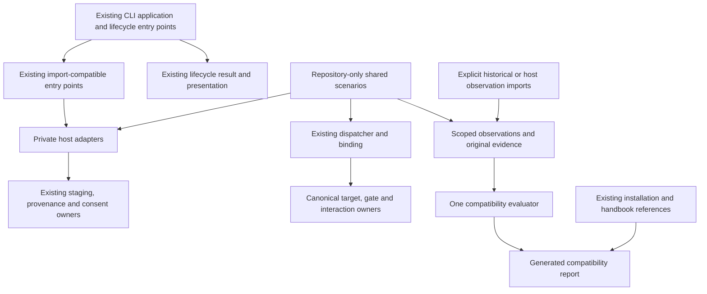

# SD: Host Adapter Ownership and Comparable Compatibility Evidence

Status: approved
Revision: 1
Gate: SD
Gate approval: Exact `Approval: SD` accepted on 2026-09-05 after version-matched gate-check confirmed run `agdf-host-adapter-compatibility`, gate `SD`, durable Revision 1 and revision identity `7cf5934a-35d0-4d91-a43c-3f5e1bc03e97`.
Based on: approved PRD Revision 1, HAC-01 through HAC-12
Date: 2026-09-05
Owner: Arndt Gold / Codex
Run: agdf-host-adapter-compatibility
Delivery depth: Structured Slice

## 1. Solution Overview

Separate two dependency paths:

1. The existing production path keeps public commands/results and canonical governance behavior.
   Private host mechanics move behind explicit adapter modules, while shared ownership, transaction,
   identity, consent and presentation policies remain in their current owners.
2. A repository-only compatibility path executes shared deterministic scenarios, imports explicitly
   identified observations and renders an evidence comparison. It consumes facts from the production
   owners but is never imported by an installed runtime or used to decide a gate or permission.

No generic adapter registration framework, live capability store or public compatibility command is
introduced. The four existing host identifiers are fixed routing data, not dynamically discovered
plugins. Explicit host selection and the existing ambiguous/unsupported input behavior are preserved.

Arrows indicate dependency/data use, not authority delegation. The diagram omits mechanical helper
imports. Nothing in the report path can cause installation, runtime dispatch, consent or gate changes.

## 2. Ownership and Source of Truth

### 2.1 Preserved Owners

| Concern | Owner retained | Design boundary |
|---|---|---|
| Target, gate, approval and presentation | `create-agdf/lib/task-target-resolution.js`, `control-evaluation/`, `interaction-presentation.js`, `plugin/meta/contracts/` | No new host-specific governance decision or gate/status renderer. |
| Skill dispatch and invocation binding | `create-agdf/lib/skill-dispatch/{service,contract,binding}.js`; existing session producers | Preserve dispatcher protocol 1, binding schema 2, source/target separation, argument grammar, terminal handling and existing launch behavior. |
| CLI selection and orchestration | `create-agdf/lib/cli/application.js` and current registry/parser/handlers | Existing command inventory, arguments, exit codes and dependency injection remain compatible. |
| Lifecycle output | `create-agdf/lib/lifecycle/{result,status,presentation}.js` | Keep legacy fields and their meanings. `healthy` continues to describe the existing installation check, not the new five-outcome comparison. |
| Shared staging, ownership and rollback | `create-agdf/lib/installers/local-marketplace.js`, `create-agdf/lib/fs-swap.js`, `runtime/plugin-provenance.js` | One owner for snapshot stability, owned-root eligibility, normalized digests, transaction/rollback and provenance formats. |
| OpenCode installation and activation | `create-agdf/lib/installers/{opencode,opencode-activation}.js` | Already a host adapter. Keep its topology and algorithms; do not duplicate or relocate the large installer just for directory symmetry. |
| Consent decisions, identity and receipt persistence | `create-agdf/lib/runtime-check-consent/{coordinator,contract,state,service}.js` | One decision vocabulary, capability validation/hash and receipt meaning. Host operations are delegated, not permission authority. |
| Existing host-specific files | Copilot transport/settings/discovery, Claude settings/cache recovery and Codex hook observation modules | Reuse the actual owner. A new host entry point may compose these modules but cannot reimplement them. |
| Historical observations | Their existing run-owned files and schemas | Immutable source evidence. No schema rewrite, approval transfer or current-version relabeling. |

### 2.2 Private Adapter Boundary

Use `create-agdf/lib/host-adapters/<host>/` for newly extracted host mechanics. This is an internal
ownership boundary, not a new package export or installed plugin API. Existing dedicated modules named
above remain valid host owners. The following extraction targets are binding:

| Target | Extracted responsibility | Compatibility entry point |
|---|---|---|
| `host-adapters/codex/plugin.js` | Codex install workflow, native registration/recovery sequence and installation-status interpretation | Existing Codex functions in `installers/plugin-installers.js` delegate/re-export. |
| `host-adapters/claude/plugin.js` | Claude reinstall workflow, native registration/recovery sequence and status interpretation; reuse `claude-cache-recovery.js` | Existing Claude functions in `installers/plugin-installers.js`. |
| `host-adapters/copilot/plugin.js` | Copilot install/enable workflow, launcher choice, marketplace-list interpretation and status interpretation; reuse existing transport/settings/discovery modules | Existing Copilot functions and `COPILOT_CLI_NPM_PACKAGE` in `installers/plugin-installers.js`. |
| `host-adapters/codex/identity.js` | Pure Codex registration revision and local installation-version projection/matching | Preserve `CODEX_REGISTRATION_REVISION`, `codexLocalInstallVersion` and `isCodexLocalInstallVersion` exports from `local-marketplace.js`. |
| `host-adapters/<host>/session-command.js` for the four hosts | Pure fixed session-check command projection with the current exact command strings and platform handling | `runtime-check-consent/contract.js` retains its existing `fixedRuntimeCheckCommand` export and signature. |
| `host-adapters/claude/permission-rules.js` | Pure exact-rule construction, apply and revoke operations currently in `runtime-check-consent/adapters.js` | Existing adapter exports remain available; `claude-settings.js` imports the pure rules directly to avoid a facade cycle. |
| `host-adapters/claude/runtime-check.js` | Configuration/revocation using the existing Claude settings owner and its rollback handle | The shared consent service continues to own receipt writes, ordering and rollback-on-receipt-failure. |
| `host-adapters/codex/runtime-check.js` | Existing Codex trust-versus-execution projection using `codex-hooks.js` | Existing functions in `runtime-check-consent/adapters.js` retain signatures and output. |
| `host-adapters/opencode/runtime-check.js` | Existing package/hook evidence projection and automatic check execution mechanics | Existing `executeOpenCodeAutomaticRuntimeCheck` and adapter exports retain defaults, flags, timeouts and result semantics. |
| `host-adapters/opencode/status.js` | Current mapping from `evaluateOpenCodeGlobalStatus` into the installation facts used by lifecycle status | `lifecycle/status.js` retains its exported functions and injectable evaluator. |

Only create an extracted module when its listed responsibility is actually moved. Do not scaffold
empty uniform files for hosts that do not have that responsibility. Identical mechanical command
formatting may share one pure helper; host command selection remains in the host adapters.

`plugin-installers.js` becomes an import-compatible composition entry point with no second install
implementation. Preserve all existing named exports, defaults, accepted arguments, error classes,
evidence fields and output ordering. `inspectPluginSurface` preserves its current routing, including
legacy default/fallback behavior; changing invalid-input semantics is outside this refactor.

The small generic helpers for command capture, phase-tagged errors, plugin-entry/version parsing and
recovery evidence move once to `installers/plugin-command.js`. Shared source/ownership classification
stays in `local-marketplace.js`; host list-envelope parsing delegates to host-specific pure parsing.
Host identifiers or manifest fields in shared composition are permitted data. They must not become
alternative governance rules or duplicated native command sequences.

Native recovery ordering belongs to each host workflow. Split the existing conditional Codex/Claude
sequences without inventing a recovery framework: shared owned-filesystem rollback still calls the
same transaction, and a shared mechanical attempt helper preserves evidence capture. Copilot retains
its existing independent recovery ordering, including restoration of prior plugin enablement after
reinstallation. Do not unify distinct host workflows by changing their semantics.

### 2.3 Shared Consent and Status Composition

The consent service continues to resolve the deliberate decision, compute the canonical identity,
create/write the receipt and emit the existing state. It delegates only native configuration, runtime
source inspection and execution mechanics. A host configuration handle exposes the existing rollback
behavior so a failed receipt write restores the prior host settings in the same order as today.

Pure permission rules cannot import the settings writer or shared service. Host modules cannot import
the facade that imports them. Runtime source readers return the existing root/digest facts; they do
not approve consent or add a new cache. Preserve current root selection exactly, including cases that
may deserve a separate functional correction. No silent correction is folded into this refactor.

Lifecycle status keeps host selection, operation-status construction, target/run delegation and
presentation. Host configuration parsing and native output interpretation move to their explicit
adapters while the current evaluator injection points remain effective. Host-specific disable and
uninstall mechanics in `lifecycle/operations.js` follow the same boundary. Codex repository config
interpretation and disable verification belong to its `plugin.js`; Copilot delegates to the existing
settings/precedence owner. Each plugin adapter supplies its existing native uninstall command data.
OpenCode's owned uninstall plan and postcondition interpretation move to its existing `installers/opencode.js`
owner. `lifecycle/operations.js` retains common plan envelopes, exported routing functions and generic
plan application. Adapter modules do not import that facade. The public plan shape, command order,
ownership checks and apply function remain unchanged. Do not add supported operations for currently
unsupported host/scope combinations. Shared next-action selection asks the selected adapter only for
host-specific command text; it retains the existing precedence of installation, repository and
delivery conditions.

## 3. Repository-only Compatibility Path

### 3.1 Concrete Files and Dependency Boundary

| Owner/path | Responsibility |
|---|---|
| `scripts/host-compatibility/contract.mjs` | Single internal observation/report vocabulary, validation, identity requirements and applicability rules. Internal format version 1 is not a public protocol. |
| `scripts/host-compatibility/evaluate.mjs` | Pure evaluation of supplied target identities, scenarios and observations. No subprocess, host inspection, network, installation, permission or control-state mutation. |
| `scripts/host-compatibility/render.mjs` | One deterministic Markdown comparison renderer. It does not render AGDF gate/status cards or recompute evidence states. |
| `scripts/host-compatibility/run.mjs` | Repository developer entry point for deterministic recording and report generation/checking. Default execution is isolated fixtures only; live evidence is imported as explicit data, never collected implicitly. |
| `evals/host-compatibility/manifest.json` | Fixed host/OS inventory, common scenario identities, relevant source sets and explicit observation sources. It contains no hand-authored support result. |
| `evals/host-compatibility/observations/` | Versioned input observations, including failure and unavailable evidence; derived support state is not written back as authority. |
| `create-agdf/scripts/host-compatibility-test.js` | One runner for common outcome assertions across the four fixture adapters. |
| `create-agdf/scripts/fixtures/host-compatibility/` | Host-local stimulus and state inspection extracted from the existing installer/lifecycle fixtures; no duplicate common grader. |
| `docs/compatibility/HOST_COMPATIBILITY.md` | Generated human comparison, labelled as a dated evidence snapshot with a source fingerprint and observation links. |
| `docs/compatibility/evidence/` | Publishable, redacted evidence extracts only where needed for an accessible positive claim. Raw private transcripts are not copied. |

These development scripts and observation inputs stay outside `create-agdf/lib`, the npm runtime
payload and `syncPluginRuntime`'s allowlist. There is no import from production into the report path.
Existing skill evaluation machinery is referenced for fingerprinting/mutation-boundary principles,
not repurposed as a lifecycle evaluator: its skill output schema and pass-only recorder cannot
represent the required lifecycle evidence faithfully.

### 3.2 Internal Observation Contract

Each observation contains the following groups. Unknown information is explicit; it is never inferred
from the agent's current working directory, installed package list or a nearby observation.

| Group | Required content |
|---|---|
| Identity | Unique observation ID; common scenario ID; host ID and host variant; expected/observed AGDF canonical version and relevant source/runtime digest; relevant runtime/SDK versions; model when model behavior is claimed. |
| Execution | Actual execution OS; separately declared target OS for platform fixtures; execution path; observation method; fixture adapter/version when simulated; applicable trust/permission/activation conditions and scope. |
| Provenance | Source evidence reference and content hash, original schema/result/evidence vocabulary, observation timestamp and producer method. Retain original identifiers through normalization. |
| Facts | Raw bounded facts required by the scenario: installed root/identity, discovered skill origins, dispatcher result, previous/target/current content, operation failure and per-step recovery facts as applicable. |
| Result | Original observed outcome, expected scenario behavior and separate conformance result. Record negative observations even when the expected-negative scenario passes. |
| Claim scope | Exactly the lifecycle outcome or capability/mechanism/path evaluated; no inherited whole-host capability claim. |
| Recovery/history | Limitation and bounded next action; optional retry/supersession references with the actual newer observation evidence. Historical observations remain accessible. |
| Publication | Explicit publishable evidence reference and redaction status. Private source paths/text cannot pass through the public renderer automatically. |

The normalized comparison lanes are `deterministic_adapter`, `installed_payload`, `fresh_host` and
`human_uat`. The original evidence class is retained separately, and historical applicability is a
property, not an evidence-strength upgrade. A deterministic fixture may omit a real host version only
because its host variant is explicitly simulated and its fixture/version is recorded; it can never
produce a fresh-host claim. An installed-root inspection cannot satisfy callable or fresh-update
proof. A primary-agent observation cannot satisfy subagent proof.

Each supported source format has one explicit mapping in the internal contract. For the historical
HC matrix, retain `run_id`, `case_id`, host/version, original evidence/enforcement/result and referenced
evidence hashes. The fixed three-host/36-row schema stays unchanged. Missing digest/OS/path fields
make the import incomplete for a current matching positive claim. Do not scan every run or import a
record merely because its field names resemble the contract.

### 3.3 Applicability and Evaluation Order

For each requested environment, lane and outcome/capability:

1. Validate inventory, schema, references/hashes, producer method and required identity. A malformed
   report input creates a report diagnostic and an unverified affected claim, not an invented pass.
2. Select observations with the exact relevant environment/payload/path/conditions and claim scope.
   Unknown fields do not match a known target. Keep mismatched observations visible as historical.
3. Check the proof obligation for that outcome. A `healthy` installer result, permission receipt or
   copied skill directory alone is insufficient for broader outcomes. The evaluator uses actual
   recorded facts and the lane-specific obligation, not a success string from an adapter.
4. Respect explicit evidence-backed retry/supersession links for the same tuple, scope and lane.
   Timestamp order alone cannot hide a contradictory failure. Links require a real new observation;
   they are evidence history, not an approval mechanism. Invalid/cyclic links are diagnostics.
5. Project **demonstrated** only from admissible matching positive evidence. Matching negative
   evidence projects **failed**. Conflicting unsuperseded evidence projects **unverified**, names the
   conflict and exposes the failed observation. No positive result wins by severity averaging.
6. Use **unsupported** only for a matching evidenced capability restriction. No observation or
   unavailable access projects **unverified**. Evidence that would otherwise apply except for changed
   relevant identity projects **stale/mismatched** with the mismatch dimensions. Unrelated historical
   entries cannot obscure a current matching failure or imply that a missing environment was tested.
7. Emit the bounded next action associated with the missing/failed condition. Recoverable failures
   include a visible retry through an existing authorized path. The renderer never executes it.

Do not create a global support boolean, a score or a tier. Report consistency and scenario conformance
are separate from host capability results. A report can be structurally valid while live rows remain
unverified; unexpected deterministic scenario failures still fail the validation command. A valid
negative test may prove that failed discovery was correctly detected while recording the observed
discovery outcome as failed in the deterministic lane.

### 3.4 Fingerprints, Recording and Reproducibility

The target snapshot derives canonical AGDF version and payload digests from the existing definition,
generated payload and provenance owners. It does not hand-copy a version into the inventory.
Each deterministic observation records hashes of the participating adapter, shared owners, fixture
and scenario definitions. Manifest source sets are checked against the actual participating local
import/dependency closure, so a new helper cannot silently escape invalidation. Shared-source changes
invalidate their consumers; a host-local fixture/source change cannot affect an unrelated lane by
arbitrary timestamp policy.

Exclude report files, observations and control artefacts from the source-under-test fingerprint to
avoid self-invalidation. Record before/after source identity around execution; a changing source
snapshot invalidates the attempt. Real runtime/source digest changes still trigger the existing
consent rules and invalidate affected host evidence.

The deterministic record action writes all attempt results, including unexpected failures, into a
bounded temporary directory before validating and atomically replacing its own observation/report
outputs. On input, runner or publication validation failure, retain diagnostic/negative attempt data
and return nonzero; do not replace a previously accepted comparison with a partial or fabricated
success. The existing comparison identifies itself as the previous dated snapshot, and check mode
must reject it when its selected source/evidence inputs have drifted. A failure report may be retained
for review without being promoted as a successful validation result.

Check mode only reads recorded observations and current sources, recomputes applicability/rendering
and compares generated bytes. It does not spawn a host or rewrite evidence. Rendering uses recorded
dates and stable ordering; it does not inject the current clock into otherwise unchanged output.

Expose this tooling only as root repository developer scripts: `test:host-compatibility` for suite and
evaluator tests, `compatibility:record` for isolated deterministic recording, and `compatibility:check`
for read-only consistency verification. Do not add commands to the shipped CLI registry or package
exports. The existing community-health/documentation check consumes the read-only compatibility check
so a changed source or missing report cannot pass that repository validation silently. It must not
execute recording or a host lifecycle action as a side effect. Package/runtime tests verify that the
development scripts and report inputs do not enter the installed runtime closure.

## 4. Shared Scenarios and Host Fixtures

The common runner calls a bounded fixture adapter exposing `setup`, `perform`, `observe` and `dispose`.
Operations are fixed scenario identifiers, not arbitrary user-provided commands. Each adapter uses
the real production entry points with existing injected executors/filesystem roots and inspects
actual resulting fixture state. Expected outcomes and common grading live only in the shared suite.

Reuse/extract the relevant setup from `local-marketplace-test.js`, `copilot-installer-test.js`,
`cli-modularization-test.js`, `lifecycle-test.js`, `runtime-check-consent-test.js` and the dispatcher
tests. Keep their focused regression assertions and standalone execution. Copilot's real local Git
transport fixture remains a deterministic fixture with a simulated Copilot command surface.

Every host evaluates the same five outcome groups, including:

- normal installation, discovery and callable canonical preflight;
- plugin listed but skills missing/disabled/from the wrong payload;
- unresolved target, missing approval, invalid input and terminal result transmission;
- same-version changed content and stale effective content after apparent update success;
- interrupted update, verified rollback and a failed/partial recovery step;
- denied/manual consent, trusted-hook-without-execution and bounded transient retry;
- stale identities, conflicting observations and attempts to promote one evidence lane or capability
  into another.

Host-native stimuli and observable fields may differ. If the current implementation exposes a partial
or unsupported mechanism, the group is still evaluated with that explicit expected boundary. A
scenario passes only when it detects the actual expected outcome; it never claims a stronger host
capability. Unconditional fixture booleans or four copied grading tables are prohibited.

The suite is isolated from actual home/config/cache directories, uses injected processes or bounded
temporary executable fixtures, and blocks unintended network/package-manager/host execution. Shared
mutation snapshots verify that real repository/host state was not changed. A fixture OS label remains
separate from the actual execution platform; native Windows/macOS/Linux proof requires real execution
and is never filled from platform-string tests.

## 5. Documentation and Runtime Integration

### Documentation

`docs/compatibility/HOST_COMPATIBILITY.md` is the complete generated reference. It starts with the
checked payload/source identity, observation date range, report consistency and separate deterministic
scenario counts. It then shows native coverage for the four hosts across macOS/Linux/Windows, with
links to detailed exact-tuple rows, and the independent capability/mechanism evidence. Inventory rows
with unknown host versions are coverage gaps, not wildcard claims.

Each outcome row shows status, evidence lane, tuple, reference, limitation and next action. Historical
and mismatched evidence appears in a separate labelled section. Details remain readable without a
dashboard or a second manually maintained support table.

`INSTALL.md` and the existing German/English troubleshooting handbook chapters explain how to read
the comparison and link to it. They retain local status as the authority for the reader's machine.
The existing Pages `proof.links` list in `pages/src/data/site.ts` links to the repository comparison;
it does not duplicate live coverage values or require a new page/component. Existing links and
document-generation rules are reused. No publishing/deployment action is part of implementation.

Public output emits only references beneath the reviewed public report/evidence paths or explicitly
approved accessible source links. Redaction is required before adding a private observation to the
publishable set. Missing publishable evidence prevents the positive public claim; it does not cause
raw private transcripts, local user paths or authentication details to be copied. Internal diagnostics
may retain a private source reference within the run without exposing it in public output.

### Runtime and Packaging

The installed validator's `sync-plugin-runtime.js` allowlist currently copies
`runtime-check-consent/contract.js` but not installer or consent-service trees. Moving fixed command
projection requires adding exactly the four pure `session-command.js` leaves and any actually shared
pure formatter to that allowlist. These leaves import no installer, receipt writer, CLI application,
reporter or generated-runtime context. The contract import closure must be loadable from the isolated
generated bundle without reaching back into the repository.

Full npm packaging already includes `create-agdf/lib`, so new production adapter files follow that
existing package path. Development report scripts and observations remain outside it. Preserve the
runtime-free portable Skills profile. Use existing synchronization and integrity tooling, not direct
edits to generated runtimes or installed caches.

## 6. Compatibility, Recovery and Alternatives

Preserve all pre-existing public flags, output fields/order, exit meanings, import entry points,
dispatcher/binding versions, ownership markers, receipts, runtime paths and per-host effect ordering.
Stable entry modules are the supported internal compatibility surface, not temporary parallel
implementations. They contain routing/re-exports only; the exit criterion for extraction is that the
moved logic has exactly one implementation and the unchanged callers pass through it.

Existing same-version reinstall, Codex content identity, Copilot transport, bounded Claude retry and
OpenCode behavior are retained because the approved PRD freezes functionality. They are not promoted
into a new universal fallback layer. Any need to change a mechanism, fix an unrelated defect, widen
permissions, add a host API or migrate state returns to the earliest affected gate and sizing decision.

Rejected alternatives:

- Putting compatibility policy into `lifecycle/result.js` would change the meaning of existing public
  results and risk deriving whole-host support from installation checks.
- A general host registry/strategy framework would add abstraction without a new required capability.
- Extending the historical HC schema in place would rewrite a completed run's evidence contract.
- Reusing the pass-only skill recorder would lose lifecycle failures or distort its skill-specific
  semantics.
- Shipping the report evaluator in the validator would increase runtime/package coupling without
  helping governance execution.
- Running installers from report generation would change local state merely to answer a comparison.

Source/package rollback uses the existing release and independent host lifecycle. No coordinated
cutover or new migration is required. New runtime bytes may require the existing consent renewal and
fresh-session evidence; this expected consequence must remain visible.

## 7. Test and Evidence Strategy

| PRD criteria | Design evidence to map into TP |
|---|---|
| HAC-01, HAC-12 | Nonzero shared scenario execution for all four adapters/five groups; inventory completeness; single assertion owner; negative sensitivity and malformed/empty-input rejection. |
| HAC-02, HAC-04, HAC-05 | Host fixture state, discovered-origin verification, byte-identity update checks, ordered failure/recovery evidence and partial-recovery output. |
| HAC-03, HAC-06, HAC-11 | Lane/tuple/mechanism validation, original vocabulary preservation, conflict/supersession handling, fingerprint invalidation, historical immutability and publication redaction. |
| HAC-07 | Denied/manual consent, trusted-but-unexecuted hook, transient retry and visible next-action cases; existing permission/receipt rollback regressions. |
| HAC-08, HAC-09 | Existing dispatcher/binding semantics, representative host-local change isolation, actual dependency review and no facade/import cycles. |
| HAC-10 | Existing CLI/lifecycle/installer/consent regressions without weakened assertions, generated isolated-runtime import closure, package/runtime integrity and unchanged persisted formats. |
| User-visible output | Generated Markdown inspection, links, separate report/scenario/capability results, German/English handbook checks and existing Pages checks when its link changes. |

The TP names exact test IDs, paths, commands and environment obligations. This SD records a strategy,
not executed test evidence. Direct host observations require their exact variant/version/OS/path and
appropriate authorization for any lifecycle operation. Missing native access remains explicit in the
report and cannot be repaired by simulated evidence. QA/report acceptance and human UAT remain
separate from stronger live support claims.

## 8. Risks and Remaining Planning Questions

- Preserving command order and exceptional recovery branches is the main extraction risk. The TP
  must capture current call sequences and failure outcomes before moving them.
- Pure runtime leaves must remain free of installation dependencies. The generated standalone import
  test is decisive; source-only import success is insufficient.
- Source sets can drift when helpers are added. The dependency-closure check and before/after source
  fingerprint prevent an apparently current report from using stale observations.
- A capability report may be misunderstood as live status. The snapshot header, independent outcome
  rows, explicit lane and link to existing local status are required design elements.
- Exact available native tuples and publishable observations remain TP/QA evidence questions. The
  initial live coverage may be unverified; deterministic suite execution must still be substantive.
- Detailed task ordering, test case IDs and effort estimates belong to TP. No product or architecture
  decision remains unresolved for SD review. If a frozen boundary proves infeasible, return to sizing
  and PRD/SD revision rather than expanding implementation silently.

Context Graph impact remains `link_only` to `CG-CREATE-AGDF-CLI-COMPOSITION`,
`CG-EXECUTABLE-SKILL-DISPATCH-AUTHORITY` and `CG-NATIVE-INTERACTION-AUTHORITY`. This proposed design is
stored in the run. After SD approval, any durable owner-map update must be recorded as approved design,
not as implemented behavior; actual Source-of-Truth registry changes follow implementation evidence.

## 9. Next Step

SD Revision 1 is approved. Prepare and review the Task/Test Plan.
Implementation remains gated on the subsequent approved TP and required pre-implementation
Brownfield Analysis.
