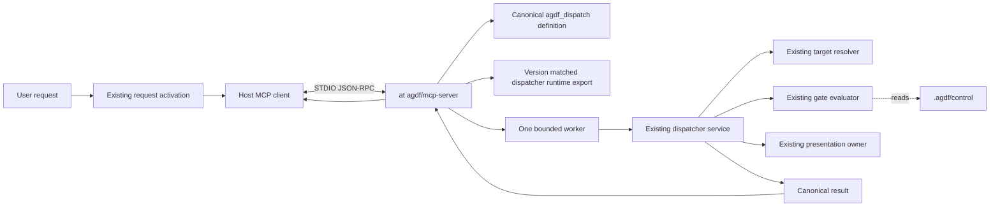

# SD: Cross-Host AGDF Dispatch Through MCP

Status: approved
Gate: SD
Gate approval: exact `Approval: SD` accepted for Revision 3 on 2026-09-06 after same-target,
same-run, same-gate and run revision `17085BD6-6F37-465E-B1D6-133596F235AE` revalidation.
Revision: 3
Date: 2026-09-06
Owner: Arndt Gold / Codex
Run: agdf-mcp-dispatch-server
Based on: approved PRD Revision 4, MCP-01 through MCP-22
Delivery depth: Structured Delivery

Revision history: Revision 1 was not approved and used SDK v1 inside the existing Node.js 18
package. Revision 2 was approved and replaced that design completely with SDK v2 in a separate
`@agdf/mcp-server` Node.js 20 package. Revision 3 keeps the implementation architecture unchanged
and separates observable host qualification from controlled dual-protocol negotiation evidence.
Revision 3 was approved on 2026-09-06 with exact `Approval: SD` after current run and revision
revalidation.

## 1. Solution Overview

Add one local MCP STDIO adapter around the existing `agdf_dispatch` semantic definition and
dispatcher service. The adapter owns protocol framing, trusted runtime injection, bounded execution
and MCP result mapping. It does not own request activation, target resolution, gate evaluation,
presentation, skill judgement, approval or durable state.

The server is distributed as a separate `@agdf/mcp-server` package with Node.js 20 or later as its
runtime boundary. `create-agdf` stays Node.js 18 compatible and remains the installer and lifecycle
owner. It exposes one narrow dispatcher-runtime API to the server without importing, resolving or
starting MCP code during normal CLI use.

The initial server exposes exactly one tool, runs as one child process per host connection, opens no
network listener and makes no outbound network request. One worker executes at most one dispatch per
connection. Timeout, cancellation and shutdown terminate the worker without creating a daemon or a
second workflow state.



Arrows show invocation and data flow. They do not transfer authority. `.agdf/control/` and exact
deliberate user approval remain the only gate authority.

## 2. Package And Ownership Boundaries

### 2.1 Package Graph

| Package | Runtime | Responsibility | Dependency rule |
|---|---|---|---|
| `create-agdf` | Node.js 18 or later | Existing CLI, installer, host lifecycle, dispatcher, target, control, presentation and provenance owners | Adds no MCP SDK dependency. Publishes only a narrow `./mcp-dispatch-runtime` export for the server. |
| `@agdf/mcp-server` | Node.js 20 or later | MCP v2 STDIO entrypoint, one-tool registration, trusted-context binding, worker lifecycle and result mapping | Production dependency on exact same-version `create-agdf` and exact `@modelcontextprotocol/server@2.0.0`. |
| `@agdf/cli` | Existing baseline | Public AGDF CLI composition | Continues to depend on the exact same-version `create-agdf`; it does not acquire the MCP server transitively. |

`@modelcontextprotocol/core@2.0.0` is a production dependency only if the server directly imports
its public protocol constants. `@modelcontextprotocol/client@2.0.0` is development-only when used
by contract tests. SDK v1, remote transports, HTTP frameworks, authentication adapters and
compatibility-shim packages are excluded from the production closure.

Each package owns its own manifest and lockfile. `@agdf/mcp-server` declares
`engines.node >=20` and a single executable bin. The published version of the server,
`create-agdf`, `@agdf/cli` and the plugin release must match exactly.

Publication order is:

1. publish `create-agdf`;
2. publish the same-version `@agdf/mcp-server`;
3. publish the same-version `@agdf/cli`;
4. build and publish the same-version plugin release.

No lifecycle operation may register a server until all selected package identities and provenance
checks agree.

### 2.2 Canonical Owners

| Concern | Canonical owner | Design action |
|---|---|---|
| Request activation | `plugin/meta/contracts/request-activation.md` and existing route projections | Keep before MCP. Registration and discovery never activate AGDF. |
| Tool semantics | `create-agdf/lib/skill-dispatch/contract.js` | Extend the existing definition with canonical output schema and MCP annotations. |
| Wire argument validation | Same semantic contract owner | Derive the accepted input from its JSON Schema, reject extra fields and delegate value normalization to existing code. |
| Dispatch behavior | `create-agdf/lib/skill-dispatch/service.js` | Reuse through the narrow public runtime export. |
| Target authority | `create-agdf/lib/task-target-resolution.js` | Reuse unchanged. `working_directory` remains context only. |
| Gate and status evaluation | `create-agdf/lib/control-evaluation/` and `.agdf/control/` | Reuse unchanged and read-only. |
| Locale and presentation | `create-agdf/lib/interaction-presentation.js` and locale registry | Reuse unchanged. MCP never repairs or localizes text itself. |
| Runtime identity and provenance | Existing runtime and plugin-provenance owners | Extract a pure owned-runtime inspection API for the server. |
| MCP protocol | New `agdf-mcp-server/` package | Own SDK v2 serving, schema adaptation, calls, cancellation and protocol errors only. |
| Host registration | Existing `create-agdf` lifecycle plus host-specific MCP adapters | Safely register, inspect, remove and roll back one owned server entry. |
| Mutable availability | Lifecycle inspection and direct host evidence | Never store loaded-host claims in the static plugin definition. |

Generated bundles, installed roots, host settings and prose skills consume these owners. They cannot
redefine the tool schema, support state or authority model.

## 3. Architecture Decisions

### AD-01: Local STDIO Is The Only Initial Transport

Use MCP over STDIO. The host starts a local AGDF process and communicates over stdin and stdout.
The server opens no TCP port and implements no Streamable HTTP, SSE, WebSocket or remote fallback.
STDOUT is reserved for MCP frames. Bounded diagnostics go to stderr and contain stable codes, not
paths, environment values, raw exceptions or stack traces. Normal startup is silent.

### AD-02: SDK v2 And Exact Protocol Generations

Use exact `@modelcontextprotocol/server@2.0.0`. Build one server definition and start it with the
SDK v2 dual-era `serveStdio(() => buildServer())` path. The release supports exactly:

- MCP `2026-07-28` as the primary protocol generation;
- MCP `2025-11-25` as the required compatibility generation.

Directly connecting `McpServer` to `StdioServerTransport` is prohibited because that path serves
only the 2025-era contract. Additional generations require an approved compatibility revision,
exact dependency updates and direct retesting of every claimed host.

### AD-03: The Semantic Function Is The Schema Owner

`SKILL_DISPATCH_FUNCTION_DEFINITION` remains the canonical owner of tool name, description, input
schema, output schema and safety annotations. Add:

- canonical output JSON Schema for the existing result envelope;
- `readOnlyHint: true`;
- `destructiveHint: false`;
- `idempotentHint: true`;
- `openWorldHint: false`.

The server imports the same definition through `create-agdf/mcp-dispatch-runtime` and passes its
input and output schemas through SDK v2 `fromJsonSchema()`. It creates no parallel Zod schema,
hand-written Standard-Schema wrapper or MCP field vocabulary.

The canonical argument adapter derives allowed and required keys from the input schema, maps the
wire fields to the existing dispatcher input and delegates value validation to
`normalizeSkillDispatchInput`. Extra properties and model-supplied commands, executables, module
paths or runtime paths are rejected before target or control evaluation.

### AD-04: Closed Entrypoint And Trusted Context

The bin entrypoint performs a synchronous Node-major preflight before any dynamic SDK import.
Node.js below 20 exits with a stable diagnostic and no stack trace. Lifecycle enablement performs
the same preflight before mutating host settings.

The installed launch command supplies only `--surface <codex|claude|opencode>`. The parser rejects
unknown, repeated or invalid options. The model cannot set process arguments.

At connection startup the server builds one immutable context:

| Value | Trusted source |
|---|---|
| surface | exact host adapter and closed entrypoint argument |
| expected AGDF version | server package version and exact dependency identity |
| server and dispatcher roots | entrypoint-relative package resolution |
| runtime and source digest | existing owned-runtime manifest and provenance inspection |
| skill registry | canonical packaged plugin definition |
| locale registry | canonical packaged locale definition |

Environment variables cannot override these identity fields. Model inputs remain limited to
`skill_id`, `presentation_language`, `working_directory`, paired target evidence and optional
`run_id`.

Missing, mismatched or unowned provenance stops before target resolution and returns one
non-authorizing terminal recovery with a stable diagnostic.

### AD-05: Direct Dispatcher Reuse Through One Worker

The server imports the narrow runtime export and calls the dispatcher service directly. It never
spawns the CLI, reconstructs a shell command or parses CLI output.

Each call runs in a worker thread created from the server package. The worker receives validated
arguments and the immutable context, recomputes runtime identity and returns only the canonical
result. A connection permits one active worker. A concurrent request receives controlled
`dispatch_busy` without starting another worker.

Cancellation, the 10-second timeout, stdin close, SIGINT and SIGTERM terminate the active worker.
The process holds no governance state after the connection ends.

### AD-06: Lossless Structured And Text Results

Every controlled AGDF result maps to:

```js
{
  content: [{ type: "text", text: serializeSkillDispatchResult(result) }],
  structuredContent: result
}
```

`content[0].text` parses back to a deeply equal object. The adapter does not summarize, translate
or reorder semantic fields.

Controlled `invalid_input`, `target_unresolved`, `control_result`,
`skill_continuation` and `evaluator_error` outcomes remain successful tool transport results
because their canonical `host_action` must reach the model. Unknown tools, malformed JSON-RPC and
non-object tool arguments produce sanitized MCP errors and never invoke the dispatcher. The
existing one MiB serialized-result limit remains authoritative.

### AD-07: Stable Failure Taxonomy

| Failure | Owner | Result |
|---|---|---|
| malformed MCP envelope or unknown tool | SDK and adapter | sanitized MCP error; no dispatcher call |
| canonical field failure | semantic contract | terminal `invalid_input`; no target evaluation |
| unresolved target | existing target owner | canonical localized terminal orientation |
| evaluator or renderer failure | existing dispatcher | canonical terminal recovery with stable stage code |
| runtime or version mismatch | provenance owner plus adapter mapping | terminal recovery; no target evaluation |
| timeout | worker owner | terminal `evaluator_error` with `dispatch_timeout`; worker terminated |
| cancellation or connection close | worker and transport | cancellation response where possible; clean close |
| startup or broken pipe | transport owner | host-visible unavailable state and bounded stderr code |

Raw `error.message`, `error.stack`, environment contents and arbitrary SDK validation details
are never returned.

### AD-08: Read-Only Application Boundary

The reachable server graph may use read-only filesystem APIs, path utilities, crypto hashing,
timers, worker threads and STDIO. It may not expose or call:

- generic filesystem write, rename, delete, permission or link operations;
- `child_process`;
- `net`, `http`, `https`, `http2`, `tls`, `dgram` or `dns`;
- `fetch`, WebSocket or remote MCP transports;
- lifecycle mutation, installer, control-state writer or approval-persistence modules.

The process inherits the operating-system identity and filesystem permissions of its launching
host. This design does not claim process sandboxing. Tests and documentation limit claims to the
application interface and reachable dependency graph. Repository reads are restricted through the
existing dispatcher to the resolved governance target and exact version-matched package roots.

### AD-09: Explicit Project-First Lifecycle

Add:

```text
agdf mcp <status|enable|disable> \
  --surface <codex|claude|opencode> \
  [--scope <project|user>] \
  --dir <absolute-target> \
  [--json]
```

Project is the default scope. User scope requires an explicit option and a visible broader-scope
description. A host that cannot express the selected scope returns an actionable non-mutating
result.

`status` is read-only. `enable` and `disable` are explicit mutation requests and reuse the
existing lifecycle transaction, ownership, result and presentation owners. There is no MCP-specific
consent receipt.

`enable` must run under Node.js 20 or later and registers `process.execPath` as the exact Node
executable. There is no `--node` option, PATH search, Node download, `npx` command or shell command
string. Under Node.js 18, `status` and attempted `enable` return `manual_compatible`, name the
observed major version, give one Node update action and perform no mutation or download. Existing
CLI dispatch remains available.

The lifecycle transaction:

1. canonicalizes the absolute target and selected scope;
2. verifies the exact installed server, dispatcher version and provenance;
3. verifies the selected Node executable before mutation;
4. refuses a foreign or modified `agdf` server identity;
5. writes only the selected host entry through its adapter;
6. reads back command, arguments, scope and identity;
7. restores the exact prior state on failure;
8. reports `configured_pending_restart`.

Only direct fresh-host evidence can promote the state to `available`.

`disable` removes only an exact AGDF-owned entry. Update verifies the new runtime before changing
the entry, verifies the changed entry and then retires the old runtime. Failure restores the prior
registration and runtime.

### AD-10: Versioned Runtime Locations

Use the existing cross-platform AGDF data-root owner and store managed runtime material at:

```text
<AGDF_DATA_ROOT>/mcp/project/<sha256-canonical-target>/<surface>/<agdf-version>/
<AGDF_DATA_ROOT>/mcp/user/<surface>/<agdf-version>/
```

The target hash is derived from the canonical absolute target and does not replace target authority.
Each directory contains exact package identity, provenance manifest and the launch entrypoint. Host
configuration points to that versioned entrypoint. Removal affects only the exact owned version
after no remaining registration references it.

### AD-11: Host Adapters Preserve Native Semantics

| Surface | Project default | Explicit user scope | Permission and evidence boundary |
|---|---|---|---|
| Codex | Safe structural merge of `<target>/.codex/config.toml` under `mcp_servers.agdf`; do not use user-scoped `codex mcp add` for the default | Safe merge of the user configuration only after explicit user scope | Preserve unrelated MCP entries, trust and per-tool approval settings. Configuration is not loaded Desktop/CLI evidence. |
| Claude Code | Run native `claude mcp add --scope local` with the target as working directory and exact command arguments | Use native `--scope user` only after explicit choice | Read back through native lifecycle. Shared `--scope project` is outside the first lifecycle interface because it creates repository-shared configuration semantics. |
| OpenCode | Safe structural merge of `mcp.agdf` in `<target>/opencode.json` using `type: local`, command array, target cwd and enabled state | Safe merge of the documented user config only after explicit choice | Preserve all permission rules. OpenCode exposes the canonical tool as `agdf_agdf_dispatch` because it prefixes the server name. |
| GitHub Copilot | No adapter mutation in the first release | No adapter mutation in the first release | Remains `unverified` until an installed target host supplies direct lifecycle and invocation evidence. |

Each adapter returns the same internal registration facts while retaining its host-specific config,
scope, restart and rollback mechanics. Unsupported symmetry is not invented.

### AD-12: Permission And Gate Approval Remain Separate

Host permission may authorize starting the process or calling `agdf_dispatch`. It never changes
`authorizes: false`, never writes `.agdf/control/` and never satisfies
`Approval: <GateName>`.

When a terminal result contains an approval presentation, the host must transfer
`host_action.text` and stop. A later deliberate user response still passes existing target, run,
gate, durable artefact and revision revalidation before persistence.

### AD-13: Capability And Support State

The static plugin definition may declare only stable facts: capability ID, semantic owner, STDIO
entrypoint, constraints and target surfaces. Mutable lifecycle status uses:

- `not_configured`;
- `configured_pending_restart`;
- `configured_unverified`;
- `available`;
- `unavailable`;
- `unsupported`;
- `manual_compatible`.

A first-release cross-host claim requires direct registration, discovery, successful invocation,
controlled failure and removal evidence on OpenCode plus at least one of Codex or Claude Code.
Every host is qualified independently for the exact observable host, model when applicable, OS,
Node, AGDF, SDK, registered entrypoint/configuration and execution-path tuple. Protocol compatibility
is qualified separately under AD-02 with controlled negotiation clients. A host-selected generation
is additional evidence only when the host exposes it through a stable supported interface. GitHub
Copilot remains unverified and cannot satisfy this threshold.

### AD-14: Deterministic Packaging And Release Integrity

`agdf-mcp-server/` contains source, manifest, lockfile, bin entrypoint and tests. The published bin
uses the server package directly; it is not copied into `create-agdf`. Package-content tests assert:

- exact production and development dependency roles;
- no SDK v1 package;
- no production client or remote transport;
- exact version equality with `create-agdf`;
- executable entrypoint and Node 20 engine;
- deterministic package inventory and license notice;
- absence of embedded absolute build paths.

The plugin definition and runtime manifests record the MCP package identity and expected version
without embedding its dependency closure into the CLI package. Release preparation refuses missing
or skewed packages.

### AD-15: Performance And Shutdown Budgets

Before host and model latency, the local runtime must meet:

| Measure | Budget |
|---|---|
| cold process start through successful `tools/list` | p95 <= 1.5 seconds over at least 20 runs |
| warm resolved gate dispatch | p95 <= 1.0 second over at least 20 runs on the same fixture |
| hard dispatch timeout | 10 seconds |
| cancellation to worker termination | <= 1 second |
| stdin close or signal to clean exit | <= 1 second idle; <= 2 seconds with worker termination |
| serialized result | <= existing 1 MiB limit |
| active workers | exactly one per connection |

TP must record machine identity, Node, AGDF and SDK versions, fixture size, raw samples and
percentile calculation. Host-visible call latency and model response latency remain separate
observations.

### AD-16: Compatible Fallback Without Runtime Search

When MCP is unsupported or deliberately disabled, skills retain the exact configured CLI dispatcher
binding or manual CLI guidance. When a configured MCP runtime fails, the model must not search
caches, invoke `npx`, choose another installation or silently switch to a shell path. Recovery
identifies repair, disable or the already configured compatible path.

The separate OpenCode native-dispatch proposal remains independent until direct MCP permission
evidence shows whether this exact tool resolves its recurring host prompt.

## 4. Planned Source Changes

| Area | Planned change |
|---|---|
| `create-agdf/lib/skill-dispatch/contract.js` | Add canonical output schema, annotations and schema-derived argument adapter. |
| `create-agdf/lib/skill-dispatch/service.js` | Accept immutable runtime evidence while preserving existing CLI behavior and result version. |
| `create-agdf/lib/runtime/` | Extract pure owned-runtime inspection without subprocess fallback. |
| `create-agdf/package.json` | Export `./mcp-dispatch-runtime`; add no MCP dependency. |
| `agdf-mcp-server/package.json` and lockfile | New exact-version Node 20 package and SDK v2 dependency boundary. |
| `agdf-mcp-server/src/server.js` | One-tool SDK v2 factory using canonical schemas through `fromJsonSchema()`. |
| `agdf-mcp-server/src/worker.js` | One-call dispatch, timeout, cancellation and sanitized failure mapping. |
| `agdf-mcp-server/bin/agdf-mcp.js` | Node preflight, closed surface parser and dual-era `serveStdio` startup. |
| `create-agdf/lib/mcp-lifecycle/` | Shared registration facts, versioned runtime install and lifecycle transaction. |
| `create-agdf/lib/host-adapters/<surface>/mcp.js` | Exact safe registration, inspection, removal and rollback behavior for Codex, Claude and OpenCode. |
| `create-agdf/lib/cli/` | Parse and route `mcp status|enable|disable`. |
| `plugin/meta/agdf-plugin.definition.json` | Stable MCP capability and package identity declaration only. |
| release workflow and integrity owners | Publish in dependency order and verify exact version/provenance coherence. |
| installation documentation | Project-first enable, status, disable, permission, access and fresh-host evidence instructions. |

No generated file is edited independently. Implementation tests change host settings only inside
isolated fixtures or an explicitly executed direct-host evidence lane.

## 5. Test And Evidence Architecture

### 5.1 Semantic And Contract Tests

- discovery exposes exactly one tool and losslessly projects the canonical function definition;
- SDK v2 receives input and output through `fromJsonSchema()`;
- no parallel Zod, Standard-Schema wrapper or MCP-specific schema exists;
- unknown, missing, malformed, overlong and unpaired fields fail before downstream callbacks;
- deterministic control, unresolved target, continuation, evaluator recovery and output overflow
  preserve the dispatcher result;
- compatibility text parses to deep equality with structured content;
- every controlled result contains `authorizes: false`.

### 5.2 Protocol And Process Tests

Use `@modelcontextprotocol/client@2.0.0` only in development. Exercise an actual child STDIO
process for initialization, discovery, call, malformed request, timeout, cancellation, broken pipe
and shutdown. Run separate negotiated protocol tests for 2026-07-28 and 2025-11-25 against the same
`serveStdio` server definition. Each controlled client records its requested generation and the
generation confirmed by initialization. Assert that stdout contains only MCP frames. This protocol
lane is independent from host qualification and cannot be replaced by a successful host call.

Run the entrypoint under Node.js 20 and current supported Node releases. Under Node.js 18, prove that
preflight fails before SDK import and that lifecycle returns `manual_compatible` without mutation,
download or runtime search.

### 5.3 Safety And Provenance Tests

- reachable dependency scans reject mutation owners, subprocess APIs and network modules;
- repository, control and host-config snapshots remain unchanged after every tool result;
- sentinel secrets in environment, paths and injected failures never appear in tool output or
  stderr;
- missing manifest, package skew, digest mismatch, unowned root and stale registration stop before
  target resolution;
- server, dispatcher and release versions must match exactly;
- package process access is described and tested as inherited, without a sandbox claim.

### 5.4 Lifecycle And Host-Config Tests

For every implemented adapter, cover absent config, exact owned entry, foreign collision, malformed
config, project default, explicit user scope, unavailable scope, Node mismatch, failed mutation,
failed read-back, rollback, update, disable and uninstall. Assert preservation of every unrelated
setting and permission rule.

### 5.5 Direct Host And Native OS Evidence

For each claimed host tuple, record only directly observable facts:

1. exact host version, model when applicable, OS, Node, AGDF and SDK package set;
2. project registration and observed config identity;
3. fresh-host discovery;
4. deterministic successful call;
5. unresolved-target or controlled-failure call;
6. terminal transfer and stop behavior;
7. bounded continuation behavior;
8. permission presentation;
9. disable and fresh-host absence;
10. rollback or update recovery.

OpenCode plus at least one of Codex or Claude Code must pass. Native macOS, Linux and Windows remain
separate evidence lanes. A missing lane blocks only its corresponding support claim unless the
approved TP makes it a release requirement.

Separately, the protocol lane records direct initialization and negotiation of MCP `2026-07-28` and
`2025-11-25` with controlled clients against the same production `serveStdio` server definition.
Host support and protocol support must both pass for a release claim, but neither is inferred from
the other. Lack of host-level protocol telemetry is not an evidence gap when this independent lane
passes.

### 5.6 Regression And Release Tests

Run focused MCP suites, existing skill-dispatch, target, control, presentation, runtime-integrity,
package-content, lifecycle, public-plugin and host-adapter suites. Then run the full isolated smoke
suite once after the final implementation diff is stable. Release tests verify the exact
`create-agdf -> @agdf/mcp-server -> @agdf/cli -> plugin` order and reject version skew.

## 6. Acceptance Traceability

| PRD criterion | Design coverage |
|---|---|
| MCP-AC-01 | AD-03 and semantic discovery tests |
| MCP-AC-02 | AD-03, AD-04 and negative argument tests |
| MCP-AC-03 | AD-05, AD-06 and deterministic control parity |
| MCP-AC-04 | AD-05, AD-07 and callback-exclusion tests |
| MCP-AC-05 | AD-05, AD-06 and continuation tests |
| MCP-AC-06 | AD-02, AD-04, AD-07 and sentinel failure tests |
| MCP-AC-07 | AD-01, AD-08 and snapshot/closure tests |
| MCP-AC-08 | AD-12 and approval non-mutation tests |
| MCP-AC-09 | AD-03, AD-05, package separation and regression set |
| MCP-AC-10 | AD-09, AD-10, AD-11 and lifecycle fixtures |
| MCP-AC-11 | AD-11, AD-13 and direct host lanes |
| MCP-AC-12 | AD-13, AD-16 and fallback presentation tests |
| MCP-AC-13 | AD-05, AD-15 and measured evidence |
| MCP-AC-14 | AD-13 and native OS lanes |
| MCP-AC-15 | AD-14 and public-plugin regression |
| MCP-AC-16 | AD-09, AD-10, AD-14 and removal preservation |
| MCP-AC-17 | AD-02, package graph and dependency-closure tests |
| MCP-AC-18 | AD-02, AD-04, AD-09 and dual-era process tests |
| MCP-AC-19 | Package graph, AD-10, AD-14 and release coherence tests |
| MCP-AC-20 | AD-09, AD-11 and unavailable-scope non-mutation tests |
| MCP-AC-21 | AD-11, AD-13 and OpenCode-plus-one evidence threshold |
| MCP-AC-22 | AD-08 and application-boundary tests and documentation |

## 7. Context Graph Decision

After exact SD approval, create `CG-MCP-DISPATCH-ADAPTER`:

> MCP is a local protocol and process adapter for the canonical `agdf_dispatch` definition. It may
> bind verified runtime context and map canonical results, but it may not activate AGDF, select a
> target, evaluate a gate, render status, judge a skill or persist approval. Host permission and MCP
> success remain non-authorizing.

Relationships:

- follows `CG-REQUEST-ACTIVATION-AUTHORITY`;
- consumes `CG-EXECUTABLE-SKILL-DISPATCH-AUTHORITY`;
- preserves `CG-TASK-TARGET-AUTHORITY`;
- delegates terminal and approval interaction to `CG-NATIVE-INTERACTION-AUTHORITY`;
- leaves `CG-PUBLIC-PLUGIN-DISTRIBUTION` unchanged.

The node is not added before approval because its ownership and failure rules derive from this SD.
Context Graph reconciliation therefore remains an open warning at the SD gate.

## 8. Risks And TP Obligations

| Risk | Design control | Required TP proof |
|---|---|---|
| SDK v2 closure includes unnecessary remote code | separate package and exact dependency roles | dependency inventory and forbidden-import tests |
| Node baselines become coupled | separate package, preflight and no transitive CLI dependency | Node 18 CLI and Node 20 server matrix |
| Schema or semantics drift | canonical owner plus `fromJsonSchema()` | deep schema and scenario parity |
| Runtime inspection inherits unsafe fallback code | pure exported inspector | import closure and injected callback exclusion |
| Host registration overwrites settings | structural merge, exact ownership, read-back and rollback | per-host preservation and collision fixtures |
| Tool permission is treated as gate approval | immutable non-authorizing result and unchanged approval path | exact approval and non-mutation tests |
| Worker termination loses a canonical response | bounded mapping and transport-aware cancellation | timeout, cancellation, pipe and signal tests |
| Support is claimed from configuration alone | direct evidence vocabulary and threshold | support-matrix source validation |
| Package versions become skewed | exact dependency and ordered release checks | clean install and release workflow tests |
| Project scope silently widens | project default and non-mutating unsupported result | all scope branches per host |
| Process is described as sandboxed | explicit inherited-access boundary | docs and reachable-graph review |

TP must map every planned source change and every MCP-AC criterion to implementation, deterministic
tests, direct host evidence or an explicitly blocking gap. It must name exact supported host and OS
tuples and may not make universal cross-host claims.

## 9. Next Step

SD Revision 3 is approved based on approved PRD Revision 4. Review TP Revision 2 and provide exact
`Approval: TP`, request revision or decline. Implementation, renewed reviews and QA remain blocked
until TP Revision 2 is approved.
