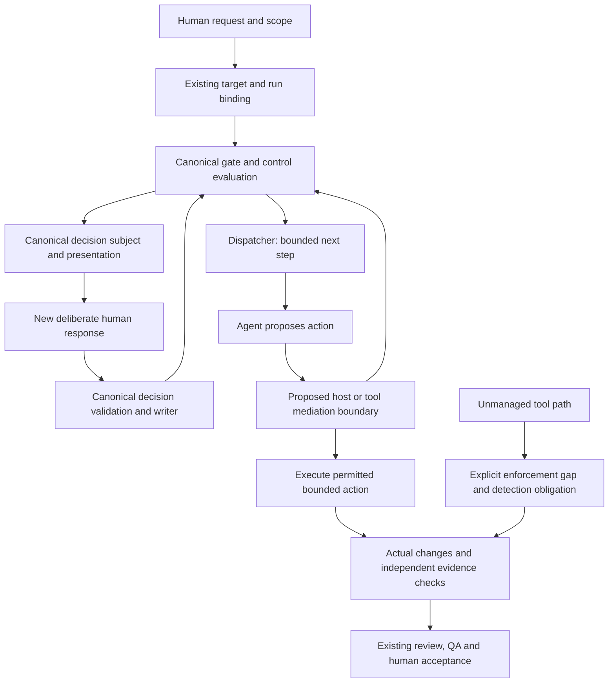

# SD: Joint Coding-Agent Control Concept for Dispatcher and MCP

Status: draft
Gate: SD
Gate approval: open
Based on: approved PRD
Date: 2026-10-02
Owner: Arndt Gold
Run: agent-control-dispatcher-mcp-concept-20261002-01
Language: en
Traceability contract: criteria-chain-v1

## 1. Solution Overview

Produce one canonical `CONCEPT.md` in this run's artefact directory. It contains the whole control model, evidence and host-capability registers, worked journeys and an implementation roadmap. Stable section and row IDs make it reviewable without maintaining another product acceptance register. PRD remains the acceptance source; this SD defines how to produce and assess the concept.

The proposed target model separates three responsibilities: workflow control determines permitted work, execution control mediates or detects real tool actions, and result verification checks actual changes and evidence. MCP exposes selected canonical operations; it is neither the execution sandbox nor an independent approval authority. The Dispatcher remains a bounded router. No existing runtime, schema or host permission is changed by this SD.

Approval of this SD accepts the design for the concept deliverable. It does not approve or install the proposed future runtime mechanisms. TP will contain document production and validation tasks only.

### Concept structure

1. Intent, scope, assurance vocabulary and evidence legend.
2. Current owners, observed guarantees and escape paths.
3. Proposed responsibilities and control flow.
4. Control catalogue and permitted-action binding.
5. Human decisions and common presentation semantics.
6. Work verification and review independence.
7. Complete lifecycle-to-MCP capability mapping.
8. Host capability and evidence matrix.
9. Failure, concurrency and recovery walkthroughs.
10. Existing-scope reconciliation and implementation roadmap.
11. Evidence register, decisions/limits, criterion and UR-signal coverage.

## 2. Ownership And Source Of Truth

| Responsibility | Existing authoritative owner | Target design boundary |
|---|---|---|
| Request activation and scope | plugins/agdf/meta/contracts/request-activation.md and task-target-resolution.md; Dispatcher assignment services | Explicit request and target/run binding precede any governed continuation; semantic scope match stays an evidenced responsibility |
| Workflow permission | packages/core/lib/control-evaluation/ and normative gate/modes contracts | One evaluated permission source; proposed action mediation consumes it rather than reimplementing gates |
| Routing | packages/core/lib/skill-dispatch/ | Return the bounded next operation; do not execute arbitrary coding actions or create approval |
| Canonical state and decisions | packages/core/lib/control-state/ | All writes delegate here with revision, integrity and transition validation; no MCP/host state mirror is authoritative |
| Presentation meaning | packages/core/lib/interaction-presentation.js and interaction.md | One semantic projection; adapters may change host chrome, never decision value, subject or effect |
| Transport | packages/mcp-server/src/server.js and packages/cli/lib/mcp-dispatch-runtime.js | Translate supported calls to canonical services; negotiation is separate from governance authorization |
| Actual execution permissions | Selected host/sandbox/tool boundary; no universal AGDF owner is evidenced today | Proposed mediation is usable only where the host can intercept every claimed action path and prevent alternative escape paths |
| Verification and final QA | Existing review skills and quality.md; qa-gate remains sole QA decision owner | Evidence, reviewer identity/independence and scope coverage are explicit; no second QA gate |
| Concept acceptance | Approved PRD, this SD, future TP and existing user gates | CONCEPT.md is the canonical output of this concept run, not a newly normative runtime policy |

The maintainers own future canonical service changes. Arndt Gold is accountable for accepting the concept and selecting later scopes. Evidence rows name their actual producer; the authoring agent cannot label its own review independent.

## 3. Architecture Decisions

- SDD-001: Deliver the entire model in one indexed CONCEPT.md with stable section/control/scenario IDs and direct source references; rationale: the user needs a coherent model before interface slices; consequence: references and coverage must be maintained within that document, while acceptance remains solely in PRD.
- SDD-002: Separate workflow evaluation, tool execution control and result verification, reusing canonical AGDF owners; rationale: routing and a valid gate do not prove that actual actions were mediated or results checked; consequence: future execution interception is an explicit host integration dependency and cannot be claimed by current Dispatcher/MCP alone.
- SDD-003: Bind proposed executable actions to evaluated target/run/scope/revision and a bounded action description, revalidate at the mediation point, and classify unmanaged paths explicitly; rationale: an earlier permission snapshot cannot safely authorize arbitrary later commands; consequence: hosts without complete mediation receive no preventive guarantee for escaped paths, and state/file tampering needs a separate trust assessment.
- SDD-004: Use exactly bound decision subjects and explicit response provenance, with one common semantic presentation and capability-based rendering; rationale: labels, defaults, elicitation acceptance and tool success are not human authorization; consequence: cooperative forwarded input remains a visibly weaker assurance lane, and text fallback does not manufacture independent attestation.
- SDD-005: Verify approved scope against actual changes, tests, findings and reviewer independence, with independent enforcement of publication/merge only where evidenced; rationale: agent self-report and self-review do not establish verified completion; consequence: the concept names observable evidence and residual limits without claiming that a reviewer agent or CI installation already exists.
- SDD-006: Define the complete logical MCP operation families before choosing transport primitives; use canonical services and versioned compatibility requirements, and treat resources/prompts/events as non-authorizing; rationale: primitive-by-primitive additions would fragment lifecycle and authority; consequence: exact schemas and write exposure belong to later approved implementation scopes after the common model is accepted.
- SDD-007: Require dated source/protocol/installation/live-host evidence classes and explicit unsupported or unknown statuses for each host capability; rationale: protocol availability is not operational support; consequence: a native form can be used only after qualification, with equivalent text presentation where assurance permits, and no default React app or custom panel.
- SDD-008: Describe recovery as revalidation of canonical state with idempotent action identity and explicit safe resume boundaries; rationale: retries, concurrent revisions and disconnection must not transfer approval or duplicate effects; consequence: distinguish documented current validation from proposed recovery obligations and name the dependent mechanism when prevention is unavailable.
- SDD-009: Derive a dependency-aware implementation roadmap from the whole accepted concept, without transferring approvals or altering related runs; rationale: source availability and active-run progress are different evidence lanes; consequence: every runtime/host/MCP change remains separately governed, with compatibility, qualification and rollback obligations.

### Proposed control flow

The mediation box is a proposed integration boundary, not a new implemented service. The unmanaged path remains possible wherever interception is incomplete. A diagram arrow is not evidence of prevention.

### Action and control binding

The concept describes an action envelope with target, run, scope/approved artefact references, current revision, action identity, operation/effect class, bounded resources/paths, expected preconditions, applicable host/tool permissions, evidence obligations and correlation IDs. These are logical requirements, not a new public schema. A tool command's actual side effects must fit the described resources; a path allowlist alone is insufficient for unrestricted shell/network commands.

Canonical evaluation owns permission. A qualified execution adapter checks the fresh permission and actual action immediately before execution, limits available tool/sandbox capabilities, records outcome and returns evidence to existing owners. Atomic or irreversible actions require a defensible boundary and idempotency treatment; long-running actions need revalidation at defined safe checkpoints, not a claim that a changed revision can undo an action already executed. Where those mechanisms cannot exist, classify prevention unavailable and define detection and a dependent blocking rule.

No signed token, hash or artefact seal is presumed adversarial assurance. If the agent can modify both evidence and its verifier or invoke the writer using fabricated user input, the concept must show that trust limit. Stronger guarantees require a separately trusted enforcement or attestation boundary outside that agent's writable/control scope.

### Decision and presentation contract

The conceptual decision subject contains the exact target/run/gate/revision, artefact and summary digests, prepared-presentation identity, visible consequences and provenance lane. Outcome values are approve/revise/decline/cancel or no-response; the exact existing approving literal remains `Approval: <gate>`. A localized label is a display field, not a second approval value. Operational status, progress, claims and decision outcome are separate meanings.

Native choice/form rendering is a host adapter. It may associate a display label with the canonical value only if the host interface supports a reliable mapping and the response is deliberately supplied after the subject is displayed. Otherwise use canonical text and an exact reply within the existing cooperative lane. Neither path alone proves human provenance independently. If a future action requires attestation that the host cannot supply, block that dependent action rather than silently downgrade assurance.

The existing run-present record is evidence of preparation, not display. The target concept therefore records separately what is prepared, what display/response evidence a host can actually provide, and what remains assumed. Host permission to execute a tool is also separate from AGDF permission for the work.

### Result verification

For each completed work unit, connect approved intent, changed paths/diff, baseline and post-action state, test scenario/results, review findings, producer identity and assurance of independence. Use external or independently controlled capture where needed for a stronger claim. Checks must catch unrelated changes and omitted required work, not merely passing tests on selected files.

Independence is a graded evidence property: same-agent self-review, separate fresh-context reviewer, and reviewer/enforcement outside the implementing agent's control are distinct. A fresh context is not automatically a different trust boundary. The concept decides the required property by action/risk and shows missing capability explicitly. Existing QA remains the final quality decision owner. Any future CI/merge/publication barrier is a separately installed downstream defense; it cannot prevent earlier workspace modifications and is not assumed active today.

## 4. Integration Points

### Logical MCP capability families

| Family | Effect and owner | Required conceptual contract | Primitive disposition |
|---|---|---|---|
| Inspect state/contracts/evidence | Read; existing inspect/evaluators and evidence owners | Exact target and optional explicitly bound run, freshness/revision, evidence refs and readable limits | Existing tools are baseline; resources only if freshness, access and source binding are preserved |
| Intake and bounded continuation | Routing; Dispatcher | Explicit intent, target provenance, scope evidence, returned next operation; authorizes:false | Tools; prompts can explain usage but never choose policy or authority |
| Prepare decision subject | Preparation write; existing presentation writer | Exact current subject, complete summary, presentation identity, no decision | Canonical service operation; eventual MCP exposure requires approved write/permission boundary |
| Capture deliberate decision | State write; existing approval/command writer | Exact presentation plus response provenance, new deliberate input, fresh validation, operation identity and audit | Tool/service plus qualified host response channel; elicitation can carry input but cannot supply authority by itself |
| Record bounded evidence/internal work | State write; existing recording/writers | Producer, artefact/resource binding, expected revision, operation identity, scope and quality checks | Future tools only through canonical services; no generic uncontrolled file writer |
| Present control status/decision | Derived projection; canonical presentation owner | Label/value/status separation, exact subject, effect, assurance, blocker and next action | Portable text baseline; native elicitation/forms only after capability qualification; custom UI optional later |
| Signal state change | Notification; no gate authority | Correlation, target/run/revision, delivery/replay semantics, re-read and revalidate | Events/notifications optional when independently justified and supported; no webhook infrastructure by default |

These families are completeness requirements, not advertised current tools. The current server exposes runtime-supplied tools and tools capability. The concept's operation catalogue assigns each operation request/result/error semantics, side effects, trust boundary, versioning, compatibility, auth/provenance and retry/audit policy before a future public schema is designed.

### Host qualification matrix

Each relevant Codex, Claude, OpenCode and Copilot row records host/version/date, transport and discovery, structured output, native decision input and mapping, display/response provenance, write consent, actual tool interception, sandbox limits, notifications/events, independent evidence capture and retry behavior. Every cell carries a primary source or bounded test reference and one of documented, installed-observed, live-observed, unsupported, or unknown. Documentation alone never fills a live-observed cell.

No current native capability is asserted in this SD. TP must collect dated primary protocol/host sources for the concept and classify missing operational evidence as unknown. A later host test is a roadmap obligation, not required installation or native UI implementation in this concept run. Simple choices need no React application; a custom panel would require an independently justified product need and separate scope.

### Recovery scenario design

The concept includes at least these stable walkthroughs, each with owner, effective state, display/feedback, next action and required evidence:

| Scenario | Core obligation |
|---|---|
| SC-NORMAL | Follow request to bound work, verified result and acceptance without hidden authority transfer |
| SC-BYPASS | Direct file/shell/network action: intercepted where evidenced, otherwise expose gap and actual-change detection |
| SC-STALE | Revision or artefact changes after presentation: reject old response and request a fresh decision |
| SC-WRONG | Wrong target/run/scope: no reassignment or transferred approval |
| SC-REPLAY | Duplicate request/response: stable operation identity and defined prior-result/conflict behavior |
| SC-CONCURRENT | Concurrent writers/actions: conflict handling and safe checkpoints; no implicit adoption of another revision |
| SC-NEGATIVE | Revise/decline/cancel/timeout/default: no gate advance |
| SC-RESTART | Interrupted work and new agent session: reconstruct canonical state; resume only revalidated permitted work |
| SC-TRANSPORT | Connection loss before/after effect: distinguish unknown outcome from failure; reconcile before retry |
| SC-CAPABILITY | Missing host input/interception/attestation: preserve fallback semantics or block dependent guarantee |
| SC-EVIDENCE | False/incomplete completion or contradictory tests: trace actual work, report gap and route to existing owner |
| SC-TAMPER | Agent-editable state/evidence/verifier: identify trust limits and requirements for independent enforcement |
| SC-ROUTE | Agent selects lighter process or omits conditional check: identify validator versus instruction-only boundary and proposed safeguard |

## 5. Constraints And Compatibility

Keep existing gate sequence, exact approval values, state ownership, inspect read boundary and authorizes:false dispatch semantics. Proposed schema/version changes are documented but not installed. Concept-only output and run bookkeeping are the only writes in this scope. Related runs and approved UR/PRD remain unchanged. The previous missing PRD-derived_from-UR row has been repaired in this run; include explicit derivation links for SD and TP before evaluating the next gate.

Use one CONCEPT.md rather than a second architecture policy registry. Existing documents remain current-state/reference owners until separately governed changes. Source versions, generated packages, installed runtime and live host behavior are distinct evidence lanes. This SD's proposal does not imply that protocol compatibility or host support has been verified.

## 6. Test And Evidence Strategy

TP maps each criterion and SDD decision to document tasks, the above walkthroughs, expected result and evidence source. Verify criterion/decision coverage, source existence, internal links, absence of placeholders, current/proposed separation and concept-only diff. Review the scenario content for semantic validity; matching IDs alone is not enough.

Collect source references for baseline control claims and dated primary documentation for protocol/host claims. Live capability assertions require bounded observed evidence; otherwise mark unknown and name the later qualification step. No broad runtime regression suite is required for this documentation-only production, unless later changes introduce runtime effects. Existing review/QA artefacts must state producer and independence honestly.

## 7. Acceptance Traceability

| criterion_id | design_response | source_of_truth | design_decision_ids | compatibility_risk |
|---|---|---|---|---|
| AC-001 | CONCEPT sections 2-3 and coverage index; current and target flow with escape paths | Approved PRD; existing skill-dispatch/evaluator owners; AGDF maintainer accountable | SDD-001, SDD-002 | Existing owners preserved; proposed arrows are not observed enforcement |
| AC-002 | Control catalogue and action envelope with prevention/detection classification | PRD; canonical evaluation and actual host/tool boundary; AGDF maintainer accountable | SDD-002, SDD-003 | Unmanaged tools and agent-writable verifiers invalidate universal prevention claims |
| AC-003 | Decision subject, provenance lanes and common semantic presentation | PRD; control-state approval/presentation owners and interaction.md; Arndt Gold accountable | SDD-004 | Text/native fallback cannot upgrade response assurance or change approval values |
| AC-004 | Scope-to-change/evidence comparison and graded reviewer independence | PRD; quality.md and existing review/QA owners; AGDF maintainer accountable | SDD-005 | Self-review and downstream CI do not establish independent prevention |
| AC-005 | Full lifecycle-to-operation catalogue with effects and canonical delegation | PRD; current MCP/CLI adapters and core services; AGDF maintainer accountable | SDD-006 | Future write schemas and exposure require separate compatibility/security scope |
| AC-006 | Host matrix and semantic fallback/blocking rules | PRD; canonical presentation owner and qualified host documentation/evidence; AGDF maintainer accountable | SDD-004, SDD-007 | Protocol and live capability kept distinct; no mandatory custom frontend |
| AC-007 | Scenario table and revalidation/idempotency/safe-resume model | PRD; canonical state/presentation/command writers; AGDF maintainer accountable | SDD-003, SDD-008 | Irreversible and long-running effects cannot be undone merely by revision invalidation |
| AC-008 | Existing-scope reconciliation and whole-concept-derived roadmap | PRD; related URs/state and current source; Arndt Gold accountable | SDD-009 | No approval transfer, silent source rewrite or shared cutover presumed |
| AC-009 | Canonical index, evidence/decision registers and semantic walkthrough review | PRD; CONCEPT.md and existing QA contract; Arndt Gold accountable | SDD-001, SDD-007, SDD-009 | Document acceptance cannot imply installed or live enforcement |

## 8. Risks And Open Questions

The target mediation and independent attestation mechanisms depend on actual host capabilities. This SD resolves PRD D-03 by requiring control-specific prevention/detection/unsupported classification and a trusted-boundary assessment, rather than promising an unachievable universal assurance level. It resolves D-04 with common semantics, text baseline, qualified native mapping and a non-authorizing adapter boundary; exact future schemas and deployment technologies are implementation-scope decisions. D-05 remains the named TP owner's task.

No unsupported mechanism is accepted as delivered or as hidden debt. If concept production reveals that a proposed guarantee cannot exist, record its unsupported status and consequences, and revise the affected proposal; material product scope changes return to PRD. Existing related-run state can differ from source capabilities and needs dated separate observations. Unknown live evidence is permitted only as explicitly limited support, not as an unfinished decision about what the concept must contain.

## 9. Next Step

Review this persisted Solution Design and approve only with `Approval: SD`. Approval permits a Task/Test Plan for producing and checking the concept. It does not authorize the target model's runtime, MCP or host implementation.

## AGDF Approval Summary (de; source=en)

- Lösung: Ein kanonisches CONCEPT.md bündelt Ist-/Zielmodell, Kontrollkatalog, MCP-Operationen, Host-Nachweise, Fehlerabläufe und die daraus abgeleitete Roadmap. Das PRD bleibt die Quelle der Abnahmekriterien.
- SDD-001: Das vollständige Konzept erhält einen gemeinsamen Index mit stabilen Verweisen und Quellen.
- SDD-002: Ablaufkontrolle, Kontrolle tatsächlicher Werkzeugaktionen und Ergebnisprüfung haben getrennte Verantwortlichkeiten und verwenden bestehende AGDF-Owner.
- SDD-003: Vorgeschlagene Aktionen werden an Ziel, Run, Umfang und aktuelle Revision gebunden. Direkte Umgehungswege und Grenzen von Shell-/Dateiberechtigungen werden ausdrücklich behandelt.
- SDD-004: Freigaben verwenden einen exakt gebundenen Entscheidungsgegenstand. Anzeigename, Entscheidungswert und Status bleiben getrennt; kooperative Eingabe ist kein unabhängiger Menschennachweis.
- SDD-005: Tatsächliche Änderungen und Nachweise werden gegen den Auftrag geprüft. Selbstprüfung, separater Prüfer und Prüfung außerhalb der Agentenkontrolle bleiben unterschiedliche Nachweisstärken.
- SDD-006: Der vollständige MCP-Bedarf folgt dem Kontrollmodell. Bestehende Services besitzen Regeln und Zustand; Resources, Prompts und Ereignisse erteilen keine Freigabe.
- SDD-007: Jede Host-Fähigkeit wird als dokumentiert, installiert beobachtet, live beobachtet, nicht unterstützt oder unbekannt gekennzeichnet. Native Auswahlfelder benötigen Qualifikation; für einfache Freigaben ist keine React-Anwendung vorgesehen.
- SDD-008: Wiederholung, Parallelität und Wiederaufnahme prüfen den kanonischen Zustand neu und verwenden eindeutige Aktionsidentitäten. Bereits ausgeführte irreversible Wirkungen werden nicht durch eine neue Revision rückgängig.
- SDD-009: Umsetzungsslices folgen erst aus dem vollständigen Konzept. Bestehende Runs werden eingeordnet; Freigaben werden nicht übertragen.
- Grenzen: Eine Textdarstellung ersetzt keine fehlende technische Sperre oder unabhängige Bestätigung. Kann ein Host eine erforderliche Garantie nicht liefern, wird diese Grenze sichtbar und die davon abhängige Aktion gesperrt oder ausdrücklich als nur nachträglich überprüfbar eingeordnet.
- Prüfung: Dreizehn normale und fehlerhafte Abläufe, Kriterien-/Entscheidungszuordnung, Quellen, Kompatibilität und Konzept-only-Diff werden geplant. Laufzeit-/Host-Wirksamkeit wird nur bei passenden Nachweisen behauptet.
- Nächster Schritt: Die SD-Freigabe erlaubt den Aufgaben- und Prüfplan zur Erstellung des Konzepts. Sie erlaubt keine Umsetzung der vorgeschlagenen MCP-, Host- oder Laufzeitänderungen.
