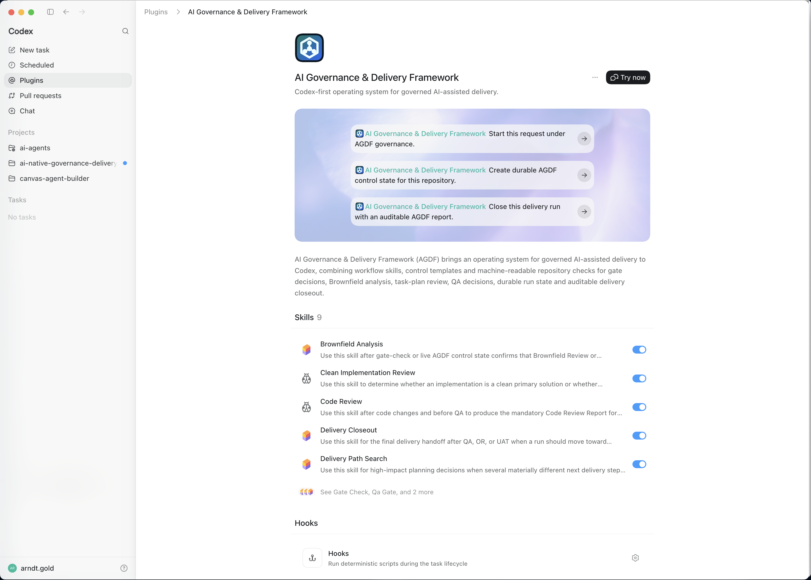
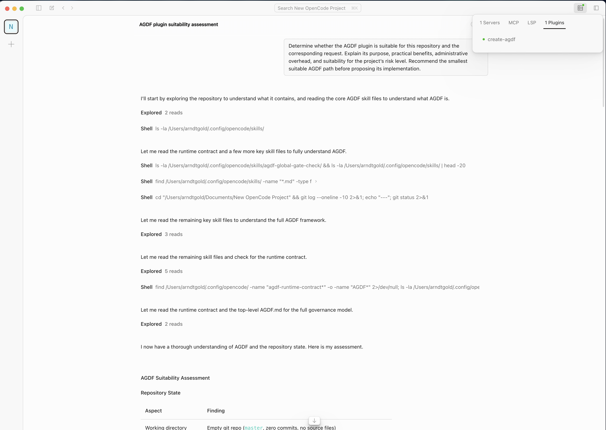
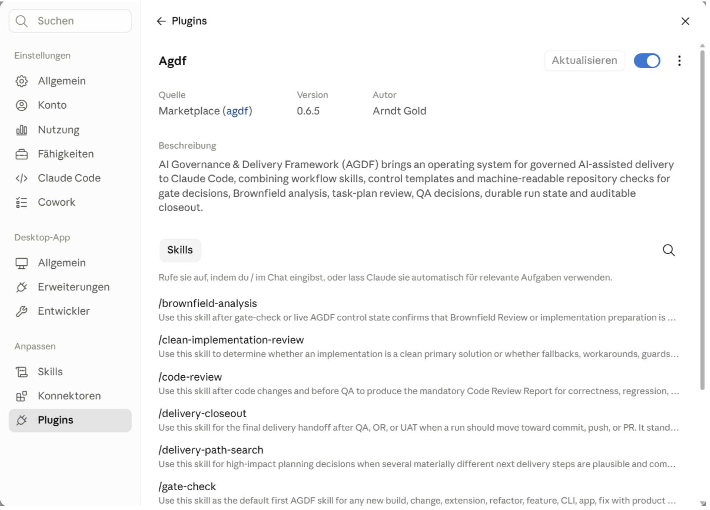

# Installation and Setup

Install AGDF for the coding agent you use. AGDF provides the appropriate plugin, native skills or
supported repository surface. It does not approve work automatically or replace product ownership, engineering
judgement, security review, tests or human acceptance.

The [host compatibility comparison](docs/compatibility/HOST_COMPATIBILITY.md) distinguishes installed,
discovered, callable, correctly updated and recoverable outcomes. It is a dated evidence snapshot
with explicit host and operating-system gaps. Available skills, automatic checks, observed governance
and technical enforcement are separate claims. Use local status and a fresh host session to verify
your own installation.

## Choose your installation path

Before running a command, install Node.js 18 or later with npm and the selected agent runtime. Run
repository-local commands inside the target Git repository, not inside this AGDF repository.

| Need | Command | Scope and verification | First safe action |
|---|---|---|---|
| Codex available in your personal environment | `npx --yes @agdf/cli@latest codex` | Installs or updates the global plugin and verifies its version through the Codex CLI. | Start a new Codex task and ask: `Run an AGDF gate check for this request.` |
| Codex only for one repository | `npx --yes @agdf/cli@latest codex-repo` | Writes the local marketplace and plugin files; restart Codex, open `/plugins`, select **This repository**, then install `agdf`. | Start a new task in that repository and ask for a gate check. |
| Claude Code | `npx --yes @agdf/cli@latest claude` | Installs or updates the global plugin; if the CLI cannot expose a version, check `claude plugin list` after a full restart. | Start a fresh session and use `/gate-check` for new build or change intent. |
| GitHub Copilot plugin | `npx --yes @agdf/cli@latest copilot` | Installs through Copilot CLI. If `copilot` is not on `PATH`, the installer runs a pinned official `@github/copilot` package through npm and verifies the installed version. | Restart Copilot, verify Installed Plugins and the `agdf-` skills, then request an AGDF gate check. |
| OpenCode, global discovery | `npx --yes @agdf/cli@latest opencode` | Installs or updates the npm plugin and global native skills. Verify with `npx --yes @agdf/cli@latest opencode-status --json`, then restart OpenCode. | Create durable control in a repository before expecting governance to be active. |
| OpenCode, repository governance | `npx --yes @agdf/cli@latest opencode-repo` | Writes durable control configuration and templates without copying a runtime surface. Re-run `opencode-status --json` from that repository. | Load `agdf-global-gate-check` through OpenCode's native skill tool. |

The OpenCode global layer only makes AGDF discoverable. It does **not** activate governance for every repository; use `opencode-repo` in each repository that should own valid durable control state.

### Optional local MCP dispatcher

The optional MCP path registers one local STDIO server for Codex, Claude Code or OpenCode. It exposes
exactly `agdf_dispatch`, backed by the same canonical semantic definition and dispatcher as the CLI.
The tool is read-only, offline while serving and non-authorizing. Host permission, registration and
successful execution never count as `Approval: <GateName>`. The process inherits the launching
host user's operating-system identity and filesystem permissions; AGDF does not claim an operating-
system sandbox.

The MCP process requires Node.js 20 or later. The existing CLI retains its Node.js 18 baseline.
Use an absolute repository path and inspect the project scope before enabling it:

```bash
npx --yes @agdf/cli@latest mcp status --surface codex --dir /absolute/path/to/repository --json
npx --yes @agdf/cli@latest mcp enable --surface codex --dir /absolute/path/to/repository
npx --yes @agdf/cli@latest mcp disable --surface codex --dir /absolute/path/to/repository
```

Replace `codex` with `claude` or `opencode` for another delivered adapter. Project scope is the
default. Choose `--scope user` explicitly when the broader registration is intended. `status` never
downloads a package or edits configuration. `enable` acquires the exact matching
`@agdf/mcp-server@<AGDF version>`, verifies the server, dispatcher and SDK runtime digests, then registers the
exact Node executable and versioned entrypoint. `disable` removes only an owned registration and
removes its owned runtime only when no managed reference remains. Foreign or malformed entries fail
closed and preserve existing settings.

The project configuration owners are `.codex/config.toml` for Codex, native `claude mcp` local scope
for Claude Code and the version-matched MCP section in `opencode.json` for OpenCode. OpenCode 1.x
uses `mcp.agdf`; OpenCode 2.x uses `mcp.servers.agdf` and `disabled: false`. The lifecycle reads the
installed OpenCode version before choosing either form and leaves other servers and permissions
unchanged. The OpenCode host-visible qualified tool name is `agdf_agdf_dispatch`; the server-level name remains `agdf_dispatch`. A Node.js 18
attempt returns `manual_compatible` with the version-matched CLI dispatch path and performs no MCP
package acquisition or host mutation. No failure silently invokes that fallback.

Restart the selected host after enablement and verify discovery in a fresh session. Support is
qualified independently per exact host, OS, Node, AGDF, SDK and negotiated protocol tuple. Config
read-back or protocol tests alone do not establish support. GitHub Copilot is excluded from the
first lifecycle and remains unverified. The public OpenAI Skills-only candidate remains MCP-free.

### Automatic runtime checks and installation consent

The `codex`, `claude`, `copilot` and `opencode` installers distinguish plugin installation from permission to run
narrow automatic checks. On an interactive terminal they disclose what the check reads and writes,
that it uses no network, and that it never grants an AGDF gate. Choose `enable`, `manual` or `cancel`.
Every interactive installation or update asks again. If a current decision exists, it is shown only
as a previous choice, never as proof that host permission is effective, and is never preselected.
The choice header shows the target AGDF version; the result shows the verified installed version or
version transition. Matching capability identity may preserve host-native trust,
but it never suppresses this installer choice. For scripts and CI, use an explicit value or accept
manual mode:

On an interactive terminal, press `1` or `E` to enable, `2` or `M` for manual mode, `D` to inspect
technical details, or `Esc` to cancel immediately without Enter. The main choice uses beginner-safe
language while all material consent facts remain visible. Manual mode explicitly confirms that AGDF
still works on request. Invalid keys show the valid choices instead of waiting silently. The installer
restores the terminal mode before continuing and shows one quiet setup-progress line.

```sh
npx --yes @agdf/cli@latest claude --runtime-checks enable
npx --yes @agdf/cli@latest claude --runtime-checks manual
npx --yes @agdf/cli@latest runtime-checks status --surface claude --json
```

`cancel` stops before plugin or permission mutation. Consent records intent only. AGDF reports
automatic checks as enabled only when the current content-bound identity and native host evidence
both match. A changed command, runtime, capability scope or adapter contract requires renewal. Use
`runtime-checks manual` to obtain the exact reinstall command for manual mode. Host-specific trust,
deny and ask decisions remain authoritative and unrelated user settings are preserved.

The fixed check accepts no arguments, performs no writes or network calls, and reads only local AGDF
runtime identity and `.agdf/control` state. Codex uses native hook review and AGDF never edits its
trust store. Claude Code may use only one exact fixed command rule; wildcard shell, Node or
PowerShell permission is forbidden. OpenCode keeps every explicit permission and does not widen
`permission.bash`.
Copilot uses the plugin's `sessionStart` hook and keeps hook review under Copilot control. AGDF records
only the user's content-bound intent until a restarted session provides direct host evidence.

For Codex, install completion and `runtime-checks status --surface codex` query native `hooks/list`
metadata through the local Codex CLI. Only a modified or untrusted hook asks for native review in
`/hooks`; a trusted, enabled hook reports that fresh-session verification is pending. Unsupported,
missing or ambiguous metadata stays unverified and directs you to inspect `/hooks`. These probes
start no task, execute no hook and never write a trust hash. Fully restart Codex after an update and
open a fresh task; restoring an old task can retain the previous skill context. Hook trust does not
prove execution, and CLI metadata does not prove which context an existing desktop task loaded.

Native Windows uses a generated Windows hook command and PowerShell-specific permission projection.
Repository fixtures do not prove Windows host behavior. Automatic-mode support is claimed only after
direct native-Windows installation, permission, rollback, renewal and fresh-session evidence.

The installer can rebuild the exact verified AGDF-owned shared profiles from `0.13.6`, `0.13.7`,
`0.13.8` and `0.14.1` into the current canonical profile. Exact snapshots for current-shape `0.14.2`
and `0.14.3` remain ordinary validation evidence. The internally `0.13.8` `agdf-v0.14.0` tag grants
no compatibility. Unknown versions, partial profile shapes, unowned roots and tampered provenance
are rejected. Installation uses only the packaged catalogue and performs no Git or network lookup.
On Windows, Claude installation may remove and retry only the exact
`temp_local_*` cache directory named by an `EPERM` rename failure from the current install command;
it never scans or broadly clears the Claude cache. Unsafe or ambiguous failures preserve the original
error and use the existing marketplace rollback.

A successful global installation verifies installed bytes, not the skill registry of an already
loaded session. Fully restart the application and start a fresh session or task. Restoring the
pre-upgrade session can retain stale AGDF skills and is not activation evidence.

The official public OpenAI candidate is currently a portable Skills-only profile. It contains no
runtime or hooks, so automatic runtime checks are unavailable there and validation remains manual or
external. The public listing must not imply otherwise.

Contributors testing an unpublished checkout should use the local `npm run install:<surface>`
commands in [CONTRIBUTING.md](CONTRIBUTING.md), not the public registry commands above.

For the exact current command and option reference, including canonical run lifecycle commands, run `npx --yes @agdf/cli@latest --help`.

Most users only need this table and the relevant platform section under
[Detailed surface setup](#detailed-surface-setup). The sections in between explain optional runtime
and planning behavior.

## Normal operating model

After installation, the coding-agent chat and AGDF skills are the normal interaction surface.
`.agdf/control/` is the durable source of truth for selected runs, artefacts, approvals and evidence.
The CLI validates or renders that state for deterministic checks, CI and audit; it is not a second gate
system and is not required for every conversational status check.

Use registry-resolved `npx --yes @agdf/cli@latest ...` for bootstrap, installation, explicit refresh or
when no local executable exists. For repeated local validation, install the wrapper once and avoid a
fresh registry resolution:

```bash
npm install -g @agdf/cli
agdf doctor
agdf gate-check --approval-envelope
agdf gate-check --json
```

`--approval-envelope` prints the canonical ready-gate cards and exact-text request. It does not approve
a gate. `--json` exposes the same additive `approval_presentation` for a safe native adapter or
automation.

### Update, disable or remove

Re-run the relevant installation command to update an installed AGDF surface. Inspect technical
installation health, repository activation and delivery state separately:

```bash
npx --yes @agdf/cli@latest status --surface codex
npx --yes @agdf/cli@latest status --surface claude
npx --yes @agdf/cli@latest status --surface copilot
npx --yes @agdf/cli@latest status --surface opencode
```

A healthy installation and blocked delivery are valid at the same time. `status` is read-only: it
does not initialize control state, silently select an ambiguous run or change host configuration.

Prefer repository-local opt-out when AGDF should remain globally available:

```bash
npx --yes @agdf/cli@latest disable --surface codex --scope repository
npx --yes @agdf/cli@latest disable --surface copilot --scope repository
npx --yes @agdf/cli@latest disable --surface copilot --scope repository --shared
```

Repository lifecycle support is explicit rather than artificially symmetric:

| Surface | Personal repository opt-out | Shared repository opt-out | Repository activation | Global uninstall |
|---|---|---|---|---|
| Codex | existing repository plugin-state disable | no new `--shared` mode | existing `codex-repo` path | supported |
| Claude Code | not supported without a verified host mechanism | not supported | no new mechanism | supported |
| GitHub Copilot | default through `.github/copilot/settings.local.json` | explicit `--shared` through `.github/copilot/settings.json` | plugin discovery remains separate | supported |
| OpenCode | not supported as disable | not supported | existing `opencode-repo` marker | supported |

Codex writes only its exact AGDF repository plugin-state section. The default Copilot command writes
only `enabledPlugins["agdf@agdf"] = false` in personal-local settings. Before writing, Git must
confirm that `.github/copilot/settings.local.json` is ignored. AGDF never changes `.gitignore` or
`.git/info/exclude` automatically. If the path is not ignored, add the exact path to an effective
Git ignore source and retry, or choose `--shared` deliberately.

`--shared` writes the same exact setting to the commit-capable repository file and can affect
collaborators and supported cloud agents. Existing foreign settings are retained. JSONC, comments,
invalid JSON, incompatible value types and symlinked settings paths fail closed without a partial
change. Both modes retain global AGDF availability and `.agdf/control`.

After either Copilot mode, restart Copilot and inspect `/plugin list`. Plugin disablement does not
disable independent repository instructions. Inspect `/instructions` separately and manage
`AGENTS.md`, `.github/copilot-instructions.md` or path-specific instructions independently when that
is the intended outcome.

Global removal always requires an explicit surface and scope. Without `--confirm` it is a
non-mutating preview:

```bash
npx --yes @agdf/cli@latest uninstall --surface codex --scope global
npx --yes @agdf/cli@latest uninstall --surface codex --scope global --confirm
```

The same shape applies to `claude`, `copilot` and `opencode`. AGDF invokes supported native removal and removes
only exact known entries or marker-proven generated state. Repository files, `.agdf/control`,
user-authored files and ambiguous configuration are retained. Review the preview before confirmation.

## Optional advanced planning and runtime reference

This section explains how AGDF behaves across platforms. You can skip it when you only need to
install or update AGDF.

AGDF supports four usage surfaces:

1. **Codex** through the complete generated shared plugin containing the projected Codex manifest
2. **Claude Code** through the same shared plugin containing the projected Claude manifest
3. **GitHub Copilot** through a dedicated generated Copilot profile with a root `plugin.json`, prefixed skills and a consent-bound hook
4. **OpenCode** through repository instructions, generated native skills, permissions and the `create-agdf` npm plugin

Codex, Claude Code and GitHub Copilot consume AGDF as installable generated plugin runtimes. All profiles are
rendered from the same canonical sources, but the Copilot package does not carry Codex or Claude components. The repository
`plugin/` directory is the canonical runtime-free source and is not registered directly.
OpenCode consumes AGDF through AGENTS-style instructions, generated native skills, explicit permissions and npm plugin hooks.

Codex is the primary plugin-packaging surface for AGDF.
OpenCode is the reference runtime for showing how AGDF can combine repository instructions, native skills, permission gates and plugins in one target surface.
The AGDF control model itself is surface-neutral and is reused for Claude Code, GitHub Copilot and OpenCode.

At a real decision point, AGDF may present a native structured question only when the loaded host can
wait for deliberate input and transport the canonical value without decoration. The currently
observed Codex question schema requires a recommended-label decoration and exposes no separate exact
value, so AGDF must use the exact-text path there. `Approval: <GateName> (Recommended)` is invalid;
the unchanged `Approval: <GateName>` text remains authoritative. Claude Code and OpenCode are subject
to the same capability preflight. These controls improve presentation only. AGDF revalidates the
selected run, current gate and durable artefact before persisting an approval. Command/edit/network
permissions, Claude plan approval and OpenCode permission or auto-mode outcomes never count as AGDF
gate approval.

Delivery Path Search follows the same model. One portable CLI/runtime contract is mapped into each
surface. Codex and Claude Code are executable reference evaluators. OpenCode joins them only when
its current-invocation capability preflight passes. Every surface declares whether read-only
behavior is `full`, `tool_enforced` or `instruction_only`. Search recommendations never replace an
AGDF gate check.

## Delivery Path Search

Use Delivery Path Search only for high-impact planning decisions with several materially different
permitted next steps. It is not part of routine implementation and is not a model-level MCTS
switch.

Prerequisites:

- live canonical `.agdf/control/runs/<run_id>/RUN_STATE.md` state, or legacy state awaiting explicit `run-migrate`
- explicit allowed and forbidden next actions
- installed and authenticated Codex CLI for executable evaluation
- an approved AGDF scope; search does not create approval

Run:

```bash
npx --yes @agdf/cli@latest delivery-path-search --surface codex --json
```

Optional:

```bash
npx --yes @agdf/cli@latest delivery-path-search \
  --surface codex \
  --model <model-id> \
  --generate-candidates \
  --generator-model <model-id> \
  --persist \
  --json
```

`--generate-candidates` is opt-in. It adds at most one call and five proposals under separate time
and cost limits. Before evaluation, it rejects malformed, prohibited, duplicate or insufficiently
diverse proposals deterministically. A generator failure remains visible and preserves the
deterministic baseline. AGDF does not fall back to another provider automatically.

`--persist` writes a redacted decision summary to:

```text
.agdf/control/artefacts/<scope>/DELIVERY_PATH_SEARCH.json
.agdf/control/artefacts/<scope>/DELIVERY_PATH_SEARCH.md
```

Raw prompts, hidden reasoning, secrets and source snapshots are excluded. Cost units are bounded rubric values, not measured provider currency.

Support boundary:

| Surface | Shared workflow | Evaluator | Candidate generator |
|---|---|---|---|
| Codex | yes | tool-enforced | tool-enforced, opt-in |
| Claude Code | yes | tool-enforced | tool-enforced, opt-in |
| GitHub Copilot | yes | instruction-only | no native executable adapter |
| OpenCode | yes | tool-enforced only after current-invocation preflight; otherwise instruction-only | no native executable adapter |

`--fixture` is available for deterministic contract testing. It is not a production external
evaluator configuration.

OpenCode uses the owned `agdf-evaluator` agent with `opencode run --pure`. The current invocation
must prove the required command flags and effective deny permissions before reporting
`tool_enforced`. Failed preflight, authentication or output validation returns
`evaluator_unavailable` and points to the instruction-only workflow. Other agents must implement the
published evaluator contract before AGDF can claim executable support for them.

After every result:

```bash
npx --yes @agdf/cli@latest gate-check --status-card
```

The search may return one recommendation or `no_safe_recommendation`. Neither outcome grants implementation permission.

AGDF is an independent project and is not affiliated with, endorsed by, or sponsored by OpenAI, Anthropic, GitHub or OpenCode.

AGDF is a control-first plugin.
The skills steer agent behavior during a run.
The `plugin/control/` scaffold provides durable repository artefacts for run state, backlog
pointers, source-of-truth ownership, Context Graph knowledge and quality contracts.

## Skill identity model

AGDF uses one logical skill model and renders surface-specific skill references.

Codex and Claude Code use plugin-scoped skill names because the plugin itself provides the `agdf` namespace.

Example:

```text
/gate-check
/brownfield-analysis
/qa-gate
```

GitHub Copilot uses prefixed skill names in its plugin. This prevents
collisions with higher-priority personal or repository skills while preserving one canonical skill source.

Example:

```text
copilot-skills/agdf-gate-check/SKILL.md
copilot-skills/agdf-brownfield-analysis/SKILL.md
copilot-skills/agdf-qa-gate/SKILL.md
```

The prefix is generated from the shared AGDF skill definition model and must not be manually duplicated across independent files.

The routing table is calculated from:

```text
plugin/meta/agdf-plugin.definition.json
```

using:

```text
surface.skillPrefix + skillSet.slug
```

The shared router source is:

```text
plugin/meta/agdf-agent-router.md
```

Copilot plugin skills are rendered from the same source with Copilot skill prefixes.

This avoids drift between:

- Codex plugin metadata
- Claude Code plugin metadata
- lifecycle hooks
- generated Copilot instructions
- visible Copilot skills
- website documentation
- examples and test prompts

## Detailed surface setup

You need Node.js 18 or later, npm (`node -v`, `npm -v`) and the selected runtime: Codex CLI or the
Codex app with plugin support, Claude Code CLI, OpenCode, or GitHub Copilot CLI/Coding Agent.

If Node.js is missing, install it with `winget install OpenJS.NodeJS.LTS` (Windows), `brew install
node` (macOS), `sudo apt install nodejs npm` (Debian/Ubuntu), or the LTS installer from
[nodejs.org](https://nodejs.org).

## Codex

AGDF is delivered to Codex and Claude Code from one complete generated plugin bundle. The paths
below are canonical source projections that are copied into that bundle; the repository `plugin/`
directory itself is not an installable runtime.

Codex uses:

```text
plugin/.codex-plugin/plugin.json
```

as the plugin manifest and loads the shared AGDF skills from:

```text
plugin/skills/
```

Codex also discovers the default lifecycle hook configuration when the plugin bundle includes:

```text
plugin/hooks/hooks.json
```

The AGDF `SessionStart` hook activates a compact runtime reminder and references:

```text
plugin/meta/agdf-agent-router.md
```

plus the compact AGDF constitution, so individual skills do not have to carry the whole control
model. The hook does not print the full router in the chat. The first visible workflow step should
still be the appropriate AGDF skill, usually `gate-check` for a new build request.

### How Codex chooses AGDF skills

Codex does not need a generated repository `AGENTS.md` to recognize AGDF plugin skills.
The Codex plugin runtime provides the discovery surface:

```text
plugin/.codex-plugin/plugin.json
plugin/skills/*/SKILL.md
plugin/meta/agdf-agent-router.md
plugin/hooks/hooks.json
```

At runtime:

1. Codex sees the installed plugin skills through their `name` and `description`.
2. The AGDF `SessionStart` hook activates a compact reminder and references the shared router and compact constitution.
3. The router describes which AGDF skill should be primary for which kind of request.
4. The individual skill descriptions provide additional trigger hints.

For example, a new user intent such as "I want to build X" should route first to `gate-check`, not `qa-gate`.
`qa-gate` is only appropriate when implementation evidence exists and a QA decision is requested or implied.

This is why AGDF generates `AGENTS.md` only for Copilot-style repository instruction loading.
Codex uses plugin discovery plus the AGDF router instead.

For global Codex installation, run:

```bash
npx --yes @agdf/cli@latest codex
```

For local repository testing, run:

```bash
npx --yes @agdf/cli@latest codex-repo
```

Then restart Codex in that repository, open `/plugins`, select `This repository` and install `agdf`.

The global command stages the complete release-built plugin, including its exact-version local
validator, in an AGDF-owned user-data directory. It then registers that durable local marketplace
with Codex and verifies the installed plugin version. The Git checkout remains a runtime-free source
tree; `plugin/runtime/` is not committed.

If an existing `agdf` marketplace points exactly to the former AGDF GitHub repository, rerunning the
command migrates it to the durable local marketplace. A same-name foreign or unreadable marketplace
is never removed. Failed migration restores the prior owned marketplace state and reports recovery
evidence instead of claiming installation success.

Then start a new Codex task and ask:

```text
Run an AGDF gate check for this request.
```



*UI example: Codex shows the installed AGDF plugin, its skills, hooks and metadata. It illustrates the plugin surface; use the install command and plugin metadata as the release-version authority.*

For a new request, AGDF does not require `init` before the agent can begin. The agent can draft the
minimal UR in the response and request the exact approval text `Approval: UR`.

For Brownfield Review, later gated delivery work or implementation, the Runtime Contract still
requires the relevant durable or linked artefacts before the process can move on. Create
`.agdf/control` files only when the repository should own durable AGDF control state, when that state
is already live, or when scripts, CI or repeatable onboarding need deterministic setup.

When durable AGDF control state is explicitly needed, keep the agent-native path primary. Ask Codex to inspect the repository and create the minimal control scaffold:

```text
Create an AGDF control scaffold for this repository.
```

Or initialize live control files directly when you want deterministic scaffolding for scripts, CI setup, repeatable onboarding or repository-owned AGDF control state:

```bash
npm create agdf@latest -- init
```

The primary CLI package is `@agdf/cli`. Use it when command semantics matter:

```bash
npx --yes @agdf/cli@latest init
npx --yes @agdf/cli@latest doctor
npx --yes @agdf/cli@latest gate-check --status-card
npx --yes @agdf/cli@latest gate-check --approval-envelope
npx --yes @agdf/cli@latest gate-check --json
```

`npm create agdf@latest -- ...` remains supported for scaffold-style setup.

You can pin the preferred project language during setup:

```bash
npx --yes @agdf/cli@latest init --language de
npx --yes @agdf/cli@latest codex-repo --lang en
npx --yes @agdf/cli@latest config --language en
```

Supported values are `de` and `en`. If no language is provided, `create-agdf` reads the local system locale from `LC_ALL`, `LC_MESSAGES`, `LANG`, `LANGUAGE` or the Node.js runtime locale and falls back to `en`.

The selected language is written to:

```text
.agdf/control/config.json
```

AGDF uses `artifact_language` for durable control artefacts and `chat_language` for user-facing
responses unless the user explicitly asks otherwise. Runtime rules and internal control contracts
remain English, giving Codex, Claude Code and Copilot one stable rule surface.

Generated or updated control artefacts stay in files by default. User-facing chat should summarize
paths, decisions, blockers and next steps instead of pasting complete files.

Use `config` for an existing repository where the plugin is already installed and only the project language preference should be created or changed. Unlike `init`, it writes only `.agdf/control/config.json`.

This promotes the AGDF templates into live files under:

```text
.agdf/control/
```

It also installs reusable artefact templates for `UR`, `PRD`, `SD`, `TP` and `QA_REPORT` under:

```text
.agdf/control/templates/artefacts/
```

Use deterministic validators when you need machine-readable proof, CI or PR evidence, repeatable diagnostics, or an audit trail:

```bash
npm create agdf@latest -- doctor
npx --yes create-agdf@latest doctor --json
npx --yes create-agdf@latest gate-check --json
```

`doctor` reports whether the repository has a current gate, a next allowed action, visible evidence, backlog pointer, source-of-truth registry, Context Graph hygiene and valid quality contracts.

`gate-check` derives the operative decision from that state:

```text
open | blocked
```

including current gate, missing approval, allowed outputs, forbidden outputs and next allowed action.

For interactive handoff, `gate-check --status-card` prints only the compact gate projection. For
machine-readable handoff, `gate-check --json` and `delivery-map --json` include a `status_card` with
the current gate, allowed and forbidden actions, blocking condition, next skill, next permitted step
and `quality_outlook`.

The quality outlook is advisory. It names the next useful quality improvement but does not unlock
gates or replace evidence.

These commands are not a required ritual for normal agent work when the agent can inspect the live control files directly.
That is the control boundary: AGDF is agent-native first and CLI-verifiable by design.

## Codex for one repository only

Run this inside the target Git repository when AGDF should be available only from that project:

```bash
npm create agdf@latest -- codex-repo
```

This writes:

```text
.agents/plugins/marketplace.json
.agdf/control/config.json
plugins/agdf/.codex-plugin/plugin.json
plugins/agdf/skills/**
plugins/agdf/control/**
plugins/agdf/meta/**
```

Then restart Codex in that repository, open `/plugins`, select `This repository` and install `agdf`.

The plugin is then discoverable from that repository's local marketplace.

Other repositories do not get this project-local marketplace unless they also contain:

```text
.agents/plugins/marketplace.json
plugins/agdf/
```

If this repository should also keep durable AGDF control state, let the agent create the scaffold as the next allowed action or run the deterministic setup path directly:

```bash
npm create agdf@latest -- init
npm create agdf@latest -- doctor
npm create agdf@latest -- gate-check
```

Use `--language de|en` or `--lang de|en` on `codex`, `copilot`, `opencode`, `both`, `init` or
`config` to save an explicit AGDF language preference in `.agdf/control/config.json`. Without the
flag, AGDF derives the preference from the local system locale.

## OpenCode

Run this once when you want OpenCode to load the AGDF npm plugin as a user-wide hook:

```bash
npx --yes @agdf/cli@latest opencode
```

Verify the global installation, then restart OpenCode so an already-running app loads the updated plugin configuration:

```bash
npx --yes @agdf/cli@latest opencode-status --json
```

Expect `status: "configured"`, a loadable current `create-agdf` package and a complete global native
skill surface. The report also:

- separates the installed OpenCode host version from the installed `@opencode-ai/plugin` SDK
  version and warns when they differ;
- reports each required experimental hook as `declared_supported`, `declared_missing` or
  `uninspectable`;
- remains read-only and does not change the installation.

The explicit `opencode` installation command attempts to align a different SDK only to the exact
detected host version. It reports a partial result when exact alignment is unavailable or cannot be
verified. Hook status proves only what the SDK declares, not that a hook ran in a live session.
`session.active: false` means only that the status process cannot see an active AGDF session; it does
not mean that installation failed.



*UI example: OpenCode shows the loaded `create-agdf` npm plugin and AGDF interaction. It does not
prove repository governance activation, an active session, tool enforcement or the current release
version. Use `opencode-status --json` for those facts.*

Then run this inside each target Git repository you want to activate for the already-installed AGDF OpenCode runtime:

```bash
npx --yes @agdf/cli@latest opencode-repo
```

Run the same status command from that repository. `repository_activation` should be `active`, and
the visible entrypoint should name `agdf-global-gate-check (native skill)`. Then load that skill for
a new build or change request.

This writes:

```text
.agdf/control/config.json
.agdf/control/templates/**
```

`opencode-repo` does not write or modify `opencode.json`, `.opencode/AGDF.md`, copied contracts or
copied skills. OpenCode installs npm plugins automatically at startup and stores them in its cache.
The `create-agdf` package is therefore the single npm-loadable AGDF OpenCode plugin. A valid
`.agdf/control/config.json` is the repository-specific activation marker.

AGDF for OpenCode has a single global runtime surface and a repository activation marker:

- global npm plugin, native skills and the deny-permission evaluator agent through `~/.config/opencode/opencode.json`, `~/.config/opencode/skills/agdf-global-*/` and `~/.config/opencode/agents/agdf-evaluator.md`
- repository activation through the target repository's valid `.agdf/control/config.json`

The global install updates `~/.config/opencode/opencode.json`, generates the native skill adapters under `~/.config/opencode/skills/` and installs the owned `agdf-evaluator` agent under `~/.config/opencode/agents/`:

```json
{
  "plugin": ["create-agdf"],
  "instructions": ["AGDF.md"],
  "permission": {
    "question": "allow",
    "edit": "ask",
    "bash": "ask",
    "skill": { "agdf-*": "allow" }
  }
}
```

The global plugin and native skills do not replace durable control files. Global skills fail closed
when the current repository has no valid `.agdf/control/config.json`. Run
`npx --yes @agdf/cli@latest opencode-repo` in each repository where AGDF governance should be active
and reviewable.

Existing `opencode.json` and `.opencode/` assets remain untouched as a supported legacy compatibility
path. Global adapters use `agdf-global-` because OpenCode does not provide a verified preference rule
for legacy project skills with the same name. An explicit `permission.question: deny` remains
unchanged and selects AGDF's exact-text fallback.

At runtime, global `AGDF.md` and `skills/agdf-global-*/` provide discovery and shared guidance; `.agdf/control/` supplies the repository-owned activation and delivery state. OpenCode permission results and auto mode remain technical controls, not AGDF gate authority.

The static `AGDF.md` boundary remains authoritative if an experimental plugin hook disappears.
Exact approvals, version-matched validation and fail-closed activation and evidence checks do not
depend on dynamic injection. Plugin hooks add context when available. They log malformed output as
degradation instead of throwing an error.

Load `agdf-global-gate-check` for new build/change intent or unclear approval before later artefacts or implementation. Use the deterministic validators only when machine-readable proof is useful:

```bash
node ~/.config/opencode/agdf/bin/agdf-local.js doctor --json
node ~/.config/opencode/agdf/bin/agdf-local.js gate-check --status-card
node ~/.config/opencode/agdf/bin/agdf-local.js gate-check --json
node ~/.config/opencode/agdf/bin/agdf-local.js skill-dispatch --json --skill gate-check --surface opencode --language en --working-directory /absolute/context
node ~/.config/opencode/agdf/bin/agdf-local.js delivery-map --json
```

## GitHub Actions and rollout boundary

GitHub Actions can validate that the Codex, Claude Code, OpenCode and Copilot-facing artefacts are publishable and internally consistent.

GitHub Actions should not run:

```bash
codex plugin marketplace add
claude plugin add
```

as a rollout step.

Those commands configure the current machine or user environment.
In GitHub Actions they would only affect the temporary runner and would not install AGDF for repository users.

Use GitHub Actions for:

- validating `plugin/.codex-plugin/plugin.json`
- validating `plugin/.claude-plugin/plugin.json`
- validating that the source checkout exposes neither root marketplace
- validating the generated runtime-complete repository marketplace
- running `node plugin/scripts/check-runtime-integrity.mjs`
- publishing `create-agdf`
- validating generated Copilot- and OpenCode-facing files
- validating that generated skill references match `plugin/meta/agdf-plugin.definition.json`

Use the documented CLI commands on the target developer machine or workspace setup path to install AGDF into Codex or Claude Code.

## Claude Code

Install the plugin in a normal terminal where the Claude Code CLI is installed:

```bash
npx --yes @agdf/cli@latest claude
```

This wraps the Claude Code plugin install command:

```bash
claude plugin add arndtgold/ai-native-governance-delivery-framework
```

Language preference is project-local, not global to the Claude Code plugin.
After installing the plugin, run this inside each repository that should keep governed AGDF state:

```bash
npm create agdf@latest -- init --language de
```

Use `--language en` or `--lang en` for English artefacts and chat. Without a language flag,
`create-agdf` derives the preference from the local system locale and writes it to:

```text
.agdf/control/config.json
```

Claude Code should use that file's `artifact_language` for durable AGDF artefacts and `chat_language` for user-facing responses unless the user explicitly asks otherwise. The plugin runtime and shared control rules remain English.

Then start with:

```text
/gate-check
```



*UI example: Claude Code shows the installed AGDF plugin and its provided surface. It does not replace `claude plugin list` as installation/version evidence or establish repository-local control state.*

Codex and Claude Code plugin skill names are intentionally unprefixed because the plugin itself provides the `agdf` namespace.

This avoids labels such as:

```text
agdf:agdf-gate-check
```

For Codex and Claude Code, the intended plugin-scoped reference is:

```text
agdf:gate-check
```

or, when invoked as a slash command inside the plugin surface:

```text
/gate-check
```

The shared router source is:

```text
plugin/meta/agdf-agent-router.md
```

Copilot-facing `AGENTS.md` content is rendered from the same source with Copilot skill prefixes.

The routing table itself is calculated from:

```text
plugin/meta/agdf-plugin.definition.json
```

using:

```text
surface.skillPrefix + skillSet.slug
```

## Why AGENTS.md is not the plugin router

AGDF does not generate a separate `AGENTS.md` or `CLAUDE.md` routing file for Codex, Claude Code or
the Copilot plugin. These surfaces consume AGDF through the installable generated plugin package.

For Codex, the plugin manifest is:

```text
plugin/.codex-plugin/plugin.json
```

For Claude Code, the generated complete bundle uses the same canonical `plugin/` source projection.
The source directory itself is not registered as an installable plugin package.

GitHub Copilot discovers its dedicated generated profile through the root `plugin.json`. Its manifest points
to `copilot-skills/` and `hooks/copilot-hooks.json` so prefixed skills and the consent-bound session
check are native plugin components. The installer stages it independently under
`<AGDF data directory>/marketplaces/agdf-copilot`; the visible Marketplace identity remains `agdf`.

All three surfaces load AGDF skills, hooks and shared meta instructions from the plugin bundle.
Their skill routing comes from the plugin router and skill descriptions, not from a target-repository `AGENTS.md`.

AGDF no longer creates a separate Copilot repository projection. Existing `AGENTS.md`, `.github/`
or `.agdf/control/` files in user repositories are retained and are never removed by the Copilot
installer. Durable `.agdf/control/` state remains surface-neutral repository governance and can be
created separately with `init` when the delivery run requires it.

## GitHub Copilot

Install the generated plugin first:

```bash
npx --yes @agdf/cli@latest copilot
```

The adapter registers the AGDF-owned local marketplace, installs `agdf@agdf` and verifies
`copilot plugin list`. This keeps the Marketplace description visible and avoids Copilot's
deprecated direct-install path.
If `copilot` is unavailable on `PATH`, the installer runs a pinned official `@github/copilot` npm
package and uses the same public commands. It does not edit Copilot's managed state or user settings
directly. If both routes are unavailable, it fails closed to an explicit manual Marketplace
handoff. A successful installation is still pending restart, not activation or UAT, until a fresh
Copilot session exposes the plugin and its skills.

Support claims are evidence-bound:

| Plane | Current claim boundary |
|---|---|
| Generated package | Deterministically verified at AGDF 0.14.1 for the isolated manifest, prefixed skills, hook, runtime digest, semantic payload inventory and release contents. |
| macOS Copilot client | Installation and loaded-session support require direct `/plugins` and fresh-session observation for the installed client version. Package tests alone are insufficient. |
| Copilot CLI | Lifecycle is verified only when the installed or npm-provided official CLI accepts the documented commands and post-operation listing. A failed npm bootstrap remains an explicit manual handoff. |
| Linux and native Windows | No parity claim without direct lifecycle and fresh-session evidence on that operating system. Generated command fixtures are not host proof. |
| Marketplace or managed policy | Unpublished and unverified unless separately authorized and directly observed. A managed result remains host-owned. |

When the repository is ready to own AGDF state as source-of-truth artefacts, let the agent initialize
the surface-neutral scaffold as the next allowed action or run the deterministic setup path directly:

```bash
npm create agdf@latest -- init
npm create agdf@latest -- doctor
npm create agdf@latest -- gate-check
```

After restarting Copilot, verify the installed plugin and its prefixed skills, then trigger AGDF naturally, for example:

```text
Run an AGDF gate check for this request.
```

## Validate the runtime in this repository

For this repository itself:

```bash
node plugin/scripts/check-runtime-integrity.mjs
npm --prefix create-agdf run eval:skills
```

The versioned corpus under `evals/` uses schema version `1` and an independently versioned
`corpus_version`. It covers every canonical skill with normal, boundary and adversarial cases.

The offline command creates disposable repository fixtures and grades:

- routing, gate and approval boundaries;
- required and forbidden actions;
- measured mutation limits;
- artefact content against deterministic Quality Contract assertions.

CI and publish validation require 100% for every deterministic threshold. Missing, stale, malformed
or unknown required evidence fails closed.

Checked-in `deterministic_replay` observations are fingerprint-bound regression evidence. They do
not prove that a live Codex, Claude Code or another host executed the cases during the current CI
job.

Refresh a replay only after reviewing the changed skill, routing, contract, case and fixture owners.
Then recompute and deliberately update the matching fingerprint in `evals/manifest.json`. The runner
never rewrites observations or goldens.

Live-host evidence is a separate, opt-in recording lane:

```bash
npm --prefix create-agdf run eval:skills:record -- --surface codex --case gate-check-normal
npm --prefix create-agdf run eval:skills:record -- --surface claude --case gate-check-normal --persist
```

The recorder executes the selected skill in a disposable fixture workspace with bounded, read-only
host settings. It captures before-and-after mutations even when the adapter fails or times out and
labels provenance as `live_codex` or `live_claude`.

`--persist` writes only a deterministically passing observation under `evals/observations/live/`.
Live evidence cannot override a stale fingerprint or any safety or quality failure.

Maintainers may set `AGDF_RUNTIME_INTEGRITY_ROOT` to either the AGDF source-repository root or a
staged/installed AGDF plugin root. The checker classifies that exact path as `source` or `installed`
from canonical layout markers and fails closed for partial or ambiguous layouts; it does not search
arbitrary parent directories. Normal direct execution needs no override.

For the website:

```bash
cd pages
npm install
npm run check
npm run build
```
