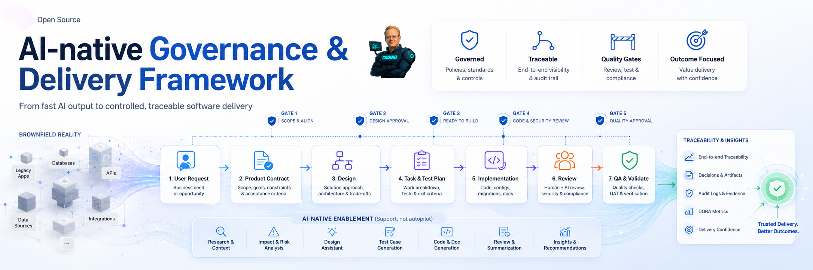

# AI-native Governance & Delivery Framework

Ein deutschsprachiger Diskussionsentwurf für Softwareentwicklung mit KI-Agenten.

Der Entwurf fragt:

Wie bleibt Softwareentwicklung kontrollierbar, wenn KI-Agenten nicht nur Code schreiben, sondern auch planen, prüfen,
ändern und zusammenfassen?

## In einem Satz

KI-Agenten brauchen nicht nur Prompts und Tools.
Sie brauchen einen nachvollziehbaren Arbeitsrahmen aus Gates, Artefakten, Projektwissen und Nachweisen.

Der Mensch bleibt verantwortlich.
Der Agent kann unterstützen.
Der Arbeitslauf muss belegbar bleiben.

## Status

Dieses Repository ist ein öffentlicher Diskussionsentwurf.
Es ist noch kein fertiges Tool, kein Pflichtprozess und kein Standard.

Ziel ist zuerst, die Beobachtung zu prüfen:

Je stärker KI-Agenten in Softwareentwicklung eingebunden werden, desto wichtiger werden Scope, Freigabe,
Nachvollziehbarkeit, Projektwissen und Qualitätsnachweise.

## Erste 5 Minuten

Wenn du schnell verstehen willst, worum es geht:

1. Lies die Kernaussage im [Manifest](docs/00-manifest.md).
2. Schau dir den Ablauf in [Gates](docs/02-gates.md) an.
3. Lies das [Beispiel für einen kleinen Brownfield Change](examples/sample-delivery-flow.md).

Danach solltest du beantworten können:

- Warum reicht ein guter Agenten-Output allein nicht?
- Welche Entscheidung stoppt oder erlaubt den nächsten Schritt?
- Welche Nachweise braucht ein Team, damit ein Agentenlauf vertrauenswürdig wird?

## Warum es dieses Projekt gibt

Viele Diskussionen über KI in der Softwareentwicklung drehen sich um Geschwindigkeit.
Wie schnell kann ein Agent Code schreiben?
Wie viel Arbeit kann automatisiert werden?
Welches Tool ist am besten?

Diese Fragen sind wichtig.
Sie reichen aber nicht.

Ein Agent kann schnell ein plausibles Ergebnis erzeugen.
Trotzdem kann offen bleiben:

- War die Anforderung richtig verstanden?
- War der Scope freigegeben?
- Wurde bestehendes Verhalten geschützt?
- Wurden Tests wirklich ausgeführt?
- Sind fehlende Nachweise sichtbar?
- Darf der nächste Schritt überhaupt beginnen?

Ein Board zeigt, woran gearbeitet wird.
Dieser Entwurf fragt, warum daran gearbeitet werden darf.

Der Entwurf beschreibt nicht nur, wie man KI-Agenten nutzt.
Er fragt, wie verhindert wird, dass Agentenarbeit unbemerkt Scope, Architektur oder Projektwissen verschiebt.

## Was der Entwurf vorschlägt

Der Entwurf arbeitet mit vier Bausteinen.

Gates:
bewusste Haltepunkte, an denen entschieden wird, ob Arbeit weitergehen darf.

Artefakte:
gespeicherte Arbeitsstände wie Bedarf, Produktvertrag, Design, Aufgaben, Tests und Nachweise.

Projektwissen:
ein projektnahes Gedächtnis, das nicht allein in Chatverläufen oder Tool-Memory liegt.

Qualitätsverträge:
prüfbare Regeln für Agentenläufe, Reviews und Nachweise.

## Warum Brownfield wichtig ist

Viele KI-gestützte Vorhaben entstehen nicht auf der grünen Wiese.
Sie treffen auf bestehende Systeme, bestehende Verantwortung, technische Schulden und oft unvollständige Tests.

Gerade dort reicht schnelle Code-Erzeugung nicht aus.
Ein kleiner neuer Wunsch kann bestehendes Verhalten verändern.
Ein Agent kann lokal plausibel arbeiten und trotzdem eine zweite Struktur oder eine zweite Wahrheit erzeugen.

Deshalb behandelt dieser Entwurf Brownfield nicht als Sonderfall.
Brownfield ist der Normalfall, an dem sich der Ansatz bewähren muss.

## Schnell ausprobieren

Ein Team kann den Entwurf klein testen:

1. Einen echten kleinen Brownfield Change auswählen.
2. In einem Absatz das User Requirement formulieren.
3. Prüfen, ob bestehendes Verhalten betroffen ist.
4. Drei bis fünf Akzeptanzkriterien festhalten.
5. Einen kurzen Task und Test Plan schreiben.
6. Nach der Umsetzung Nachweise sammeln.
7. Am Ende prüfen, ob Ergebnis und Agentenlauf ausreichend belegt sind.

Wenn dieser kleine Lauf mehr Klarheit schafft, ist der Ansatz nützlich.
Wenn er nur mehr Text erzeugt, muss der Zuschnitt kleiner werden.

## Dokumente

Empfohlene Reihenfolge:

1. [00 - Manifest](docs/00-manifest.md)
2. [01 - Überblick](docs/01-framework-ueberblick.md)
3. [02 - Gates](docs/02-gates.md)
4. [03 - Artefakte](docs/03-artefakte.md)
5. [04 - Wissen nutzbar halten](docs/04-wissen-nutzbar-halten.md)
6. [05 - Vom Mythos zur Prüfung](docs/05-vom-mythos-zur-pruefung.md)
7. [06 - Glossar](docs/06-glossar.md)
8. [Beispiel - Kleiner Brownfield Change](examples/sample-delivery-flow.md)

## Projektstruktur

```text
/
├─ README.md
├─ docs/
│  ├─ 00-manifest.md
│  ├─ 01-framework-ueberblick.md
│  ├─ 02-gates.md
│  ├─ 03-artefakte.md
│  ├─ 04-wissen-nutzbar-halten.md
│  ├─ 05-vom-mythos-zur-pruefung.md
│  └─ 06-glossar.md
├─ templates/
├─ examples/
│  └─ sample-delivery-flow.md
└─ .github/
```

## Nicht im Fokus

Noch nicht im Fokus stehen:

- fertiges Tooling
- Agent Runtime
- IDE-Integration
- vollständige Automatisierung
- organisationsspezifische Compliance-Profile

## Diskussion erwünscht

Besonders interessant sind Fragen wie:

- Ist ein Produktvertrag der richtige Anker für Arbeit mit KI-Agenten?
- Wie viel Steuerung hilft, bevor sie zu schwergewichtig wird?
- Wie lassen sich Tickets, Boards und Pull Requests mit fachlicher Nachvollziehbarkeit verbinden?
- Welche Nachweise sind nötig, damit ein Agentenlauf vertrauenswürdig wird?
- Wie lässt sich der Ansatz in Brownfield-Projekten anwenden?
- Was muss menschliches Review und menschliche Verantwortung bleiben?

Beiträge sind willkommen:
Diskussionen, Issues, Gegenargumente, Beispiele aus realen Projekten und Pull Requests.

## Lizenz

Die Lizenz ist noch festzulegen.

Bis zur Entscheidung sollte das Repository als Diskussionsentwurf behandelt werden.
