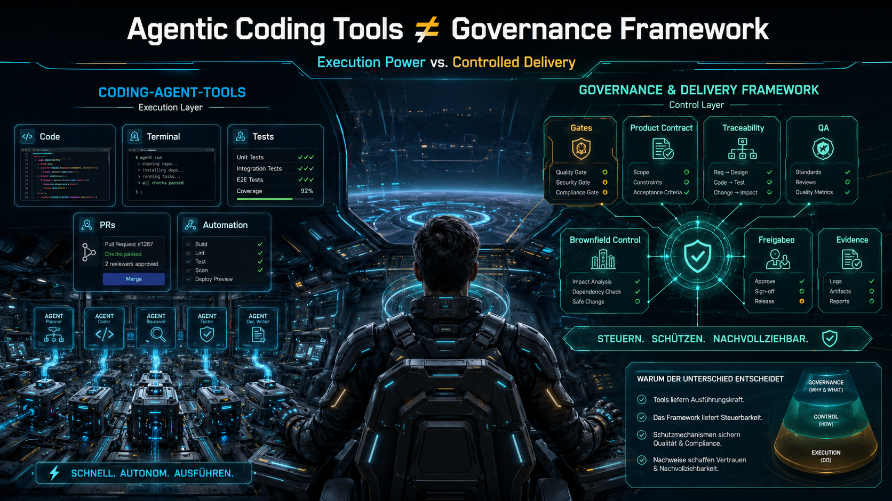
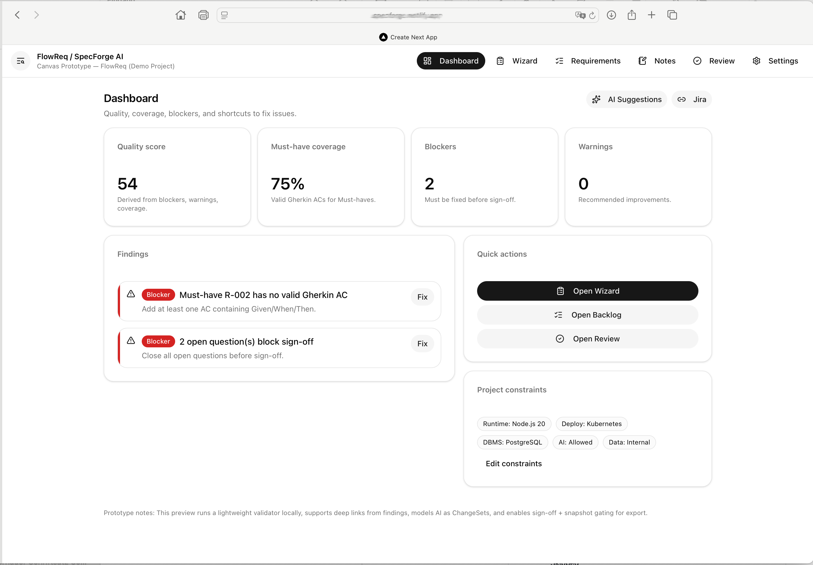

Ein deutschsprachiger Entwurf für Softwareentwicklung mit KI-Agenten, kontrollierbare KI-gestützte Lieferung und die
nachvollziehbare Weiterentwicklung bestehender Softwarelandschaften.

> Von schnellen KI-Ergebnissen zu stabiler, nachvollziehbarer und gate-basierter Softwareentwicklung.

## In einem Satz

Dieser Entwurf ist kein Ersatz für erfahrene Entwickler. Er beschreibt ein mögliches Exoskelett für Softwareentwicklung
mit KI-Agenten: Es soll Entwicklung mit KI-Agenten verstärken, ohne Kontrolle, Nachvollziehbarkeit und Verantwortung
aufzugeben.

Gleichzeitig behandelt es Projektwissen als eigenständigen Vermögenswert: versionierbar, reviewbar und nahe am Projekt
statt ausschließlich in Toolplattformen oder Modellkontexten gespeichert.

Bildlich gesprochen: Nicht Autopilot, sondern Iron-Man-Anzug. Der Entwickler bleibt Pilot; der Entwurf beschreibt HUD,
Schutzmechanismen, Gate-Checks und Nachweise.

**Arbeitsname: A.E.G.I.S.**

A.E.G.I.S. steht hier für die Steuerung um das Modell herum: Arbeitsstände werden sichtbar, Gates prüfen ihre
Tragfähigkeit, und der Mensch bleibt verantwortlich.

## Status

Dieses Repository ist ein öffentlicher Diskussionsentwurf.

Es geht hier nicht darum, sofort ein fertiges Tool oder einen neuen Pflichtprozess vorzugeben. Der erste Schritt ist
einfacher:
Wir wollen gemeinsam herausarbeiten, welche Struktur Softwareteams brauchen, wenn KI-Agenten nicht mehr nur assistieren,
sondern aktiv an Analyse, Planung, Umsetzung und Qualitätssicherung beteiligt sind.

## Warum dieses Projekt existiert

Agentisches Software Engineering verändert, wie Software geplant, entworfen, getestet und umgesetzt wird.

Viele Diskussionen drehen sich dabei um Coding Agents, Produktivität und Automatisierung. Das ist verständlich: Wer
sieht, wie schnell KI heute lauffähigen Code erzeugen kann, landet schnell bei der Frage, wie viel schneller Entwicklung
dadurch wird.

Dieses Projekt setzt an einer anderen Stelle an:

> Wie sorgen wir dafür, dass KI-Agenten nicht nur schnell liefern, sondern im richtigen fachlichen Rahmen arbeiten?

Eine einfache Analogie ist ein Haus-Party-Protokoll:

Nur weil jemand Gäste einladen kann, heißt das noch nicht, dass die Party kontrolliert abläuft. Es braucht Regeln:
besonders dann, wenn nicht vollständig transparent ist, mit welchen Systemanweisungen, Voreinstellungen oder internen
Prioritäten ein LLM tatsächlich arbeitet.

Ähnlich ist es bei KI-Agenten in der Softwareentwicklung. Ein Coding Agent kann schnell Änderungen vorschlagen oder
erzeugen. Ohne klare Artefakte, Gates und Verantwortlichkeiten bleibt aber unklar, ob diese Änderungen fachlich erlaubt,
technisch tragfähig und ausreichend geprüft sind.

In vielen Teams versucht man, den roten Faden über Jira, Azure DevOps, GitHub Issues oder ähnliche Ticket- und
Planungssysteme zu halten. Diese Werkzeuge sind wichtig. Sie zeigen, woran gearbeitet wird, wer beteiligt ist und wie
weit ein Vorgang fortgeschritten ist.

Sie beantworten aber nicht automatisch die Steuerungsfrage.

Ein Board zeigt, woran gearbeitet wird.
Dieser Entwurf fragt, warum daran gearbeitet werden darf.

Wenn KI-Agenten Anforderungen deuten, Solution Designs ableiten, Tasks vorschlagen, Tests planen oder
Implementierungsvorschläge erzeugen, braucht es klare Regeln für Scope, Freigabe, Nachvollziehbarkeit, Qualitätsnachweise,
Rollen, Verantwortung, Change Control und die Grenze zwischen Design und Code.

Kurz gesagt:

Die eigentliche Herausforderung entsteht nicht beim ersten guten Ergebnis.

Sie entsteht, wenn KI-Agenten über längere Zeit an demselben Projekt arbeiten sollen.

## Abgrenzung zu Coding-Agent-Tools



Tools wie Claude Code, Cursor, GitHub Copilot oder ähnliche Entwicklungsumgebungen mit KI-Agenten helfen dabei, Code zu
verstehen, Änderungen vorzuschlagen, Dateien zu bearbeiten, Tests auszuführen oder Git-Workflows zu unterstützen.

Dieser Entwurf ist kein Ersatz für solche Werkzeuge.

Es beantwortet eine andere Frage:

> Nicht: Welcher Agent kann Code erzeugen?
> Sondern: Unter welchen Voraussetzungen darf ein Agent Anforderungen interpretieren, Designs ableiten, Tasks planen,
> Code ändern oder Ergebnisse als fertig darstellen?

Coding-Agent-Tools liefern Ausführungskraft. Dieser Entwurf beschreibt den Rahmen, damit diese Arbeit gesteuert und
geprüft werden kann.

Der Unterschied ist wichtig:

| Coding-Agent-Tool                           | Dieser Entwurf                                    |
|---------------------------------------------|---------------------------------------------------|
| arbeitet in Codebase, IDE, Terminal oder PR | definiert Gates, Freigaben und Entscheidungslogik |
| kann Code ändern oder Tests ausführen       | klärt, wann Codeänderung überhaupt erlaubt ist    |
| optimiert Entwicklungsfluss                 | schützt Scope, Nachvollziehbarkeit und Verantwortung |
| unterstützt Umsetzung                       | macht Produktvertrag, Nachweise und QA prüfbar    |
| kann sehr schnell liefern                   | sorgt dafür, dass Lieferung prüfbar bleibt        |

> KI Werkzeuge wie Claude Code oder Codex helfen beim Arbeiten.
>
> Dieser Entwurf beschreibt, woran gearbeitet werden darf, wie Entscheidungen nachvollziehbar bleiben und wie
> Projektwissen erhalten wird.

## Projektwissen als eigener Vermögenswert

Mit zunehmender Nutzung von KI-Agenten entsteht eine neue Herausforderung:

Nicht die Erzeugung von Ergebnissen wird zum Engpass.

Der Engpass wird das langfristige Management von Projektwissen.

Anforderungen, Entscheidungen, Designs, Tests, Nachweise und Brownfield-Erkenntnisse entstehen über Monate oder Jahre.

Viele Teams adressieren dieses Problem heute über Wikis, Developer Guides und Projektdokumentation.

Aktuelle KI-Werkzeuge ergänzen diese Ansätze durch Memory-Funktionen, Projektwissen und Kontextverdichtung.

Diese Ansätze können wertvoll sein.

Sie beantworten jedoch nicht automatisch die Frage, wie Projektwissen versionierbar, nachvollziehbar und langfristig mit
Anforderungen, Entscheidungen, Tests und Nachweisen verbunden bleibt.

Dieser Entwurf schlägt einen anderen Ansatz vor.

Projektwissen soll nicht primär einer Toolplattform gehören.

Es soll nahe am Projekt liegen, gemeinsam mit Code, Artefakten und Nachweisen.

Artefakte halten dieses Wissen fest.

Kontextgraphen machen Zusammenhänge sichtbar.

Gates prüfen, welche Erkenntnisse belastbar genug sind, um Teil des Projektgedächtnisses zu werden.

So kann ein versionierbares, reviewbares und kontinuierlich verbessertes Projektgedächtnis entstehen.

## Ursprung

Dieser Entwurf ist aus praktischen Experimenten und einem Vortrag zu **„KI als Junior-Dev-Teammitglied“** entstanden.
Zu einer Zeit, in der in vielen Teams noch die Frage im Vordergrund stand: „KI, was haben wir konkret davon?"

Sam Altman schrieb Anfang 2025 in seinem Blogpost **„Reflections“**:

> “We believe that, in 2025, we may see the first AI agents ‘join the workforce’ …”

Der ursprüngliche Impuls war pragmatisch: Was passiert, wenn diese Einschätzung zutrifft? Was passiert, wenn KI nicht
nur Texte erklärt oder Code vervollständigt, sondern als KI-Teammitglied an realen Delivery-Schritten beteiligt
wird?

*Frühes Experiment aus der Phase „KI als Junior-Dev-Teammitglied“: schnelle MVP-Erzeugung machte sichtbar,
dass Geschwindigkeit allein nicht reicht. Entscheidend wird, ob Scope, Entscheidungen, Tests und Freigaben
nachvollziehbar
bleiben.*



Die spannendere Frage zeigte sich aber erst danach:

> Was passiert, wenn jeder erfahrene Entwickler zum Produzenten wird, mit KI als Entwicklungsteam?

In dieser Perspektive schreibt ein erfahrener Entwickler nicht mehr nur Code. Er formuliert Ziele, stabilisiert
Scope, trifft Architekturentscheidungen, zerlegt Arbeit, bewertet Vorschläge, prüft Qualität, priorisiert Risiken und
entscheidet über Freigaben.

KI-Agenten können sehr schnell lauffähige Ergebnisse erzeugen. Entscheidend wird aber, ob Anforderungen, Scope,
Architekturentscheidungen, Arbeitspakete, Tests, Freigaben und Änderungen nachvollziehbar bleiben.

Dieser Entwurf ist der Versuch, diese Beobachtung greifbar zu machen:

> Wenn erfahrene Entwickler mit KI-Agenten wie mit einem Entwicklungsteam arbeiten, brauchen sie nicht nur Prompts
> und Tools, sondern einen nachvollziehbaren Arbeitsrahmen.

## Leitthese

KI-Agenten machen erfahrene Entwickler nicht überflüssig. Sie verändern ihre Rolle.

Der erfahrene Entwickler wird stärker zum Produzenten. Er setzt Ziele, gibt Kontext, hält Scope stabil, trifft
Architekturentscheidungen, bewertet Vorschläge, prüft Qualität und entscheidet, wann etwas weitergehen darf.

Genau deshalb braucht Softwareentwicklung mit KI-Agenten nicht nur bessere Coding Agents. Sie braucht klare Steuerung,
damit diese neue Arbeitsweise kontrollierbar bleibt.

## Kernidee

Der Entwurf schlägt eine Arbeit mit klaren Gates für Softwareentwicklung mit KI-Agenten vor.

Der zentrale Gedanke ist bewusst einfach:

> Keine Implementierung ohne freigegebenen Produktvertrag.

Ein stabiler Produktvertrag, zum Beispiel ein `Product Requirements Doc`, beschreibt verbindlich, was gelten soll:
Scope, Akzeptanzkriterien, Non-Goals, Constraints und Erfolgsmessung.

Nachgelagerte Artefakte wie Solution Design, Task & Test Plan und Implementierung dürfen diesen Vertrag nicht
stillschweigend uminterpretieren.

Gleichzeitig betrachtet der Entwurf Artefakte nicht nur als Dokumentation.

Sie bilden gemeinsam ein projektnahes Gedächtnis, das durch Brownfield-Analysen, Reviews und Gates kontrolliert
weiterentwickelt werden kann.

## Deutsch-first

Dieses Projekt ist bewusst Deutsch-first.

Verantwortung, Freigabe, Nachweisführung, Akzeptanzkriterien, Nicht-Ziele, Änderungssteuerung und Prüfbarkeit sind
keine rein technischen Begriffe. Sie berühren Organisation, Haftung, Zusammenarbeit, Regulierung und
Entscheidungsverantwortung.

Gerade im deutschsprachigen Raum (in Unternehmen, Mittelstand, öffentlicher Verwaltung, regulierten Branchen und
europäischen Regelungsumfeldern) müssen diese Fragen präzise und anschlussfähig diskutiert werden können.

Englische Fachbegriffe wie `AI-native`, `Delivery`, `Gate`, `Product Requirements Doc` oder
`Agentic Software Engineering`
werden dort verwendet, wo sie als Fachanker hilfreich sind.

## Brownfield als Hauptanwendungsfall

Dieser Entwurf betrachtet Brownfield-Projekte nicht als Sonderfall, sondern als zentrale Realität von
Softwareentwicklung mit KI-Agenten.

Viele relevante KI-gestützte Softwarevorhaben entstehen nicht auf der grünen Wiese. Sie finden in bestehenden
Systemlandschaften statt: gewachsene Codebasen, historische Architekturentscheidungen, unvollständige Dokumentation,
bestehende Schnittstellen, regulatorische Anforderungen, technische Schulden, laufender Betrieb und oft auch lückenhafte
Tests.

Gerade dort reicht schnelle Code-Erzeugung nicht aus. Arbeit mit KI-Agenten muss kontrolliert, nachvollziehbar und
rückbaubar bleiben.

Brownfield bedeutet deshalb nicht nur, neuen Code schneller zu erzeugen. Es bedeutet, bestehendes Verhalten
zu verstehen, Risiken sichtbar zu machen, Änderungen sauber zu begründen, Tests gezielt nachzuziehen und Rückbau oder
Rollback mitzudenken.

## Grundprinzipien

### 1. Fail closed

Wenn eine notwendige Voraussetzung fehlt, wird nicht einfach weitergemacht. Fehlende Freigaben, unklare Anforderungen
oder fehlende Qualitätsnachweise führen zu Klärung, Revision oder Blockade.

### 2. Single Source of Truth

Der Produktvertrag ist die verbindliche Quelle für Scope, Akzeptanzkriterien und Non-Goals.

### 3. Design ist nicht Code

Solution Design beschreibt Architektur, Verantwortlichkeiten, Schnittstellen und Abläufe. Code beschreibt ausführbares
Verhalten, vollständige Payloads, Schemas, Migrationen und Implementierungslogik.

### 4. Nachvollziehbarkeit statt Bauchgefühl

Wichtige Entscheidungen sollen auf Anforderungen, Artefakte, Freigaben oder Qualitätsnachweise zurückführbar sein.

### 5. Qualität braucht Nachweise

Build-, Test-, Review- und Risikoaussagen müssen sichtbar gemacht werden. Was nicht verifiziert wurde, sollte auch
nicht so dargestellt werden, als sei es verifiziert.

Bei KI-Agenten reicht es nicht, nur den erzeugten Code zu prüfen. Auch der Agentenlauf selbst sollte nachvollziehbar
werden: Welche Regel galt, welcher Nachweis liegt vor, und welche Entscheidung darf daraus folgen?

### 6. Änderungen müssen sichtbar sein

Scope-Änderungen, geänderte Akzeptanzkriterien, Non-Goal-Anpassungen sowie sicherheits-, compliance- oder
datenschutzrelevante Änderungen brauchen dokumentierte Change Control.

## Vorgeschlagene Gate-Struktur

Der Vorschlag arbeitet mit klaren Gates:

| Gate                       | Zweck                                                                        |
|----------------------------|------------------------------------------------------------------------------|
| G-00 User Request          | Problemverständnis, Scope-Rahmen, Risiken, Entscheidungsvorlage              |
| G-01 Product Requirements  | Anforderungen und stabiler Produktvertrag                                    |
| G-02 Solution Design       | Lösungskonzept, Architektur, Schnittstellen, Datenflüsse                     |
| G-03 Task & Test Plan      | Ableitung umsetzbarer Arbeitspakete und Prüfung gegen Akzeptanzkriterien     |
| G-04 Code / Implementation | Implementierung, Tests, Qualitätsnachweise                                   |

Die detaillierte Gate-Matrix wird in den Dokumenten ausgearbeitet.

## Repository-Struktur

```text
/
├─ README.md
├─ docs/
│  ├─ 00-manifest.md
│  ├─ 01-framework-ueberblick.md
│  ├─ 02-gates.md
│  ├─ 03-artefakte.md
│  ├─ 04-wissen-nutzbar-halten.md
│  ├─ 05-vom-mythos-zur-pruefung.md
│  └─ 06-glossar.md
├─ templates/
│  ├─ user-requirement.md
│  ├─ prd-contract.md
│  ├─ solution-design.md
│  ├─ task-test-plan.md
│  └─ qa-report.md
├─ examples/
│  └─ sample-delivery-flow.md
└─ .github/
   ├─ ISSUE_TEMPLATE/
   └─ DISCUSSION_TEMPLATE/
```

## Einstieg

Empfohlene Reihenfolge:

1. [`docs/00 - Manifest`](docs/00-manifest.md) lesen
2. [`docs/01 - Überblick`](docs/01-framework-ueberblick.md) lesen
3. [`docs/02 - Gates`](docs/02-gates.md) lesen
4. [`docs/03 - Artefakte`](docs/03-artefakte.md) lesen
5. [`docs/04 - Wissen nutzbar halten`](docs/04-wissen-nutzbar-halten.md) lesen
6. [`docs/05 - Vom Mythos zur Prüfung`](docs/05-vom-mythos-zur-pruefung.md) lesen
7. [`docs/06 - Glossar`](docs/06-glossar.md) bei Begriffsklärung nutzen
8. Offene Fragen in den GitHub Discussions kommentieren
9. Issues zu Begriffen, Gates, Artefakten oder Brownfield-Anwendungsfällen anlegen
10. Verbesserungsvorschläge als Pull Request einreichen

## Aktueller Arbeitsstand

Die erste öffentliche Version konzentriert sich auf Manifest und Positionierung, Ursprung und praktische Motivation,
Begriffsklärung, Gate-Modell, Artefaktmodell, Product Requirements Doc als Produktvertrag, Task & Test Plan als Brücke
zur Umsetzung,
Brownfield-Relevanz, Kontextgraph, Qualitätsverträge, Glossar und offene Diskussionsfragen.

Noch nicht im Fokus stehen fertiges Tooling, Agent Runtime, IDE-Integration, vollständige Automatisierung oder
organisationsspezifische Compliance-Profile.

## Diskussion erwünscht

Dieses Projekt lebt von Kritik und Gegenbeispielen.

Besonders interessant sind Fragen wie:

* Wie verändert sich die Rolle erfahrener Entwickler, wenn KI-Agenten Teile eines Entwicklungsteams übernehmen?
* Wie viel Steuerung ist hilfreich, bevor sie zu schwergewichtig wird?
* Ist ein Produktvertrag der richtige Anker für Arbeit mit KI-Agenten?
* Wo endet Design und wo beginnt Implementierung?
* Wie lassen sich Tickets, Boards und PRs mit fachlicher Nachvollziehbarkeit verbinden?
* Welche Qualitätsnachweise sind für Vertrauen notwendig?
* Wie lässt sich dieser Ansatz in Brownfield-Projekten anwenden?
* Welche Teile sollten durch Tooling unterstützt werden?
* Was muss menschliches Review und menschliche Verantwortung bleiben?

## Mitwirken

Beiträge sind willkommen: Diskussionen, Issues, Verbesserungsvorschläge, Gegenargumente, Beispiele aus realen
Brownfield-Projekten oder Pull Requests für Dokumentation, Templates und Beispiele.

Bitte beachte: Dieses Repository ist zunächst ein Entwurfs- und Diskussionsprojekt. Implementierungsdetails und
Tooling werden erst später ergänzt.

## Lizenz

Die Lizenz ist noch festzulegen.

Bis zur Entscheidung sollte das Repository als Diskussionsentwurf behandelt werden.

## FAQ

### Was ist das Ziel ?

Das unmittelbare Ziel ist nicht die Einführung eines neuen Prozesses, Tools oder Organisationsmodells.

Der Entwurf entstand aus der Beobachtung, dass mit zunehmender Nutzung von KI-Agenten die Herausforderungen rund um
Projektwissen, Nachvollziehbarkeit, Freigaben und langfristige Stabilität zunehmen.

Die erste Frage sollte deshalb nicht lauten:

* Wer soll das einsetzen?
* Wem gehört das?
* Wie wird es eingeführt?

Die erste Frage lautet:

> Ist die zugrunde liegende Beobachtung fachlich richtig?

Erst wenn diese Beobachtung trägt, lohnt sich die Diskussion über Einführung, Rollen, Prozesse oder organisatorische
Verankerung.

### Brauchen wir das noch, wenn Coding-Agenten immer besser werden?

Vielleicht sogar dann erst recht.

Eine größere KI, mehr Kontext oder noch autonomere Code-Generierung mit oder ohne Plan-Modus löst nicht jedes Problem.

Ein Moped wird auch nicht zur Formel 1, nur weil man Formel-1-Benzin einfüllt.

Mit steigender Leistung werden andere Faktoren zum Engpass:

* Struktur
* Steuerung
* Nachvollziehbarkeit
* Projektwissen

Für Softwareentwicklung mit KI-Agenten gilt möglicherweise dasselbe.

Je leistungsfähiger Coding-Agenten werden, desto wichtiger wird die Frage, worauf sie aufbauen dürfen, wann sie stoppen
müssen und welche Nachweise vorliegen.

Dieser Entwurf adressiert genau diese Ebene.
