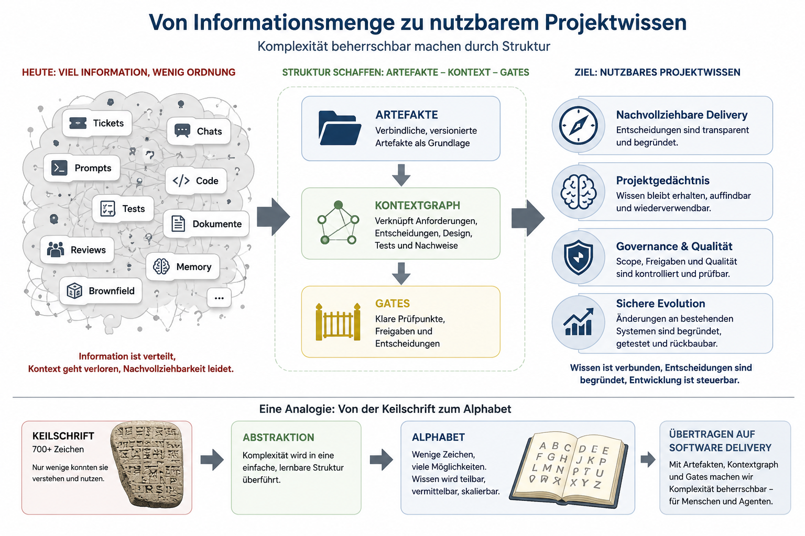

# Manifest: AI-native Governance & Delivery Framework

## Warum dieses Projekt existiert

Softwareentwicklung mit KI-Agenten verändert gerade, wie Software geplant, entworfen, getestet und umgesetzt wird.

Viele Diskussionen drehen sich um Coding Agents, Produktivität und Automatisierung. Das ist nachvollziehbar. Wer sieht,
wie schnell KI heute lauffähigen Code erzeugen kann, landet schnell bei der Frage, wie viel schneller Entwicklung
dadurch wird.

Dieses Projekt setzt an einer anderen Stelle an:

> Wie halten wir Softwareentwicklung kontrollierbar, prüfbar und am vereinbarten Ziel ausgerichtet, wenn KI-Agenten
> Anforderungen interpretieren, Lösungen entwerfen, Arbeitspakete ableiten, Tests planen und Implementierungsartefakte
> erzeugen?

In vielen Teams versucht man, den roten Faden über Jira, Azure DevOps, GitHub Issues oder ähnliche Ticket- und
Planungssysteme zu halten. Diese Werkzeuge sind wichtig. Sie zeigen, woran gearbeitet wird, wer beteiligt ist und wie
weit ein Vorgang fortgeschritten ist.

Sie beantworten aber nicht automatisch die Steuerungsfrage.

## Eine Analogie

Komplexe Systeme werden oft nicht dadurch beherrschbar, dass immer mehr Informationen gesammelt werden.

Sie werden beherrschbar, wenn eine einfachere Struktur entsteht, die diese Informationen ordnet.

Eine historische Analogie ist die Entwicklung von Schriftsystemen: Statt immer mehr einzelne Zeichen (Keilschrift) zu verwalten,
entstanden einfachere Strukturen, mit denen Wissen leichter erfassbar, vermittelbar und wiederverwendbar wurde.

Softwareentwicklung mit KI-Agenten steht möglicherweise vor einer ähnlichen Herausforderung.

Nicht die Menge der erzeugbaren Ergebnisse wird zum Engpass.

Der Engpass wird die Fähigkeit, Wissen nachvollziehbar zu organisieren, wiederzufinden und verantwortbar
weiterzuentwickeln.

## Worum es in diesem Entwurf zunächst geht

Dieser Entwurf ist zunächst kein Produkt, kein Tool und kein Rollout-Vorschlag.

Er beschreibt Beobachtungen:

Je mehr Verantwortung KI-Agenten in der Softwareentwicklung übernehmen, desto wichtiger werden Nachvollziehbarkeit,
Freigabe, Projektwissen und kontrollierte Entscheidungen.

Die erste Frage lautet deshalb nicht:

* Wer besitzt so einen Ansatz?
* Wie wird es eingeführt?
* Wie wird es bewertet?
* Wie wird es vermarktet?

Die erste Frage lautet:

* Ist die Beobachtung fachlich richtig?

Wenn Softwareentwicklung mit KI-Agenten zunimmt:

* Entstehen dann tatsächlich neue Anforderungen an Steuerung und Verantwortung?
* Werden Produktverträge wichtiger?
* Werden Brownfield-Fragen wichtiger?
* Brauchen Teams ein belastbares Projektgedächtnis?
* Reichen bestehende Liefermodelle dafür aus?

Dieses Repository versteht sich zunächst als Beitrag zu dieser Diskussion.

## Sprache und Kontext

Dieses Projekt ist bewusst Deutsch-first.

Der Grund ist fachlich: Verantwortung, Freigabe, Nachweisführung, Prüfpfade, Akzeptanzkriterien, Nicht-Ziele und
Änderungssteuerung sind keine rein technischen Begriffe. Sie berühren Organisation, Haftung, Zusammenarbeit,
Regulierung und Entscheidungsverantwortung.

Gerade im deutschsprachigen Raum, etwa in Unternehmen, Mittelstand, öffentlicher Verwaltung, regulierten Branchen und
europäischen Regelungsumfeldern, müssen diese Fragen präzise und anschlussfähig diskutiert werden können.

Englische Fachbegriffe wie `AI-native`, `Delivery`, `Gate`, `Product Requirements Doc` oder
`Agentic Software Engineering` werden dort verwendet, wo sie als Fachanker hilfreich sind. Die argumentative und
inhaltliche Ausarbeitung erfolgt jedoch zunächst auf Deutsch.

Englische Übersetzungen können später entstehen. Die Primärfassung dieses Entwurfs soll zuerst im deutschsprachigen
Kontext geschärft werden.

## Kernthese

Softwareentwicklung mit KI-Agenten braucht eine klare Steuerungs- und Lieferstruktur.

Die zentrale Aufgabe ist nicht nur, Agenten produktiver zu machen.
Die zentrale Aufgabe ist, ihre Arbeit so einzubetten, dass Scope, Architektur, Verantwortung und Projektwissen nicht
unbemerkt verschoben werden.

Ohne eine solche Struktur kann KI-gestützte Softwareentwicklung zwar schneller werden, aber zugleich schwer nachvollziehbar bleiben:

* Anforderungen können stillschweigend uminterpretiert werden
* Scope kann ohne Freigabe wandern
* Design kann zu früh in Implementierung kippen
* Tasks können technisch plausibel wirken, ohne fachlich legitimiert zu sein
* Tests können den Bezug zu Akzeptanzkriterien verlieren
* Qualitätsaussagen können ohne Nachweise bleiben
* Verantwortung kann unklar werden

Ziel dieses Entwurfs ist es, KI-gestützte Softwareentwicklung belastbarer zu machen, indem Absicht, Scope, Freigabe,
Nachvollziehbarkeit und Qualitätsnachweise sichtbar werden.

Besonders relevant wird diese Steuerung in Brownfield-Projekten, in denen KI-Agenten nicht nur neue Funktionen
erzeugen, sondern bestehende Systeme verstehen, verändern, modernisieren und absichern müssen.

## Rollenwandel

Agentisches Software Engineering verändert nicht nur Werkzeuge, sondern Rollen.

Erfahrene Entwickler werden zunehmend zu Produzenten. Sie schreiben nicht mehr nur Code. Sie formulieren Ziele, geben
Kontext, stabilisieren Scope, treffen Architekturentscheidungen, zerlegen Arbeit, bewerten Vorschläge, prüfen Qualität,
priorisieren Risiken und entscheiden über Freigaben.

KI-Agenten können dabei Teile eines Entwicklungsteams simulieren oder übernehmen: Analyse, Planung,
Implementierungsvorschläge, Testableitung, Dokumentation und Qualitätshinweise.

Gerade deshalb braucht diese Arbeitsweise einen Rahmen. Wenn ein erfahrener Entwickler mit KI wie mit einem
Entwicklungsteam arbeitet, muss nachvollziehbar bleiben, warum etwas gebaut wird, worauf es basiert, wie es geprüft wird
und wann es weitergehen darf.

## Brownfield als Kernrealität

Dieser Entwurf betrachtet Brownfield-Projekte nicht als Sonderfall, sondern als zentrale Realität von
Softwareentwicklung mit KI-Agenten.

Viele relevante KI-gestützte Softwarevorhaben werden nicht auf der grünen Wiese entstehen. Sie werden in bestehenden
Systemlandschaften stattfinden: in gewachsenen Codebasen, mit historischen Architekturentscheidungen, unvollständiger
Dokumentation, bestehenden Schnittstellen, regulatorischen Anforderungen, technischen Schulden und laufendem Betrieb.

Gerade dort reicht schnelle Code-Erzeugung nicht aus.

In Brownfield-Kontexten muss Arbeit mit KI-Agenten besonders sorgfältig gesteuert werden:

* bestehendes Verhalten darf nicht unbemerkt verändert werden
* verstecktes Systemwissen muss sichtbar gemacht werden
* Abhängigkeiten müssen nachvollziehbar bleiben
* Änderungen brauchen klare Begründung und Freigabe
* Tests müssen bestehendes Verhalten absichern
* Risiken müssen vor Umsetzung sichtbar werden
* Migration, Rückbau und Rollback müssen mitgedacht werden

Brownfield ist deshalb kein Randfall für diesen Entwurf. Er ist wahrscheinlich der wichtigste Prüfstein.

Ob Softwareentwicklung mit KI-Agenten wirklich trägt, entscheidet sich nicht an der nächsten grünen Wiese, sondern an
bestehenden Systemen: dort, wo Abhängigkeiten gewachsen sind, Wissen verteilt ist, Tests fehlen und Änderungen trotzdem
verantwortbar geliefert werden müssen.

## Prinzipien

### 1. Keine Implementierung ohne freigegebenen Produktvertrag

Implementierung sollte nicht auf vager Absicht basieren.

Ein stabiler Produktvertrag definiert akzeptierten Scope, Akzeptanzkriterien, Non-Goals, Constraints und Erfolgsmessung.

### 2. Fail closed

Wenn eine notwendige Freigabe, Eingabe oder Qualitätsaussage fehlt, muss der Prozess stoppen oder eine Überarbeitung
verlangen.

Der Standard darf nicht „best effort“ sein, wenn der nächste Schritt von ungeprüften Annahmen abhängt.

### 3. Eine verbindliche Quelle für Produktabsicht

Der Produktvertrag ist der Anker für alle nachgelagerten Arbeiten.

Design, Task & Test Plan und Implementierung dürfen den vereinbarten Scope nicht stillschweigend uminterpretieren.

### 4. Design und Code müssen getrennt bleiben

Konzeptuelles Design und Implementierungsdetails sollten nicht zu früh vermischt werden.

Design beschreibt Architektur, Verantwortlichkeiten, Schnittstellen und Abläufe.

Code beschreibt ausführbares Verhalten, Payloads, Schemas, Migrationen und Implementierungslogik.

### 5. Tasks brauchen fachliche Begründung

Ein Task ist nicht nur eine Karte auf einem Board.

Ein Task sollte nachvollziehbar machen, welche Anforderung, welches Akzeptanzkriterium, welche Designentscheidung,
welches Risiko oder welches Qualitätsziel er adressiert.

Gerade bei KI-Agenten ist das wichtig, weil sie sehr schnell überzeugende Pläne erzeugen können. Die Zerlegung von
Arbeit muss deshalb erklärbar und prüfbar bleiben.

### 6. Nachvollziehbarkeit ist keine Bürokratie

Nachvollziehbarkeit bedeutet nicht, möglichst viele Dokumente zu erzeugen.

Nachvollziehbarkeit bedeutet, grundlegende Lieferfragen beantworten zu können:

* Warum existiert diese Aufgabe?
* Welche Anforderung stützt diese Designentscheidung?
* Welches Akzeptanzkriterium prüft dieser Test?
* Welches freigegebene Artefakt erlaubt diese Implementierung?
* Was hat sich zwischen zwei Versionen geändert?

### 7. Qualität braucht Nachweise

Eine Qualitätsbehauptung reicht nicht aus.

Die Lieferung sollte sichtbare Nachweise enthalten, zum Beispiel Testergebnisse, Build-Status, Review-Ergebnisse, bekannte
Einschränkungen und verbleibende Risiken.

Was nicht geprüft wurde, sollte auch nicht so dargestellt werden, als sei es geprüft.

### 8. Änderungen müssen sichtbar sein

Wenn Scope, Akzeptanzkriterien, Non-Goals oder sicherheits-, compliance- oder datenschutzrelevante Aspekte geändert
werden, muss diese Änderung dokumentiert und geprüft werden.

Arbeit mit KI-Agenten darf Änderungen nicht hinter flüssiger Konversation verstecken.

## Was dieser Entwurf ist

Dieser Entwurf ist ein Vorschlag für Softwareentwicklung mit KI-Agenten, die über Gates gesteuert und nachvollziehbar
geprüft werden kann.

Es strukturiert Arbeit entlang von:

* Nutzerabsicht
* Produktvertrag
* Solution Design
* Ableitung von Arbeitspaketen und Tests
* Implementierung
* Qualitätsnachweisen
* Review und Change Control

Es richtet sich an Teams, Builder, Forscherinnen und Forscher, Engineering Leads, Produktverantwortliche und Praktiker,
die Softwareentwicklung mit KI-Agenten zuverlässiger, prüfbarer und verantwortbarer machen wollen.

## Was dieser Entwurf nicht ist

Dieser Entwurf ist kein Coding Standard.

Es ersetzt kein Engineering-Urteil.

Es ist nicht an ein bestimmtes KI-Modell, einen Anbieter, eine IDE, ein Agent Framework oder eine Programmiersprache
gebunden.

Es soll Teams nicht durch unnötige Bürokratie verlangsamen.

Sein Zweck ist es, die kritischen Teile von Softwareentwicklung so sichtbar zu machen, dass Menschen und KI-Agenten sicher
zusammenarbeiten können.

## Offene Fragen

Dieses Projekt wird bewusst als Diskussionsentwurf veröffentlicht.

Wichtige Fragen sind:

1. Wie verändert sich die Rolle erfahrener Entwickler, wenn KI-Agenten Teile eines Entwicklungsteams übernehmen?
2. Wie viel Steuerung ist hilfreich, bevor sie zu schwergewichtig wird?
3. Ist ein Produktvertrag der richtige Anker für Arbeit mit KI-Agenten?
4. Wo endet Design und wo beginnt Implementierung?
5. Wie lassen sich Tickets, Boards und Pull Requests mit fachlicher Nachvollziehbarkeit verbinden?
6. Welche Qualitätssignale sind notwendig, um Vertrauen zu schaffen?
7. Wie sollte Verantwortung zwischen Menschen und Agenten verteilt werden?
8. Welche Teile dieses Ansatzes sollten durch Tooling unterstützt werden?
9. Was muss menschliches Review und menschliches Urteil bleiben?
10. Wie kann dieser Ansatz Brownfield-Modernisierung unterstützen, ohne bestehende Lieferprozesse zu überfrachten?

## Nächster Schritt

Als nächstes wird der Überblick des Frameworks beschrieben.

Das nächste Dokument ist daher:

[01 - Überblick](01-framework-ueberblick.md)