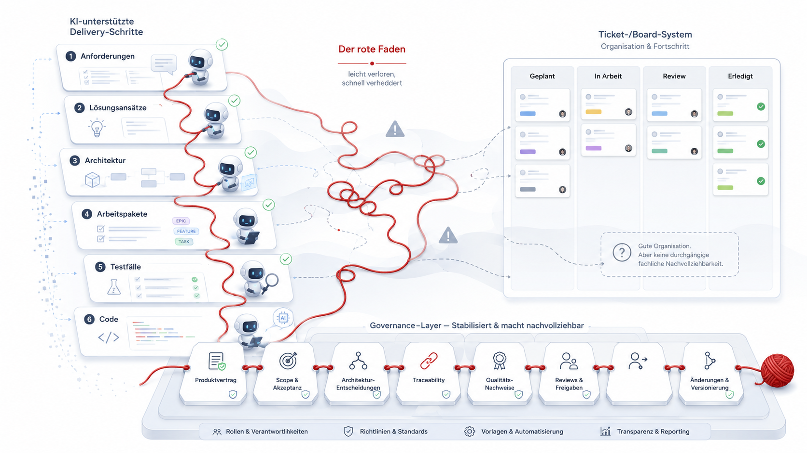
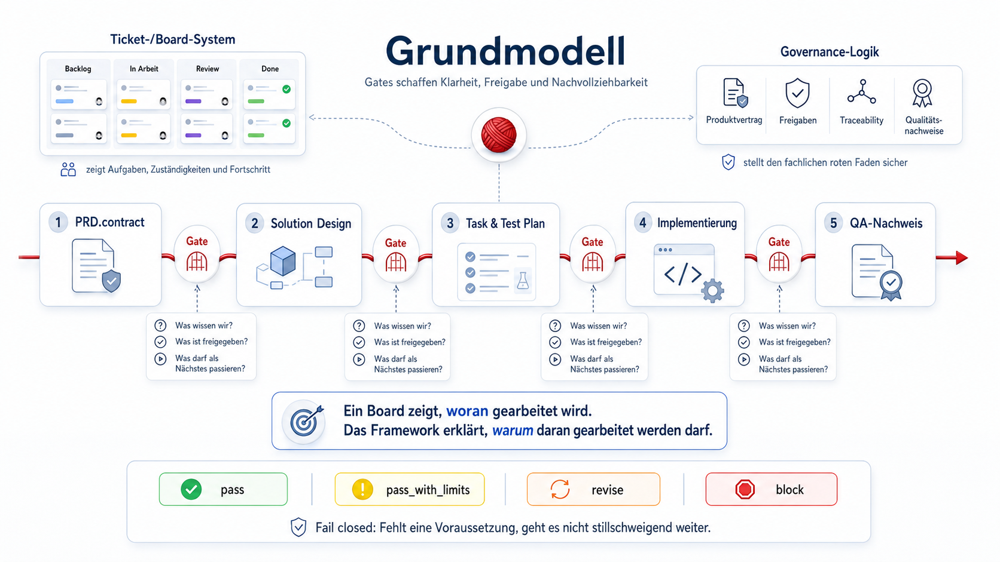
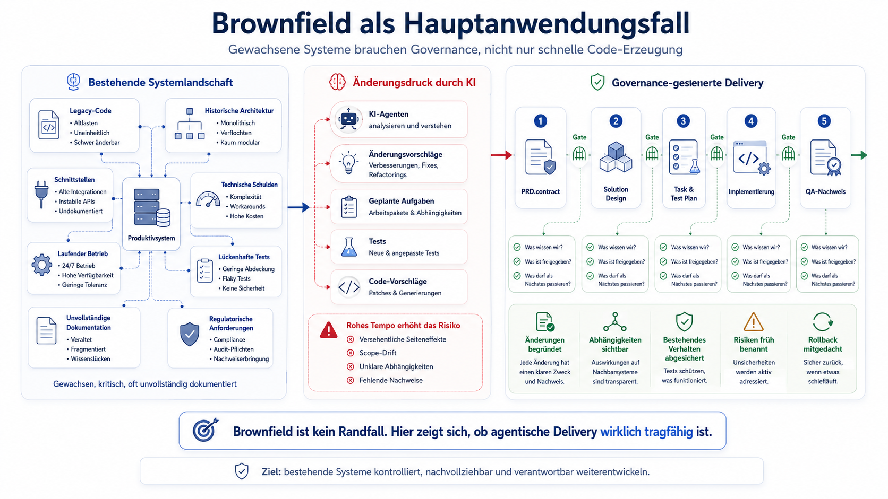

# Framework-Überblick

## Worum es geht

Dieses Dokument gibt einen ersten Überblick über das **AI-native Governance & Delivery Framework für agentisches Software Engineering**.

Es verbindet das Manifest mit den späteren Detaildokumenten. Im Kern geht es um eine einfache Frage:

> Wie organisieren wir Software Delivery mit KI-Agenten so, dass sie nicht nur schneller wird, sondern nachvollziehbar, prüfbar und verantwortbar bleibt?

Der Überblick beschreibt noch kein Tool, keine Agent Runtime und keinen fertigen Implementierungsprozess. Er skizziert das Arbeitsmodell, die Gates, die wichtigsten Artefakte und die offenen Fragen.

---
## Ausgangspunkt

KI-Agenten können heute schon viele Tätigkeiten unterstützen, die bisher klar bei einzelnen Personen oder einem ganzen Team lagen: Anforderungen zusammenfassen, 
Lösungsansätze formulieren, Architekturvorschläge machen, Arbeitspakete ableiten, Testfälle planen oder Code erzeugen.



Viele Teams versuchen, den roten Faden über Werkzeuge wie Jira, Azure DevOps, GitHub Issues oder ähnliche Ticket- und Planungssysteme zu halten. Diese Werkzeuge sind 
wichtig: Sie helfen dabei, Arbeit zu strukturieren, Zuständigkeiten sichtbar zu machen und Fortschritt zu verfolgen.

In der Praxis zeigt sich aber oft ein anderes Bild. Ein typischer Dialog zwischen Product Owner und Entwicklung lautet:

> „Wir haben in Jira zu diesem Thema fast 1000 Tickets, aber wir wissen nicht, was davon tatsächlich umgesetzt wurde.“

Dieser Satz beschreibt das Problem sehr präzise. Das Ticket-System enthält Aktivität, Historie und Statusinformationen. Aber es beantwortet 
nicht automatisch, welche fachlichen Anforderungen wirklich umgesetzt wurden, welche Akzeptanzkriterien erfüllt sind, welche Entscheidungen 
noch gelten und welche Änderungen später wieder verworfen wurden.

Ein Board zeigt Fortschritt. Es zeigt aber nicht zwingend fachliche Nachvollziehbarkeit.

Genau hier entsteht durch KI-Agenten zusätzlicher Druck: Je mehr Zwischenschritte durch KI unterstützt oder vorbereitet werden, desto schwieriger wird es, den roten Faden nicht nur organisatorisch, sondern auch fachlich und auditierbar zu halten.

Dieses Framework setzt genau dort an.

## Grundmodell

Das Framework betrachtet Delivery als Abfolge von Gates.

Ein Gate ist kein zusätzliches Meeting und kein Selbstzweck. Ein Gate ist ein bewusster Haltepunkt, an dem geprüft wird, ob genügend Klarheit, Freigabe und Nachweis vorhanden sind, um sinnvoll weiterzugehen.



Jedes Gate beantwortet im Kern drei Fragen:

1. Was wissen wir?
2. Was ist freigegeben?
3. Was darf als Nächstes passieren?

Wenn eine dieser Fragen nicht belastbar beantwortet werden kann, geht der Prozess nicht stillschweigend weiter. Dann braucht es Klärung, Überarbeitung oder eine bewusste Blockade.

Das ist der Kern von `fail closed`.

## Rollenwandel

Agentisches Software Engineering verändert nicht nur Werkzeuge, sondern Rollen.

Erfahrene Entwickler schreiben nicht mehr nur Code. Sie werden stärker zu Produzenten: Sie geben Ziele vor, stabilisieren Scope, treffen Architekturentscheidungen, zerlegen Arbeit, bewerten Vorschläge, prüfen Qualität und entscheiden über Freigaben.

KI-Agenten können dabei Teile eines Entwicklungsteams übernehmen oder simulieren: Analyse, Planung, Implementierungsvorschläge, Testableitung und Dokumentation.

Damit steigt aber auch der Bedarf an einem klaren Rahmen. Wenn KI wie ein Entwicklungsteam arbeitet, muss nachvollziehbar bleiben, warum etwas gebaut wird, worauf es basiert, wie es geprüft wird und wann es weitergehen darf.


## Die Gates im Überblick

### G-00 — User Request

Am Anfang steht nicht sofort ein Requirements-Dokument, sondern ein gemeinsames Verständnis des Anliegens.

In G-00 geht es darum, das Problem, das Ziel, die betroffenen Nutzer, erkennbare Constraints und die wichtigsten Unsicherheiten zu verstehen. Auch eine erste Einschätzung von Größe, Machbarkeit und Risiko gehört hierher.

G-00 ist noch kein Design- oder Umsetzungs-Gate. Es geht um Orientierung und Entscheidungsvorbereitung.

### G-01 — Product Requirements

In G-01 entsteht der Produktvertrag: der `PRD.contract`.

Er beschreibt, was tatsächlich gelten soll:

- Problem und Ziel
- Zielgruppe
- Scope
- Out-of-Scope
- Akzeptanzkriterien
- Non-Goals
- Erfolgsmessung
- Constraints
- Annahmen

Der Produktvertrag ist der zentrale Anker des Frameworks. Er verhindert, dass sich Anforderungen im weiteren Verlauf unbemerkt verschieben.

Ohne freigegebenen Produktvertrag sollte keine Implementierung beginnen.

### G-02 — Solution Design

In G-02 wird beschrieben, wie die Lösung grundsätzlich aussehen soll.

Dabei geht es um Architektur, Komponenten, Verantwortlichkeiten, Schnittstellen auf konzeptioneller Ebene, Datenflüsse, Sequenzen sowie Sicherheits-, Datenschutz- und Observability-Aspekte.

Wichtig ist die Grenze zwischen Design und Code.

Das Solution Design soll Orientierung geben, aber noch keine vollständigen Runtime-Payloads, Schemas, Migrationen oder implementierungsnahen Schritt-für-Schritt-Anleitungen enthalten.

### G-03 — Task & Test Plan

G-03 ist der Übergang von Konzept zu steuerbarer Umsetzung.

Aus Produktvertrag und Solution Design werden Arbeitspakete abgeleitet. Gleichzeitig wird festgelegt, wie diese Arbeitspakete und die zugrunde liegenden Akzeptanzkriterien geprüft werden.

Der Task & Test Plan beschreibt unter anderem:

- welche Tasks umgesetzt werden sollen
- warum diese Tasks existieren
- auf welche Anforderungen und Akzeptanzkriterien sie zurückführen
- welche Abhängigkeiten bestehen
- welche Reihenfolge sinnvoll ist
- welche Tests notwendig sind
- welche negativen Fälle berücksichtigt werden
- welche Risiken oder Review-Punkte bestehen

Ein Task sollte nicht einfach nur technisch plausibel klingen. Er sollte nachvollziehbar machen, welche fachliche, technische oder risikobezogene Begründung hinter ihm steht. 
In Brownfield-Kontexten gehört zur Vorbereitung der Umsetzung eine explizite Brownfield-Analyse. Sie prüft, welche bestehenden Artefakte betroffen sind, welche Teile bereits vorhanden sind, welche Reuse-Strategie sinnvoll ist und ob neue Parallelstrukturen drohen.

G-03 verhindert damit, dass nach dem Design direkt „irgendwie gebaut“ wird. Stattdessen entsteht ein prüfbarer Plan: Was wird gebaut, warum wird es gebaut, in welcher Reihenfolge, und wie wird es validiert?

### G-04 — Code / Implementation

Erst in G-04 geht es um die eigentliche Umsetzung.

Dafür müssen die harten Voraussetzungen erfüllt sein:

- der `PRD.contract` ist freigegeben
- das Solution Design ist abgeschlossen
- der Task & Test Plan ist abgeschlossen

In G-04 entstehen Code, Tests und Qualitätsnachweise. Aussagen wie „fertig“, „getestet“ oder „grün“ müssen belegbar sein. Wenn Prüfungen nicht ausgeführt wurden, muss das sichtbar bleiben.

## Der Produktvertrag als Anker

Der `PRD.contract` ist mehr als Dokumentation. Er ist der Bezugspunkt für alle nachgelagerten Entscheidungen.

Das Solution Design erklärt, wie der Vertrag konzeptionell erfüllt werden soll. Der Task & Test Plan leitet daraus umsetzbare Arbeitspakete und Validierung ab. Die Implementierung darf nur das umsetzen, was durch Vertrag, Design und Plan gedeckt ist.

Wenn sich Scope, Akzeptanzkriterien oder Non-Goals ändern, ist das keine beiläufige Textänderung. Dann braucht es einen nachvollziehbaren Änderungsprozess.

## Artefaktfluss

Der typische Fluss sieht so aus:

```text
User Request
   ↓
PRD.contract
   ↓
Solution Design
   ↓
Task & Test Plan
   ↓
Code / Implementation
   ↓
QA Report
```

Jedes Artefakt sollte zeigen, worauf es basiert, welche Version zugrunde liegt, welche Annahmen bestehen und welche Risiken offen geblieben sind.

Damit entsteht ein Prüfpfad. Nicht als Selbstzweck, sondern damit später noch nachvollzogen werden kann, warum etwas gebaut, geändert oder freigegeben wurde.

## Task-Ableitung

Ein wichtiger Punkt ist die Ableitung von Tasks.

Tasks entstehen nicht einfach, weil ein Agent oder ein Entwickler eine technische Zerlegung vorschlägt. Sie sollten begründet sein durch Anforderungen, Akzeptanzkriterien, Designentscheidungen, Abhängigkeiten, Qualitätsziele oder Risiken.

Ein guter Task beantwortet mindestens:

- Welche Anforderung oder welches Risiko adressiert er?
- Welche Akzeptanzkriterien sind betroffen?
- Welche Abhängigkeiten gibt es?
- Welche Tests oder Nachweise gehören dazu?
- Gibt es besondere Review- oder Change-Request-Punkte?

Gerade bei KI-Agenten ist das wichtig, weil sie sehr schnell sehr überzeugende Pläne erzeugen können. Das Framework fordert nicht mehr Planung um der Planung willen, sondern nachvollziehbare Planung.

## Traceability

Traceability bedeutet hier nicht, möglichst viele Dokumente zu erzeugen.

Traceability bedeutet, die entscheidenden Fragen beantworten zu können:

- Warum existiert dieser Task?
- Welche Anforderung begründet diese Designentscheidung?
- Welcher Test validiert welches Akzeptanzkriterium?
- Welche Freigabe erlaubt diese Implementierung?
- Welche Änderung hatte welchen Effekt auf Scope oder Risiko?

Das ist besonders wichtig, wenn nicht mehr jeder Zwischenschritt vollständig manuell entsteht.

## Brownfield-Relevanz

Ein großer Teil relevanter Softwarearbeit findet nicht auf der grünen Wiese statt.

Viele KI-gestützte Vorhaben betreffen bestehende Systeme: gewachsene Codebasen, historische Architekturentscheidungen, technische Schulden, unvollständige Dokumentation, vorhandene Schnittstellen, laufender Betrieb und manchmal unklare Testabdeckung.



Genau dort ist schnelle Code-Erzeugung besonders riskant.

Brownfield bedeutet in diesem Framework deshalb nicht einfach „bestehender Code“. Brownfield bedeutet: Vor jeder Implementierung muss verstanden werden, was bereits vorhanden ist, welche Verantwortung bestehende Artefakte haben und welcher Eingriff das System am wenigsten belastet.

Das zentrale Prinzip lautet:

> Reuse before create.

Bestehende Module, Services, Komponenten, Schnittstellen, Datenmodelle, Tests und Konfigurationen sind einer Neuanlage vorzuziehen, sofern sie sauber erweitert werden können.

Ein KI-Agent darf in einem Brownfield-System nicht greenfield-artig arbeiten. Er sollte nicht vorschnell neue Services, neue Endpoints, neue Wrapper, neue Defaults oder parallele Verantwortlichkeiten erzeugen, nur weil das lokal einfacher wirkt.

Vor der Implementierung braucht es deshalb eine Brownfield-Analyse:

- Welche bestehenden Artefakte sind relevant?
- Was ist bereits vollständig oder teilweise vorhanden?
- Was kann erweitert, refaktoriert oder wiederverwendet werden?
- Welche Auswirkungen entstehen auf Architektur, Schnittstellen, Datenmodell, Kompatibilität und Tests?
- Entsteht eine unnötige Parallelstruktur?
- Was ist der kleinste fachlich saubere Eingriff?

Wichtig ist dabei die Unterscheidung zwischen einem kleinen technischen Diff und einem sauberen fachlichen Schnitt.

Der kleinste technische Eingriff ist nicht automatisch die beste Lösung. Wenn er neue Zustandsvermischung, falsche Ownership, stille Parallelstrukturen oder spätere Rückbauarbeit erzeugt, ist er nicht minimal-invasiv im Sinne dieses Frameworks.

Minimal-invasiv bedeutet: so wenig Änderung wie möglich, aber so viel Struktur wie nötig, damit die Lösung dauerhaft tragfähig bleibt.

Brownfield ist deshalb kein Randfall, sondern ein zentraler Prüfstein für agentische Software Delivery. Ob KI-gestützte Entwicklung wirklich funktioniert, zeigt sich nicht an der nächsten Greenfield-Demo, sondern dort, wo bestehende Systeme kontrolliert, nachvollziehbar und verantwortbar weiterentwickelt werden müssen.


## Qualität

Qualität ist keine Behauptung.

Wenn ein Ergebnis als fertig, getestet oder freigabereif gilt, braucht es Nachweise. Je nach Kontext können das Formatierung, Linting, Typprüfung, Build, Unit Tests, Integration Tests, End-to-End Tests, Reviews oder Risiko-Einschätzungen sein.

Nicht alles lässt sich in jedem Umfeld automatisch prüfen. Aber was nicht geprüft wurde, sollte auch nicht so dargestellt werden, als sei es geprüft.

## Change Control

Änderungen entstehen in KI-gestützter Arbeit oft beiläufig: in Rückfragen, Umformulierungen, Ergänzungen oder scheinbar kleinen Optimierungen.

Das Framework behandelt relevante Änderungen deshalb ausdrücklich als prüfpflichtig.

Das gilt besonders bei Änderungen an:

- Scope
- Akzeptanzkriterien
- Non-Goals
- Sicherheitsanforderungen
- Compliance-Aspekten
- Datenschutzaspekten
- Architekturgrundlagen
- Risiken mit hoher Auswirkung

Eine Änderung sollte erkennen lassen, was geändert wurde, warum es geändert wurde, welche Auswirkungen entstehen und wie ein Rückbau oder Rollback möglich wäre.

## Was noch offen ist

Dieser Überblick ist noch keine vollständige Spezifikation.

Offen sind unter anderem:

- konkrete Artefakt-Templates
- detaillierte Gate-Regeln
- Rollen und Verantwortlichkeiten
- Tooling-Unterstützung
- Agent Runtime
- Automatisierung von Prüfungen
- Integration in bestehende Delivery-Prozesse
- organisationsspezifische Governance-Profile

Diese Punkte werden in eigenen Dokumenten und Issues weiter ausgearbeitet.

## Diskussionsfragen

Für die weitere Arbeit sind vor allem diese Fragen spannend:

1. Ist der `PRD.contract` der richtige zentrale Anker?
2. Reichen die Gates G-00 bis G-04 aus?
3. Ist `Task & Test Plan` der passende Name für G-03, oder wäre `Delivery Plan` besser?
4. Wie streng sollte fail closed in echten Teams angewendet werden?
5. Wie viel Traceability hilft, ohne den Prozess zu überfrachten?
6. Welche Qualitätsnachweise sind in Brownfield-Projekten mindestens nötig?
7. Welche Teile des Frameworks sollten später durch Tooling unterstützt werden?
8. Wo muss menschliche Verantwortung zwingend erhalten bleiben?

## Nächster Schritt

Als nächstes sollten die Gates detaillierter beschrieben werden.

Das nächste Dokument ist daher:

```text
docs/02-gates.md
```

Dort werden Zweck, Inputs, Outputs, Stop-Bedingungen und Verbote pro Gate genauer ausgearbeitet.

