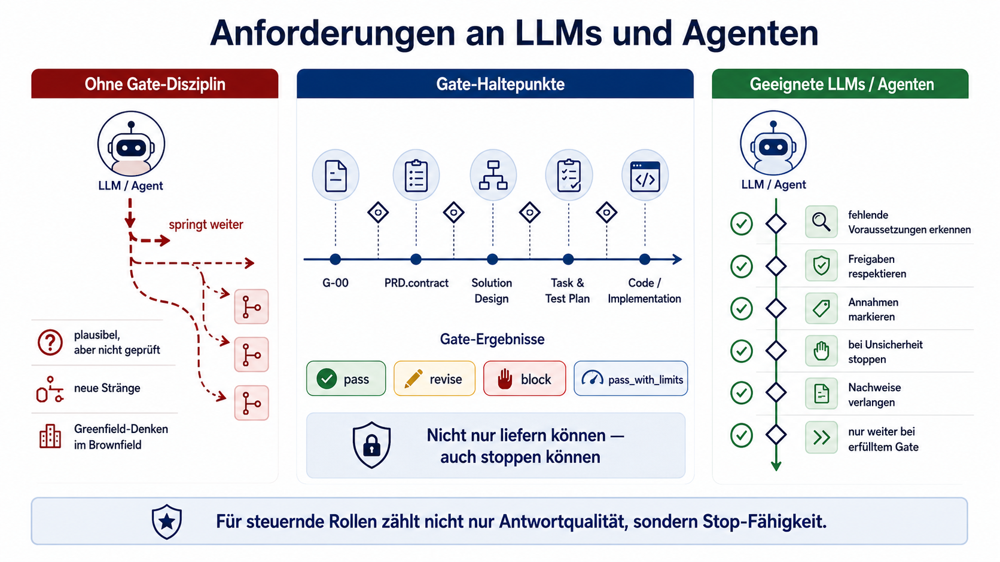

# 02 — Gates

Dieses Dokument beschreibt, wie Gates im Framework bewertet werden.

Der Überblick über das gesamte Modell steht in `01-framework-ueberblick.md`. Dieses Dokument erklärt nicht noch einmal
den gesamten Ablauf. Es beantwortet die operative Frage:

> Darf das Vorhaben verantwortbar in die nächste Phase wechseln, oder fehlt dafür noch etwas?

Ein Gate ist ein bewusster Haltepunkt mit einer expliziten Entscheidung: `pass`, `revise`, `block` oder
`pass_with_limits`.

Ein Gate prüft nicht, ob ein Artefakt schön formuliert ist. Es prüft, ob Grundlage, Freigabe, Annahmen, Risiken und
Nachweise ausreichen, um verantwortbar weiterzugehen.

---

## 1. Grundprinzip

Jedes Gate beantwortet fünf Fragen:

1. **Grundlage:** Worauf basiert die aktuelle Entscheidung?
2. **Freigabe:** Was ist bereits verbindlich freigegeben?
3. **Annahmen:** Welche Annahmen oder Unsicherheiten bestehen noch?
4. **Nachweise:** Welche Evidenz liegt vor, und was wurde nicht geprüft?
5. **Nächster Schritt:** Was darf als Nächstes passieren?

Wenn eine harte Voraussetzung fehlt oder eine offene Frage die nächste Phase fachlich unsicher macht, geht der Prozess
nicht stillschweigend weiter.

Das ist der praktische Kern von `fail closed`.

`fail closed` bedeutet nicht, dass jedes Detail perfekt sein muss. Es bedeutet:

- Unklarheiten werden sichtbar gemacht.
- Annahmen werden als Annahmen markiert.
- Fehlende Nachweise werden nicht als erledigt dargestellt.
- Harte Voraussetzungen werden nicht übersprungen.
- Spätere Artefakte dürfen frühere Entscheidungen nicht stillschweigend uminterpretieren.

---

## 2. Statusmodell

Jedes Gate endet mit genau einem Status.

| Status             | Bedeutung                                                                                                                              | Erlaubter nächster Schritt                                       |
|--------------------|----------------------------------------------------------------------------------------------------------------------------------------|------------------------------------------------------------------|
| `pass`             | Das Gate ist erfüllt. Die notwendigen Eingaben liegen vor, die Entscheidung ist nachvollziehbar, und keine harte Voraussetzung fehlt.  | Die nächste Phase darf beginnen.                                 |
| `revise`           | Das Gate ist noch nicht reif. Es fehlen Informationen, Präzisierungen, Nachweise oder eine bessere Abgrenzung.                         | Artefakt oder Klärung nacharbeiten und erneut prüfen.            |
| `block`            | Das Gate darf nicht passieren. Eine harte Voraussetzung fehlt, ein Widerspruch ist offen oder ein Risiko darf nicht übergangen werden. | Prozess anhalten, bis die Blockade entschieden oder behoben ist. |
| `pass_with_limits` | Das Gate ist nur eingeschränkt bestanden. Einschränkungen und Risiken sind explizit benannt und bewusst akzeptiert.                    | Nur der klar begrenzte nächste Schritt ist erlaubt.              |

### Regeln für `pass_with_limits`

`pass_with_limits` ist selten und darf nicht als bequemer Mittelweg verwendet werden.

Der Status ist nur zulässig, wenn:

- die Einschränkung konkret benannt ist,
- das verbleibende Risiko sichtbar ist,
- klar ist, was nicht geprüft wurde,
- der nächste Schritt eng begrenzt ist,
- keine harte Voraussetzung fehlt.

Beispiel:

```text
Gate: G-04 Implementation Entry
Status: pass_with_limits
Begründung: PRD, Design und Task & Test Plan liegen vor. Der E2E-Test kann erst in der Staging-Umgebung ausgeführt werden.
Limit: Nur Implementierung und lokale Tests erlaubt; keine Freigabe ohne Staging-Nachweis.
Next action: Implementierung starten, E2E-Nachweis vor Task Plan Review nachreichen.
```

---

## 3. Gute Gate-Entscheidungen

Eine Gate-Entscheidung muss nicht lang sein. Sie muss belastbar sein.

Jede Gate-Entscheidung sollte enthalten:

- Gate
- Status
- Entscheidungsgrundlage
- kurze Begründung
- offene Punkte oder Einschränkungen
- nächste Aktion

Beispiel:

```text
Gate: G-01 Product Requirements Doc
Status: revise
Grundlage: UR-1, PRD.draft v0.2
Begründung: Scope ist beschrieben, aber AC-3 und AC-4 sind noch nicht testbar.
Offen: AC-3 präzisieren; Reporting explizit als Out-of-Scope oder In-Scope entscheiden.
Next action: PRD überarbeiten und erneut gegen G-01 prüfen.
```

---

## 4. Anforderungen an LLMs und Agenten

Für dieses Framework reicht es nicht, dass ein Modell gute Antworten, plausible Pläne oder funktionierenden Code
erzeugt.

Coding-Fähigkeit ist nicht gleich Prozessfähigkeit.

Ein geeigneter Agent braucht zwei Fähigkeiten:

1. **Fachliche Gate-Prüfung**  
   Der Agent erkennt, ob Scope, Akzeptanzkriterien, Brownfield-Kontext, Risiken, Nachweise oder Freigaben fehlen oder
   widersprüchlich sind.

2. **Technische Gate-Durchsetzung**  
   Der Agent stoppt bei einem nicht erfüllten Gate, bevor Dateien geändert, Tools genutzt, Kommandos ausgeführt oder
   Deployment-Schritte gestartet werden.

Human-in-the-loop ersetzt diese Disziplin nicht. Menschen können prüfen, Rückfragen stellen und freigeben. Sie sollten
aber keinen bereits ungeordnet weitergelaufenen Agentenfluss nachträglich rekonstruieren müssen.



Ein Agent, der bei fehlenden Voraussetzungen trotzdem weiterplant, implementiert oder Ergebnisse als fertig darstellt,
ist für dieses Framework nicht als steuernder Agent geeignet. Er kann weiterhin unterstützend eingesetzt werden, etwa
für Recherche, Formulierungen, Variantenbildung, Code-Vorschläge oder Zusammenfassungen.

> Ein geeigneter Agent muss nicht nur liefern können. Er muss auch zuverlässig nicht liefern, wenn das Gate nicht
> erfüllt ist.

---

## 5. Universelle Gate-Regeln

Diese Regeln gelten für alle Gates.

### 5.1 Harte Blocker

Ein Gate muss auf `block` stehen, wenn eine dieser Situationen vorliegt:

- eine harte Voraussetzung fehlt,
- ein freigegebener Produktvertrag fehlt, obwohl er erforderlich ist,
- Scope oder Akzeptanzkriterien widersprechen sich,
- ein späteres Artefakt interpretiert ein früheres Artefakt stillschweigend um,
- Brownfield-Kontext wird ignoriert,
- bestehende Ownership ist unklar,
- neue Parallelstrukturen entstehen ohne Entscheidung,
- nicht verifizierte Annahmen werden als Fakten behandelt,
- Security, Datenschutz oder Compliance sind betroffen und ungeklärt,
- Qualität wird behauptet, aber nicht belegt.

### 5.2 Mindestprüfung vor jedem Weitergehen

Vor dem Wechsel in die nächste Phase muss klar sein:

- Was ist die verbindliche Grundlage?
- Was ist freigegeben?
- Welche Annahmen bestehen?
- Welche Risiken bleiben?
- Welche Nachweise liegen vor?
- Was wurde nicht geprüft?
- Was darf als Nächstes passieren?

Wenn diese Fragen nicht belastbar beantwortet werden können, ist das Gate nicht einfach bestanden.

### 5.3 Keine stillen Bedeutungsänderungen

Ein späteres Artefakt darf ein früheres Artefakt nicht stillschweigend verändern.

Beispiele:

- Ein Solution Design darf keine neue Produktsemantik einführen, die im PRD nicht angelegt ist.
- Ein Task & Test Plan darf keinen zusätzlichen Scope erzeugen.
- Eine Implementierung darf kein bestehendes Verhalten ändern, wenn diese Änderung nicht entschieden wurde.
- Ein QA-Report darf fehlende Evidenz nicht durch Plausibilität ersetzen.

Wenn sich Scope, Akzeptanzkriterien, Non-Goals, Produktsemantik, Security, Datenschutz oder Compliance-relevante
Annahmen ändern, braucht es eine bewusste Änderungsentscheidung.

---

## 6. Brownfield als Querschnittsregel

Brownfield ist kein Sonderthema am Rand.

Sobald ein Vorhaben bestehende Systeme, Produktlogik, Schnittstellen, Datenmodelle, Ownership, technische Schulden oder
Betriebsverhalten berührt, muss Brownfield früh sichtbar werden und über alle Gates hinweg nachgeführt werden.

Dafür gibt es zwei unterschiedliche Prüfungen:

1. **Brownfield Review nach G-00**  
   Frühe fachliche und systemische Orientierung, bevor das PRD entsteht.

2. **Task-level Brownfield Analysis vor G-04**  
   Konkrete operative Analyse pro Task, bevor implementiert wird.

Die frühe Prüfung verhindert, dass bereits das PRD auf einer falschen Greenfield-Annahme entsteht. Die spätere Prüfung
verhindert, dass die Umsetzung trotz gutem PRD und Design neue Drift, Parallelstrukturen oder falsche Ownership erzeugt.

Die Prüfung wird über die Gates hinweg konkreter:

| Station                        | Brownfield-Frage                                                                                             |
|--------------------------------|--------------------------------------------------------------------------------------------------------------|
| G-00                           | Könnte bestehender Systemkontext betroffen sein?                                                             |
| Brownfield Review              | Welche bestehende Logik, Ownership, Produktsemantik oder Systemgrenze muss vor dem PRD verstanden werden?    |
| G-01                           | Sind Auswirkungen auf Scope, Non-Goals, Risiken und Akzeptanzkriterien übersetzt?                            |
| G-02                           | Respektiert das Design bestehende Systemgrenzen, Ownership und Produktsemantik?                              |
| G-03                           | Sind Brownfield-Fragen in Tasks, Tests oder Review-Punkte überführt?                                         |
| Task-level Brownfield Analysis | Welche Artefakte sind pro Task betroffen, was kann wiederverwendet werden, und wo drohen Parallelstrukturen? |
| G-04                           | Darf die Umsetzung im bestehenden System starten?                                                            |
| Task Plan Review               | Wurde die geplante Reuse-Strategie tatsächlich eingehalten?                                                  |
| QA-Gate                        | Sind Auswirkungen, Regressionen und Nachweise ausreichend sichtbar?                                          |

Leitregel:

> Reuse before create.

Neue Artefakte, neue State-Pfade, neue Wrapper, neue Endpoints, neue Defaults oder parallele Verantwortlichkeiten
brauchen eine Begründung, wenn bestehende Verantwortung bereits vorhanden ist.

Brownfield blockiert nicht automatisch. Brownfield verlangt aber eine explizite Entscheidung darüber, wie bestehende
Struktur kontrolliert verändert wird.

---

## 7. Gate-Übersicht

Der typische Entscheidungsfluss sieht so aus:

```text
G-00 User Requirement
   ↓
Brownfield Review, falls bestehender Systemkontext betroffen sein könnte
   ↓
G-01 Product Requirements Doc
   ↓
G-02 Solution Design
   ↓
G-03 Task & Test Plan
   ↓
Task-level Brownfield Analysis, falls bestehender Systemkontext betroffen ist
   ↓
G-04 Implementation Entry
   ↓
Implementation Evidence
   ↓
Task Plan Review
   ↓
QA-Gate
```

Hinweis: Brownfield Review, Task-level Brownfield Analysis, Implementation Evidence und Task Plan Review sind
Prüfstationen mit Gate-Statuslogik. Sie müssen nicht zwingend als eigene Haupt-Gates nummeriert werden, sind aber
verbindliche Kontrollpunkte, sobald ihr Kontext zutrifft.

---

# Gate-Kriterien

## G-00 — User Requirement

G-00 prüft, ob aus einem Anliegen ein sinnvoller nächster Schritt werden kann.

Es geht noch nicht um PRD, Design oder Umsetzung. Es geht um Orientierung: Was ist das Problem, was ist das Ziel, wer
ist betroffen, welche Unsicherheiten sind sichtbar?

### Benötigte Eingaben

- Anliegen oder Problem
- gewünschtes Ziel
- betroffene Nutzer oder Rollen
- bekannte Constraints
- erkennbare Risiken
- offene Fragen

In Brownfield-Kontexten zusätzlich:

- Hinweise auf betroffene bestehende Systeme
- bekannte technische Schulden
- bestehende Produktlogik oder Ownership
- mögliche Schnittstellen, Datenmodelle oder Betriebsabhängigkeiten

### Entscheidungskriterien

**pass, wenn:**

- Problem und Ziel ausreichend verstanden sind,
- betroffene Nutzer oder Rollen erkennbar sind,
- wichtigste Constraints und Unsicherheiten sichtbar sind,
- klar ist, ob Brownfield wahrscheinlich betroffen ist,
- ein PRD sinnvoll vorbereitet werden kann.

**revise, wenn:**

- das Ziel nicht verständlich ist,
- Nutzer oder Betroffene unklar sind,
- das gewünschte Ergebnis mehrdeutig ist,
- wichtige Constraints fehlen,
- Brownfield-Auswirkungen wahrscheinlich sind, aber noch nicht grob eingeordnet wurden.

**block, wenn:**

- Ziele sich widersprechen,
- Verantwortung unklar ist,
- eine fachliche Richtungsentscheidung fehlt,
- Security, Datenschutz oder Compliance offensichtlich betroffen und ungeklärt sind,
- im Brownfield-Kontext unklar ist, welches bestehende Verhalten überhaupt gelten soll.

### Gate-Check

- Verstehen wir das Problem?
- Verstehen wir das Ziel?
- Wissen wir, wer betroffen ist?
- Sind die wichtigsten Unsicherheiten sichtbar?
- Ist klar, ob Brownfield betroffen ist?
- Muss vor dem PRD eine Richtungsentscheidung getroffen werden?

### Next action

Bei `pass`: Brownfield Review durchführen, falls bestehender Systemkontext betroffen sein könnte; sonst PRD
vorbereiten.  
Bei `revise`: Anliegen, Ziel oder Kontext nachschärfen.  
Bei `block`: Richtungsentscheidung oder Verantwortlichkeit klären, bevor ein PRD entsteht.

---

## Brownfield Review nach G-00

Der Brownfield Review liegt direkt nach G-00, sobald bestehender Systemkontext betroffen sein könnte.

Er ist noch keine implementierungsnahe Analyse. Er soll verhindern, dass das PRD auf einer falschen Greenfield-Annahme
entsteht.

Der Brownfield Review beantwortet die frühe Frage:

> Welche bestehende Logik, Ownership, Produktsemantik oder Systemgrenze müssen wir verstehen, bevor wir Anforderungen
> formulieren?

### Benötigte Eingaben

- Ergebnis aus G-00
- Hinweise auf betroffene Systeme, Module, Schnittstellen oder Prozesse
- bekannte technische Schulden oder fragile Bereiche
- vorhandene Produktlogik oder Ownership
- erkennbare Drift zwischen Dokumentation, Runtime-Verhalten und gewünschter Produktsemantik

### Entscheidungskriterien

**pass, wenn:**

- klar ist, welche bestehenden Systeme oder Verantwortlichkeiten wahrscheinlich betroffen sind,
- bestehendes Verhalten, das geschützt werden muss, grob benannt ist,
- relevante Brownfield-Risiken für das PRD sichtbar sind,
- offene Richtungsentscheidungen markiert sind,
- klar ist, welche Punkte in Scope, Non-Goals, Risiken oder Akzeptanzkriterien übersetzt werden müssen.

**revise, wenn:**

- mögliche Systembetroffenheit noch zu unklar ist,
- Ownership oder Produktsemantik nicht ausreichend verstanden wurde,
- relevante technische Schulden nur vermutet, aber nicht eingeordnet wurden,
- unklar ist, welche bestehenden Verhaltensweisen geschützt werden müssen.

**block, wenn:**

- unklar ist, welches bestehende Verhalten fachlich gelten soll,
- eine Source-of-Truth- oder Ownership-Frage vor dem PRD entschieden werden muss,
- Security, Datenschutz oder Compliance offensichtlich betroffen und ungeklärt sind,
- das PRD sonst wahrscheinlich eine falsche Produktsemantik festschreiben würde.

### Gate-Check

- Welche bestehenden Systeme, Module oder Prozesse könnten betroffen sein?
- Gibt es bestehendes Verhalten, das geschützt werden muss?
- Gibt es bekannte technische Schulden oder fragile Bereiche?
- Ist aktuelle Produktsemantik eindeutig?
- Gibt es Drift zwischen Dokumentation, Runtime und gewünschtem Verhalten?
- Muss vor dem PRD eine fachliche Richtungsentscheidung getroffen werden?

### Next action

Bei `pass`: PRD mit Brownfield-Erkenntnissen vorbereiten.  
Bei `revise`: Brownfield-Kontext grob nachklären.  
Bei `block`: fachliche Richtungs-, Ownership- oder Source-of-Truth-Entscheidung treffen.

---

## G-01 — Product Requirements Doc

G-01 prüft, ob ein belastbarer Produktvertrag vorliegt.

Das `Product Requirements Doc` ist der zentrale Anker für Scope, Akzeptanzkriterien, Non-Goals, Constraints und
Erfolgskriterien. Es beschreibt nicht jede spätere Lösung im Detail. Es legt fest, was fachlich gelten soll.

### Benötigte Eingaben

- Ergebnis aus G-00
- geklärtes Problem und Ziel
- Scope und Out-of-Scope
- Akzeptanzkriterien
- Non-Goals
- relevante Constraints
- Annahmen und Risiken
- Brownfield-Erkenntnisse aus G-00, falls vorhanden

### Entscheidungskriterien

**pass, wenn:**

- das PRD vollständig genug, widerspruchsfrei und freigegeben ist,
- Scope und Out-of-Scope klar getrennt sind,
- Akzeptanzkriterien testbar formuliert sind,
- Non-Goals sichtbar sind,
- relevante Constraints, Annahmen und Risiken markiert sind,
- Brownfield-Erkenntnisse in Scope, Risiken oder Akzeptanzkriterien übersetzt wurden.

**revise, wenn:**

- Akzeptanzkriterien nicht testbar sind,
- Scope oder Out-of-Scope unscharf sind,
- Non-Goals fehlen,
- Annahmen nicht markiert sind,
- Risiken aus G-00 nicht aufgenommen wurden,
- Brownfield-Kontext erkannt, aber nicht fachlich übersetzt wurde.

**block, wenn:**

- Scope widersprüchlich ist,
- eine fachliche Entscheidung fehlt,
- regulatorische, sicherheitsrelevante oder datenschutzrelevante Fragen offen sind,
- das PRD bestehendes Verhalten verändern würde, ohne dass diese Änderung bewusst entschieden wurde,
- keine verbindliche Freigabe für den Produktvertrag vorliegt.

### Gate-Check

- Ist klar, was gebaut oder geändert werden soll?
- Ist klar, was nicht gebaut oder geändert werden soll?
- Sind die Akzeptanzkriterien prüfbar?
- Sind Annahmen und Risiken sichtbar?
- Ist der Brownfield-Kontext berücksichtigt?
- Liegt eine Freigabe für das PRD vor?

### Next action

Bei `pass`: Solution Design erstellen.  
Bei `revise`: PRD nachschärfen und erneut prüfen.  
Bei `block`: fehlende Entscheidung oder Freigabe einholen, bevor Design entsteht.

---

## G-02 — Solution Design

G-02 prüft, ob es ein tragfähiges Lösungskonzept gibt.

Das Solution Design beschreibt, wie das PRD konzeptionell erfüllt werden soll. Es bleibt auf Design-Ebene. Es ist keine
Implementierungsanleitung.

### Benötigte Eingaben

- freigegebenes PRD
- relevante Constraints
- bekannte Risiken
- Brownfield-Kontext, falls vorhanden
- Architektur- oder Systemhinweise

### Entscheidungskriterien

**pass, wenn:**

- das Design nachvollziehbar auf das PRD zurückführt,
- wesentliche Lösungsentscheidungen erklärt sind,
- Komponenten und Verantwortlichkeiten verständlich sind,
- Schnittstellen und Datenflüsse konzeptionell beschrieben sind,
- Sicherheits-, Datenschutz-, Betriebs- und Observability-Aspekte berücksichtigt sind,
- relevante Trade-offs sichtbar sind,
- bestehende Systemgrenzen respektiert werden.

**revise, wenn:**

- Traceability zum PRD fehlt,
- Verantwortlichkeiten unklar sind,
- Trade-offs nicht erklärt werden,
- Brownfield-Risiken nicht berücksichtigt sind,
- bestehende Systemgrenzen ignoriert werden,
- das Design bereits implementierungsnahe Details enthält.

**block, wenn:**

- kein freigegebenes PRD vorliegt,
- das Design Akzeptanzkriterien oder Non-Goals widerspricht,
- das Design Produktsemantik ohne Change-Entscheidung verändert,
- Security, Datenschutz oder Compliance ungeklärt sind,
- eine Architekturentscheidung mit hoher Auswirkung fehlt.

### Gate-Check

- Führt das Design auf das PRD zurück?
- Sind Komponenten und Verantwortlichkeiten verständlich?
- Sind Schnittstellen und Datenflüsse passend abstrakt beschrieben?
- Werden bestehende Systemgrenzen respektiert?
- Bleibt das Design konzeptionell?
- Sind Risiken und Trade-offs sichtbar?

### Next action

Bei `pass`: Task & Test Plan erstellen.  
Bei `revise`: Design klären oder abstrahieren.  
Bei `block`: fehlende Grundlage oder Richtungsentscheidung klären.

---

## G-03 — Task & Test Plan

G-03 prüft, ob aus Produktvertrag und Design ein steuerbarer Umsetzungsplan entstanden ist.

Der Task & Test Plan verbindet Arbeitspakete mit Testbarkeit. Er beschreibt nicht nur, was getan werden soll, sondern
auch, warum es getan werden soll und wie später geprüft wird, ob es erledigt ist.

### Benötigte Eingaben

- freigegebenes PRD
- abgeschlossenes Solution Design
- Akzeptanzkriterien
- relevante Risiken
- Brownfield-Kontext, falls vorhanden

### Entscheidungskriterien

**pass, wenn:**

- Tasks nachvollziehbar aus PRD und Design abgeleitet sind,
- jede relevante Aufgabe einen Zweck hat,
- Akzeptanzkriterien ausreichend durch Tests oder Nachweise abgedeckt sind,
- Abhängigkeiten und Reihenfolge sichtbar sind,
- Risiken in Tasks, Tests oder Review-Punkte übersetzt wurden,
- Brownfield-Fragen für die spätere Analyse identifiziert sind.

**revise, wenn:**

- Tasks keinen klaren Bezug zu Anforderungen, Design, Risiko oder Qualitätsziel haben,
- Akzeptanzabdeckung fehlt oder unklar ist,
- Tests für relevante Akzeptanzkriterien fehlen,
- Reihenfolge oder Abhängigkeiten unklar sind,
- Risiken nicht in Tasks, Tests oder Review-Punkte übersetzt wurden,
- Brownfield-Kontext nicht in eine spätere Analyse überführt wurde.

**block, wenn:**

- kein freigegebenes PRD vorliegt,
- kein tragfähiges Solution Design vorliegt,
- Akzeptanzkriterien nicht prüfbar sind,
- eine zentrale Brownfield-Frage offen ist,
- der Task Plan Arbeit außerhalb des freigegebenen Scope enthält.

### Gate-Check

- Hat jede relevante Aufgabe einen Zweck?
- Führt jede Aufgabe auf PRD, Design, Risiko oder Qualitätsziel zurück?
- Sind Akzeptanzkriterien abgedeckt?
- Sind Tests oder Nachweise benannt?
- Sind Abhängigkeiten sichtbar?
- Ist klar, wann eine Aufgabe fertig ist?

### Next action

Bei `pass`: Task-level Brownfield Analysis durchführen, falls bestehender Systemkontext betroffen ist; sonst G-04
prüfen. Bei `revise`: Task & Test Plan nachschärfen. Bei `block`: Scope-, Design- oder Brownfield-Entscheidung klären.

---

## Task-level Brownfield Analysis vor G-04

In Brownfield-Kontexten reicht der frühe Brownfield Review aus G-00 nicht aus.

Vor der Implementierung braucht es eine konkrete Brownfield Analysis. Sie prüft pro Task, welche bestehenden Artefakte
betroffen sind, was bereits vorhanden ist, welche Reuse-Strategie sinnvoll ist und ob neue Parallelstrukturen drohen.

Diese Prüfung liegt zwischen G-03 und G-04.

Sie beantwortet die operative Frage:

> Wie setzen wir den genehmigten Task & Test Plan im bestehenden System sauber und minimal-invasiv um?

### Benötigte Eingaben

- freigegebenes PRD
- abgeschlossenes Solution Design
- abgeschlossener Task & Test Plan
- relevante Repository-, System-, Runtime- oder Dokumentationsinformationen
- bekannte technische Schulden oder fragile Bereiche

### Entscheidungskriterien

**pass, wenn:**

- relevante bestehende Artefakte identifiziert sind,
- vorhandene Verantwortung und Ownership verstanden wurden,
- Reuse, Erweiterung, Refactoring oder Neuanlage begründet sind,
- Regressionen und Testbedarf sichtbar sind,
- der minimal-invasive Pfad fachlich und technisch begründet ist.

**revise, wenn:**

- relevante Module oder Artefakte nicht geprüft wurden,
- aktuelle Teilabdeckung unklar ist,
- bestehende Ownership nicht verstanden wurde,
- Test- oder Regressionsbedarf offen ist,
- der minimal-invasive Pfad nicht begründet ist.

**block, wenn:**

- Implementierung wahrscheinlich neue Drift oder Parallelstrukturen erzeugen würde,
- ein neues Artefakt trotz vorhandener Verantwortung geplant ist,
- ein zweiter State-, Render-, Recovery- oder Policy-Pfad entstehen würde,
- eine Source-of-Truth-Frage offen ist,
- eine Änderung bestehendes Verhalten brechen würde, ohne dass dies entschieden wurde.

### Gate-Check

- Welche bestehenden Artefakte sind betroffen?
- Was ist bereits vollständig oder teilweise vorhanden?
- Was wird wiederverwendet, erweitert, refaktoriert oder neu angelegt?
- Welche Regressionen können entstehen?
- Drohen Parallelstrukturen?
- Ist der Eingriff minimal-invasiv im fachlich sauberen Sinn?

### Next action

Bei `pass`: G-04 Implementation Entry prüfen.  
Bei `revise`: Bestandsanalyse vertiefen.  
Bei `block`: Ownership-, Produktsemantik- oder Reuse-Entscheidung treffen.

---

## G-04 — Implementation Entry

G-04 prüft, ob die Umsetzung auf einer freigegebenen, nachvollziehbaren und ausreichend geprüften Grundlage starten
darf.

G-04 entscheidet nicht, ob das Ergebnis fertig ist. G-04 entscheidet, ob Implementierung verantwortbar beginnen darf.

### Benötigte Eingaben

- freigegebenes PRD
- abgeschlossenes Solution Design
- abgeschlossener Task & Test Plan
- Brownfield Analysis, falls bestehender Codebestand betroffen ist
- klare Zuständigkeit für Umsetzung, Tests und Nachweise

### Entscheidungskriterien

**pass, wenn:**

- alle harten Voraussetzungen erfüllt sind,
- die Umsetzung durch PRD, Design und Task & Test Plan gedeckt ist,
- Brownfield Analysis abgeschlossen ist, falls erforderlich,
- bekannte Risiken und Nachweispflichten sichtbar sind,
- klar ist, welche Tests, Checks oder Evidenzen nach der Umsetzung erwartet werden.

**revise, wenn:**

- Nachweispflichten unklar sind,
- einzelne Tasks nicht eindeutig umsetzbar sind,
- Brownfield-Reuse noch nicht ausreichend konkret ist,
- Zuständigkeiten für Tests oder Checks fehlen,
- offene Punkte markiert, aber noch nacharbeitbar sind.

**block, wenn:**

- PRD, Design oder Task & Test Plan fehlen,
- das PRD nicht freigegeben ist,
- die Umsetzung Scope überschreiten würde,
- Security, Datenschutz oder Compliance ungeklärt sind,
- Brownfield-Fragen mit hoher Auswirkung offen sind,
- Implementierung wahrscheinlich ungeklärte Parallelstrukturen erzeugen würde.

### Gate-Check

- Ist der Produktvertrag freigegeben?
- Sind Design und Task & Test Plan abgeschlossen?
- Ist Brownfield geklärt, falls relevant?
- Ist klar, was umgesetzt werden darf?
- Ist klar, was nicht umgesetzt werden darf?
- Ist klar, welche Nachweise nach Umsetzung erforderlich sind?

### Next action

Bei `pass`: Implementierung starten.  
Bei `pass_with_limits`: nur den begrenzten Implementierungsschritt ausführen.  
Bei `revise`: Grundlage oder Nachweispflichten nachschärfen.  
Bei `block`: fehlende Freigabe oder harte Voraussetzung einholen.

---

## Implementation Evidence

Nach der Umsetzung müssen Code, Tests und Nachweise sichtbar gemacht werden.

Implementation Evidence ist kein Ersatz für QA. Sie ist die Nachweisgrundlage für Task Plan Review und QA-Gate.

### Muss enthalten

- geänderte Dateien oder Artefakte
- Zuordnung zu Tasks
- ausgeführte Tests und Checks
- Ergebnis der Tests und Checks
- nicht ausgeführte Prüfungen
- bekannte Lücken oder Risiken
- relevante Screenshots, Logs, Build-Ergebnisse oder Runtime-Evidenz, falls Verhalten nur so belegbar ist

### Regeln

- „Fertig“ darf nicht behauptet werden, wenn Evidenz fehlt.
- Ein grüner Build beweist keine vollständige Task-Erfüllung.
- Nicht ausgeführte Prüfungen müssen als `NOT_VERIFIED` sichtbar bleiben.
- Out-of-Scope-Änderungen müssen dokumentiert werden.
- Abweichungen vom Task & Test Plan müssen markiert werden.

---

## Task Plan Review nach G-04

Nach der Implementierung sollte nicht direkt zur finalen QA gesprungen werden.

Zuerst braucht es einen Task Plan Review.

Der Task Plan Review prüft, ob die Umsetzung den genehmigten Task & Test Plan tatsächlich erfüllt. Dabei wird jede
relevante `task_id` einzeln betrachtet.

Der Task Plan Review ist keine finale QA-Entscheidung. Er beantwortet eine engere Frage:

> Wurde das umgesetzt, was im genehmigten Task & Test Plan vorgesehen war?

### Benötigte Eingaben

- genehmigter Task & Test Plan
- Implementation Evidence
- Test- und Check-Ergebnisse
- bekannte Abweichungen
- offene Punkte oder nicht verifizierte Nachweise

### Entscheidungskriterien

**pass, wenn:**

- alle relevanten Tasks vollständig erfüllt sind,
- Acceptance Criteria pro Task bewertet wurden,
- belastbare Evidenz vorliegt,
- Abweichungen dokumentiert und akzeptiert sind,
- keine zentrale Task-Lücke offen ist.

**revise, wenn:**

- Tasks teilweise erfüllt sind,
- Evidenz fehlt,
- Acceptance Criteria nur teilweise erfüllt sind,
- UI-, State-, Render- oder Runtime-Verhalten nicht belegt ist,
- Tests vorhanden sind, aber nicht zur Aufgabe passen,
- der Build grün ist, aber das Task-Ziel nicht vollständig erfüllt wurde,
- Out-of-Scope-Änderungen geklärt werden müssen.

**block, wenn:**

- wichtige Tasks nicht erledigt sind,
- ein kritisches Akzeptanzkriterium fehlt,
- Evidenz für zentrales Verhalten fehlt,
- die Umsetzung wesentlich vom genehmigten Task Plan abweicht,
- nicht entschieden ist, ob eine Abweichung akzeptiert werden darf.

### Gate-Check

- Wurde jede relevante `task_id` einzeln geprüft?
- Ist der Status pro Task klar: vollständig, teilweise oder nicht erledigt?
- Sind Acceptance Criteria pro Task bewertet?
- Gibt es belastbare Evidenz?
- Sind Abweichungen dokumentiert?
- Welche Lücken gehen an QA?

### Next action

Bei `pass`: QA-Gate vorbereiten.  
Bei `revise`: fehlende Task-Erfüllung oder Evidenz nacharbeiten.  
Bei `block`: zentrale Task-Lücke oder Abweichung entscheiden.

---

## QA-Gate

QA prüft die Lieferfähigkeit des Ergebnisses.

Es geht nicht nur darum, ob Code vorhanden ist oder ob einzelne Tests grün sind. QA bewertet, ob das Ergebnis mit den
vorhandenen Nachweisen verantwortbar freigegeben werden kann.

QA ist nicht der Ort, um fehlenden Scope, unklare Produktsemantik oder ungeklärte Brownfield-Entscheidungen nachträglich
zu verstecken.

### Benötigte Eingaben

- Implementation Evidence
- Test- und Check-Ergebnisse
- Task Plan Review
- bekannte Defects
- offene Risiken
- nicht verifizierte Punkte
- relevante Freigaben oder Risikoakzeptanzen

### Entscheidungskriterien

**pass, wenn:**

- relevante Akzeptanzkriterien erfüllt sind,
- Nachweise ausreichend und nachvollziehbar sind,
- keine offenen Risiken eine Freigabe verhindern,
- bekannte Defects akzeptiert oder behoben sind,
- nicht verifizierte Punkte keine harte Freigabevoraussetzung betreffen,
- Brownfield-Auswirkungen und Regressionen ausreichend geprüft sind.

**revise, wenn:**

- Korrekturen nötig sind,
- weitere Nachweise fehlen,
- Defects offen sind, aber behebbar erscheinen,
- nicht verifizierte Punkte nachgereicht werden müssen,
- Risikoakzeptanz noch dokumentiert werden muss.

**block, wenn:**

- kritische Defects offen sind,
- Nachweise für wichtige Akzeptanzkriterien fehlen,
- ein nicht akzeptiertes Risiko besteht,
- Compliance-, Datenschutz- oder Sicherheitsprobleme offen sind,
- das Ergebnis nicht verantwortbar freigegeben werden darf.

### Gate-Check

- Sind alle relevanten Akzeptanzkriterien bewertet?
- Sind Tests und Checks nachvollziehbar?
- Sind Defects sichtbar?
- Sind offene Risiken akzeptiert oder blockierend?
- Sind nicht verifizierte Punkte markiert?
- Ist die Lieferung verantwortbar freigabefähig?

### Next action

Bei `pass`: Ergebnis freigeben oder in den nächsten Release-Schritt überführen.  
Bei `revise`: Defects, Nachweise oder Risikoentscheidungen nacharbeiten.  
Bei `block`: Freigabe stoppen, bis der Blocker behoben oder bewusst entschieden ist.

---

## Verhältnis zu Tooling

Die Gates ersetzen keine Werkzeuge wie Jira, Azure DevOps, GitHub Issues, Pull Requests oder CI/CD.

Sie erklären, welche Entscheidung ein Werkzeug unterstützen soll.

Ein Jira-Ticket kann zeigen, woran gearbeitet wird. Ein Pull Request kann zeigen, was geändert wurde. Eine Pipeline kann
zeigen, welche Checks gelaufen sind.

Das Gate beantwortet die Frage, ob diese Informationen zusammen ausreichen, um verantwortbar weiterzugehen.

Toolzugriff ersetzt keine Gate-Entscheidung.

Ein Agent darf nicht nur deshalb weiterarbeiten, weil er ein Ticket lesen, einen Branch öffnen oder eine Pipeline
starten kann. Er muss prüfen, ob die Voraussetzungen des jeweiligen Gates erfüllt sind.

MCP oder vergleichbare Integrationen sollten deshalb nicht als direkter Autopilot verstanden werden, sondern als
kontrollierte Verbindung zwischen Agent und Werkzeuglandschaft.

Das Ziel ist nicht:

> Der Agent kann alles ausführen.

Sondern:

> Der Agent kann die richtigen Nachweise lesen, die richtigen Aktionen auslösen und an Gate-Haltepunkten zuverlässig
> stoppen.

Tool-Integrationen müssen governance-fähig sein:

- klare Berechtigungen,
- nachvollziehbare Aktionen,
- begrenzte Schreibrechte,
- Audit Logs,
- Trennung zwischen Lesen, Vorschlagen, Ändern und Freigeben.

---

## Kurzform für die Anwendung

Diese Kurzform kann als Operator-Checkliste verwendet werden.

```text
Gate: <Gate-Name>
Status: pass | revise | block | pass_with_limits
Grundlage: <Artefakte, Versionen, Evidenz>
Begründung: <kurz und belastbar>
Offen / Limits: <nur wenn vorhanden>
Next action: <eindeutiger nächster Schritt>
```

### Minimalfragen

Vor jedem Weitergehen:

- Ist die Grundlage klar?
- Ist die nötige Freigabe vorhanden?
- Sind Annahmen markiert?
- Sind Risiken sichtbar?
- Sind Nachweise vorhanden?
- Ist klar, was nicht geprüft wurde?
- Ist der nächste Schritt erlaubt?

Wenn nicht, ist das Gate nicht `pass`.

---

## Nächster Schritt

Als nächstes sollten die Artefakte detaillierter beschrieben werden.

Das nächste Dokument ist daher:

[`03-artefakte.md`](docs/03-artefakte.md)