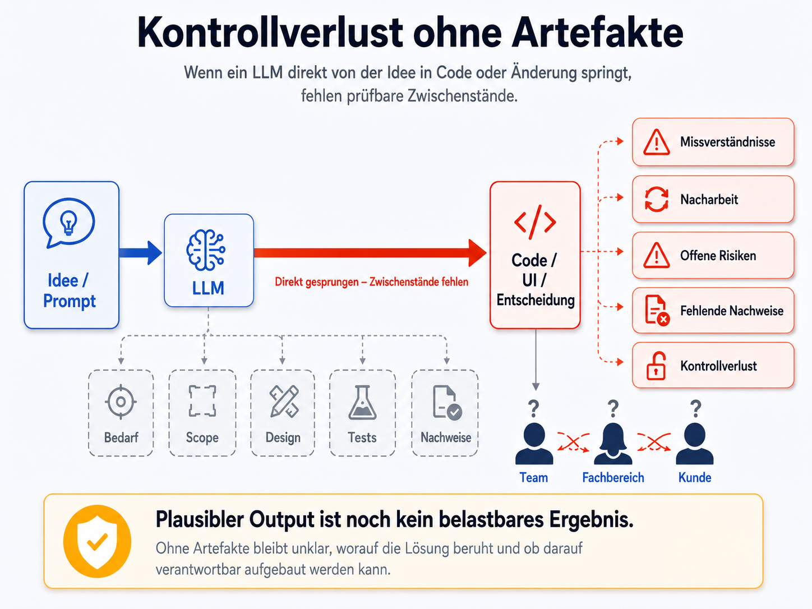
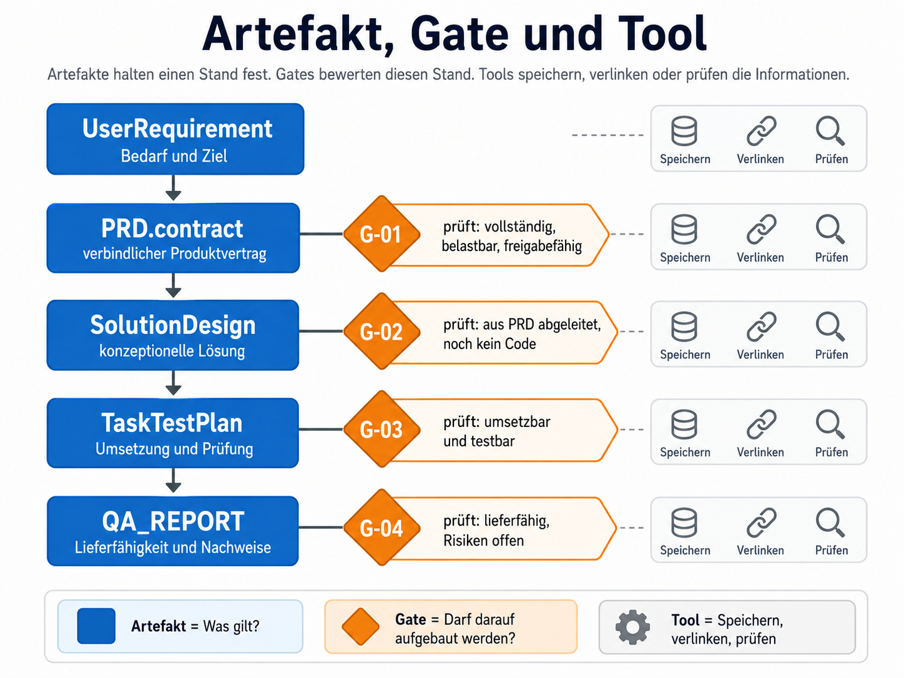
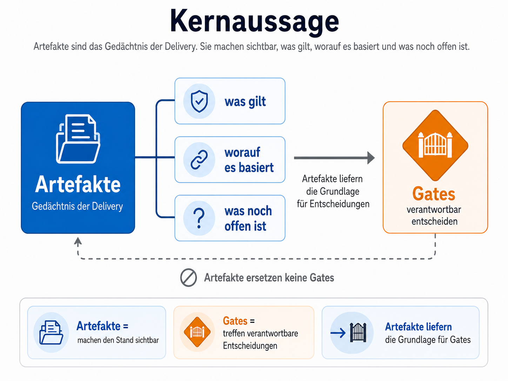

# 03 - Artefakte

Hier geht es um die Frage:

Was muss ein Artefakt enthalten, damit es als Grundlage für die nächste Entscheidung taugt?

Mit anderen Worten: Artefakte sollen verhindern, dass ein LLM direkt von einer Idee in Code springt. Sie zwingen dazu,
Bedarf, Produktvertrag, Design, Tests und Nachweise als getrennte Arbeitsstände sichtbar zu machen.

Dadurch können Gates nicht nur den erzeugten Output bewerten, sondern auch die Grundlage, auf der dieser Output
entstanden ist.

## Grundidee

In der praktischen Arbeit mit LLMs zeigt sich ein wiederkehrendes Muster:

Aus demselben Prompt entstehen oft ähnliche Ergebnisse. Sie wirken plausibel und sind häufig brauchbar. Trotzdem ist
nicht immer klar, ob sie auf denselben Annahmen, demselben Scope und demselben fachlichen Stand beruhen.

Diese Beobachtung zeigt sich auch bei aktuellen Coding-Agenten. Werkzeuge wie Claude Code trennen Planung und Ausführung
zunehmend deutlicher. Ein eingebauter Plan-Modus hilft dabei, nicht sofort in die Umsetzung zu springen.

Ein Plan allein ist aber noch kein belastbares Artefakt. Er wird erst dann tragfähig, wenn er gespeichert, versioniert,
referenziert und später gegen Anforderungen, Design, Tests oder Nachweise geprüft werden kann.

Viele KI-Initiativen scheitern vermutlich nicht daran, dass das Modell keinen Output erzeugt. Output entsteht schnell.
Das Problem beginnt dort, wo dieser Output zu früh als belastbares Ergebnis behandelt wird.

Besonders kritisch wird es, wenn KI-generierter Code vor allem als kurzfristiger Produktivitätsgewinn verstanden wird.
Dann entsteht schnell der Eindruck, man könne mit weniger Menschen denselben oder sogar mehr Output erzeugen.

In der Praxis kann das kippen: Erst werden Rollen reduziert, weil KI vermeintlich Arbeit ersetzt. Wenige Wochen später
wird deutlich, dass weiterhin Menschen gebraucht werden, die Anforderungen klären, Annahmen prüfen, Artefakte pflegen,
KI-Ergebnisse bewerten und die Verantwortung für das Ergebnis übernehmen können.

Das Problem ist dann nicht fehlende KI-Leistung. Das Problem ist ein verkürztes Verständnis davon, was Software Delivery
mit KI tatsächlich erfordert.

Entscheidend bleibt nicht nur, wie viel Code mit KI entsteht. Entscheidend ist, ob dieser Code den Bedarf erfüllt, auf
einem klaren Scope beruht und gegen nachvollziehbare Anforderungen geprüft wurde.

Andernfalls entsteht eine Lücke zwischen plausibler Lösung und belastbarem Ergebnis. In der Zusammenarbeit mit Kunden,
Fachbereichen oder internen Teams führt genau diese Lücke zu Missverständnissen, Nacharbeit und Kontrollverlust.

Wenn ein LLM direkt von der Idee in Code, Konzept oder Entscheidung springt, fehlen oft stabile Zwischenstände: Bedarf,
Scope, Annahmen, Design, Tests und Nachweise.

Genau hier setzt die Idee dieses Frameworks an: weg vom flüchtigen Dialog mit dem Modell, hin zu persistenten
Artefakten, die einen prüfbaren Arbeitsstand festhalten.

Ein Artefakt macht sichtbar:

* worum es fachlich oder technisch geht
* was entschieden wurde
* worauf die Entscheidung basiert
* welche Annahmen gelten
* welche Risiken offen sind
* welche Nachweise vorliegen
* welche Version gültig ist

Ein Artefakt ist deshalb nicht bloß Dokumentation nach der Umsetzung. Es ist ein prüfbarer Zwischenstand, auf dem
weitere Arbeitsschritte aufbauen dürfen.

Mit anderen Worten: Artefakte helfen zu verhindern, dass ein LLM direkt von einer Idee in Code springt. Sie machen
Bedarf, Produktvertrag, Design, Tests und Nachweise als getrennte Arbeitsstände sichtbar.

Dadurch können Gates nicht nur den erzeugten Output bewerten, sondern auch die Grundlage, auf der dieser Output
entstanden ist.

Damit wird aus einem plausiblen Modelloutput ein nachvollziehbarer Arbeitsstand.

## Artefakt und Gate

Artefakte und Gates haben unterschiedliche Aufgaben.

Ein Artefakt hält einen konkreten Arbeitsstand fest.
Ein Gate prüft, ob dieser Stand tragfähig genug für die weitere Arbeit ist.

Beispiele:

* Das `PRD.contract` ist der verbindliche Produktvertrag.
* `G-01` prüft, ob dieser Vertrag vollständig, belastbar und freigabefähig ist.
* Das `SolutionDesign` zeigt die konzeptionelle Lösung.
* `G-02` prüft, ob dieses Design sauber aus dem Produktvertrag abgeleitet ist und noch keine Implementierung
  vorwegnimmt.

Damit bleibt die Trennung klar:

* Artefakte liefern die fachliche oder technische Grundlage.
* Gates bewerten diese Grundlage.
* Tools speichern, verlinken oder prüfen Informationen.

Kurz gesagt:

Artefakte zeigen, was gilt.
Gates entscheiden, ob darauf aufgebaut werden darf.

## Gemeinsame Struktur

Jedes Artefakt besteht aus drei Bereichen:

| Bereich    | Zweck                                           |
|------------|-------------------------------------------------|
| `meta`     | Identität, Version, Status, Hash und Referenzen |
| `content`  | fachlicher oder technischer Inhalt              |
| `approval` | Review- oder Freigabestatus, falls erforderlich |

Die normale Arbeitsform ist Markdown.

JSON ist optional. Es kann für Export, Automatisierung oder Audit sinnvoll sein, ersetzt aber nicht die lesbare Fassung.

## Pflichtfelder in `meta`

Jedes Artefakt braucht stabile Metadaten.

| Feld         | Bedeutung                                 |
|--------------|-------------------------------------------|
| `id`         | stabile Artefakt-ID, zum Beispiel `PRD-1` |
| `version`    | Version, zum Beispiel `0.1.0`             |
| `status`     | aktueller Stand                           |
| `created_at` | Erstellzeitpunkt                          |
| `updated_at` | letzter Änderungszeitpunkt                |
| `hash`       | Hash des Inhalts                          |
| `refs`       | Referenzen auf andere Artefakte           |

Der Hash bezieht sich auf `content`, nicht auf `meta` oder `approval`.

So bleibt sichtbar, ob sich der fachliche oder technische Inhalt geändert hat.

## Status eines Artefakts

Ein Artefakt kann folgende Status haben:

| Status     | Bedeutung                       |
|------------|---------------------------------|
| `draft`    | in Arbeit                       |
| `contract` | fachlich stabiler Vertragsstand |
| `approved` | geprüft und freigegeben         |

Wichtig:

`contract` bedeutet nicht, dass spätere Gates automatisch bestanden sind. Es bedeutet nur, dass dieser Artefaktstand als
verbindliche Grundlage dienen kann.

## Referenzen

Ein Artefakt muss zeigen, worauf es basiert.

Beispiele:

| Artefakt         | Muss verweisen auf                        |
|------------------|-------------------------------------------|
| `PRD.contract`   | `UserRequirement`                         |
| `SolutionDesign` | `PRD.contract`                            |
| `TaskTestPlan`   | `PRD.contract` und meist `SolutionDesign` |
| `QA_REPORT`      | `ImplementationEvidence` und Task Review  |

Eine Referenz sollte mindestens enthalten:

* `id`
* `version`
* `hash`
* `role`

## Artefaktarten

### UserRequirement

Das `UserRequirement` beschreibt den Bedarf am Anfang.

Es ist noch kein Produktvertrag.

Es sollte enthalten:

* Problem
* Ziel
* betroffene Nutzer oder Rollen
* erste Scope-Idee
* erkennbare Constraints
* kritische Unklarheiten
* Annahmen
* erste Brownfield-Hinweise, falls relevant

Das `UserRequirement` darf kein Design und keine Implementierungsanleitung enthalten.

### PRD.draft

Das `PRD.draft` ist der Arbeitsstand für Anforderungen.

Es sammelt die fachlichen Inhalte, die später in den Produktvertrag eingehen können.

Es sollte enthalten:

* Problem und Ziel
* Zielgruppe
* User Stories oder vergleichbare Bedarfssätze
* funktionale Anforderungen
* nichtfunktionale Anforderungen
* Akzeptanzkriterien
* Scope
* Out-of-Scope
* Non-Goals
* Erfolgsmessung
* Constraints
* Annahmen
* Risiken

Das `PRD.draft` darf offen und unvollständig sein. Unklare Punkte müssen sichtbar markiert werden.

### PRD.contract

Das `PRD.contract` ist der verbindliche Produktvertrag.

Es ist die wichtigste fachliche Grundlage für alle späteren Artefakte.

Es muss enthalten:

* verbindlichen Scope
* verbindliches Out-of-Scope
* testbare Akzeptanzkriterien
* Non-Goals
* relevante Constraints
* Erfolgskriterien
* bekannte Annahmen
* bekannte Risiken
* Freigabestatus

Nachgelagerte Artefakte dürfen den Produktvertrag nicht stillschweigend verändern.

Änderungen an Scope, Akzeptanzkriterien oder Non-Goals brauchen eine dokumentierte Änderung.

### SolutionDesign

Das `SolutionDesign` beschreibt die Lösung auf Design-Ebene.

Es zeigt, wie der Produktvertrag konzeptionell erfüllt werden soll.

Es sollte enthalten:

* Architekturüberblick
* Komponenten
* Verantwortlichkeiten
* Datenflüsse
* Schnittstellen auf konzeptioneller Ebene
* relevante Sicherheitsaspekte
* Datenschutzaspekte
* Observability-Aspekte
* wichtige Entscheidungen mit Begründung
* Brownfield-Bezug, falls relevant

Das `SolutionDesign` darf keine Implementierung vorwegnehmen.

Nicht erlaubt sind:

* vollständige Runtime-Payloads
* vollständige Request- oder Response-Bodies
* vollständige JSON-Schemas
* Datenbankmigrationen
* konkrete Algorithmen
* Schritt-für-Schritt-Anleitungen zur Umsetzung

### TaskTestPlan

Der `TaskTestPlan` verbindet Umsetzung und Prüfung.

Er zeigt, welche Arbeitspakete aus Produktvertrag und Design abgeleitet werden und wie sie geprüft werden.

Er sollte enthalten:

* Tasks
* Zweck jedes Tasks
* Bezug zu Anforderungen oder Risiken
* Bezug zu Akzeptanzkriterien
* Abhängigkeiten
* Reihenfolge, falls relevant
* Testmatrix
* Testarten
* Testdaten
* negative Tests
* Review-Punkte
* Brownfield-Prüfpunkte, falls relevant

Ein Task ohne Bezug zu Anforderung, Design, Risiko oder Qualitätsziel braucht eine Begründung.

Ein Akzeptanzkriterium ohne Test oder Nachweis ist eine Lücke.

### QA_REPORT

Der `QA_REPORT` bewertet die Lieferfähigkeit.

Er nutzt vorhandene Nachweise und macht sichtbar, ob das Ergebnis freigegeben werden kann.

Er sollte enthalten:

* kurze Zusammenfassung
* Bewertung pro Task
* Bewertung relevanter Akzeptanzkriterien
* Nachweise
* offene Defects
* offene Risiken
* nicht verifizierte Punkte
* Gesamtbewertung

Der QA-Report darf fehlende Nachweise nicht durch Plausibilität ersetzen.

## Brownfield-Hinweise in Artefakten

Brownfield ist kein eigenes Artefakt nur für große Altsysteme.

Sobald bestehende Systeme betroffen sind, müssen Artefakte zeigen:

* welche bestehenden Module betroffen sind
* welches Verhalten geschützt werden muss
* welche Ownership gilt
* was wiederverwendet wird
* was erweitert wird
* was neu entsteht
* wo Parallelstrukturen drohen
* welche Regressionen möglich sind

Diese Hinweise werden je nach Gate konkreter.

Im `UserRequirement` reicht eine frühe Einordnung.
Im `TaskTestPlan` muss der Bezug konkret prüfbar sein.

## Änderungen

Jede inhaltliche Änderung an einem Artefakt braucht eine neue Version.

Empfehlung:

| Änderung                                                                   | Version |
|----------------------------------------------------------------------------|---------|
| Klarstellung ohne Bedeutungswechsel                                        | PATCH   |
| kompatible Ergänzung                                                       | MINOR   |
| Änderung an Scope, Akzeptanzkriterien, Non-Goals oder Architekturgrundlage | MAJOR   |

Jede inhaltliche Änderung sollte kurz erklären:

* was geändert wurde
* warum es geändert wurde
* welche Artefakte betroffen sind
* ob ein Change Request nötig ist

## Lesbare Form zuerst

Artefakte müssen von Menschen verstanden werden.

Deshalb gilt:

* Markdown ist die Standardform.
* Tabellen sind erlaubt, wenn sie Klarheit schaffen.
* JSON ist nur für Export, Tooling oder Audit nötig.
* Fachliche Aussagen müssen auch ohne Tool lesbar sein.

Ein gutes Artefakt ist kurz genug, um gelesen zu werden, und genau genug, um als Grundlage zu dienen.

## Artefaktliste als Fallback

Wenn kein zentrales Ablagesystem vorhanden ist, soll jede Lieferung eine einfache Artefaktliste führen.

Beispiel:

| Artefakt | Version | Status     | Hash         | Grundlage       |
|----------|--------:|------------|--------------|-----------------|
| `UR-1`   | `0.1.0` | `draft`    | `sha256:...` | User Request    |
| `PRD-1`  | `0.1.0` | `contract` | `sha256:...` | `UR-1`          |
| `SD-1`   | `0.1.0` | `draft`    | `sha256:...` | `PRD-1`         |
| `TP-1`   | `0.1.0` | `draft`    | `sha256:...` | `PRD-1`, `SD-1` |

Bei Änderungen wird ergänzt:

* neue Version
* kurzer Änderungshinweis
* betroffene Artefakte
* offener Review- oder Freigabebedarf

## Qualitätskriterien für Artefakte

Ein Artefakt ist gut, wenn:

* der Zweck klar ist
* der Scope klar ist
* Annahmen markiert sind
* Risiken sichtbar sind
* Referenzen vorhanden sind
* Begriffe konsistent bleiben
* Nachweise von Annahmen getrennt sind
* keine späteren Entscheidungen vorweggenommen werden
* der nächste Gate-Check darauf aufbauen kann

Ein Artefakt ist schwach, wenn:

* es nur Aktivität beschreibt
* es keine Grundlage nennt
* es Scope offen lässt
* es Annahmen wie Fakten behandelt
* es Design und Code vermischt
* es fehlende Nachweise versteckt
* es Änderungen nicht versioniert

## Kernaussage

Artefakte sind das Gedächtnis der Delivery.

Sie machen sichtbar:

* was gilt
* worauf es basiert
* was noch offen ist

Sie ersetzen keine Gates. Sie liefern die Grundlage, damit wir mit Gates verantwortbar entscheiden können.

