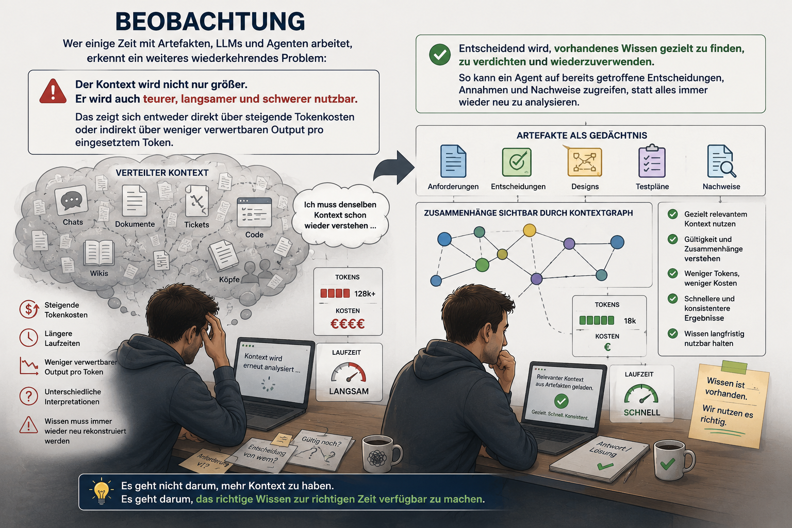
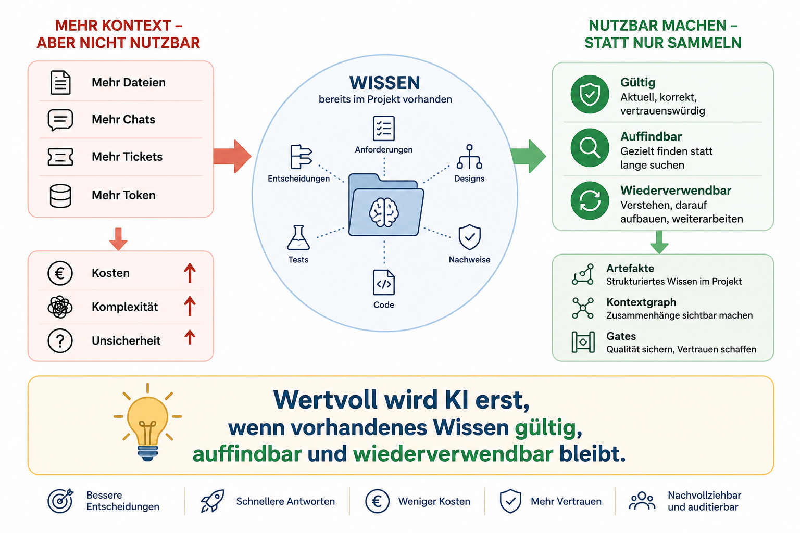
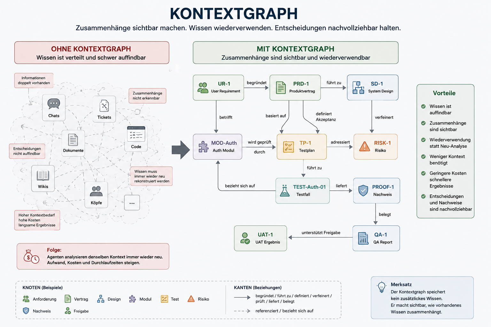

# 04 - Wissen nutzbar halten

## Beobachtung

Wer einige Zeit mit [`Artefakten`](03-artefakte.md), LLMs und Agenten arbeitet, könnte auch noch ein weiteres
wiederkehrendes Muster erkennen:

Ergebnisse entstehen sichtbar schnell.

Schwieriger wird es, vorhandenes Wissen langfristig nutzbar zu halten.

Mit jedem neuen Artefakt, Dokument, Ticket und Chat wächst die Menge an Informationen.

Das zeigt sich als erstes durch dauerhaft oder plötzlich steigende Tokenkosten.

Noch häufiger zeigt es sich indirekt:

Der Agent benötigt mehr Kontext, liefert langsamere Antworten oder analysiert bekannte Informationen immer wieder neu.

Die eigentliche Herausforderung besteht jedoch nicht darin, Informationen überhaupt zu speichern.

Anforderungen, Entscheidungen, Designs, Tests und Nachweise sind in Projekten meist bereits vorhanden.

Schwieriger wird es zu verstehen:

* Welche Informationen gelten noch?
* Welche Annahmen wurden später verworfen?
* Worauf basiert eine Entscheidung?
* Welche Auswirkungen hat eine Änderung?
* Welche Nachweise stützen den aktuellen Stand?

Hersteller investieren (natürlich nicht umsonst) deshalb sichtbar in Memory, Projektwissen und Kontextverdichtung.

Das bestätigt die praktische Beobachtung: Mehr Kontext allein löst das Problem nicht. **Wertvoll wird KI erst,** wenn
vorhandenes Wissen gültig, auffindbar und wiederverwendbar bleibt.

Einige Unternehmen schalten solche Memory-Funktionen bewusst ab oder begrenzen sie. Gründe können Kosten, Datenschutz,
Governance oder fehlende Kontrolle über gespeichertes Wissen sein.

Das zeigt eine wichtige Grenze plattformbasierter Memory-Funktionen:

Sie können hilfreich sein, sollten aber nicht die einzige Grundlage für dauerhaft relevantes Projektwissen sein.

Das gilt besonders dann, wenn KI nicht nur einfach nur breit ausgerollt wird, sondern konkret und dauerhaft in Software
Delivery eingebunden werden soll.

Für Softwareprojekte reicht es nicht, Wissen irgendwo in einer Toolplattform zu speichern.

Das relevante Wissen entsteht und verändert sich nahe am Projekt:

* in Anforderungen
* in Entscheidungen
* in Designs
* in Tests
* in Nachweisen
* im Code
* in Brownfield-Erkenntnissen

Wenn dieses Wissen in [`Artefakten`](03-artefakte.md) nahe am Projekt liegt, bleibt es versionierbar, prüfbar und
unabhängiger von einer einzelnen Toolplattform.

Gerade um nicht auf einen Toolhersteller angewiesen zu sein, legt dieses Framework das Gedächtnis nahe an das Projekt und
seine [`Artefakte`](03-artefakte.md).

## Artefakte als Gedächtnis

[`Artefakte`](03-artefakte.md) sind der stabile Speicher der Delivery.

Sie halten die Arbeitsstände fest, auf die spätere Agentenläufe, Reviews und Entscheidungen wieder verweisen können.

Dadurch muss vorhandenes Wissen nicht jedes Mal neu aus Chats, Tickets, Dokumenten oder Code rekonstruiert werden.

In diesem Abschnitt geht es deshalb nicht um die Struktur einzelner Artefakte, sondern um ihre Rolle als langfristiges
Gedächtnis der Delivery.

## Brownfield und Gedächtnis

Brownfield ist im Framework bereits als eigener Prüfpunkt beschrieben.

In diesem Abschnitt geht es um einen zusätzlichen Aspekt:

Bestehender Systemkontext ist nicht nur ein technisches Risiko. Er ist auch ein Gedächtnisproblem.

Je mehr bestehendes Wissen in Code, Tickets, Dokumenten und Artefakten verteilt ist, desto wichtiger wird es, dieses
Wissen gezielt auffindbar und wiederverwendbar zu machen.

Die Brownfield-Analyse hilft dabei, relevantes Bestandswissen zu identifizieren.

Artefakte halten dieses Wissen fest.

Der Kontextgraph macht sichtbar, wie es mit Anforderungen, Design, Tests und Nachweisen zusammenhängt.

## Kontext verdichten

Mehr Kontext ist nicht automatisch besser.

Zu viel ungeordnete Information erhöht Aufwand, Kosten und Komplexität.

Deshalb sollte nicht alles dauerhaft gespeichert werden.

Wichtig sind die Informationen, die für spätere Entscheidungen relevant bleiben.

Artefakte verdichten Wissen auf das Wesentliche:

* Entscheidungen
* Annahmen
* Risiken
* Nachweise
* Referenzen

So bleibt relevantes Wissen nutzbar, ohne dass Agenten denselben Kontext immer wieder vollständig analysieren müssen.

## Kontextgraph 

Ein einzelnes [`Artefakt`](03-artefakte.md) beantwortet selten alle Fragen.

Mit der Zeit entstehen immer mehr Anforderungen, Designs, Tests, Nachweise und Änderungen.

Die Herausforderung besteht dann nicht mehr darin, einzelne Informationen zu speichern.

Die größere Herausforderung besteht darin, ihre Zusammenhänge nachvollziehen zu können.

Beispiele:

* Welche Anforderung begründet diese Entscheidung?
* Welches Design setzt diese Anforderung um?
* Welcher Test prüft dieses Akzeptanzkriterium?
* Welche Module sind von einer Änderung betroffen?
* Welche Nachweise stützen die Freigabe?

Dadurch wird nicht mehr nur das einzelne Artefakt wichtig, sondern auch die Beziehung zwischen Artefakten.

Ein [`Produktvertrag`](03-artefakte.md) verweist auf Anforderungen.

Ein [`Design`](03-artefakte.md) verweist auf den Produktvertrag.

Ein [`Task/Testplan`](03-artefakte.md) verweist auf Design und Anforderungen.

Ein [`QA-Report`](03-artefakte.md) verweist auf Nachweise.

So entsteht fast schon automatisch ein Kontextgraph.

Mit wachsender Systemgröße werden jedoch nicht nur Beziehungen zwischen Artefakten wichtig.

Auch bestehende Module, Schnittstellen, Tests, Risiken, Verantwortlichkeiten und Nachweise werden zu relevanten Knoten
im Wissensnetz des Projekts.

Die **Brownfield-Analyse** kann dabei als Knotenfinder dienen.

Sie identifiziert bestehende Module, Schnittstellen, Tests, Risiken, Owner und Nachweise, die im Kontextgraphen sichtbar
werden sollten.

Nach einer Brownfield-Analyse sollte das Gedächtnis der Delivery aktualisiert werden.

Neue Erkenntnisse werden nicht ungeordnet abgelegt, sondern mit bestehenden Artefakten, Entscheidungen, Risiken und
Nachweisen verbunden.

So bleibt der Kontextgraph aktuell und nutzbar.

Mit jeder Nutzung kann er genauer werden.

Jede Brownfield-Analyse kann neue Knoten und Beziehungen sichtbar machen.

Jeder Review kann ungültige Annahmen, fehlende Nachweise oder überholte Beziehungen korrigieren.

Jedes [`Gate`](02-gates.md) prüft, ob der aktuelle Stand noch tragfähig ist.

**So entsteht ein lernender Kontextgraph.**

Das Delivery-Gedächtnis wird mit jeder Nutzung nicht nur größer, sondern besser: genauer, aktueller und besser
wiederverwendbar.

## Kernaussage

Die Herausforderung moderner Agentensysteme ist nicht nur die Erzeugung von Ergebnissen.

Die größere Herausforderung besteht darin, vorhandenes Wissen langfristig nahe im Projekt nutzbar zu halten.

Artefakte bilden das Gedächtnis.

Kontextgraphen verbinden dieses Wissen.

Gates schützen seine Qualität.
