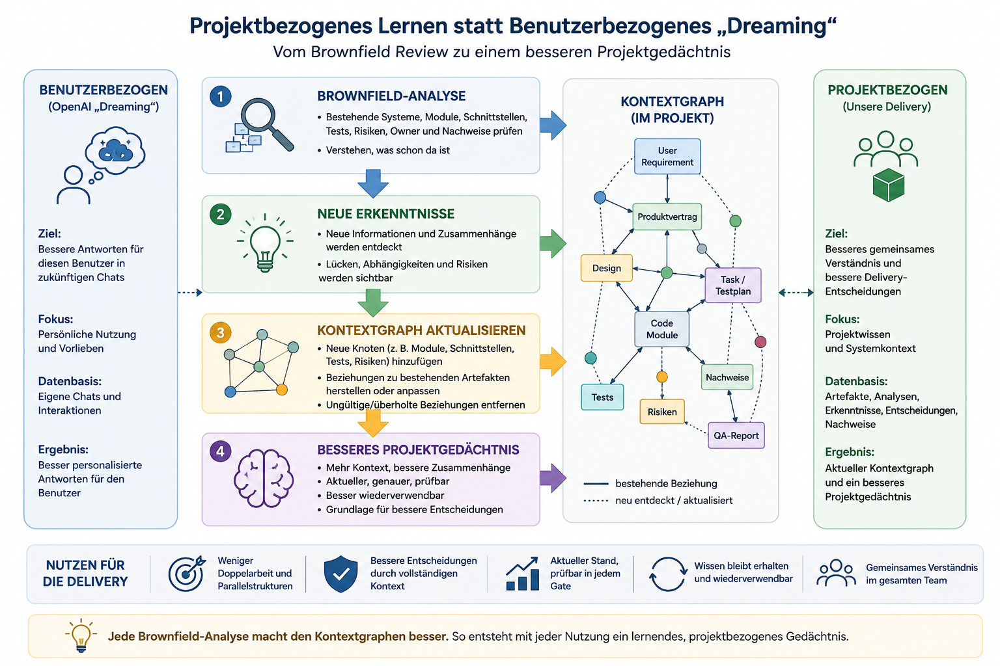

# 04 - Wissen nutzbar halten

## Beobachtung

Wer einige Zeit mit [`Artefakten`](03-artefakte.md), LLMs und Agenten arbeitet, könnte auch noch ein weiteres
wiederkehrendes Muster erkennen:

Ergebnisse entstehen sichtbar schnell.

Schwieriger wird es, vorhandenes Wissen langfristig nutzbar zu halten.

Mit jedem neuen Artefakt, Dokument, Ticket und Chat wächst die Menge an Informationen.

Das zeigt sich als erstes durch dauerhaft oder plötzlich steigende Tokenkosten.

Noch häufiger zeigt es sich indirekt:

Der Agent benötigt mehr Kontext, liefert langsamere Antworten oder analysiert bekannte Informationen immer wieder neu.

Die eigentliche Herausforderung besteht jedoch nicht darin, Informationen überhaupt zu speichern.

Anforderungen, Entscheidungen, Designs, Tests und Nachweise sind in Projekten meist bereits vorhanden.

Schwieriger wird es zu verstehen:

* Welche Informationen gelten noch?
* Welche Annahmen wurden später verworfen?
* Worauf basiert eine Entscheidung?
* Welche Auswirkungen hat eine Änderung?
* Welche Nachweise stützen den aktuellen Stand?

Hersteller investieren (natürlich nicht umsonst) deshalb sichtbar in Memory, Projektwissen und Kontextverdichtung.

Das bestätigt die praktische Beobachtung: Mehr Kontext allein löst das Problem nicht. **Wertvoll wird KI erst,** wenn
vorhandenes Wissen gültig, auffindbar und wiederverwendbar bleibt.

Einige Unternehmen schalten solche Memory-Funktionen bewusst ab oder begrenzen sie. Gründe können Kosten, Datenschutz,
Governance oder fehlende Kontrolle über gespeichertes Wissen sein.

Das zeigt eine wichtige Grenze plattformbasierter Memory-Funktionen:

Sie können hilfreich sein, sollten aber nicht die einzige Grundlage für dauerhaft relevantes Projektwissen sein.

Das gilt besonders dann, wenn KI nicht nur einfach nur breit ausgerollt wird, sondern konkret und dauerhaft in Software
Delivery eingebunden werden soll.

Für Softwareprojekte reicht es nicht, Wissen irgendwo in einer Toolplattform zu speichern.

Das relevante Wissen entsteht und verändert sich nahe am Projekt:

* in Anforderungen
* in Entscheidungen
* in Designs
* in Tests
* in Nachweisen
* im Code
* in Brownfield-Erkenntnissen

Wenn dieses Wissen in [`Artefakten`](03-artefakte.md) nahe am Projekt liegt, bleibt es versionierbar, prüfbar und
unabhängiger von einer einzelnen Toolplattform.

Gerade um nicht auf einen Toolhersteller angewiesen zu sein, legt dieses Framework das Gedächtnis nahe an das Projekt
und
seine [`Artefakte`](03-artefakte.md).

## Artefakte als Gedächtnis

[`Artefakte`](03-artefakte.md) sind der stabile Speicher der Delivery.

Sie halten die Arbeitsstände fest, auf die spätere Agentenläufe, Reviews und Entscheidungen wieder verweisen können.

Dadurch muss vorhandenes Wissen nicht jedes Mal neu aus Chats, Tickets, Dokumenten oder Code rekonstruiert werden.

In diesem Abschnitt geht es deshalb nicht um die Struktur einzelner Artefakte, sondern um ihre Rolle als langfristiges
Gedächtnis der Delivery.

## Brownfield und Gedächtnis

Brownfield ist im Framework bereits als eigener Prüfpunkt beschrieben.

In diesem Abschnitt geht es um einen zusätzlichen Aspekt:

Bestehender Systemkontext ist nicht nur ein technisches Risiko. Er ist auch ein Gedächtnisproblem.

Je mehr bestehendes Wissen in Code, Tickets, Dokumenten und Artefakten verteilt ist, desto wichtiger wird es, dieses
Wissen gezielt auffindbar und wiederverwendbar zu machen.

Die Brownfield-Analyse hilft dabei, relevantes Bestandswissen zu identifizieren.

Artefakte halten dieses Wissen fest.

Der Kontextgraph macht sichtbar, wie es mit Anforderungen, Design, Tests und Nachweisen zusammenhängt.

## Kontext verdichten

Mehr Kontext ist nicht automatisch besser.

Zu viel ungeordnete Information erhöht Aufwand, Kosten und Komplexität.

Deshalb sollte nicht alles dauerhaft gespeichert werden.

Wichtig sind die Informationen, die für spätere Entscheidungen relevant bleiben.

Artefakte verdichten Wissen auf das Wesentliche:

* Entscheidungen
* Annahmen
* Risiken
* Nachweise
* Referenzen

So bleibt relevantes Wissen nutzbar, ohne dass Agenten denselben Kontext immer wieder vollständig analysieren müssen.

## Kontextgraph

Ein einzelnes [`Artefakt`](03-artefakte.md) beantwortet selten alle Fragen.

Mit der Zeit entstehen immer mehr Anforderungen, Designs, Tests, Nachweise, Risiken und Änderungen.

Die Herausforderung besteht dann nicht mehr darin, einzelne Informationen zu speichern.

Die größere Herausforderung besteht darin, vorhandenes Wissen richtig einzuordnen und seine Zusammenhänge
nachvollziehbar zu halten.

Ein Kontextgraph macht diese Zusammenhänge sichtbar.

Er zeigt zum Beispiel:

* welche Anforderung eine Entscheidung begründet
* welches Design eine Anforderung umsetzt
* welcher Test ein Akzeptanzkriterium prüft
* welche Module von einer Änderung betroffen sind
* welche Nachweise eine Freigabe stützen

Der Kontextgraph entsteht nicht durch zusätzliche Dokumentation.

Er entsteht durch die Referenzen zwischen vorhandenen Artefakten.

Ein [`UserRequirement`](03-artefakte.md) beschreibt den Bedarf.

Ein [`Produktvertrag`](03-artefakte.md) verweist auf das UserRequirement.

Ein [`Design`](03-artefakte.md) verweist auf den Produktvertrag.

Ein [`TaskTestPlan`](03-artefakte.md) verweist auf Produktvertrag und Design.

Ein [`QA-Report`](03-artefakte.md) verweist auf Tests, Nachweise und Umsetzung.

So entsteht Schritt für Schritt ein Wissensnetz des Projekts.

Mit wachsender Systemgröße werden jedoch nicht nur Artefakte wichtig.

Auch bestehende Module, Schnittstellen, Tests, Risiken, Verantwortlichkeiten und Nachweise werden zu relevanten Knoten
in diesem Netz.

Eine [`Brownfield-Analyse`](01-framework-ueberblick.md) dient deshalb nicht nur der Risikoerkennung.

Sie hilft auch dabei, neue Knoten zu finden, fehlende Beziehungen sichtbar zu machen und bestehendes Projektwissen neu
einzuordnen.

**Nach einer Brownfield-Analyse sollte der Kontextgraph aktualisiert werden.**

Neue Erkenntnisse werden nicht automatisch Teil des Projektgedächtnisses.

Sie durchlaufen dieselben Mechanismen wie andere Änderungen:

* Artefakte
* Reviews
* Gates
* Nachweise

Erst danach werden sie Teil des Kontextgraphen.

So bleibt der Kontextgraph aktuell und nutzbar.

In Teams sollte das Projektgedächtnis jedoch nicht stillschweigend durch einzelne Agentenläufe verändert werden.

Wenn Artefakte und Referenzen im Repository liegen, können Änderungen wie Code behandelt werden:

* als Diff
* mit Review
* mit Historie
* mit Freigabe
* mit Rollback-Möglichkeit

So kann der Kontextgraph kontrolliert wachsen, ohne dass unklare oder ungeprüfte Erkenntnisse automatisch gültig werden.

Mit jeder Nutzung kann er genauer werden.

Jede Brownfield-Analyse kann neue Knoten und Beziehungen sichtbar machen.

Jeder Review kann ungültige Annahmen, fehlende Nachweise oder überholte Beziehungen korrigieren.

Jedes [`Gate`](02-gates.md) prüft, ob der aktuelle Stand noch tragfähig ist.

**So entsteht ein lernender Kontextgraph.**

Das Projektwissen wird mit jeder Nutzung nicht nur größer.

Es wird besser: genauer, aktueller und leichter wiederverwendbar.

### Was den Kontextgraphen unterscheidet zu gängigen KI-Werkzeugen

Ein Kontextgraph im Sinne dieses Frameworks ist kein klassisches Memory-System.

Memory-Funktionen von KI-Werkzeugen speichern Informationen, damit ein Modell oder Agent bei späteren Aufgaben darauf
zurückgreifen kann.

Der Kontextgraph diese Frameworks verfolgt ein anderes Ziel.

Er speichert Wissen nicht für eine einzelne KI, sondern macht Projektwissen für Menschen, Agenten und zukünftige
Entscheidungen nachvollziehbar.

Er beantwortet nicht nur:

Was soll die KI wissen?

Sondern auch:

* Warum wurde diese Entscheidung getroffen?
* Worauf basiert sie?
* Welche Artefakte sind betroffen?
* Welche Nachweise liegen vor?
* Welche Auswirkungen hat eine Änderung?

Der Kontextgraph gehört deshalb nicht einer Plattform oder einem Modell.

Er gehört dem Projekt und das ist ein fundamentaler Unterschied.

## Kernaussage

Die Herausforderung moderner Agentensysteme ist nicht nur, Ergebnisse zu erzeugen.

Die größere Herausforderung besteht darin, vorhandenes Projektwissen langfristig gültig, auffindbar und wiederverwendbar
zu halten.

Dieses Wissen sollte nicht allein in einer Toolplattform oder im aktuellen Modellkontext liegen.

Es gehört nahe an das Projekt.

[`Artefakte`](03-artefakte.md) halten belastbare Arbeitsstände fest.

Der Kontextgraph macht ihre Beziehungen sichtbar.

[`Gates`](02-gates.md) prüfen, ob auf diesem Wissen verantwortbar aufgebaut werden darf.

So entsteht ein projektnahes Delivery-Gedächtnis, das mit jeder Nutzung nicht nur größer, sondern besser werden kann.
