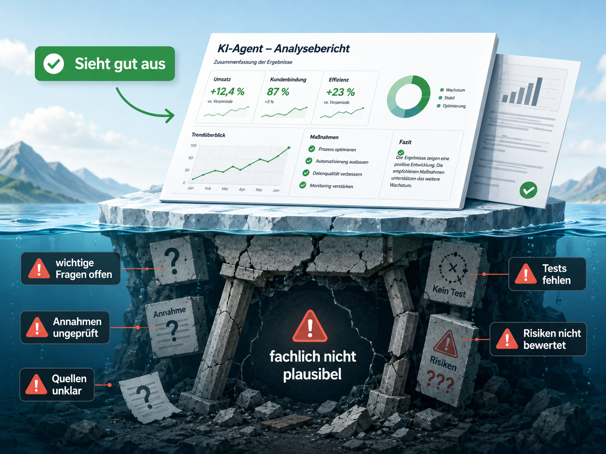
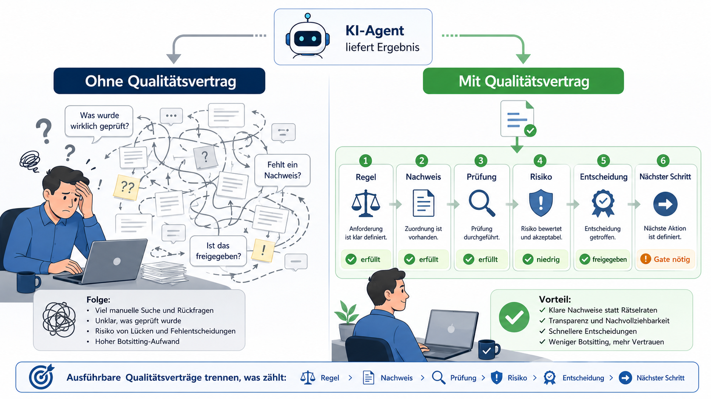

# 05 - Vom Mythos zur Prüfung

Dieses Dokument beschreibt einen weiteren Baustein für die Arbeit mit KI-Agenten.

Das vorherige Kapitel hat beschrieben, wie Projektwissen auffindbar und wiederverwendbar bleibt.
Dieses Kapitel ergänzt eine weitere Frage:

Woran erkennen wir, ob ein Agent nicht nur etwas geliefert hat, sondern auch nach den vereinbarten Regeln gearbeitet hat?

Die bisherigen Kapitel beschreiben dafür bereits wichtige Grundlagen.

[`Gates`](02-gates.md) klären, wann ein Vorhaben weitergehen darf.

[`Artefakte`](03-artefakte.md) halten fest, worauf eine Entscheidung basiert.

[`Projektwissen`](04-wissen-nutzbar-halten.md) sorgt dafür, dass wichtige Erkenntnisse wiederverwendbar bleiben.

Ausführbare Qualitätsverträge ergänzen diese Bausteine.

Sie helfen, Regeln nicht nur zu beschreiben, sondern wiederholt gegen sichtbare Nachweise zu prüfen.

Dabei geht es nicht zuerst um ein neues Werkzeug.

Es geht um eine einfache Frage:

Hat dieser Agentenlauf auf einer tragfähigen Grundlage gearbeitet?

## Kernaussage in fünf Sätzen

Bei KI-Agenten reicht es nicht, nur das Ergebnis zu prüfen.
Auch der Agentenlauf selbst muss nachvollziehbar werden.
Ein Qualitätsvertrag beschreibt, welche Regel gilt und welcher Nachweis sie belegt.
Er ersetzt keine menschliche Entscheidung, macht aber fehlende Nachweise sichtbar.
So wird aus einer plausiblen Agenten-Zusammenfassung eine prüfbare Arbeitsgrundlage.

## Beobachtung

In vielen Teams gibt es bereits Regeln.

Es gibt eine Definition of Done für Entwickler.
Es gibt eine Definition of Ready für Analysten.
Es gibt Prüfchecklisten, Testvorgaben und Freigabeprozesse.
Es gibt Hinweise für Architektur, Sicherheit, Dokumentation und Tests.

Solange Menschen jeden Schritt bewusst ausführen, können viele dieser Regeln teilweise unausgesprochen bleiben.

**Ein erfahrener Entwickler merkt,** wenn etwas fehlt.

**Eine Architektin erkennt,** wenn ein Entwurf plötzlich eine andere Richtung nimmt.

**Ein Tester sieht,** ob ein Test wirklich zur Änderung passt.

**Bei KI-Agenten verschiebt sich diese Lage.**

Wer einmal einen umfangreichen Systemprompt eines modernen Agentensystems gelesen hat, versteht: Die Hersteller wissen sehr genau,
dass praktische KI-Leistung nicht allein aus dem Modell entsteht.

Sie entsteht im Zusammenspiel aus Modell, Regeln, Tool-Grenzen, Kontextsteuerung, Sicherheitslogik, Nachweisen und Prüfungen.

Diese Beobachtung lässt sich auf Softwareentwicklung mit KI-Agenten übertragen: Auch dort reicht Modelloutput allein nicht.
Daraus folgt eine einfache Annahme: Es braucht dauerhafte Artefakte und Gates, damit KI-Ergebnisse nachvollziehbar,
prüfbar und verantwortbar bleiben.

Ein Agent kann sehr schnell plausibel klingende Ergebnisse erzeugen.

Er kann Anforderungen formulieren, Aufgaben ableiten, Dateien ändern, Tests starten und am Ende eine überzeugende
Zusammenfassung schreiben.

Das kann hilfreich sein.

Es macht aber auch eine Lücke sichtbar:

Ein Ergebnis kann gut aussehen, obwohl wichtige Fragen offen sind.

Zum Beispiel:

* Wurde die richtige Grundlage verwendet?
* Galten die vorgesehenen Regeln für diesen Lauf?
* Wurde eine notwendige Freigabe eingeholt?
* Wurde das bestehende System ausreichend geprüft?
* Sind Tests wirklich gelaufen?
* Wurde ein fehlender Test offen benannt?
* Sind Risiken sichtbar?
* Wurde eine Annahme als Annahme markiert?
* Wurde eine Aufgabe nur behauptet oder auch belegt?
* Wurde ein Gate wirklich bestanden oder nur sprachlich so dargestellt?

Genau an dieser Stelle werden ausführbare Qualitätsverträge wichtig.

Sie machen Regeln, Prüfungen und Nachweise sichtbar. Dadurch wird aus einer plausiblen Agenten-Zusammenfassung eine
prüfbare Arbeitsgrundlage.

## Was ist ein Agentenlauf?

Ein Agentenlauf ist eine zusammenhängende Arbeit eines KI-Agenten.

Ein Agentenlauf hat in der Regel:

* ein Ziel
* eine Grundlage
* einen Arbeitsmodus
* verwendete Regeln
* verwendete Skills oder Werkzeuge
* erzeugte Änderungen
* ausgeführte Prüfungen
* offene Punkte
* einen Abschlussbericht

Ein Agentenlauf kann klein sein.

Zum Beispiel eine schnelle Änderung an einer Datei.

Ein Agentenlauf kann aber auch größer sein.

Zum Beispiel eine geplante Umsetzung mit Produktvertrag, Solution Design, Task- und Testplan, Prüfung und Abschluss.

Wichtig ist:

Nach einem relevanten Agentenlauf sollte nachvollziehbar sein, was der Agent getan hat und worauf seine Aussagen beruhen.

Das Projekt sollte beantworten können:

* Welche Regeln galten für diesen Lauf?
* Aus welcher Quelle kamen diese Regeln?
* Welche Skills oder Gates waren beteiligt?
* Welche Nachweise hat der Agent geliefert?
* Welche Nachweise fehlen?
* Welche Risiken bleiben offen?
* Welche Entscheidung wurde getroffen?
* Welcher nächste Schritt ist sauber möglich?

Ohne diese Klarheit entsteht schnell Rätselraten.

Der Agent sagt: erledigt.

Der Mensch muss nachträglich prüfen, ob das wirklich stimmt.

## Was ist ein ausführbarer Qualitätsvertrag?

Ein ausführbarer Qualitätsvertrag ist eine vereinbarte Qualitätsregel, die wiederholt gegen sichtbare Nachweise geprüft werden kann.

Er beantwortet nicht nur:

> Was soll gelten?

Sondern auch:

> Woran erkennen wir, ob es eingehalten wurde?

Dabei bedeutet „ausführbar“ nicht, dass jede Prüfung automatisch durch ein Werkzeug erfolgen muss.

Ausführbar bedeutet:

Eine Regel ist so klar beschrieben, dass sie wiederholt geprüft werden kann.

Manchmal durch ein Skript.

Manchmal durch eine fachliche Prüfung.

Manchmal durch ein Gate.

Manchmal durch eine bewusste Entscheidung eines Menschen.

Wichtig ist nicht zuerst das Werkzeug.

Wichtig ist die klare Verbindung aus:

* Regel
* Geltungsbereich
* Nachweis
* Prüfung
* Wirkung

Ein einfacher Qualitätsvertrag beantwortet zum Beispiel:

* Welche Regel gilt?
* Für welchen Agentenlauf oder Arbeitsschritt gilt sie?
* Welche Nachweise müssen sichtbar sein?
* Wer oder was prüft diese Nachweise?
* Was passiert, wenn der Nachweis fehlt?
* Führt der Verstoß zu Stopp, Nacharbeit oder nur zu einem Hinweis?

Damit wird aus einer allgemeinen Regel ein wiederholbarer Prüfpunkt.

Beispiel:

> Eine Aufgabe darf nur als erledigt gelten, wenn konkrete Nachweise sichtbar sind.

Diese Regel ist erst dann ein Qualitätsvertrag, wenn zusätzlich klar ist:

* Was zählt als Nachweis?
* Wo muss der Nachweis stehen?
* Wer prüft ihn?
* Was passiert, wenn er fehlt?

## Systemanweisung für einen Agenten als Regelquelle

Viele Teams beginnen nicht mit einer großen Prüfplattform.

Sie beginnen mit Regeln in Markdown-Dateien.

Zum Beispiel in:

* Projektanweisungen
* Architekturhinweisen
* Testvorgaben
* Review-Regeln
* Spezifikationen
* Dokumentation unter `doc/ai`

Das ist sinnvoll.

Diese Dateien liegen nah am Code.

Sie sind versionierbar.

Sie können von Menschen und Agenten gelesen werden.

Sie beschreiben, wie ein Agent arbeiten soll.

Aber eine Regel in einer Systemanweisung für einen Agenten ist noch kein ausführbarer Qualitätsvertrag.

Sie sagt zunächst nur:

> So soll gearbeitet werden.

Ein Qualitätsvertrag stellt die nächste Frage:

> Woran erkennen wir, dass wirklich so gearbeitet wurde?

Beispiel:

> Vor Änderungen am bestehenden System muss der Bestand geprüft werden.

Als Regel in einer Systemanweisung für einen Agenten ist das verständlich.

Als Qualitätsvertrag reicht der Satz noch nicht.

Dafür muss zusätzlich klar sein:

* Für welche Änderungen gilt die Regel?
* Welche Teile des bestehenden Systems wurden geprüft?
* Wo steht das Prüfergebnis?
* Welche Risiken wurden gefunden?
* Welche Nachweise müssen sichtbar sein?
* Wer entscheidet, ob die Prüfung ausreicht?
* Was passiert, wenn die Prüfung fehlt?

Damit wird aus einer Arbeitsregel ein prüfbarer Arbeitsschritt.

Nicht jede Regel muss ein Qualitätsvertrag werden.

Das wäre zu schwerfällig.

Geeignet sind vor allem Regeln, bei denen ein fehlender Nachweis später teuer werden kann.

Zum Beispiel:

* Gate-Freigaben
* erledigte Aufgaben
* Änderungen am bestehenden System
* sicherheitsrelevante Änderungen
* fachlich kritische Logik
* Schnittstellen
* Architekturentscheidungen
* Test- und Freigaberegeln
* Abweichungen zwischen Dokumentation, Spezifikation und Code

So sollte kein zweiter Regelkatalog entstehen.

Die Regel bleibt dort, wo sie hingehört.

Der Qualitätsvertrag beschreibt nur, wie geprüft wird, ob der Agentenlauf diese Regel sichtbar beachtet hat.

## Warum reicht ein grüner Build nicht?

Ein grüner Build ist wichtig.

Ein grüner Testlauf ist wichtig.

Beides beantwortet aber nur einen Teil der Qualitätsfrage.

Ein Build kann grün sein, obwohl der vereinbarte Umfang falsch verstanden wurde.

Ein Test kann grün sein, obwohl ein wichtiges Akzeptanzkriterium fehlt.

Ein Pull Request kann sauber aussehen, obwohl eine zweite verbindliche Grundlage entstanden ist.

Ein Agent kann schreiben, dass etwas erledigt ist, obwohl nicht sichtbar wird, welche Aufgabe mit welchem Nachweis erfüllt wurde.

Das bedeutet nicht, dass technische Checks unwichtig sind.

Es bedeutet nur:

Technische Checks prüfen vor allem das Produkt oder den Code.

Qualitätsverträge prüfen zusätzlich den Weg dorthin.

Sie fragen nicht nur:

> Funktioniert es?

Sondern auch:

> Wurde nach den vereinbarten Regeln gearbeitet?

Für Agentenläufe ist diese zweite Frage besonders wichtig.

Denn ein Agent kann nicht nur Code ändern.

Er kann auch planen, zusammenfassen, bewerten, ein Gate vorbereiten oder eine Entscheidung sprachlich darstellen.

Genau deshalb muss sichtbar bleiben, ob seine Aussagen auf prüfbaren Nachweisen beruhen.

## Was kann sinnvoll geprüft werden?

Nicht alles lässt sich sinnvoll automatisieren.

Das ist wichtig.

Wenn ein Qualitätsvertrag mehr verspricht, als er prüfen kann, entsteht Scheinsicherheit.

Trotzdem gibt es viele wiederkehrende Fragen, die sich gut als Qualitätsvertrag formulieren lassen.

Zum Beispiel:

* Wurde vor einer späteren Phase die nötige Freigabe eingeholt?
* Wurde vor einer Änderung im bestehenden System der Bestand geprüft?
* Hat jede Aufgabe im Aufgaben- und Testplan einen Status?
* Gibt es für erledigte Aufgaben konkrete Nachweise?
* Wurde ein fehlender Test offen benannt?
* Wurde eine zweite verbindliche Grundlage eingeführt?
* Wurde eine Ausweichlösung behalten, ohne festzulegen, wann sie wieder entfernt wird?
* Wurde Dokumentation angepasst, wenn sich Verhalten oder Architektur geändert haben?
* Enthält eine Prüfung Entscheidung, Nachweise, Risiken und nächsten Schritt?
* Wurde eine Annahme als Annahme markiert und nicht als Tatsache behandelt?
* Wurde ein naheliegender Skill genutzt oder nachvollziehbar ausgelassen?
* Wurde ein Gate als bestanden dargestellt, obwohl eine Freigabe fehlt?

Solche Fragen sind nicht neu.

Neu ist, dass sie bei Arbeit mit KI-Agenten häufiger ausdrücklich gestellt werden müssen.

Ein Agent sollte nicht nur liefern.

Er sollte auch zeigen, worauf seine Lieferung beruht.

## Was bleibt menschliche Verantwortung?

Ausführbare Qualitätsverträge ersetzen keine menschliche Verantwortung.

Sie ersetzen kein PRD.

Sie ersetzen keine Architekturentscheidung.

Sie ersetzen keine Freigabe.

Sie ersetzen kein QA-Gate.

Sie machen nur sichtbarer, worauf eine Entscheidung aufbaut.

Ein Qualitätsvertrag kann zeigen:

* Der Nachweis fehlt.
* Die Aufgabe ist nicht vollständig belegt.
* Eine Regel wurde nicht geprüft.
* Eine Annahme wurde nicht markiert.
* Ein Risiko bleibt offen.
* Eine Entscheidung wurde behauptet, aber nicht freigegeben.
* Ein Agentenlauf hat einen notwendigen Skill nicht genutzt.
* Ein Gate wurde vorbereitet, obwohl eine Vorprüfung fehlt.

Ob daraus ein Stopp wird, ob Nacharbeit reicht oder ob ein Risiko bewusst akzeptiert wird, bleibt eine Gate- oder Prüfentscheidung.

Das ist der Unterschied zwischen Prüfung und Verantwortung.

Der Qualitätsvertrag zeigt den Befund.

Die Verantwortung bleibt beim Team.

## Welche Wirkung kann ein Qualitätsvertrag haben?

Ein Qualitätsvertrag sollte nicht nur sagen, ob etwas auffällig ist.

Er sollte auch beschreiben, welche Wirkung der Befund hat.

Dabei reichen für den Anfang drei einfache Klassen.

### Stopp

Der Agentenlauf darf an dieser Stelle nicht als erfolgreich abgeschlossen gelten.

Ein Gate darf nicht passieren.

Eine QA-Aussage darf nicht als bestanden dargestellt werden.

Das gilt zum Beispiel, wenn eine wichtige Aufgabe ohne Nachweis als erledigt markiert wird oder eine notwendige Freigabe fehlt.

### Nacharbeit

Der Agentenlauf ist nicht ausreichend belastbar, kann aber korrigiert werden.

Der Agent oder das Team muss nacharbeiten.

Erst danach kann die Arbeit erneut geprüft werden.

Das gilt zum Beispiel, wenn ein Test genannt wurde, aber nicht klar ist, welches Risiko oder welches Akzeptanzkriterium damit geprüft wurde.

### Hinweis

Die Lieferung kann weitergehen.

Der offene Punkt muss aber sichtbar bleiben.

Das gilt zum Beispiel, wenn eine kleine Aufgabe nur schwach belegt ist, das Risiko aber gering ist.

Wichtig ist:

Es sollte kein stilles Ignorieren geben.

Wenn ein Qualitätsvertrag greift, muss sichtbar sein, ob daraus Stopp, Nacharbeit oder ein Hinweis wird.

## Wo liegt der Nutzen?

Der Nutzen liegt nicht darin, mehr Bürokratie zu erzeugen.

Der Nutzen liegt darin, wiederkehrende Qualitätsfragen stabiler zu stellen.

Man muss nicht jedes Mal neu diskutieren, was ein Agent am Ende eines Laufs belegen soll.

Ein Prüfer muss nicht aus einer langen Zusammenfassung erraten, welche Tests wirklich gelaufen sind.

Ein Gate muss nicht raten, ob eine Aufgabe vollständig erledigt ist.

Ein späterer Agent muss nicht aus Chat-Verläufen rekonstruieren, warum eine Entscheidung als sicher galt.

Gute Qualitätsverträge machen die Arbeit ruhiger.

Sie trennen sauber:

* Regel
* Beobachtung
* Nachweis
* Risiko
* Entscheidung
* nächster Schritt

Diese Trennung ist besonders wichtig, wenn Agenten über längere Zeit an demselben Projekt arbeiten.

Ohne diese Trennung entsteht schnell Botsitting:

Dabei lesen wir häufig lange Agenten-Zusammenfassungen, suchen fehlende Nachweise und prüfen im Kopf nach, ob die Arbeit wirklich belastbar ist.

*Qualitätsverträge machen sichtbar, was geprüft wurde, welche Nachweise vorliegen und welche Entscheidung noch offen ist.*

Ausführbare Qualitätsverträge reduzieren genau diese Nacharbeit.

Sie machen nicht jede Entscheidung automatisch.

Sie machen aber sichtbar, worüber entschieden werden muss.

## Was kann schiefgehen?

Auch ausführbare Qualitätsverträge können falsch eingesetzt werden.

Ein Risiko ist Scheinsicherheit.

Ein Check ist grün, aber die eigentliche fachliche Frage wurde gar nicht geprüft.

Ein zweites Risiko ist eine zweite verbindliche Grundlage.

Wenn Qualitätsverträge eigene Produktregeln erfinden, konkurrieren sie mit Produktvertrag, Gates und Artefakten.

Ein drittes Risiko ist Bürokratie.

Wenn jeder kleine Schritt denselben schweren Prüfprozess auslöst, wird der Ansatz zum Hindernis.

Ein viertes Risiko ist Abhängigkeit von einzelnen Werkzeugen.

Wenn Qualität nur noch in einer Plattform sichtbar ist, gehört das Projektwissen nicht mehr dem Projekt.

Die Gegenregel lautet:

Nur prüfen, was wirklich prüfbar ist.

Alles andere bleibt fachliche Prüfung, Gate oder Freigabe.

Ein Qualitätsvertrag darf also nicht mehr behaupten, als er tatsächlich prüfen kann.

## Ein mögliches Muster

Ein Qualitätsvertrag kann einfach beginnen.

Zum Beispiel so:

### Qualitätsvertrag: Aufgabe nur mit Nachweis erledigt

**Regel**

Eine Aufgabe darf nur als erledigt gelten, wenn konkrete Nachweise sichtbar sind.

**Geltungsbereich**

Alle Aufgaben im Aufgaben- und Testplan.

**Nachweis**

Für jede erledigte Aufgabe muss mindestens erkennbar sein:

* welche Datei oder Komponente betroffen war
* welche Änderung vorgenommen wurde
* welcher Test gelaufen ist oder warum kein Test möglich war
* welches Ergebnis beobachtet wurde
* welches Risiko offen bleibt, falls vorhanden

**Prüfung**

Eine fachliche Prüfung oder ein automatischer Check prüft, ob die Pflichtangaben vorhanden sind.

**Wirkung bei fehlendem Nachweis**

Fehlende Nachweise führen mindestens zu Nacharbeit.

Bei sicherheitsrelevanten, fachlich kritischen oder architekturrelevanten Änderungen kann ein fehlender Nachweis das Gate stoppen.

**Entscheidung**

Das Gate entscheidet, ob die Aufgabe akzeptiert, zurückgegeben oder bewusst mit Risiko freigegeben wird.

## Beispiel: Agentenlauf prüfen

Eine einfache Regel aus AGENTS.md könnte lauten:

> Ein Agent darf eine Aufgabe nur als erledigt melden, wenn der Nachweis sichtbar ist.

Als Arbeitsregel ist das verständlich.

Als Qualitätsvertrag wird daraus eine prüfbare Frage:

> Hat dieser Agentenlauf gezeigt, welche Aufgabe erledigt wurde, welche Änderung erfolgt ist, welche Prüfung gelaufen ist und welches Ergebnis beobachtet wurde?

Der Agentenlauf kann dann zum Beispiel so geprüft werden:

* Aufgabe vorhanden?
* Änderung benannt?
* betroffene Dateien oder Komponenten genannt?
* Test oder Prüfschritt genannt?
* Ergebnis genannt?
* fehlender Test offen benannt?
* Risiko genannt?
* nächster Schritt genannt?

Wenn diese Angaben fehlen, ist die Aussage „erledigt“ nicht belastbar.

Dann ist nicht automatisch das Produkt falsch.

Aber der Agentenlauf ist nicht ausreichend belegt.

Das ist der entscheidende Unterschied.

Der Qualitätsvertrag bewertet nicht nur das Ergebnis.

Er prüft, ob der Weg zum Ergebnis nachvollziehbar ist.

## Kernaussage

Softwareentwicklung mit KI-Agenten braucht nicht nur bessere Antworten.

Sie braucht bessere Nachvollziehbarkeit.

Ausführbare Qualitätsverträge helfen dabei, vereinbarte Regeln wiederholt gegen sichtbare Nachweise zu prüfen.

Sie beziehen sich auf konkrete Agentenläufe, Review-Ergebnisse oder Lieferartefakte.

Sie ersetzen keine Produktanforderungen.

Sie ersetzen keine Gates.

Sie ersetzen keine menschliche Verantwortung.

Sie machen sichtbar, ob ein Agent auf einer tragfähigen Grundlage gearbeitet hat.

Kurz gesagt:

Der Agentenlauf erzeugt Arbeit und Nachweise.

Der Qualitätsvertrag prüft, ob die Regeln sichtbar beachtet wurden.

Das Gate oder die fachliche Prüfung entscheidet, welche Wirkung das hat.

## Nächster Schritt

Das nächste Kapitel beschreibt, warum mit wachsendem Projektwissen nicht nur mehr Kontext, sondern der richtige Kontext
wichtig wird:

[06 - Vom Notizzettel zum Bauplan](06-vom-notizzettel-zum-bauplan.md)
