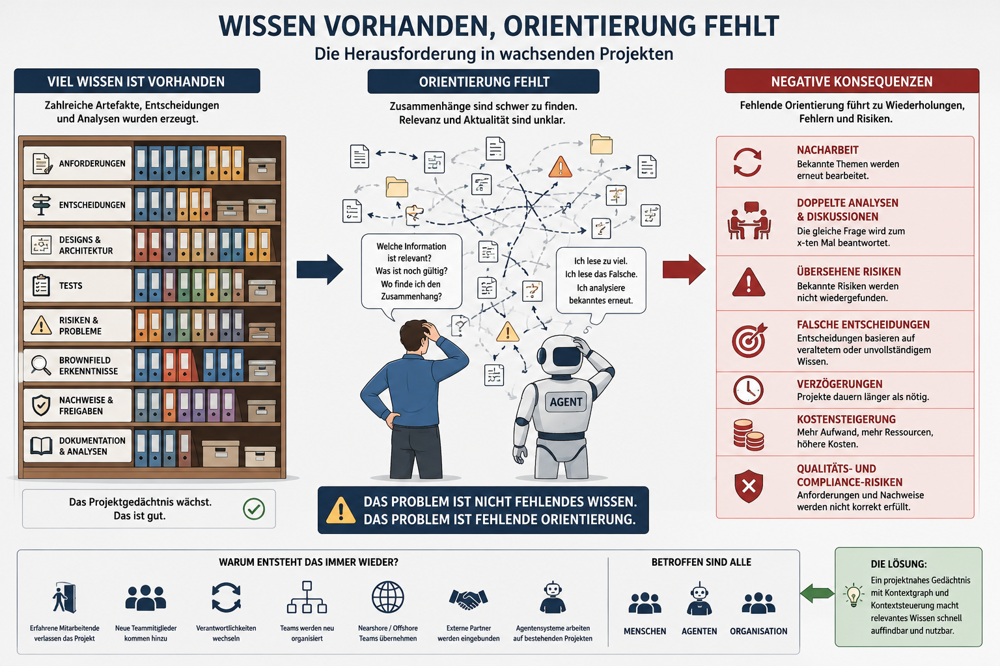
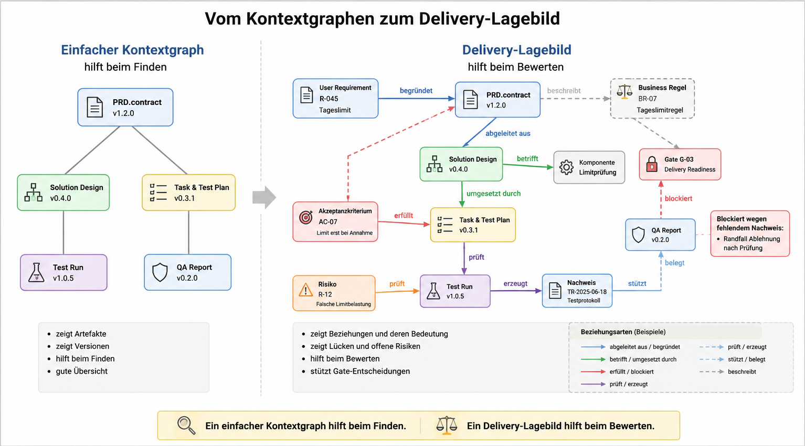

# 06 - Vom Notizzettel zum Bauplan

Das vorherige Kapitel hat beschrieben, wie Agentenläufe prüfbar werden.

Dieses Kapitel beschreibt eine weitere Herausforderung:

Wie finden Menschen und Agenten die Informationen, die für eine Aufgabe tatsächlich relevant sind?

## Kernaussage in fünf Sätzen

Mehr Kontext führt nicht automatisch zu besseren Ergebnissen.

Mit jedem Artefakt, jeder Entscheidung und jeder Analyse wächst das Projektwissen.

Dadurch wird die Auswahl der richtigen Informationen wichtiger als das Speichern weiterer Informationen.

Der Kontextgraph hilft dabei, relevante Zusammenhänge sichtbar zu machen.

So arbeiten Menschen und Agenten auf dem Wissen, das sie wirklich benötigen, statt das gesamte Projekt immer wieder neu
zu analysieren.

## Beobachtung

Am Anfang eines Projekts fehlt oft Wissen.

Später fehlt Orientierung.

Mit jedem Artefakt, jeder Entscheidung, jedem Test und jeder Analyse lernt das Projekt.

Genau dadurch entsteht eine neue Aufgabe:

Projektwissen muss nicht nur gespeichert werden.

Es muss übertragbar und auffindbar bleiben.

Und es muss sich richtig einordnen lassen.

**Aufgaben lassen sich relativ einfach übergeben. Projektwissen deutlich schwerer.**

Projektwissen wird besonders wichtig, sobald Arbeit über Personen-, Team-, Standort- oder Unternehmensgrenzen hinweg
erfolgt.

Das zeigt sich zum Beispiel, wenn:

* neue Mitarbeitende eingearbeitet werden
* Verantwortlichkeiten wechseln
* erfahrene Mitarbeitende das Projekt verlassen
* Teams neu organisiert werden
* externe Partner eingebunden werden
* Arbeit auf mehrere Standorte verteilt wird
* Agentensysteme auf bestehenden Projekten arbeiten

In vielen Organisationen ist Einarbeitung deshalb ein normaler Teil der Arbeit.

Das ist sinnvoll.

Trotzdem wird oft unterschätzt, wie viel Zeit für die Suche nach bereits vorhandenem Wissen verloren geht.

Dokumente, Repositories und Tickets können übergeben werden.

Deutlich schwieriger ist die Übergabe von Zusammenhängen:

Warum wurde diese Entscheidung getroffen?

Welche Annahmen gelten noch?

Welche Risiken sind bekannt?

Welche Lösung wurde bereits verworfen?

Welche Teile des Systems sind betroffen?

Welche Nachweise stützen den aktuellen Stand?

Schwierig wird es besonders dann, wenn Projektwissen über Jahre fast ausschließlich in Ticketsystemen liegt.

Ein Ticket beschreibt meist einen Arbeitsschritt.

Es erklärt aber nicht automatisch den Zusammenhang.

Ticketsysteme wie Jira sind hilfreich, um Arbeit zu planen, zu verteilen und nachzuverfolgen.

Als dauerhaftes Projektgedächtnis reichen sie jedoch oft nicht aus.

Nach einigen Jahren liegt Wissen verteilt in alten Tickets, Kommentaren, Anhängen, Links und Statuswechseln.

Einzelne Informationen sind vorhanden, aber der Zusammenhang fehlt.

Dadurch entstehen typische Reibungsverluste:

* neue Teams lesen lange Ticket-Historien
* alte Entscheidungen werden erneut diskutiert
* gültige und überholte Informationen vermischen sich
* Nachweise sind schwer auffindbar
* Agenten analysieren viele Tickets, ohne den tragfähigen Stand sicher zu erkennen

Das Problem ist nicht, dass Jira oder ein anderes Ticketsystem falsch ist.

Das Problem entsteht, wenn ein Ticketsystem zum einzigen Gedächtnis des Projekts wird.

Arbeitssteuerung ersetzt kein projektnahes Liefergedächtnis.

Die Folgen zeigen sich häufig erst später:

Eine bekannte Einschränkung wird übersehen.

Eine frühere Entscheidung wird nicht gefunden.

Eine bereits verworfene Lösung wird erneut vorgeschlagen.

Ein Agent analysiert dieselben Informationen erneut.

Nicht weil das Wissen fehlt.

Sondern weil es nicht schnell genug gefunden, eingeordnet oder verstanden werden konnte.

Mit zunehmender Projektgröße wird deshalb nicht das Speichern von Wissen zum Engpass.

**Der Engpass wird Orientierung.**

*Mit wachsendem Projektwissen wird nicht das Speichern von Informationen zum Problem. Die Herausforderung besteht darin,
relevantes Wissen zum richtigen Zeitpunkt zu finden und richtig einzuordnen.*

Genau hier wird Kontextsteuerung wichtig.

Menschen und Agenten sollten nicht das gesamte Projektwissen durchsuchen müssen.

Sie sollten gezielt den Ausschnitt finden, der für ihre aktuelle Aufgabe relevant ist.

## Warum mehr Kontext nicht automatisch besser ist

Mehr Kontext kann hilfreich sein.

Mehr Kontext kann aber auch verwirren.

Je größer ein Projekt wird, desto mehr Informationen konkurrieren um Aufmerksamkeit.

Nicht jede Information ist gleich wichtig.

Nicht jede Information ist noch gültig.

Nicht jede Information gehört zur aktuellen Aufgabe.

Ein Agent muss deshalb unterscheiden können:

* Was ist relevant?
* Was ist historisch?
* Was ist überholt?
* Was ist verbindlich?
* Was ist nur eine Annahme?

Diese Auswahl wird mit wachsender Projektgröße immer wichtiger.

## Der Kontextgraph als Wegweiser

Im vorherigen Kapitel wurde der Kontextgraph als Teil des Projektgedächtnisses beschrieben.

Er hat jedoch noch eine zweite Aufgabe.

Er hilft dabei, relevantes Wissen zu finden.

Der Kontextgraph beantwortet nicht nur:

> Was wissen wir?

Sondern auch:

> Wo müssen wir nachsehen?

Beispielsweise:

* Welche Anforderungen betreffen dieses Modul?
* Welche Entscheidungen hängen damit zusammen?
* Welche Risiken sind bekannt?
* Welche Tests prüfen dieses Verhalten?
* Welche Nachweise stützen den aktuellen Stand?
* Welche Freigaben wurden bereits erteilt?

Der Kontextgraph wird dadurch zu einem Wegweiser.

Er hilft Menschen und Agenten dabei, schneller die richtigen Informationen zu finden.

## Wenn ein einfacher Kontextgraph nicht mehr reicht

Am Anfang reicht oft ein einfacher Kontextgraph.

Er zeigt:

* welche Artefakte es gibt
* welche Version aktuell ist
* wo wichtige Entscheidungen liegen
* welche Nachweise zuletzt erzeugt wurden
* welche offenen Punkte bekannt sind

Für kleine Projekte ist das häufig genug.

Ein Team kann die wenigen Zusammenhänge noch im Kopf halten. Auch ein Agent findet sich relativ schnell zurecht.

Mit wachsender Größe ändert sich das.

Ab einer gewissen Zahl von Anforderungen, Entscheidungen, Tests und Freigaben reicht eine reine Übersicht nicht mehr.
Dann wird aus einer Ablage zwar noch ein Suchraum, aber noch kein verlässliches Lagebild.

Eine grobe Faustregel:

Bis etwa 100 User Requirements kann ein einfacher Kontextgraph oft noch tragen. Danach wird eine reine Übersicht schnell
zu schwach.

Die genaue Zahl ist nicht entscheidend.

Entscheidend ist der Punkt, an dem Menschen und Agenten nicht mehr zuverlässig erkennen:

* warum ein Artefakt entstanden ist
* welche Entscheidung darauf aufbaut
* welcher Test welches Risiko prüft
* welcher Nachweis ein Gate stützt
* welche Information überholt ist
* welche Lücke eine Freigabe schwächt

Dann muss der Kontextgraph mehr leisten als Verlinkung.

Er muss Beziehungen sichtbar machen.

Nicht nur:

* dieses PRD gehört zu diesem Design
* dieser Task gehört zu diesem Plan
* dieser Test gehört zu diesem Lauf

Sondern:

* dieses Design wurde aus dieser Anforderung abgeleitet
* dieser Task erfüllt dieses Akzeptanzkriterium
* dieser Test prüft dieses Risiko
* dieser Nachweis stützt diese QA-Aussage
* dieses Gate blockiert wegen dieses fehlenden Nachweises

Das ist der Übergang vom einfachen Kontextgraphen zum Delivery-Lagebild.

Ein einfacher Kontextgraph hilft beim Finden.

Ein Delivery-Lagebild hilft beim Bewerten.

## Vom Projekt zum relevanten Ausschnitt

Eine Aufgabe benötigt selten das gesamte Projektwissen.

Oft reicht ein kleiner Ausschnitt.

Beispiel:

Eine Änderung an einer Schnittstelle.

Relevant könnten sein:

* die betroffene Anforderung
* die Schnittstellendokumentation
* bestehende Tests
* bekannte Risiken
* frühere Entscheidungen

Nicht relevant sind möglicherweise:

* andere Fachbereiche
* unabhängige Module
* abgeschlossene Themen
* historische Diskussionen

Der Kontextgraph hilft dabei, genau diesen Ausschnitt sichtbar zu machen.

Ein einfacher Ausschnitt kann so aussehen:

* Änderung an Schnittstelle X
* betroffene Anforderung
* frühere Entscheidung zur Schnittstellengrenze
* verantwortliche Komponente
* Regressionstest
* Nachweis für den letzten erfolgreichen Lauf

Damit prüft der Mensch nicht mehr Rohkontext.

Er prüft, ob der gewählte Ausschnitt die fachliche Entscheidung trägt.

## Brownfield als Kontextfinder

Die Brownfield-Analyse dient nicht nur der Risikoerkennung.

Sie hilft auch dabei, relevantes Bestandswissen zu finden.

Dabei werden häufig Zusammenhänge sichtbar, die vorher nicht bekannt waren:

* versteckte Abhängigkeiten
* genutzte Schnittstellen
* technische Einschränkungen
* bestehende Tests
* Architekturentscheidungen

Diese Erkenntnisse erweitern den Kontextgraphen.

Dadurch verbessert jede Analyse nicht nur die aktuelle Aufgabe.

Sie verbessert auch spätere Agentenläufe.

## Kontext wächst schrittweise

Nicht jede Aufgabe benötigt dieselbe Tiefe.

Eine kleine Änderung benötigt meist weniger Kontext als eine größere Umstellung.

Deshalb sollte Kontext schrittweise aufgebaut werden.

Bei einer kleinen Änderung reichen oft die relevanten Artefakte und eine kurze Analyse.

Bei einer größeren Änderung kommen zusätzliche Anforderungen, Risiken und Tests hinzu.

Bei einer kritischen Änderung werden Brownfield-Analyse, Qualitätsverträge und Gates wichtiger.

So wächst der Kontext mit der Aufgabe.

Nicht jede Aufgabe löst automatisch die größte Analyse aus.

## Weniger Botsitting

Fehlende Kontextsteuerung erzeugt häufig Botsitting.

Menschen lesen lange Agentenberichte.

Sie suchen die relevanten Informationen selbst heraus.

Sie prüfen erneut, was bereits bekannt ist.

Sie rekonstruieren Entscheidungen aus mehreren Dokumenten.

Sie versuchen herauszufinden, welche Informationen noch gültig sind.

Ein guter Kontextgraph reduziert genau diese Nacharbeit.

Er hilft dabei, die relevanten Informationen und ihre Beziehungen schneller sichtbar zu machen.

Dadurch prüfen Menschen stärker die Entscheidung und weniger den Rohkontext.

## Kernaussage

Effiziente Agentensysteme benötigen nicht möglichst viel Kontext.

Sie benötigen den richtigen Kontext.

Artefakte halten Wissen fest.

Der Kontextgraph verbindet dieses Wissen.

Brownfield-Analysen erweitern es.

Menschen und Agenten nutzen daraus den Kontextausschnitt, der für ihre Aufgabe tatsächlich relevant ist.

So entsteht ein Projektgedächtnis, das nicht nur wächst, sondern gezielt nutzbar bleibt.

## Nächster Schritt

Ein naheliegender nächster Baustein ist die Frage, wie Fachlichkeit, Artefakte, Gates, Tests und Nachweise noch enger
zusammengeführt werden können.

Das nächste Kapitel beschreibt diesen Baustein:

[07 - Domain Driven Delivery](07-domain-driven-delivery.md)
