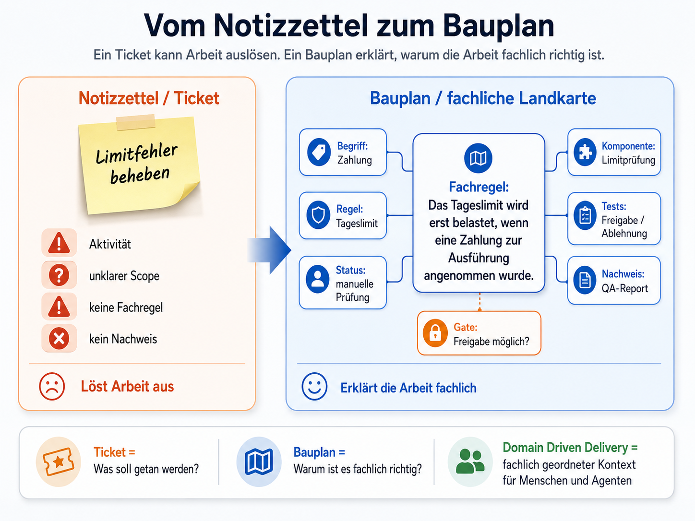

# 07 - Domain Driven Delivery

Das vorherige Kapitel hat beschrieben, wie Menschen und Agenten den richtigen Kontextausschnitt finden.

Dieses Kapitel ergänzt eine weitere Frage:

Wie bleibt dieser Ausschnitt fachlich richtig geordnet?

## Kernaussage in fünf Sätzen

Viele Projekte verlieren nicht daran Klarheit, dass zu wenig Arbeit erledigt wird.

Sie verlieren Klarheit, weil fachliche Begriffe, Entscheidungen, Regeln, Tests und technische Bausteine nicht mehr gut
zusammenpassen.

Domain Driven Delivery verbindet die Sprache der Fachlichkeit mit Artefakten, Gates, Aufgaben, Tests und Nachweisen.

Dadurch wird sichtbar, ob eine Änderung wirklich zum fachlichen Modell passt.

So entsteht aus einzelnen Arbeitsständen ein Bauplan, auf dem Menschen und Agenten verlässlich weiterarbeiten können.

Ein sehr einfacher Unterschied macht das greifbar:

Vorher:

Limitfehler beheben.

Nachher:

Fachregel: Das Tageslimit wird erst belastet, wenn eine Zahlung zur Ausführung angenommen wurde.

Nachweis: Tests zeigen die Fälle manuelle Prüfung, spätere Freigabe und spätere Ablehnung.

Der erste Satz löst Arbeit aus.

Der zweite Satz ordnet die Arbeit fachlich.

## Beobachtung

Softwareentwicklung scheitert selten nur an fehlendem Code.

Oft scheitert sie daran, dass fachliche Begriffe unscharf werden.

Ein Begriff bedeutet im Produkt etwas anderes als im Code.

Ein Ticket beschreibt eine Aktivität, aber nicht die Fachregel dahinter.

Ein Test prüft ein technisches Ergebnis, aber nicht den fachlichen Grund.

Ein Agent schlägt eine Lösung vor, die lokal plausibel ist, aber am eigentlichen Modell vorbeigeht.

Das wird besonders sichtbar, wenn ein bestehendes System über Jahre gewachsen ist.

Dann liegen Wissen und Verantwortung verteilt:

* in Code
* in Tickets
* in alten Entscheidungen
* in Tests
* in Betriebswissen
* in Fachbegriffen
* in Schnittstellen
* in Workarounds
* in unausgesprochenen Annahmen

Ein Agent kann diese Informationen analysieren.

Aber Analyse allein reicht nicht.

Er muss auch verstehen, was fachlich zusammengehört.

Ein Agent braucht deshalb nicht nur Kontext.

Er braucht fachlich geordneten Kontext.

## Warum DDD hier relevant wird

Domain Driven Design hat eine einfache Stärke:

Es nimmt die Fachlichkeit ernst.

Es fragt nicht zuerst:

> Wie bauen wir das technisch?

Sondern:

> Welche Begriffe, Regeln und Grenzen gelten in dieser Domäne?

Diese Denkweise passt gut zu KI-gestützter Softwareentwicklung.

KI-Agenten können sehr schnell technische Vorschläge erzeugen. Gerade deshalb brauchen sie eine klare fachliche
Grundlage.

Wenn die Fachlichkeit unklar ist, kann ein Agent zwar Code liefern. Es bleibt aber offen, ob dieser Code zum
eigentlichen Problem passt.

Domain Driven Delivery überträgt diese Idee auf den Lieferprozess.

Es fragt nicht nur:

> Passt der Code zur Domäne?

Sondern:

> Passt die gesamte Lieferung zur Domäne?

Nicht nur der Code soll zur Domäne passen. Auch Anforderungen, Design, Tasks, Tests, Reviews, Gates und Nachweise sollen
auf die fachlichen Begriffe und Regeln zurückführen.

In einem Satz:

**Domain Driven Delivery bedeutet: Nicht nur der Code soll zur Domäne passen, sondern die gesamte Lieferung.**

Dazu gehören:

* Anforderungen
* Design
* Tasks
* Tests
* Reviews
* Gates
* Nachweise

So wird fachlich prüfbar, ob eine Änderung nur technisch plausibel ist oder wirklich zum fachlichen Modell passt.

## Vom Notizzettel zum Bauplan

Ein einzelnes Ticket ist oft ein Notizzettel.

Es sagt:

Was soll getan werden?

Ein Bauplan beantwortet mehr:

* Warum ist diese Änderung nötig?
* Welcher fachliche Begriff ist betroffen?
* Welche Regel wird geändert?
* Welche bestehende Regel bleibt geschützt?
* Welche Komponente trägt diese Regel heute?
* Welcher Test belegt das Verhalten?
* Welcher Nachweis stützt die Freigabe?

Der Unterschied ist wichtig.

Ein Notizzettel kann Arbeit auslösen.

Ein Bauplan kann Arbeit erklären.

_Für KI-Agenten ist das entscheidend._

Ein Mensch kann aus Erfahrung oft erkennen, worum es fachlich eigentlich geht. Ein KI-Agent braucht dafür eine klare Einordnung: Welche Regel gilt, welche Begriffe wichtig sind, welche bestehende Logik geschützt werden muss und welche Nachweise am Ende zählen.

Ohne diese Einordnung kann ein Agent zwar eine plausible Lösung erzeugen. Es bleibt aber offen, ob diese Lösung fachlich richtig ist.

## Die fachliche Landkarte als Ergänzung zum Kontextgraphen

Eine fachliche Landkarte beschreibt nicht jedes Detail des Systems.

Sie zeigt die Dinge, die für Entscheidungen wichtig sind.

Dazu gehören zum Beispiel:

* fachliche Begriffe
* Regeln
* Ausnahmen
* Grenzen
* Verantwortlichkeiten
* Risiken
* Tests
* Nachweise
* betroffene Komponenten

Diese Landkarte muss nicht als großes Modell beginnen.

Sie kann aus Artefakten wachsen.

Ein User Requirement benennt das Problem.

Ein Produktvertrag beschreibt die fachlichen Regeln.

Ein Solution Design beschreibt die Systemgrenzen.

Ein Task und Test Plan verbindet Arbeit mit Akzeptanzkriterien.

Ein Review prüft, ob die Umsetzung zur Absicht passt.

Ein QA Report zeigt, welche Nachweise vorliegen.

Der Kontextgraph verbindet diese Informationen.

So entsteht schrittweise eine fachliche Landkarte der Delivery.

Damit wird der Begriff nicht als zweites Gedächtnis eingeführt.

Das Projektgedächtnis bleibt bei den Artefakten und ihren Beziehungen.

Die fachliche Landkarte beschreibt den Ausschnitt daraus, der fachliche Begriffe, Regeln, Grenzen und Nachweise für eine
konkrete Aufgabe verständlich macht.

## Beziehungen sind wichtiger als Ablageorte

Ein Dokument allein erklärt noch keinen Zusammenhang.

Wichtig ist, wie die Dinge verbunden sind.

Zum Beispiel:

* Eine Anforderung begründet eine Regel.
* Eine Regel betrifft eine Komponente.
* Eine Komponente gehört einem Team.
* Ein Test prüft ein Akzeptanzkriterium.
* Ein Nachweis belegt einen Testlauf.
* Ein Gate erlaubt den nächsten Schritt.
* Ein Risiko blockiert eine Freigabe.

Diese Beziehungen machen aus gespeicherten Informationen nutzbares Projektwissen.

Ohne Beziehungen bleiben Dokumente Ablage.

Mit Beziehungen entsteht Orientierung.

## Der Unterschied zwischen Ablage und fachlichem Bauplan

Ein Kontextgraph kann auf zwei Arten wachsen.

Er kann mehr Links sammeln.

Oder er kann bessere Beziehungen zeigen.

Mehr Links helfen eine Zeit lang.

Bei vielen Anforderungen, Entscheidungen, Risiken, Tests und Nachweisen entsteht aber ein anderes Problem.

Dann ist nicht mehr nur wichtig, wo etwas liegt.

Wichtig wird, was es fachlich bedeutet.

Ein einfacher Kontextgraph sagt:

* PRD liegt hier
* Design liegt hier
* Task Plan liegt hier
* QA Report liegt hier

Ein fachlicher Bauplan sagt zusätzlich:

* diese Entscheidung wurde aus dieser Anforderung abgeleitet
* diese Aufgabe erfüllt dieses Akzeptanzkriterium
* dieser Test prüft dieses Risiko
* dieser Nachweis belegt diese Gate-Entscheidung
* diese Komponente trägt diese Fachregel
* diese offene Lücke schwächt die Freigabe

Genau hier beginnt Domain Driven Delivery.

Die Beziehungen bekommen fachliche Bedeutung.

Ein Task ist nicht nur Arbeit.

Er ist Arbeit an einer Anforderung, einer Regel, einem Risiko oder einer Komponente.

Ein Test ist nicht nur ein technischer Lauf.

Er ist ein Nachweis für ein Akzeptanzkriterium, ein Risiko oder eine fachliche Regel.

Ein Gate ist nicht nur ein Statuswechsel.

Es ist eine Entscheidung auf Basis von Artefakten, Risiken und Nachweisen.

Diese Unterscheidung wird mit wachsender Projektgröße wichtiger.

Bis zu einer gewissen Größe kann ein Team vieles durch Erfahrung ausgleichen.

Danach wird die fachliche Beziehung selbst zum Arbeitsmittel.

Nicht weil das Projekt akademischer werden soll.

Sondern weil Menschen und Agenten sonst nicht mehr zuverlässig erkennen, ob ein Vorschlag nur plausibel klingt oder
wirklich auf der richtigen fachlichen Grundlage arbeitet.

## Was der Kontextgraph dafür leisten kann

Der Kontextgraph ist in diesem Entwurf der Ort, an dem diese Beziehungen sichtbar werden.

Er ersetzt keine Artefakte.

Er ersetzt keine Gates.

Er ersetzt keine fachliche Entscheidung.

Er zeigt, wie diese Dinge zusammenhängen.

Dadurch kann ein Gate mehr prüfen als ein einzelnes Dokument.

Es kann fragen:

* Hat jede wichtige Anforderung ein Akzeptanzkriterium?
* Hat jedes kritische Akzeptanzkriterium einen Test?
* Gibt es Risiken ohne Mitigation?
* Gibt es Tasks ohne fachlichen Bezug?
* Gibt es Designentscheidungen ohne Produktgrundlage?
* Gibt es QA-Aussagen ohne Nachweis?
* Berührt eine Änderung eine Komponente, deren Owner nicht beteiligt ist?

Das ist der Schritt vom Notizzettel zum Bauplan.

## Brownfield macht die Landkarte wichtiger

In einem neuen System kann ein Team viele Grenzen bewusst setzen.

In einem bestehenden System sind Grenzen oft bereits entstanden.

Manche sind dokumentiert.

Manche stecken im Code.

Manche leben im Betriebswissen.

Manche sind nur noch als Workaround sichtbar.

Brownfield bedeutet deshalb:

Die fachliche Landkarte muss auch das bestehende System ernst nehmen.

Es reicht nicht, neue Anforderungen sauber zu beschreiben.

Man muss auch verstehen, welche bestehende Logik betroffen ist.

Beispiele:

* Welche Komponente entscheidet heute über eine Fachregel?
* Welche Schnittstelle transportiert diesen Begriff?
* Welche Datenbanktabelle hält den wirksamen Zustand?
* Welche Tests schützen das Verhalten?
* Welche historische Entscheidung darf nicht übersehen werden?
* Welche technische Schuld macht eine Änderung riskant?

Eine Brownfield-Analyse erweitert dadurch nicht nur den aktuellen Arbeitsstand.

Sie verbessert die fachliche Landkarte für spätere Läufe.

## Was Agenten dadurch besser können

Ein Agent arbeitet besser, wenn er nicht nur mehr Text bekommt.

Er arbeitet besser, wenn er den richtigen Ausschnitt fachlich geordnet bekommt.

Domain Driven Delivery hilft dabei.

Der Agent kann sehen:

* welche fachlichen Begriffe relevant sind
* welche Regeln gelten
* welche Grenzen nicht überschritten werden dürfen
* welche bestehenden Komponenten betroffen sind
* welche Tests als Nachweis zählen
* welche Risiken offen sind
* welches Gate den nächsten Schritt erlaubt

Dadurch wird der Agent nicht automatisch richtig.

Aber seine Arbeit wird besser prüfbar.

Menschen müssen weniger erraten, worauf ein Vorschlag beruht.

Sie können gezielter prüfen, ob der Vorschlag zur Domäne passt.

Der entscheidende Punkt ist nicht, ob der Vorschlag plausibel klingt.

Der entscheidende Punkt ist, ob er auf der richtigen fachlichen Regel arbeitet.

## Was nicht gemeint ist

Domain Driven Delivery bedeutet nicht, dass jedes Projekt ein großes DDD-Modell braucht.

Es bedeutet auch nicht, dass jedes Team Event Storming, Aggregates oder taktische DDD-Muster einführen muss.

Der Entwurf ist einfacher.

Er sagt:

Fachliche Begriffe, Regeln, Grenzen und Nachweise müssen im Lieferprozess sichtbar bleiben.

Wenn ein Projekt bereits mit DDD arbeitet, kann dieser Ansatz daran anschließen.

Wenn ein Projekt nicht mit DDD arbeitet, kann es trotzdem profitieren.

Dann beginnt man klein:

* zentrale Begriffe klären
* Regeln sichtbar machen
* Grenzen markieren
* Tests mit Akzeptanzkriterien verbinden
* Brownfield-Erkenntnisse festhalten
* Nachweise an Gates zurückführen

## Beispiel

Im Bankbeispiel geht es nicht nur um einen Bug.

Es geht um eine fachliche Regel:

Eine Zahlung darf erst dann auf das Tageslimit zählen, wenn sie zur Ausführung angenommen wurde.

Diese Regel berührt mehrere Dinge:

* den Begriff Zahlung
* den Status manuelle Prüfung
* das Tageslimit
* die Ausführung
* den Buchungspfad
* die Tests für Freigabe und Ablehnung
* die Nachweise für QA

Ein einfacher Task könnte lauten:

Limitfehler beheben.

Das ist ein Notizzettel.

Ein fachlich nachvollziehbarer Bauplan zeigt zusätzlich:

* welche Regel falsch umgesetzt war
* welche bestehende Logik geschützt bleibt
* welche Status fachlich unterschieden werden
* welche Tests die neue Regel belegen
* welcher Nachweis die Freigabe stützt

Genau diese Verbindung macht den Unterschied.

## Kernaussage

Domain Driven Delivery verbindet Fachlichkeit und Lieferung.

Artefakte halten fest, was gelten soll.

Gates entscheiden, ob weitergearbeitet werden darf.

Qualitätsverträge machen Regeln prüfbar.

Der Kontextgraph zeigt die Beziehungen.

Brownfield-Analysen ergänzen das bestehende Systemwissen.

So entsteht eine fachliche Landkarte, auf der Menschen und Agenten arbeiten können.

Nicht jedes Detail muss modelliert werden.

Aber die wichtigen Begriffe, Regeln, Grenzen, Risiken und Nachweise müssen auffindbar bleiben.

Dann wird aus einer Sammlung von Tickets, Dokumenten und Agentenläufen ein Bauplan.

Dieser Bauplan zeigt, ob ein Agent fachlich richtig arbeitet oder nur plausibel liefert.

## Weiterführend

Die wichtigsten Begriffe sind im [Glossar](glossar.md) kurz abgegrenzt.

Ein einfaches Beispiel für diese Denkweise zeigt
der [KI-gestützte Lieferprozess in einem Bankenumfeld](../examples/sample-banking-flow.md).
