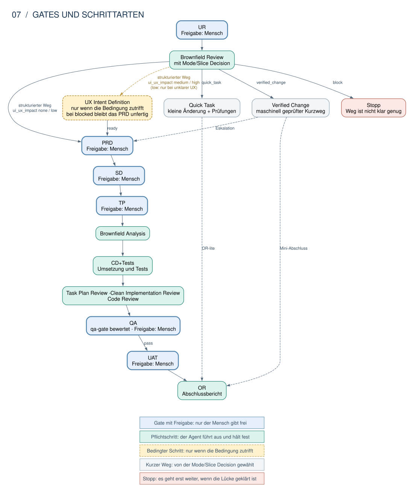

# Dispatcher: Architektur und Use Cases

**Stand: 2. Oktober 2026, Repository-Quelle.** Dieses Dokument erklärt den implementierten
Dispatcher. Es belegt weder die Veröffentlichung eines Pakets noch das Verhalten einer geladenen
Host-Sitzung. Der [Architektur-Einstieg](README.md) zeigt den durchgehenden Arbeitsablauf;
die [Bestandsbeschreibung](01-systemarchitektur.md) ordnet den Dispatcher in die Bausteine und
Aufrufwege ein. Dieses Dokument vertieft diesen Teil der bestehenden Architektur.
Weiterentwicklung, Kontrollkatalog und Roadmap stehen im [gemeinsamen Zielbild](03-agentenkontrolle-zielbild.md).

Der Dispatcher verbindet einen konkreten Agentenauftrag mit einem Zielprojekt, dem erforderlichen
Kontrollkontext und dem nächsten begrenzten Arbeitsschritt. Er führt diesen Arbeitsschritt nicht
selbst aus. **Jedes Ergebnis trägt `authorizes: false`.** Eine technische Prüfung, eine
Fortsetzung oder eine Vorschau erzeugt keine menschliche Freigabe.

Die Use-Case-Kennungen unten dienen der Orientierung in dieser Dokumentation. Sie sind keine
Runtime-Kennungen und definieren keine zusätzliche Policy. Maßgeblich bleiben der
[Werkzeugvertrag](../../packages/core/lib/skill-dispatch/contract.js), der
[Dispatch-Service](../../packages/core/lib/skill-dispatch/service.js) und die
[Runtime-Verträge](../../plugins/agdf/meta/contracts/).

## Zuständigkeiten und Aufrufwege

| Beteiligter | Verantwortung |
|---|---|
| Mensch | Beauftragt Ziel und Umfang und trifft die erforderlichen Gate-Entscheidungen. |
| Coding-Agent | Wendet den Aktivierungsvertrag an, vergleicht den Auftrag mit den referenzierten URs, führt zurückgegebene Schritte aus und zeigt die kanonische Antwort. |
| Skill-Bindung oder MCP-Adapter | Ruft die geprüfte Laufzeit mit dem kanonischen Eingabeschema auf. Der Adapter besitzt keine eigene Run-, Gate- oder Freigabelogik. |
| Dispatcher | Validiert Eingaben, bindet das Ziel, beschafft Zuordnungsbelege, ruft die Kontrollauswertung auf und liefert ein Ergebnis samt `host_action`. |
| Gate-Evaluator | Bestimmt den aktuellen Kontrollstand, Voraussetzungen und die zulässige nächste Operation aus dem kanonischen Zustand. |
| Benannter Skill | Bearbeitet den gelieferten Auftrag innerhalb seines Vertrags; beispielsweise Brownfield Analysis oder die QA-Entscheidung. |
| Kanonische Writer | Persistieren separat Run-Zustand, Revisionen und Präsentationsbindungen. Sie werden vom Agenten aufgerufen, nicht vom Dispatcher ausgeführt. |

*Logischer Ablauf; die Fortsetzungszweige gelten nur unter den jeweiligen Eingabe- und
Kontrollbedingungen. [Diagrammquelle](diagrams/03-dispatch.dot).*

Der agentennative Skill-Weg und MCP `agdf_dispatch` erreichen denselben Dispatch-Service.
`agdf_inspect` hat einen eigenen lesenden Vertrag und Service und verwendet die gemeinsamen
Kontrollevaluatoren. Inspect führt keine Delivery-Fortsetzung aus. Installation, MCP-Registrierung
und Repository-Migration gehören zu getrennten Services; sie sind keine Dispatcher-Freigaben.

### Operationsabhängige Inspect-Eingaben

`agdf_inspect` veröffentlicht die bestehenden Auswahlregeln auch als JSON-Schema:
`all_active: true` gilt nur für `doctor` und `delivery-map`; `variant` nur für
`gate-check`; `module` ausschließlich und verpflichtend für `contract`.
`all_active: false` bleibt bei allen Operationen zulässig. Für ein Inventar aller
aktiven Runs wird `doctor` oder `delivery-map` gewählt. Ein `gate-check` wird nicht
automatisch umgedeutet. Schemawidrige Kombinationen erreichen den MCP-Executor
nicht; direkte Core-/CLI-Aufrufe behalten die gemeinsame Auswahlvalidierung.
Diese Grenze belegt keine fehlerfreie Operationswahl eines frisch geladenen Modells.

## Bindung vor Fortsetzung

### Sichtbarer Skillname und stabile AGDF-ID

Der aus der [Plugin-Definition](../../plugins/agdf/meta/agdf-plugin.definition.json)
berechnete [Namenskatalog](../../packages/core/lib/skill-dispatch/contract.js) ordnet
exakt registrierte Hostnamen demselben kanonischen Skill-Katalogeintrag zu. Die
Produktionsinstanz erhält diese Definition aus ihrem bestehenden Resource Context;
das Modell kann keine Aliasliste oder Präfixregel übergeben.

| Oberfläche | Gültige Beispiele | Interne ID |
|---|---|---|
| Codex / Claude Code | `gate-check`, `agdf:gate-check` | `gate-check` |
| Copilot | `gate-check`, `agdf-gate-check` | `gate-check` |
| OpenCode lokal / global | `gate-check`, `agdf-gate-check`, `agdf-global-gate-check` | `gate-check` |

Die Beispiele werden für alle registrierten Skills aus ihren Slugs, der Plugin-ID
und den vorhandenen Hostpräfixen abgeleitet. Die aufrufende Oberfläche bestimmt die
erlaubten Formen; MCP bindet sie über den vertrauenswürdigen Runtime-Kontext.
Unbekannte Namen, fremde Formen und Alias-/ID-Kollisionen scheitern vor Ziel- oder
Kontrollevaluierung. Es gibt keine heuristische Präfixentfernung. Die Recovery nennt
gültige Eingaben aus dem aktiven Katalog, sofern dieser eindeutig ist.

Ergebnisse, Fortsetzungen, `skill_id`, CLI `--skill` und technische Contractreferenzen
tragen ausschließlich die stabile kanonische ID. Hostgeneratoren und globale Adapter
verwenden dieselbe Ableitung für Frontmatter und explizite sichtbare Aufrufreferenzen;
sie benennen keine bloßen ID-Erwähnungen oder Pfadsubstrings pauschal um.
Eine Namensauflösung ersetzt keine Ziel-, Run- oder Freigabebindung.

Die Tests belegen Quellcode-, Protokoll- und Paketverhalten. Installation und eine
frisch geladene Host-/Modellsitzung sind davon getrennte Nachweise.

`working_directory` ist Aufrufkontext. Das Governance-Ziel benötigt eine belegte Herkunft aus
`explicit_target`, `continued_target` oder `current_repository`. Eine Belegquelle oder ein zufällig
gefundenes Repository wird dadurch nicht zum Ziel. Die Gesprächssprache wird explizit als
`presentation_language` übergeben; sie muss bereits vor der Zielauflösung validierbar sein.

Für `gate-check` unterscheidet der Vertrag drei Absichten:

| Eingabe | Bedeutung |
|---|---|
| Ohne `intake` und ohne `continue_delivery` | Kontrollstand anzeigen; keine automatische Delivery-Fortsetzung. |
| `intake: true` | Positiv beauftragter Delivery-Einstieg. Ohne Run-Bindung zunächst den Umfang zuordnen; danach den konkreten neuen oder fortgesetzten Run bearbeiten. |
| `continue_delivery: true` mit Run-ID | Einen gebundenen Delivery-Pfad anhand seines aktuellen Zustands fortsetzen. Nicht mit `intake` kombinierbar. |

Beide Fortsetzungsoptionen gehören ausschließlich zu `gate-check`. Ein Urteilsskill wie `qa-gate`
erhält seinen eigenen Auftrag ohne `continue_delivery`. `expected_revision_id` bindet einen
Intake-Resume an die zuvor gelesene oder vom Writer zurückgegebene Revision; eine Abweichung liefert
frische Zuordnungsbelege. Sie darf nicht automatisch einen anderen oder neuen Run auswählen.

Die Ausgabefelder haben unterschiedliche Aufgaben:

| Feld | Bedeutung |
|---|---|
| `outcome`, `terminal` | Ergebnistyp und ob dieser Aufruf endet. |
| `control.gate_route` | Abgeleitete Route für das aktuelle Gate; keine Freigabe des nachfolgenden Gates. |
| `control.next_operation` | Vom Evaluator bestimmte nächste Operation, etwa `prepare_gate_artifact`. |
| `control.missing_approval` | Noch ausstehende menschliche Freigabe. |
| `continuation.phase` | Anlass der begrenzten Fortsetzung; kein zusätzlicher Ergebnistyp. |
| `host_action` | Verbindliche Behandlung des Ergebnisses durch den Aufrufer. |

## Schrittklassen

Ein Run besteht aus drei Arten von Schritten. Sie unterscheiden sich darin, wer entscheidet.

| Art | Schritte | Wer entscheidet |
|---|---|---|
| **Gate mit Freigabe** | UR, PRD, SD, TP, QA, UAT | Nur der Mensch. |
| **Pflichtschritt** | Brownfield Review mit Mode/Slice Decision, Brownfield Analysis, CD+Tests, Task Plan Review, Clean Implementation Review, Code Review, OR | Der Agent. Er führt den Schritt aus und hält das Ergebnis fest. |
| **Bedingter Schritt** | UX Intent Definition | Der Agent, aber nur wenn die Bedingung zutrifft. |

*Die Mode/Slice Decision wählt den Weg. Nur der strukturierte Weg führt durch PRD, SD, TP,
Brownfield Analysis, die Reviews, QA und UAT. Quick Task und Verified Change enden mit einem kurzen
Abschluss. Verified Change kann in den strukturierten Weg wechseln.
[Diagrammquelle](diagrams/07-gate-steps.dot).*

Die fachliche Beschreibung jedes Schritts steht in [02 - Gates](../02-gates.md). Dort heißen UR,
PRD, SD und TP auch G-00 bis G-03.

**Gate mit Freigabe.** Der Agent bereitet die Entscheidung vor und zeigt sie mit `run-present` an.
`run-present` speichert die vorbereitete Bindung; die Vorschau des Evaluators ist dagegen lesend.
Danach wartet der Agent auf eine neue Antwort des Menschen. Erst diese Antwort gibt das Gate frei. Der
Skill `qa-gate` bewertet die Qualität mit `pass`, `revise` oder `block`. Die Freigabe `Approval: QA`
erteilt trotzdem der Mensch. Im Dispatcher: UC-D10, UC-D11 und UC-D13.

**Pflichtschritt.** Der Agent muss den Schritt ausführen. Er gibt damit nichts frei und erhält
keine Erlaubnis zur Umsetzung. Danach prüft der Dispatcher den Run erneut. Wann ein Pflichtschritt
dran ist:

- Brownfield Review: immer nach der Freigabe des UR.
- Brownfield Analysis: nach der Freigabe des TP. Ist sie bestanden, darf die Umsetzung beginnen
  (in 02 - Gates: G-04 Implementation Entry).
- CD+Tests, danach Task Plan Review, Clean Implementation Review und Code Review: vor QA.
- OR: nach der Freigabe der UAT.

Im Dispatcher: UC-D09, UC-D12 und UC-D14.

**Bedingter Schritt.** Der Brownfield Review bewertet, wie stark der Auftrag die Bedienung betrifft
(`ui_ux_impact`):

- `medium` oder `high`: Die UX Intent Definition ist Pflicht, bevor das PRD als fertig gelten darf.
- `low`: Sie ist nur Pflicht, wenn für das PRD noch unklar ist, wie sich die Bedienung verhalten soll.
- `none`: Der Schritt entfällt.

Die UX Intent Definition endet mit `ready`, `blocked` oder `not_applicable`. Sie gibt nichts frei.
Bei `blocked` darf das PRD nicht als fertig gelten. Der Dispatcher hat für diesen Schritt keinen
eigenen Fall.

Welche Schritte zu welcher Art gehören, steht im Code: `userGateOrder`, `internalStepArtefacts` und
`closeoutArtefacts` in [`run-state.js`](../../packages/core/lib/control-evaluation/run-state.js).
Die Regeln, wann ein Schritt nötig ist, stehen im
[Gate-Übergangsvertrag](../../plugins/agdf/meta/contracts/gate-transition.md).

## Bekannte Grenzen: Wo der Agent sich selbst kontrolliert

Die folgenden Grenzen erklären das aktuelle Routing. Sie werden im
[Kontrollkatalog](03-agentenkontrolle-zielbild.md#4-kontrollkatalog-und-bindung-konkreter-aktionen)
als C-05 bis C-09 aufgegriffen. Lösungsmechanismen und Abhängigkeiten stehen dort und in der
[gemeinsamen Roadmap](03-agentenkontrolle-zielbild.md#10-abgleich-der-umfänge-und-umsetzungsroadmap).

| Grenze im bestehenden Ablauf | Maßgebliche Quelle | Verbindung zum Zielbild |
|---|---|---|
| Der Agent trifft die Mode/Slice Decision. Der Evaluator verarbeitet die gespeicherte Quick-Task-Entscheidung; Verified Change hat zusätzliche Eignungsprüfungen. | [Gate-Übergang](../../plugins/agdf/meta/contracts/gate-transition.md), [Gate-Policy](../../packages/core/lib/control-evaluation/gate-policy.js), [Verified Change](../../packages/core/lib/control-evaluation/verified-change.js) | C-07: Grundlagen eines leichteren Ablaufs prüfen; R-01 |
| Reviews können vom umsetzenden Agenten stammen. Ein aufgezeichnetes Reviewergebnis allein belegt keine unabhängige Prüfung. | [Qualitätsvertrag](../../plugins/agdf/meta/contracts/quality.md) | C-08/C-09: tatsächliche Ergebnisse und Unabhängigkeit belegen; R-03 |
| Die bedingte UX Intent Definition und die Bewertung der Architecture Impact verlangen fachliche Einordnung durch den Agenten; universelle technische Durchsetzung ist nicht nachgewiesen. | [Brownfield-Vertrag](../../plugins/agdf/skills/brownfield-analysis/SKILL.md), [UX-Solution-Design](../../.agdf/control/artefacts/prd-ux-intent-requirements/SD.md), [dokumentiertes Risiko](../../.agdf/control/artefacts/prd-ux-intent-requirements/OR.md) | C-07: bedingte Anforderungen prüfen; R-01 |
| Direkte Werkzeuge des Hosts können außerhalb des Dispatcher-Pfads wirken. | [Bestandsbeschreibung der Durchsetzungsgrenzen](01-systemarchitektur.md#5-regel-prüfung-und-durchsetzung) | C-05: tatsächliche Aktionswege kontrollieren; R-02 |

Die QA-Bewertung verlangt vollständige Anforderungen und behandelte Befunde. Daraus folgt keine
universelle technische Erkennung einer ausgelassenen Prüfung. Ebenso bietet ein Reviewer mit neuem
Kontext eine zusätzliche Perspektive, aber allein noch keine unabhängige Vertrauensgrenze. Diese
Unterscheidungen erläutert die [Ergebnisprüfung im Zielbild](03-agentenkontrolle-zielbild.md#6-prüfung-der-tatsächlichen-arbeit-und-unabhängigkeit).

## Use-Case-Katalog

Die Tabelle beschreibt den jeweiligen Einstieg und das erwartete Verhalten. Schreibende Schritte
in der letzten Spalte erfolgen **nach** dem Dispatch durch den Agenten über die zuständigen Writer.

| Fall | Auslöser und Bindung | Dispatcher-Ergebnis | Nächster Akteur und Grenze |
|---|---|---|---|
| **UC-D01 · Normale Hilfe / Opt-out** | Erklärung, Diagnose oder ausdrücklicher Verzicht auf AGDF ohne anderslautenden Auftrag. | Kein anfragebedingter Dispatch; Aktivierung wird davor entschieden. | Agent bearbeitet die Anfrage. Plugin-Entdeckung, Arbeitsverzeichnis und frühere Runs aktivieren keinen Delivery-Auftrag. |
| **UC-D02 · Kontrollstatus** | Explizite Kontrollabfrage mit belegtem Ziel, ohne Delivery-Fortsetzung. | `control_result`, terminal; bei unklarer Run-Auswahl kanonische Auswahl-/Statusdarstellung. | Agent zeigt den Text unverändert und beendet den Aufruf. Ein lesender Gate-Vorschautext ist keine gebundene Freigabefrage. |
| **UC-D03 · Ziel offen** | Gültige Eingabe, aber keine belastbare Zielbindung. | `target_unresolved`, terminal; keine Run- oder Gate-Auswertung. | Agent zeigt die kanonische Zielorientierung und stoppt. |
| **UC-D04 · Auftrag zuordnen** | Positiver Intake ohne bestätigten Run. | `intake_continuation`, Phase `resolve_delivery_run`; kanonische Kandidaten mit UR-Referenzen und Revisionen, noch kein einzelnes Gate-Ergebnis. | Agent liest die vollständigen referenzierten URs und vergleicht den Umfang. Anzahl und Aktualität der Runs sowie `AGDF_RUN_ID` ersetzen diesen Vergleich nicht. |
| **UC-D05 · Bestehenden Umfang fortsetzen** | Der Auftrag passt eindeutig in einen bestehenden UR. | Nach Resume mit Run-ID und `expected_revision_id`: aktuelle Gate-Auswertung oder passende Fortsetzung. | Agent arbeitet nur im gebundenen Umfang; frühere Freigaben werden nicht auf einen neuen Umfang übertragen. |
| **UC-D06 · Neuen Umfang beginnen** | Eigenständiger Auftrag; kein passender aktiver Umfang. Agent liefert eine neue, unbenutzte Run-ID mit Intake-Modus `new`. | `intake_continuation`, Phase `run_missing`; nach Erstellung und Resume gegebenenfalls `ur_missing`. | Agent ruft `run-create` auf, schreibt den UR und erfasst ihn mit `run-step`. Jede erneute Bindung verwendet die vom Writer zurückgegebene Revision. |
| **UC-D07 · Fachlich mehrdeutig** | Mehrere plausible UR-Umfänge oder unklare Abgrenzung. | Die Zuordnungsfortsetzung liefert Belege, keine semantisch ausgewählte Run-ID. | Agent stellt eine gezielte fachliche Frage. Der Dispatcher entscheidet die Umfangsübereinstimmung nicht. |
| **UC-D08 · Zuordnung veraltet / Bestand ungültig** | Intake-Revision geändert oder Run-Bestand unvollständig bzw. Integrität verletzt. | Veraltete Revision: frische `resolve_delivery_run`-Fortsetzung. Ungültiger Bestand: terminaler Kontrollbefund oder technische Recovery. | Agent vergleicht bei neuer Revision erneut. Fehlerhafte Bestände gelten nicht als leere Kandidatenliste und erlauben keinen Ersatz-Run. |
| **UC-D09 · Interne Brownfield-Schritte** | Intake oder Fortsetzung am Brownfield Review / Mode-Slice Decision; später strukturierter Pfad an Brownfield Analysis nach erfülltem TP. | `skill_continuation`, Phase `post_ur_review` bzw. `pre_implementation_analysis`, Skill `brownfield-analysis`. | Agent führt den benannten Skill aus und persistiert Review/Analyse und interne Schritte. Danach erneute Prüfung desselben Runs; unveränderter blockierter Zustand beendet die Fortsetzung. |
| **UC-D10 · Aktuelles Gate-Artefakt fehlt** | Gebundene Fortsetzung; Evaluator liefert `next_operation.type: prepare_gate_artifact`. | `skill_continuation`, Phase `required_gate_artifact`, mit Gate, Ausgabe- und Quellpfaden. | Agent erstellt das aktuelle Artefakt gemäß Vertrag und prüft danach erneut. Die Vorbereitung erlaubt weder ein späteres Artefakt noch eine vorgezogene Freigabefrage. |
| **UC-D11 · Menschliche Entscheidung vorbereiten** | Intake oder Fortsetzung; aktuelle Gate-Auswertung liefert eine gültige Approval-Präsentation. | `intake_continuation`, Phase `presentation_required`, lesende Vorschau und gebundener `run-present`-Schritt. | Agent ruft `run-present` auf, zeigt dessen Text unverändert und wartet auf eine **neue** bewusste Antwort. Der Dispatcher bindet oder persistiert keine Freigabe. |
| **UC-D12 · Benannten Skill ausführen** | Direkter Urteilsskill oder zulässige nächste Skill-Route bei gebundener Fortsetzung. | `skill_continuation` mit Skill, Ziel, Sprache und erforderlichem Kontroll-Snapshot. | Agent führt genau diesen Skill aus. Für unaufgelöste QA-Auswahl liefert der Evaluator die vollständige Kandidatenliste; der QA-Skill filtert nach QA und sucht nicht erneut in Run-Dateien. |
| **UC-D13 · QA-Nacharbeit / Blocker** | QA verlangt Nacharbeit, ist blockiert oder Voraussetzungen fehlen. | Aktuelle Kontroll-/Skill-Route gemäß Zustand; keine automatische Fortsetzung in spätere Gates. | Agent folgt dem konkreten Befund. Der Dispatcher trifft keine eigene QA-Entscheidung und wandelt `revise` nicht in `pass` um. |
| **UC-D14 · OR nach UAT** | Gebundene strukturierte Fortsetzung an OR, UAT erfüllt, keine offene Freigabe, OR noch nicht abgeschlossen. | `skill_continuation`, Phase `post_uat_closeout`, Skill `release-or`. | Agent erstellt und persistiert den Orchestration Report und prüft erneut. Commit, Push, PR oder Release werden dadurch nicht beauftragt. |
| **UC-D15 · Eingabe / Laufzeitfehler** | Ungültige Argumente, fehlender Vertrag oder technische Auswertung fehlgeschlagen. | `invalid_input` bzw. `evaluator_error`, terminal mit stabiler Recovery. | Agent zeigt die Recovery unverändert und stoppt. Kein alternativer Laufzeitpfad, keine Konfigurationsreparatur und keine Zustandsänderung allein aus diesem Ergebnis. |

## Drei typische Abläufe

**Neuer Auftrag:** Der erste Intake liefert `resolve_delivery_run`. Nach dem Vergleich mit den
referenzierten URs wählt der Agent bei eigenständigem Umfang eine unbenutzte Run-ID. Der nächste
Intake im Modus `new` liefert `run_missing`. Der Agent erstellt den Run und setzt mit dessen
Revision im Modus `resume` fort. `ur_missing` liefert die Schritte zum Schreiben und Erfassen des
UR. Erst die erneute Prüfung dieses Zustands kann `presentation_required` liefern. Auf
`run-present`, Anzeige und die neue menschliche Antwort folgt ein gesonderter Freigabevorgang.

**Bestehender Auftrag:** Der Agent liest die referenzierte vollständige UR-Fassung und bindet
den passenden Run mit ihrer aktuellen Revision. Hat sich die Revision geändert, folgt erneut der
Umfangsvergleich. Ein jüngerer Run oder ein ähnlicher Titel überspringt diesen Schritt nicht.

**Nächstes Gate vorbereiten:** `gate-check` mit `continue_delivery` prüft den gebundenen Run.
Wenn der Evaluator beispielsweise das aktuelle PRD zur Vorbereitung benennt, erstellt der Agent
dieses Artefakt aus den gelieferten Quellpfaden. Eine erneute Prüfung entscheidet, ob weitere Arbeit
oder `presentation_required` folgt. Die menschliche Freigabe bleibt ein eigener Schritt.

## Ergebnisbehandlung

Der Werkzeugvertrag besitzt genau sechs Ergebnistypen:

| `outcome` | `terminal` | Behandlung |
|---|---|---|
| `invalid_input` | `true` | Kanonische Recovery unverändert zeigen und stoppen. |
| `target_unresolved` | `true` | Kanonische Zielorientierung unverändert zeigen und stoppen. |
| `control_result` | `true` | Kanonische Präsentation oder Recovery unverändert zeigen und stoppen. |
| `evaluator_error` | `true` | Kanonische Recovery unverändert zeigen und stoppen. |
| `intake_continuation` | `false` | Die konkrete Zuordnung, Intake-Schritte oder Präsentationsvorbereitung ausführen. |
| `skill_continuation` | `false` | Den benannten Skill mit der gelieferten Bindung und dessen Vertrag ausführen. |

Ein terminaler Text bildet die gesamte Antwort auf diesen Dispatch: ohne angehängte Frage,
Übersetzung oder weitere Aktion. Bei Fortsetzungen bestimmt `host_action` den Auftrag; das Feld
`terminal: false` ist keine allgemeine Erlaubnis zum Weiterarbeiten. Insbesondere ist
`presentation_required` eine Phase von `intake_continuation` und `prepare_gate_artifact` eine
Evaluator-Operation, kein siebter oder achter Ergebnistyp.

## Quellen und Verifikation

| Thema | Maßgebliche Implementierung / Vertrag | Bestehender Test-Einstieg |
|---|---|---|
| Eingabe, Ergebnisse, Host-Aktion und Routing | [Vertrag](../../packages/core/lib/skill-dispatch/contract.js), [Service](../../packages/core/lib/skill-dispatch/service.js) | [Dispatch-Tests](../../packages/cli/scripts/skill-dispatch-test.js), [Funktionsvertrag](../../packages/cli/scripts/skill-dispatch-function-contract-test.js) |
| Aktivierung und Interaktion | [Request Activation](../../plugins/agdf/meta/contracts/request-activation.md), [Interaktion](../../plugins/agdf/meta/contracts/interaction.md) | [Dispatch-Tests](../../packages/cli/scripts/skill-dispatch-test.js) für Runtime-Verhalten; die anfragebezogene Aktivierung durch den Agenten braucht eigene Host-Evidenz. |
| Run-Zuordnung und Intake | [Zuordnung](../../packages/core/lib/skill-dispatch/delivery-run-assignment.js), [Intake](../../packages/core/lib/skill-dispatch/delivery-intake.js) | [Zuordnungs-Tests](../../packages/cli/scripts/delivery-run-assignment-test.js) |
| Schrittklassen und Regeln für bedingte Schritte | [Run-Zustand](../../packages/core/lib/control-evaluation/run-state.js), [Gate-Übergang](../../plugins/agdf/meta/contracts/gate-transition.md) | Bedingte Schritte, Wegwahl und Reviews: keine Prüfung durch Software, siehe [bekannte Grenzen](#bekannte-grenzen-wo-der-agent-sich-selbst-kontrolliert) |
| Gate-Routing und Artefaktvorbereitung | [Gate-Evaluator](../../packages/core/lib/control-evaluation/gate-check.js), [Vorbereitungsvertrag](../../plugins/agdf/meta/contracts/gate-artifact-preparation.md), [Gate-Übergang](../../plugins/agdf/meta/contracts/gate-transition.md) | [Dispatch-Tests](../../packages/cli/scripts/skill-dispatch-test.js) |
| Präsentationsbindung und Freigabeprüfung | [Präsentations-Writer](../../packages/core/lib/control-state/run-presentation.js), [Approval-Validator](../../packages/core/lib/control-state/gate-approval-validator.js) | [Dispatch-Tests](../../packages/cli/scripts/skill-dispatch-test.js) für die Übergabe an den Writer |
| MCP-Projektion | [MCP-Laufzeit](../../packages/cli/lib/mcp-dispatch-runtime.js), [Server](../../packages/mcp-server/src/server.js) | [Protokoll](../../packages/mcp-server/test/protocol.test.js), [Fortsetzungen](../../packages/mcp-server/test/continuation.test.js) |

Quellcode und lokale Tests belegen Vertrags- und Routingverhalten. Ob ein bestimmter Host die
Bindung lädt, den richtigen Aufruf ausführt, eine Fortsetzung beachtet und den Text unverändert
anzeigt, benötigt zusätzlich einen frischen Host-Test. Der Katalog ist keine Behauptung, dass jeder
Fall bereits in jeder Host-/Modellkombination beobachtet wurde.

Bei Änderungen an Ergebnisfeldern, Routing, Phasen oder Writer-Grenzen sind Katalog,
[Übersicht](README.md) und DOT/SVG gemeinsam zu prüfen. Die fachliche Regel bleibt bei ihrem
verlinkten Owner; dieses Dokument erklärt ihre Wirkung.

### Validierte Transportverträge und Zieldiagnosen

Der Dispatcher veröffentlicht die Abhängigkeiten von `intake_mode`, `expected_revision_id` und `continue_delivery` im Eingabeschema. Eine Revision benötigt `intake: true`, `intake_mode: resume` und `run_id`; eine aktive Fortsetzung benötigt `run_id` und schließt Intake aus. Explizites `false` bleibt zulässig. Die katalogbasierte Skill-Auflösung und die Laufzeitprüfung bleiben maßgeblich für die Skill-Berechtigung dieser Optionen.

Inspect-Ausgaben typisieren Bericht, Präsentation, Recovery und Host-Aktion. Präsentationen enthalten Markdown, Recovery enthält einen Handlungstext; terminale Übermittlungsaktionen benötigen Text und verbieten Begleittext. Operationsspezifische Berichtsinhalte bleiben beim jeweiligen Evaluator.

Die Zielauflösung meldet ungültige Arbeitsordner, relative Zielpfade, Ziele außerhalb eines verifizierten Repositorys, ersetzte Fortsetzungsziele sowie falsche Wurzel- und Kontextbindungen separat. Jede Diagnose besitzt eine deutsche und englische Rückmeldung. Der bisherige Grund `target_content_mismatch` bleibt für ältere Ergebnisse darstellbar. Keine Diagnose leitet ein Ziel aus dem Arbeitsordner ab oder erteilt eine Freigabe.

### Inspect-Ergebnis und Stop-Semantik

Ein erfolgreiches `inspect_result` hat `terminal: false` und `consume_report_and_continue`: Der Host verarbeitet den Bericht und kann die Antwort formulieren. Zielklärungen und Fehler haben `terminal: true` und eine passende Übermittlungsaktion; deren Text wird unverändert ausgegeben, anschließend endet die Antwort.

Das Ausgabeschema bindet Erfolg an einen Bericht, eine bekannte Operation und ein Ziel ohne Recovery. Zielklärungen benötigen eine Präsentation, Fehler eine Recovery. Host-Modus, Quelle, Begleittext und Stop-Flag müssen zur Ergebnisart passen. Die Textgleichheit zwischen Host-Aktion und ihrer Quelle erzeugt der gemeinsame Laufzeit-Owner; JSON Schema prüft die Struktur, nicht die Gleichheit zweier dynamischer Texte.
