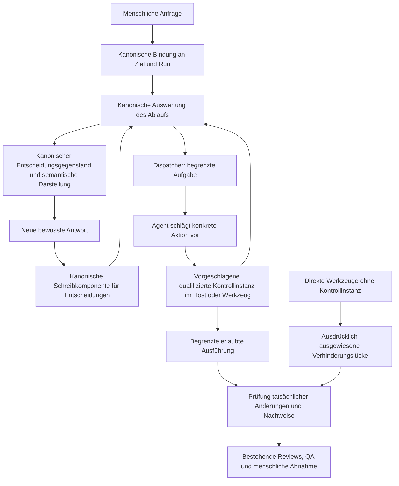

# Gesamtkonzept zur Kontrolle des Coding-Agenten: Dispatcher, MCP und Hosts

Datum: 2026-10-02
Run: agent-control-dispatcher-mcp-concept-20261002-01
Verantwortlicher: Arndt Gold
Typ: Konzeptartefakt; vorgeschlagene Zielarchitektur, keine installierte Laufzeitrichtlinie
Kanonisches Dokument: docs/architecture/03-agentenkontrolle-zielbild.md
Integration in die Dokumentation: 2026-10-02, ausdrücklich vom Nutzer beauftragt; Inhalt und Governance-Grenzen beibehalten
Grundlage: freigegebene [UR](../../.agdf/control/artefacts/agent-control-dispatcher-mcp-concept-20261002-01/UR.md), [PRD](../../.agdf/control/artefacts/agent-control-dispatcher-mcp-concept-20261002-01/PRD.md), [SD](../../.agdf/control/artefacts/agent-control-dispatcher-mcp-concept-20261002-01/SD.md) und [TP](../../.agdf/control/artefacts/agent-control-dispatcher-mcp-concept-20261002-01/TP.md) des verknüpften Runs
Ausgangsstand: Repository-Commit a6ba40c64a77bbb490519e978a5a30cd73be2d1a; installierte AGDF-Laufzeit für Dispatch und Freigaben 0.14.5

## 1. Ziel, Übersicht und Begriffe zur Nachweisstärke

### Einordnung in die Architekturdokumentation

Der [Architektur-Einstieg](README.md) erklärt den gemeinsamen Arbeitsablauf.
Die [bestehende Systemarchitektur](01-systemarchitektur.md) und der [Dispatcher-Katalog](02-dispatcher.md)
beschreiben die implementierte Grundlage. Dieses Konzept führt das gemeinsame **vorgeschlagene
Zielbild** für Ablaufsteuerung, Ausführungskontrolle und Ergebnisprüfung zusammen.
Sein Kontrollkatalog, Operationskatalog und seine Roadmap verbinden die Weiterentwicklung dieser Teile.

Die [MCP-Schnittstellenfragen](04-mcp-schnittstellen.md) vertiefen dieses Zielbild. Die früheren
fachlichen Gruppen werden dort OP-01 bis OP-10 zugeordnet; offene Vertrags- und Host-Fragen bleiben
als Umsetzungsvoraussetzungen sichtbar. Diese Ergänzung führt keine zweite Roadmap ein.
Die [Paketstruktur](05-paketstruktur.md) ordnet bestehende Zuständigkeiten den Quellen zu.

### Ziel und Lesehilfe

Ziel ist, zu kontrollieren, was der Coding-Agent tun darf, und zu prüfen, was er tatsächlich getan hat. Auswahl-Buttons für Freigaben sind eine Darstellungsoption innerhalb dieses Kontrollmodells. Das vollständige Modell muss vorliegen, bevor einzelne MCP-Operationen oder hostspezifisches Verhalten ergänzt werden.

Dieses Konzept schlägt Änderungen vor und benennt Voraussetzungen. Die Abnahme dieses Dokuments installiert keine Ausführungssperre, bestätigt keine menschliche Antwort unabhängig und erteilt keine Freigabe für die Umsetzung der Roadmap. Die aktuellen kanonischen AGDF-Verträge und Zustände bleiben maßgeblich. [PRD.md](../../.agdf/control/artefacts/agent-control-dispatcher-mcp-concept-20261002-01/PRD.md) ist die einzige Quelle der Abnahmekriterien; die Abdeckungsübersicht in Abschnitt 11 verweist lediglich auf deren Umsetzung im Konzept.

| Abschnitt | Beantwortete Frage |
|---|---|
| 2 | Was besteht bereits, wer ist verantwortlich und wo können Aktionen die Kontrolle umgehen? |
| 3 | Wie arbeiten Ablaufsteuerung, Ausführungskontrolle und Ergebnisprüfung zusammen? |
| 4 | Welche Kontrolle verhindert oder erkennt welche Aktion, und wo liegen ihre Grenzen? |
| 5 | Wie entscheidet ein Mensch, wenn Entscheidungswert, Beschriftung und Status getrennt behandelt werden? |
| 6 | Wie wird die tatsächliche Arbeit geprüft und die Unabhängigkeit eines Reviews beschrieben? |
| 7 | Welcher zusammenhängende Vertrag für MCP-Operationen wird benötigt? |
| 8 | Was ist je Host dokumentiert oder beobachtet, und wie funktioniert die Ersatzdarstellung? |
| 9 | Was geschieht bei Umgehung, ungültigen Antworten, Fehlern und Neustart? |
| 10 | Was wird wiederverwendet und was muss in getrennten Umfängen umgesetzt werden? |
| 11 | Wo stehen Kriterien, Quellenbelege, Entscheidungen und verbleibende Grenzen? |

Nachweise werden als anhand der Quellen geprüft, im Protokoll oder Produkt dokumentiert, an der Installation beobachtet, live beobachtet, in der untersuchten Komponente nicht unterstützt oder unbekannt eingestuft. Jeder Nachweis ist datiert und an seine Komponente beziehungsweise Version gebunden; keiner stellt eine universelle Garantie dar. Ein dokumentbasierter Szenariodurchgang prüft die Konsistenz des Entwurfs, keine technisch wirksame Verhinderung.

Durchsetzungsklassen beschreiben den Mechanismus, nicht das Vertrauen in ihn: `tool_enforced` verhindert eine über die Kontrollinstanz vermittelte Aktion; `validator_enforced` weist eine ungültige kanonische Operation zurück; `host_limited` hängt von einem qualifizierten Eingriff des Hosts ab; `instruction_only` erfordert die Kooperation des Agenten; `detection_after_execution` erkennt eine Wirkung erst nach ihrer Ausführung und damit zu spät, um sie zu verhindern; `not_enforceable` bezeichnet eine Garantie, die in der gewählten Konfiguration nicht verfügbar ist. Eine Kontrolle kann für unterschiedliche Aktionswege mehrere Klassen kombinieren.

Der aktuelle Freigabeweg ist `cooperative_local`: Der Aufrufer reicht eine bewusste Nutzereingabe weiter; ein unabhängiger Nachweis ihrer menschlichen Herkunft ist nicht verfügbar. In diesem Run wurden bewusste menschliche Chat-Antworten und ihre akzeptierten kanonischen Einträge beobachtet. Die schreibende Komponente selbst stellt diese Herkunft jedoch nicht unabhängig fest. E-04 und E-06 halten diesen Unterschied fest.

## 2. Bestehendes System und Wege zur Umgehung

| Bestehende Verantwortung | Kanonisch zuständige Komponente / Nachweis | Tatsächliche Grenze |
|---|---|---|
| Aktivierung und Bindung an Ziel und Run | request-activation.md, task-target-resolution.md; skill-dispatch-Dienste; E-01 | Der Agent klassifiziert zunächst die Anfrage und vergleicht Umfangsnachweise; Arbeitsverzeichnis oder Erkennung allein autorisieren kein Ziel |
| Berechtigung und nächster Schritt | control-evaluation/gate-policy.js; gate-transition.md; E-02 | Bestimmt, was der dokumentierte Ablauf erlaubt; fängt nicht sämtliche Werkzeugaufrufe ab |
| Dispatcher | skill-dispatch/; 02-dispatcher.md; E-01 | Leitet einen begrenzten Schritt weiter; jedes Ergebnis erteilt selbst keine Berechtigung |
| Dauerhafter Zustand | Schreibkomponenten und Versiegelungen unter control-state; E-03 | Revisions-, Integritäts- und Übergangsprüfungen schützen kooperierende Schreibkomponenten; für den Agenten zugängliche Dateien bilden keine Vertrauensgrenze gegenüber einem angreifenden Agenten |
| Darstellung und Freigabe | run-presentation.js, gate-approval-validator.js, interaction-presentation.js; E-04 | Die Vorbereitung bindet den Inhalt; der Validator prüft die Einstufung als bewusste Antwort sowie den exakten Entscheidungsgegenstand und Wert; ein unabhängiger Nachweis der Anzeige oder menschlichen Eingabe fehlt |
| Idempotente Freigabebefehle | approval-command.js und approval-command-contract.js; E-05 | Für diesen Befehlsdienst bestehen Operationsbelege, Erkennung von Nutzlastkonflikten, Sperren sowie Wiederholung und Wiederherstellung; dies belegt keine allgemeine Idempotenz beliebiger Aktionen |
| MCP | packages/mcp-server/src/server.js und die MCP-Laufzeit der CLI; E-07 | Der Server bietet Tools an und liefert Text sowie structuredContent zurück; Formulare, Resources, Prompts und Ereignisverarbeitung sind dort nicht implementiert |
| Qualität | Review-Skills und quality.md; E-08 | Die bestehende QA-Instanz bleibt für die abschließende Qualitätsentscheidung zuständig; Reviews desselben Agenten können dokumentierte Schritte erfüllen, ohne eine unabhängige Absicherung zu belegen |

Der gewöhnliche Ablauf lautet derzeit: Anfrage -> Zuordnung zu Ziel und Run -> Evaluator -> Dispatcher -> Agent führt die zurückgegebene Arbeit aus -> kanonische Aufzeichnung -> Review/QA -> menschliche Abnahme -> Abschluss. Eine Gate-Auswertung kontrolliert diesen kooperativen Ablauf. Der Agent hat daneben direkten Zugriff auf Datei-, Shell-, MCP- und weitere Werkzeuge. Diese können ohne Rückfrage beim Dispatcher handeln; Wirkungen auf Arbeitsbereich, Netzwerk, externe Dienste, Zustandsdateien und Prüfwerkzeuge benötigen eigene Ausführungskontrollen.

Konkrete bestehende Lücken: Der Agent wählt die Tiefe von Mode/Slice; der Zweig `quick_task` verarbeitet seine gespeicherte Entscheidung, während Verified Change eine zusätzliche Eignungsprüfung besitzt. Bedingte UX-/Architekturbewertungen und die Unabhängigkeit von Reviews unterliegen vertraglichen Anforderungen. Ihre universelle Durchsetzung durch die zuständigen Laufzeitkomponenten ist jedoch nicht nachgewiesen. Ein erfolgreich aufgezeichneter CR oder Testbericht beweist weder die Unabhängigkeit seines Erstellers noch die Prüfung jeder erforderlichen Änderung. Diese Beobachtungen stützen sich auf E-02/E-08 und stellen keine neue Richtlinienentscheidung dar.

Externe Schreibzugriffe können einem Diff des Arbeitsbereichs vollständig entgehen. Kindprozesse können über Shell-Befehle schreiben, statt Dateibearbeitungswerkzeuge zu verwenden. Werkzeugberechtigungen können weiter reichen als der freigegebene Umfang. Der Agent kann möglicherweise sowohl eine Prüfkomponente als auch deren Eingaben verändern. Repository-weite oder nachgelagerte CI-Prüfungen können Abweichungen erkennen oder eine Veröffentlichung blockieren, aber eine bereits ausgeführte Aktion im Arbeitsbereich oder in einem externen System nicht nachträglich verhindern.

## 3. Vorgeschlagene Verantwortlichkeiten und Kontrollablauf

Das Zielbild umfasst drei zusammenwirkende Verantwortlichkeiten. Die bestehende Zuständigkeit für Richtlinien und Zustand bleibt erhalten:

1. Die Ablaufsteuerung bewertet das kanonische Ziel, den Umfang, Freigaben, Voraussetzungen und Revision. Der Dispatcher nutzt diese Auswertung, um die nächste Aufgabe zuzuordnen.
2. Die Ausführungskontrolle an einer qualifizierten Host-, Werkzeug- oder Sandbox-Grenze prüft die konkret vorgeschlagene Aktion gegen die aktuell ausgewertete Ablaufberechtigung und die verfügbaren Host-Berechtigungen. Sie verhindert die Aktion oder weist ausdrücklich darauf hin, dass dieser Aktionsweg nicht kontrolliert wird.
3. Die Ergebnisprüfung vergleicht die freigegebene Arbeit mit tatsächlichen Änderungen und Nachweisen, erkennt fehlende oder widersprüchliche Ergebnisse und leitet Befunde an die bestehenden Review-/QA-Verantwortlichen weiter. Menschliche Gates bleiben menschliche Entscheidungen.

Die Kontrollinstanz ist eine vorgeschlagene Grenze, keine installierte Komponente. Der Core verantwortet die Ablaufberechtigung; Host-Adapter verwenden sie und verantworten ausschließlich ihre unterstützten Eingriffe und Darstellungen. MCP übersetzt Operationen in Aufrufe bestehender Dienste. Der Agent kann nicht allein dadurch zur maßgeblichen Instanz für ein stärkeres Durchsetzungsprofil werden, dass er behauptet, die Kontrollgrenze sei aktiv.

Vorgeschlagener Aktionsablauf: Anfrage binden; eine aktuelle ausgewertete Berechtigung erhalten; Aktion und begrenzte Ressourcen beschreiben; jeden relevanten Werkzeugweg über die Kontrollinstanz führen; das beobachtete Ergebnis erfassen; Änderungen und Nachweise vergleichen; Befunde zuordnen; die nächste bestehende menschliche Entscheidung einholen. Ist ein erforderlicher Verhinderungsweg nicht verfügbar, darf keine vorbeugende Ausführungskontrolle behauptet werden. Ein sichtbar begrenzter kooperativer oder erkennender Weg ist nur zulässig, wenn die gewählte Arbeitsrichtlinie dieses Niveau erlaubt; andernfalls wird die davon abhängige Aktion gestoppt. Die spätere Entscheidung über ein akzeptables Absicherungsniveau gehört in den freigegebenen Umsetzungsumfang und ist keine automatische Herabstufung durch die Laufzeit.

## 4. Kontrollkatalog und Bindung konkreter Aktionen

Alle Kontrollen sind, soweit zutreffend, an Ziel, Run, Umfang, aktuelle Revision und Referenzen auf freigegebene Artefakte gebunden. Die Zeilen unterscheiden bestehende und vorgeschlagene Mechanismen. Der AGDF-Maintainer verantwortet die Entwicklung von Richtlinien und Diensten; die benannte Host-/Werkzeuggrenze verantwortet die tatsächliche Verhinderung. Arndt Gold trägt die Verantwortung für die Abnahme künftiger Umfänge.

| ID / Aktionsrisiko | Zuständigkeit und Bindung | Mechanismus / Klasse | Fehler- oder Erkennungspunkt | Verbleibende Grenze / Nachweis / Validierung |
|---|---|---|---|---|
| C-01 falsche Anfrage, falsches Ziel oder falscher Run | Bestehende Aktivierung/Bindung; Anfrage und UR-Umfang | Bestehende Validierung plus semantischer Abgleich als instruction_only | Ungeklärtes oder unpassendes Ziel stoppt den kanonischen Ablauf | Der semantische Abgleich durch den Agenten bleibt kooperativ; E-01; SC-WRONG |
| C-02 verfrühter Ablaufschritt | Core-Evaluator; aktuelle Freigaben/Revision | Bestehende kanonische Operation mit validator_enforced | Unerfüllte Voraussetzung oder ungültigen Zustand zurückweisen | Verhindert keine beliebigen Shell-/Dateiaufrufe; E-02; SC-NORMAL, SC-BYPASS |
| C-03 falsche oder veraltete Entscheidung | Schreibkomponenten für Darstellung/Freigabe; Entscheidungsgegenstand und Digests | Bestehende exakte Antwort und vorbereitete Bindung mit validator_enforced | Vor dauerhafter Speicherung der Entscheidung erneut validieren | Unabhängiger Nachweis von Anzeige und Antwort fehlt; E-04/E-06; SC-STALE, SC-NEGATIVE |
| C-04 doppelte Wirkung einer Freigabe | Freigabebefehlsdienst; Operations-UUID und Nutzlast | Bestehende Belege/Sperren mit validator_enforced | Vor Prüfung der Aktualität bestehenden Beleg oder Konflikt prüfen | Nur für den kooperativen Befehlsweg; allgemeine Aktionswiederholung ist getrennt zu behandeln; E-05; SC-REPLAY |
| C-05 Nebenwirkung eines direkten Werkzeugaufrufs | Vorgeschlagene qualifizierte Host-/Werkzeugkontrollinstanz; aktueller Aktionsrahmen | Vorgeschlagen: host_limited/tool_enforced, sonst detection_after_execution | Vor Ausführung bei vollständiger Vermittlung; sonst tatsächliche Wirkungen prüfen | Vollständige Abdeckung von Werkzeugen, Kindprozessen und Netzwerk sowie vertrauenswürdige Konfiguration erforderlich; L-01; SC-BYPASS |
| C-06 Manipulation von Zustand oder Nachweisen | Bestehende Versiegelungen plus vorgeschlagene unabhängig vertrauenswürdige Prüfkomponente | Bestehende Integrität mit validator_enforced; stärkere Verhinderung ohne externe Vertrauensbasis not_enforceable | Integritätsabweichung erkennen; eine stärkere Grenze muss vom Agenten veränderbare Prüfkomponenten ausschließen | Hashes beweisen keine Authentizität gegenüber einem Angreifer; E-03/L-02; SC-TAMPER |
| C-07 selbst gewählter leichterer Ablauf oder ausgelassene Prüfung | Bestehende Zuständigkeiten für Modi und bedingte Anforderungen plus vorgeschlagene Eignungsprüfung | Derzeit gemischt validator_enforced/instruction_only; vorgeschlagen: Validierung der Entscheidungsgrundlagen | Unbegründeten leichteren Ablauf zurückweisen; ausgelassene bedingte Anforderung markieren | Vorgeschlagene Prüfkomponente ist nicht aktiv; E-02/E-08; SC-ROUTE |
| C-08 falsche oder unvollständige Fertigmeldung | Bestehendes Review/QA und vorgeschlagene Erfassung tatsächlicher Änderungen und Nachweise | detection_after_execution; Nachvollziehbarkeit mit validator_enforced, soweit unterstützt | Vor Abnahme geänderte Ressourcen und erforderliche Ergebnisse vergleichen | Ausgewählte Tests und selbst erstellte Protokolle reichen allein nicht aus; SC-EVIDENCE |
| C-09 falsch dargestellte Review-Unabhängigkeit | Review-/QA-Verantwortliche; Referenzen auf Ersteller, Sitzung und Vertrauensbasis | Ausdrückliche Nachweiseinstufung; unabhängige Grenze vorgeschlagen | Bei fehlender Identität oder Unabhängigkeit keine Kennzeichnung als unabhängig | Ein getrennter Kontext beweist keine eigenständige Vertrauenskontrolle; L-04; SC-EVIDENCE |
| C-10 gleichzeitige Änderung von Berechtigung oder Zustand | Schreibkomponenten plus vorgeschlagene Kontrollpunkte der Ausführung | Bestehende Revision/Sperren der Schreibkomponente; vorgeschlagene Aktionsprüfungen mit host_limited | Vor Speicherung/Ausführung und an definierten Kontrollpunkten langer Aktionen | Kann bereits abgeschlossene irreversible Wirkungen nicht rückgängig machen; SC-CONCURRENT |
| C-11 unbekanntes Ergebnis oder unsichere Fortsetzung | Kanonische Schreibkomponenten und vorgeschlagene Aktionsbeobachtung | Bestehende Wiederherstellung für Freigaben; allgemeiner Operationsabgleich vorgeschlagen | Bei unbekanntem Ergebnis Wiederholung/Fortsetzung bis zur Beobachtung anhalten | Keine Zusage einer genau einmaligen Wirkung für beliebige externe Nebenwirkungen; SC-TRANSPORT, SC-RESTART |
| C-12 irreführende UI oder Fähigkeitsangabe | Semantische Darstellung und qualifizierter Host-Adapter | Gemeinsame Bedeutung; instruction_only, wenn Darstellung nicht unabhängig geprüft wird | Nicht unterstützte Garantie zurückweisen; Ersatzdarstellung oder Blockade abhängiger Aktionen anzeigen | Native Eingabe oder Transportbestätigung belegt keine Herkunft; SC-CAPABILITY |
| C-13 verfrühter Merge oder verfrühte Veröffentlichung | Bestehende Gates plus vorgeschlagene unabhängig kontrollierte nachgelagerte Sperre | Vorgeschlagene Veröffentlichungssperre mit tool_enforced, sofern installiert | Vor Merge/Release | Verhindert keine vorherigen Bearbeitungen; durch dieses Konzept weder installiert noch qualifiziert; L-05 |

Der logische Aktionsrahmen umfasst Zielidentität, Run-ID, Umfang und Referenzen auf freigegebene Artefakte, erwartete Revision, Aktionsidentität, Operations-/Wirkungsklasse, begrenzte Ressourcen und Pfade, Vorbedingungen, Host-/Werkzeugberechtigungen, erforderliche Nachweise und Korrelations-IDs. Dies ist eine Entwurfsanforderung, kein exportiertes Schema. Das bloße Vorliegen dieses Rahmens begründet keine Berechtigung; diese bestimmt der kanonische Evaluator.

Vor der Ausführung vergleicht die zuständige Kontrollinstanz die tatsächlichen Argumente und Wirkungen mit diesem Rahmen und validiert den Zustand erneut. Die Pfadprüfung muss, soweit relevant, Aliase, symbolische Links und die Zugehörigkeit zum erlaubten Bereich auflösen. Unbeschränkte Shell-Befehle, Kindprozesse und Netzwerknebenwirkungen werden durch eine Pfadliste allein nicht sicher. Der Ressourcenzugriff muss durch eine tatsächlich beschränkte Ausführungsumgebung oder unterstützte Werkzeugfähigkeit durchgesetzt werden. Eine Aktion ist zurückzuweisen, wenn ihre Wirkungen auf dem erforderlichen Niveau nicht begrenzt werden können.

Lange laufende Arbeit verwendet ausdrücklich definierte sichere Kontrollpunkte und eine Ergebniserfassung. Eine Revisionsänderung macht künftige abhängige Aktionen ungültig, nicht die Vergangenheit. Irreversible Aktionen benötigen eine vorherige Autorisierung und eine gesondert entworfene Grenze für externe Konsistenz beziehungsweise Kompensation. Für Garantien gegenüber einem angreifenden Agenten müssen unabhängig vertrauenswürdige Durchsetzungskonfiguration und Nachweisspeicher außerhalb seiner Schreibbefugnis liegen. Tokens oder Signaturen sind optionale Mechanismen, die später zu bewerten sind; dieses Dokument setzt sie nicht als Lösung voraus.

## 5. Menschliche Entscheidungen und gemeinsame Darstellung

Ein Entscheidungsgegenstand umfasst Ziel, Run, Gate und Revision, Artefakt-Digest, Zusammenfassungs-Digest, Identität der vorbereiteten Darstellung, sichtbare Konsequenzen, Antwortkanal und Absicherungsweg. Kanonischer Zustand und Schreibkomponenten bestimmen die Verbindlichkeit. Die semantische Darstellung verantwortet die Bedeutung; Host-Adapter stellen sie dar und erfassen Eingaben, ohne sie umzudeuten.

| Element | Beispiel | Bedeutung |
|---|---|---|
| Sichtbare Beschriftung | Freigeben / Überarbeiten / Ablehnen | Lokalisierter Text für Menschen |
| Entscheidungswert | Approval: SD / revise / decline / cancel | Kanonisches ausdrückliches Ergebnis |
| Betriebszustand | waiting, blocked, work permitted, evidence incomplete | Aktuell ausgewertete Berechtigung und nächster zuständiger Akteur |
| Transportstatus | accepted/delivered/request completed | Kommunikationsergebnis, niemals automatische Gate-Freigabe |
| Nachweiszustand | prepared, displayed-observed, response-observed, independently attested | Getrennte Nachweiseigenschaften; spätere Eigenschaften dürfen nicht aus früheren abgeleitet werden |

Bei einer entscheidungsreifen Vorlage werden der exakte Entscheidungsgegenstand und das Artefakt, die vollständige Entscheidungszusammenfassung, Konsequenzen und nächste Aktion gezeigt. Danach wird auf eine neue bewusste Antwort gewartet. Bei der Speicherung prüft der Validator denselben Gegenstand und Zustand erneut. Überarbeitung, Ablehnung, Abbruch, Zeitüberschreitung oder Schweigen führen niemals zu einem Fortschritt im Ablauf. Ein geändertes Artefakt oder eine geänderte Revision erfordert eine neue Darstellung und eine neue Antwort; die vorherige Antwort darf nicht an den neuen Gegenstand gebunden werden.

Die portable Darstellung besteht aus kanonischem Text und exakter menschlicher Antwort. Ein qualifiziertes natives Auswahlformular kann lokalisierte Beschriftungen auf stabile Werte abbilden; kein Standardwert und keine vorausgewählte Option wird als Freigabe übermittelt. Auch die Annahme einer Formularübermittlung muss den erwarteten Entscheidungswert und einen gültigen gebundenen Antwortkontext enthalten. UI-Funktionalität und Absicherung der Herkunft werden getrennt bewertet. Für einfache Auswahlentscheidungen ist keine React-Anwendung erforderlich. Ein umfangreicheres eigenes Panel benötigt einen gesonderten begründeten Produktumfang.

Standard-MCP-Elicitation kann Formularunterstützung aushandeln und unterschiedliche Optionswerte und Titel darstellen; nicht unterstützte Modi dürfen nicht angefordert werden. Dies erfasst Eingaben und stellt keine AGDF-Freigaberichtlinie dar. [MCP-Elicitation-Spezifikation](https://modelcontextprotocol.io/specification/2025-11-25/client/elicitation). OpenAI dokumentiert umfangreichere native ChatGPT-Formulare und UI-Einstiegspunkte mit const/title-Optionen sowie MRTR-Anforderungen für registrierte Server. Das belegt nicht ihre Verfügbarkeit in dieser lokalen Codex-Sitzung. [Plugin Extensions](https://developers.openai.com/plugins/build/extensions).

Liefert der Host nur vom Aufrufer weitergereichten Text zurück, bleibt der aktuelle kooperative Weg erhalten. Verlangt eine spätere Operation eine unabhängig geprüfte menschliche Eingabe, erfüllt eine Ersatzdarstellung per Text diese Anforderung nicht. Die Operation bleibt blockiert, bis ein vertrauenswürdiger Antwortkanal qualifiziert ist. Die Zustimmung zu einem Host-Werkzeug bleibt vom AGDF-Gate der Arbeit getrennt. Es wird kein neues Gate eingeführt.

## 6. Prüfung der tatsächlichen Arbeit und Unabhängigkeit

Beim Abschluss einer Arbeitseinheit werden Ressourcenstand vor und nach der Aktion, tatsächlicher Diff und geänderte Pfade, Referenzen auf freigegebene Kriterien und Aufgaben, relevante Tests und Ergebnisse, Behandlung der Befunde sowie Identität des Erstellers und Vertrauensbasis erfasst. Kann die Aufgabe externe Systeme beeinflussen, werden auch externe Wirkungen einbezogen; ein Repository-Diff allein kann keine externe Aktion prüfen. Der Vergleich erfolgt in beide Richtungen: Jede Änderung muss zur freigegebenen Arbeit gehören, und jedes erforderliche Ergebnis muss durch tatsächliche Änderungen oder Nachweise gestützt sein. Erfolgreiche ausgewählte Tests können weder ausgelassene Anforderungen noch sachfremde Bearbeitungen abdecken.

| Nachweisniveau | Was es stützt | Was es allein nicht belegen kann |
|---|---|---|
| Behauptung des Agenten oder selbst erstellter Bericht | Behaupteten Fortschritt und referenzierte Nachweise | Tatsächliche Ausführung, Vollständigkeit oder unabhängige Qualität |
| Beobachteter Diff oder Ausgabe eines Testprozesses | Ein begrenztes beobachtetes Ergebnis mit Befehl, Ressourcen und Kontext | Sämtliche erforderliche Arbeit oder Integrität eines vom Agenten kontrollierten Tests beziehungsweise Prüfers |
| Neuer Kontext oder separater Reviewer | Zusätzliche Prüfungsperspektive, sofern die Identität aufgezeichnet ist | Eine unabhängige Vertrauensgrenze allein aufgrund getrennter Modelle oder Sitzungen |
| Unabhängig kontrollierte Prüfkomponente oder Nachweiserfassung | Stärkere Absicherung für den tatsächlich gemessenen Umfang | Nicht gemessene Werkzeugwege, externe Wirkungen oder universell korrekte Abnahme |

In künftigen Umfängen werden erforderliche Nachweise anhand von Wirkung und Risiko gewählt; bei Ersatzwegen bleibt die Anforderung erhalten. Fehlender Nachweis hat einen konkreten Verantwortlichen und nächsten Schritt; widersprüchlicher Nachweis verhindert eine Erfolgsmeldung. Review-Befunde werden gemäß quality.md an die zuständigen Stellen für Anforderungen, Design, Plan, Umsetzung oder Nachweise geleitet. QA bleibt die bestehende abschließende Entscheidung über Quality Readiness; QA-/UAT-Entscheidungen verbleiben beim Menschen.

Für dieses Konzept selbst bestehen die durchgeführten Prüfungen aus Quellen-/Dokumentreviews und semantischen Szenariodurchgängen. Reviews des erstellenden Agenten sind Selbstreviews, keine unabhängige Absicherung. Die künftige Qualifikation der Ausführungskontrolle und Live-Tests bleiben Abhängigkeiten der Roadmap. Es wird keine neue CI-Sperre, kein Review-Dienst und keine Nachweiserfassung installiert.

## 7. MCP-Operationskatalog für den gesamten Lebenszyklus

Der Katalog konkretisiert die MCP-Rolle im gemeinsamen Kontrollmodell aus Abschnitt 3.
Er führt die fachlichen Gruppen des früheren MCP-Diskussionsvorschlags zusammen; verbleibende
Detailfragen stehen in der [MCP-Vertiefung](04-mcp-schnittstellen.md#verbleibende-schnittstellenfragen).
Eine lesende Vorschau und die Speicherung einer vorbereiteten Präsentationsbindung sind verschiedene
Operationen. Im bestehenden Code liest der Evaluator die Entscheidungsbereitschaft;
[`run-present`](../../packages/core/lib/control-state/run-presentation.js) speichert einen
Vorbereitungsbeleg. OP-05 übernimmt diese Unterscheidung. Der Beleg ist keine menschliche Freigabe
und beweist keine Anzeige.

Dies sind logische Operations-IDs, keine neuen öffentlichen Tool-Namen. Die aktuell angebotenen Dispatch-/Inspect-Tools bleiben unverändert. Jede spätere Operation muss die Validierung der kanonisch zuständigen Komponente und ihre genaue Nebenwirkungsgrenze verwenden, statt im Server einen weiteren Ablauf zu implementieren.

Alle Operationen erfordern ausdrücklichen Zugriff auf die Ziele und Ressourcen, die sie zugänglich machen. Logische Eingaben umfassen Herkunft und Identität des Ziels, den ausgewählten Run, die relevante Revision und Korrelation. Leseoperationen liefern Aktualität, Quelle und Grenzen; Schreiboperationen erfordern die erwartete Revision, Aktionsidentität, einen autorisierten Ersteller und einen Audit-Beleg. Ein unbekanntes Ergebnis bedeutet niemals, dass keine Wirkung eingetreten ist. Ungültige Schemata oder Versionen, unzugängliche Ressourcen, falsche Bindungen und nicht unterstützte erforderliche Fähigkeiten werden zurückgewiesen. Transportauthentifizierung ersetzt keine Autorisierung der Aktion. Das Audit minimiert Argumente mit geheimen Inhalten und bewahrt Identitäten, Bindungen, Ergebnis und Nachweisreferenzen.

| ID / Operation | Zuständigkeit und Wirkung | Eingaben / Ergebnis | Autorisierung und Fehler | Wiederholung, Audit und Kompatibilität |
|---|---|---|---|---|
| OP-01 Kontrolle/Verträge einsehen | Inspect/Core-Evaluatoren; Lesen | Ziel, expliziter Run oder Bestandsaufnahmeabsicht; ausgewerteter Status, Revision, Blockaden und Referenzen | Zugriff geprüft; keine implizite Run-Auswahl oder Zustandsänderung | Wiederholtes Lesen liefert aktuellen Stand; Quelle/Version angeben |
| OP-02 Nachweis/Artefakt einsehen | Bestehende Nachweis-/Quellenzuständigkeit; Lesen | Exakt gebundene Ressource beziehungsweise Artefakt und Revision/Digest; Inhalt/Referenz und Verfügbarkeit | Zugriff und Bereichszugehörigkeit auf Ressourcenebene; fehlende Verfügbarkeit oder veralteter Stand werden ausdrücklich ausgewiesen | Zwischengespeicherten Inhalt nicht als aktuell behandeln; Ressourcenvertrag versionieren |
| OP-03 Anfrage aufnehmen/Umfang zuordnen | Dispatcher/Zuordnung; Lesen und Weiterleitung | Explizite Anfrage/Zielherkunft, mögliche UR-Referenzen; begrenzte Fortsetzung der Zuordnung | Agent belegt semantische Übereinstimmung; unklare Arbeit erfordert Klärung | Bei Fortsetzung erwartete Revision erneut prüfen; keinen Run aus der bloßen Umgebung übernehmen |
| OP-04 aktuelle Arbeit fortsetzen | Dispatcher/Evaluator; Weiterleitung | Gebundener Run/Absicht; nächste begrenzte Operation oder abschließendes Ergebnis | authorizes:false; früheste Voraussetzung hat Vorrang | Aktuell zurückgegebener Operation folgen; keine wiederholte implizite Freigabe |
| OP-05 Darstellung vorbereiten | run-presentation; vorbereitender Schreibzugriff | Exaktes Ziel/Run/Gate/Revision; Darstellungsidentität, vollständiger Text/Digests | Bereitschaft und Integrität erneut validiert; keine Entscheidungserfassung | Nach Ungültigwerden neu vorbereiten; Identität protokollieren; spätere Freigabe dieses MCP-Schreibzugriffs gesondert erforderlich |
| OP-06 menschliche Entscheidung aufzeichnen | Bestehende Freigabe-/Befehlsschreibkomponente; Zustandsänderung | Exakter Entscheidungsgegenstand, neue Antwort, Herkunftsweg und Operations-UUID; Beleg/neue Revision | Kanonische Prüfung der exakten Freigabe; nicht unterstützte Entscheidungsbefugnis, veraltete/falsche Bindung oder Konflikt zurückweisen | Bestehendes Verhalten für Befehlsbelege, Nutzlast und Sperren wiederverwenden; nur identische Wiederholung; historischer Beleg erteilt keine aktuelle Freigabe |
| OP-07 internen Schritt/Nachweis aufzeichnen | Bestehende Aufzeichnungskomponenten; Zustandsänderung | Begrenzter Schritt, Ersteller, Nachweisreferenzen, erwartete Revision; resultierender Zustand | Erlaubten Schritt und Rolle validieren; keine Modellbehauptung in QA-Freigabe umwandeln | Kanonische Transaktionszuständigkeit wiederverwenden; idempotente Identität je künftig zugänglicher Operation definieren |
| OP-08 Aktionsberechtigung auswerten | Core-Evaluator; lesende Auswertung der Entscheidungsanforderung | Gebundener Aktionsrahmen/aktueller Zustand; Erlaubnis oder Blockadegrund und Nachweispflichten | Keine eigenständige Adapterrichtlinie; Ausführungsberechtigung des Hosts zusätzlich erforderlich | Bei Verwendung erneut validieren; aus veraltetem Leseergebnis keine dauerhafte übertragbare Berechtigung ableiten |
| OP-09 Arbeitsergebnis erfassen/prüfen | Bestehende Qualitäts-/Nachweiszuständigkeit mit vorgeschlagener Erfassungskomponente; Wirkung auf Nachweise | Tatsächlich geänderte Ressourcen, Umfangs-/Test-/Befundreferenzen und Ersteller; geprüfte Lücken/Ergebnis | Keine selbst erklärte abschließende QA; unzugängliche oder unpassende Nachweise zurückweisen | Aktions-IDs korrelieren, Nachweise auf erforderlichem Vertrauensniveau schützen; spätere Erfassungskomponente benötigt eigenen Umfang |
| OP-10 Ungültigwerden/Fortschritt signalisieren | Benachrichtigungsadapter; keine Änderung des Ablaufs | Ziel/Run/Revision/Ereignisidentität; Änderungssignal | Abonnement/Zugriff geprüft; Empfang eines Ereignisses erteilt keine Arbeits- oder Gate-Berechtigung | Doppelte oder ungeordnet zugestellte Ereignisse führen zu erneutem Lesen; kein allein ereignisbasierter Zustandsübergang |

Tools decken explizite validierte Operationen ab. Resources sind optional für stabil lesbare Verträge und Nachweise, sofern Identität, Zugriff und Aktualität sichtbar bleiben. Prompts sind optionale Erklärungshilfen und bestimmen niemals eine Berechtigung. Elicitation ist eine optionale strukturierte Eingabe über qualifizierte Clients. MCP Apps/UI Extensions sind optionale Darstellungskanäle. Events sind, soweit unterstützt, optionale Signale zur Ungültigkeitsanzeige und Überwachung; sie sind keine Voraussetzung für lokale Governance oder Freigaben.

Der Umsetzungsvertrag muss die Bedeutung von Anfragen, Ergebnissen und Fehlern gemeinsam mit der Fähigkeitsaushandlung versionieren. Bestehende Lese-/Dispatch-Clients bleiben während eines definierten Kompatibilitätszeitraums funktionsfähig. Vorgeschlagene Schreibzugriffe dürfen die aktuelle ausschließlich lesende MCP-Grenze nicht stillschweigend erweitern; Fähigkeitserkennung und menschliche Zustimmung müssen die neue Wirkung vor der Nutzung beschreiben. Ein neuer Transport rechtfertigt weder eine zweite Zustandsdatenbank noch eine zweite maßgebliche Schemaquelle.

Die von OpenAI dokumentierte MCP-Events-Integration verwendet Webhooks mit Protokoll 2026-07-28 in Work Web, Desktop Cloud und Dots. Daraus folgt keine Unterstützung lokaler Codex-Ereignisse. Der aktuelle AGDF-Server bietet ausschließlich Tools und hat keine Ereignisverarbeitung. Für die lokale Ausgangsbasis dieses Konzepts ist keine Webhook-Infrastruktur erforderlich. [MCP Events](https://developers.openai.com/plugins/build/mcp-events).

## 8. Matrix der Host-Fähigkeiten und Nachweise

Stand: 2026-10-02. Host-/Versionsmetadaten beschränken sich auf das tatsächlich Beobachtete. Die installierte AGDF-Laufzeit ist 0.14.5; es wurde keine neue Claude-/OpenCode-/Copilot-Sitzung getestet. Produktdokumentation belegt keine installierte Bereitstellung. Bei unbekannter Unterstützung wird nicht behauptet, dass das Produkt die Fähigkeit grundsätzlich nicht unterstützt.

| Fähigkeit | Codex lokal, diese Sitzung | Claude Code, nur offizielle Dokumentation | OpenCode | Copilot |
|---|---|---|---|---|
| AGDF-Dispatch-/Inspect-Transport | Dispatch und strukturierte Ergebnisse in diesem Chat live beobachtet; Inspect aufrufbar, hier aber nicht vollständig qualifiziert, E-06/E-07 | MCP-Integration dokumentiert; geladene AGDF-Sitzung unbekannt, E-12 | AGDF-Profil-/Quellenreferenz vorhanden; geladene Sitzung unbekannt, E-13 | AGDF-Profil-/Quellenreferenz vorhanden; geladene Sitzung unbekannt, E-13 |
| Kanonischer Text und exakte Chat-Antwort | Darstellung und bewusste Freigaben live beobachtet; Absicherung der Schreibkomponente bleibt kooperativ, E-06 | Vorgeschlagener portabler Weg; durchgängiger AGDF-Ablauf unbekannt | Unbekannt | Unbekannt |
| Natives Formular und Zuordnung von Beschriftung zu Wert | Für AGDF unbekannt; Dokumentation der ChatGPT-Erweiterungen ist gesondert zu betrachten, E-10 | Elicitation-Dialoge dokumentiert; AGDF-Zuordnung und Live-Verhalten unbekannt, E-12 | Unbekannt | Unbekannt |
| Unabhängige Bestätigung von Anzeige/Antwort | Unbekannt; aktuelle Schreibkomponente liefert ausdrücklich keinen unabhängigen Nachweis menschlicher Eingabe | Unbekannt; Dialogdokumentation allein beweist keine vertrauenswürdige Bestätigung | Unbekannt | Unbekannt |
| Schreibzustimmung/Sandbox des Hosts | Sitzung stellt verwaltete Werkzeug-/Dateiberechtigungsgrenzen bereit; Vollständigkeit der Vermittlung des AGDF-Umfangs unbekannt, E-06 | Berechtigungsverhalten des Hosts hier nicht qualifiziert | Unbekannt | Unbekannt |
| Abfangen von Werkzeugaufrufen und Abdeckung von Umgehungswegen | Für AGDF unbekannt; direkte Datei-/Shell-Werkzeuge bleiben verfügbar | PreToolUse-Grenze mit Zurückweisungsmöglichkeit dokumentiert; tatsächliche Abdeckung/Konfiguration unbekannt, E-12 | Unbekannt | Unbekannt |
| Resources/Prompts | Im untersuchten AGDF-Server nicht unterstützt, E-07; Host-Fähigkeit unbekannt | Resources dokumentiert; AGDF-Bereitstellung fehlt, E-12 | Unbekannt | Unbekannt |
| Unabhängige Ergebniserfassung/Review | Durch das Selbstreview dieses Runs nicht gestützt; stärkere Host-Integration unbekannt | Unbekannt | Unbekannt | Unbekannt |
| MCP Events | Lokales Codex unbekannt; im untersuchten AGDF-Server nicht unterstützt; E-07/E-11 | Unbekannt | Unbekannt | Unbekannt |
| Idempotente AGDF-Entscheidungen/Wiederherstellung | Kooperativer Befehlsdienst an Installation und Quellen beobachtet, E-05/E-06; Verbindungsverlust nicht live getestet | Host-Integration unbekannt | Host-Integration unbekannt | Host-Integration unbekannt |

Claude Code dokumentiert Formular-/URL-Elicitation und erlaubt automatische Antworten durch Hooks. Das Vorhandensein einer Dialogfähigkeit allein ist daher kein ausreichender Nachweis einer bewussten menschlichen Eingabe. Die Hook-Dokumentation beschreibt Entscheidungskontrolle über PreToolUse; FileChanged beobachtet dagegen erst nach einem Schreibzugriff und kann ihn nicht verhindern. Keines davon belegt universelles Abfangen oder die Durchsetzung des AGDF-Umfangs in einer Installation. [Claude MCP](https://code.claude.com/docs/en/mcp), [Claude Hooks](https://code.claude.com/docs/en/hooks).

Die Qualifikation jedes Hosts dokumentiert die exakte Version und Konfiguration, das gewählte Protokoll, vertrauenswürdigen Adapter und Konfiguration, angebotene Fähigkeiten, dargestellten Entscheidungsgegenstand und zurückgegebenen Wert, Verhalten bei ausbleibender Antwort oder Ablehnung, Zurückweisung falscher/veralteter Bindung, Umgehungstests für Dateien, Shell, Kindprozesse und Netzwerk sowie erforderliche unabhängige Nachweise und Herkunft. Eine Paketregistrierung allein qualifiziert nicht den vollständigen Weg.

Die portable Ersatzdarstellung erhält Entscheidungsgegenstand, kanonische Werte, Zusammenfassung, Konsequenz und nächsten Akteur. Sie ändert nur die Darstellung. Ein fehlendes optionales natives Formular kann im kooperativen Weg durch Text ersetzt werden; fehlt ein erforderliches Abfangen oder eine unabhängige Bestätigung, blockiert dies die davon abhängige stärkere Garantie. Events, Panels und Formulare sind nicht zwingend, um den aktuellen Kontrollablauf nutzbar zu machen. Adaptercode kann je Host unterschiedlich sein; Richtlinie und Entscheidungsbedeutung bleiben gleich.

## 9. Szenarien für Fehler, Parallelität und Wiederherstellung

Diese dokumentbasierten Entwurfsdurchgänge sind vorgeschlagene Ergebnisanforderungen, keine ausgeführten Host-Tests. Jedes Ergebnis unterscheidet den kanonischen Zustand von bereits eingetretenen Wirkungen.

| Szenario | Quelle / Auslöser | Zuständigkeit, Zustand und sichtbare Rückmeldung | Sichere nächste Aktion und Prüfung |
|---|---|---|---|
| SC-NORMAL | Explizite Anfrage, gebundenes Ziel/Run, gültige Voraussetzungen | Evaluator erlaubt eine begrenzte Aufgabe; qualifizierte Kontrollinstanz führt aus; Prüfer unterscheidet Ergebnis von Agentenbehauptung; Mensch entscheidet am bestehenden Gate | Korrelierte Aktion/Nachweise aufzeichnen, dann erneut auswerten; vollständigen Verantwortungsablauf und Kette vom Kriterium zum Ergebnis prüfen |
| SC-BYPASS | Agent verwendet Shell-/Datei-/Netzwerkwerkzeug außerhalb der zugeordneten Operation | Qualifizierte Kontrollinstanz weist eine Aktion außerhalb des Umfangs vor ihrer Wirkung zurück; ohne Abfangen ist Verhinderung nicht verfügbar, und die Prüfung tatsächlicher Änderungen meldet die Abweichung nach der Wirkung | Abhängige Fortsetzung stoppen, betroffene Ressourcen erfassen und Umfangs-/Nachweisbefund zuordnen; Abfangen gesondert durch Umgehungstests belegen |
| SC-STALE | Artefakt/Revision ändert sich zwischen Darstellung und Antwort | Darstellungs-/Freigabeschreibkomponente weist alte Bindung zurück; Gate schreitet nicht fort; veralteten Gegenstand und Grund anzeigen | Aktuellen Gegenstand vorbereiten und neue bewusste Antwort einholen; Bindungen/Digests vergleichen |
| SC-WRONG | Antwort/Aktion benennt ein anderes Ziel, einen anderen Run oder Umfang | Zuständige Bindungskomponente weist zurück; keine automatische Ersetzung, kein neuer Umfang und keine Übertragung von Freigaben; genaue Abweichung anzeigen | Angefragte Arbeit über bestehenden Ablauf klären beziehungsweise neu binden; Ziel-/Run-Nachweise prüfen |
| SC-REPLAY | Gleiche Operation wird wiederholt oder UUID mit anderer Nutzlast wiederverwendet | Bestehender Freigabedienst liefert für identischen Befehl den vorherigen Beleg oder weist den Konflikt zurück; Beleg ist historischer Nachweis, keine aktuelle Berechtigung | Aktuellen Zustand abgleichen; identische Nutzlast nur zur Bestätigung/Wiederherstellung wiederholen; allgemeine Aktionen benötigen gesondert entworfene Belege |
| SC-CONCURRENT | Andere Schreibkomponente oder lang laufende Wirkung ändert den Zustand | Sperr-/Revisionskonflikt der Schreibkomponente weist veraltete Speicherung zurück; vorgeschlagene Kontrollinstanz prüft Berechtigung vor Aktion und an sicheren Kontrollpunkten erneut; Konflikt/aktuellen Zustand anzeigen | Erneut lesen und auswerten; neue menschliche Antwort bei ungültigem Entscheidungsgegenstand; bereits abgeschlossene irreversible Wirkungen melden |
| SC-NEGATIVE | Überarbeiten/Ablehnen/Abbrechen, Zeitüberschreitung, Schweigen oder vorausgewählter Standardwert | Entscheidungsvalidator erhält das Ergebnis ohne Fortschritt; UI zeigt Überarbeitungsauftrag, Ablehnung/Abbruch oder unbeantworteten Zustand | Aktuelles Artefakt nur bei Autorisierung überarbeiten oder stoppen; niemals Transportannahme oder Standardwert in Freigabe umwandeln |
| SC-RESTART | Agent/Prozess stoppt mitten in einer Aufgabe und setzt später fort | Kanonische Zustands-/Nachweiszuständigkeit unterscheidet abgeschlossene, ausstehende und unbekannte Wirkungen; verbleibende Arbeit und fehlenden Nachweis anzeigen | Exaktes Ziel/Run/Revision und aktuelle Berechtigung rekonstruieren; keine Freigabe aus vorherigem Fließtext ableiten und keine ungewissen Schreibzugriffe erneut ausführen |
| SC-TRANSPORT | Verbindung geht vor oder nach einem Schreibzugriff verloren | Kanonische Beleg-/Ergebniszuständigkeit unterscheidet zurückgewiesen, gespeichert und unbekannt; unbekanntes Ergebnis anzeigen, statt Erfolg oder Fehlschlag abzuleiten | Beleg/Zustand prüfen, dann identische Operation wiederholen, soweit unterstützt; niemals neue UUID erzeugen, um eine irreversible Wirkung mit unbekanntem Ergebnis zu wiederholen |
| SC-CAPABILITY | Native Eingabe, unabhängige Bestätigung oder Abfangen fehlt | Host-Adapter meldet unterstützte Ersatzdarstellung oder nicht unterstützte erforderliche Garantie; kanonischer Zustand schreitet durch UI-Ersatzdarstellung allein nicht fort | Text nur verwenden, wenn gewählte Absicherung dies erlaubt; sonst abhängige Aktion blockieren und Qualifikationsvoraussetzung nennen |
| SC-EVIDENCE | Agent behauptet Fertigstellung, aber Änderungen/Tests lassen erforderliche Arbeit aus oder widersprechen der Behauptung | Prüfer tatsächlicher Änderungen und bestehende Review-/QA-Zuständigkeit melden fehlende/widersprüchliche Nachweise; keine Erfolgsmeldung | Arbeit/Nachweise über die korrekte Lückenzuständigkeit korrigieren; nicht freigegebene Änderungen und ausgelassene erforderliche Ergebnisse prüfen; Unabhängigkeit offenlegen |
| SC-TAMPER | Agent kann Zustand, Nachweise oder Prüfkomponente bearbeiten | Integritätsprüfungen erkennen Abweichungen innerhalb ihres Umfangs; unabhängig vertrauenswürdige Kontrolle kann nur bei Isolation verhindern oder bestätigen; Vertrauenslücke anzeigen, wenn Agent beides kontrolliert | Starke Absicherungsbehauptung stoppen; unabhängige Konfiguration/Nachweise beschaffen oder ausdrücklich begrenzten Weg nutzen; Hashes allein klären die Herkunft nicht |
| SC-ROUTE | Agent wählt quick_task oder lässt bedingtes UX-/Architekturreview aus | Bestehende Ablauf-/Prüfzuständigkeiten unterscheiden aktuelle Validator-Durchsetzung von bloßer Anweisungsanforderung; vorgeschlagene Eignungsprüfung prüft strukturierte Fakten und Voraussetzungen | Unbegründeten leichteren Ablauf zurückweisen oder fehlenden Nachweis dem Verantwortlichen zuordnen; Agententext darf das erforderliche Absicherungsniveau nicht senken |

Jede Wiederherstellung verwendet kanonischen Zustand und bestehende Gates. Kein Fehler und kein Ereignis erteilt neue Berechtigungen. Wiederholungen erhalten Operationsidentität und Nutzlast, soweit der Dienst dies unterstützt. Allgemeine Wiederherstellung der Ausführung muss Ressourcenwirkungen und sichere Fortsetzungspunkte erfassen; eine genau einmalige Zustellung an beliebige externe Systeme wird nicht zugesagt.

## 10. Abgleich der Umfänge und Umsetzungsroadmap

Die folgenden Beobachtungen sind datierte direkte Lesezugriffe auf Artefakte und Zustände, keine neuen Gate-Auswertungen fremder Runs. Aktuelle Fähigkeiten laut Quellen und formaler Abschluss sind getrennt zu betrachten. Historische Pfade in Artefakten können aus einer Zeit vor der aktuellen physischen Paketstruktur stammen; die aktuellen Quellen bestimmen die untersuchte Implementierung.

| Verknüpfter Run | Ursprünglicher Umfang / aufgezeichneter Zustand | Wiederverwendung und Grenze |
|---|---|---|
| cross-surface-executable-skill-dispatcher | Gemeinsamer ausführbarer Preflight/Ablauf; aktiv, UR/revise aufgezeichnet | Aktuellen Dispatcher-Dienst und Zuständigkeitsgrenzen wiederverwenden; weder seinen formalen Abschluss noch vollständige Host-Qualifikation behaupten |
| mcp-zielarchitektur-doku-20260929-01 | Nicht normatives MCP-Diskussionsdokument; aktive QA aufgezeichnet | Diskussionsgruppen wiederverwenden; dieses Konzept liefert die Integration, keine nachträgliche Laufzeitfreigabe |
| agdf-mcp-inspect-slice1-20260929-01 | Ausschließlich lesende Einsicht; Schreibzugriffe ausgeschlossen; aktive QA aufgezeichnet | Inspect-Grenze erhalten; vorgeschlagene Bereitstellung von Schreibzugriffen benötigt eigenen Umfang |
| codex-harness-conformance-slice | Gesteuertes Codex-Harness und Berechtigungszuordnung; aktive UR aufgezeichnet | Fragen für künftige Host-Qualifikation wiederverwenden; keine Freigabeübertragung oder Codex-spezifische Core-Richtlinie |
| agdf-product-maturity-roadmap | Koordinierte Arbeitslinien zur Produktreife; aktive UR aufgezeichnet | Durchsetzungs-/Nachweislücken querverweisen; keine implizite Berechtigung zur Umsetzung der Roadmap |

Die folgende Abhängigkeitsreihenfolge folgt dem Gesamtmodell. Sie schlägt getrennt freizugebende Umfänge vor und ist kein Auftrag, sämtliche Umsetzungsschnitte auszuführen. Optionale Darstellung und Ereignisse dürfen keine Voraussetzung sein, um Lücken der Ausführungskontrolle zu schließen.

| Umsetzungsschnitt / Ergebnis | Voraussetzungen und Zuständigkeit | Auswirkungen auf Verträge/Hosts | Validierung und Rücknahme |
|---|---|---|---|
| R-01 Ausgangsstand und Kontrollpflichten qualifizieren | Abgenommenes vollständiges Konzept; Maintainer verantwortet gemessene Garantien und erforderliche Absicherung der ausgewählten Arbeit | Bedingte Anforderungen und Ablaufentscheidungsgrundlagen des Evaluators sowie Abweichungen zwischen Quellen, Installation und Live-Verhalten bewerten | Normale und negative Kontrollfälle; aktuelle Schnittstellen bis zu gesondert freigegebener Version erhalten; neue Qualifikationsartefakte zurücknehmen, ohne Historie zu ändern |
| R-02 tatsächlichen Aktionsumfang durchsetzen/Abweichungen erkennen | In R-01 gewählte Garantie; qualifizierte Host-/Werkzeugzuständigkeit und vertrauenswürdige Konfiguration | Vermittlung von Datei-, Shell-, Kindprozess- und Netzwerkwegen über die Kontrollinstanz; Verwendung kanonischer Berechtigungen | Umgehungs-, Manipulations- und Parallelitätstests sowie unabhängige Wirkungserfassung; Adapter nur mit ausdrücklich niedrigerer Absicherung oder Blockade deaktivieren, niemals bei Fehlern stillschweigend durchlassen |
| R-03 Prüfung der tatsächlichen Arbeit verbessern | Nachweisanforderungen aus R-01; Review-/QA- und Erfassungszuständigkeiten; R-02 liefert bei Bedarf Aktionsnachweise | Nachvollziehbarkeit von Umfang, Diff und Tests sowie Unabhängigkeitsaufzeichnungen; externe Wirkungen einbezogen | Falsche/unvollständige Behauptungen und manipulierte Nachweise testen; Kompatibilität für alte Nachweise, rücknehmbare ergänzende Erfassung mit ausdrücklich benannten Grenzen |
| R-04 zusammenhängenden MCP-Lebenszyklus bereitstellen | Abgenommener Operationskatalog plus qualifizierte Entscheidungen zu Wirkung, Autorisierung und Herkunft; bestehende Core-/Schreib- und MCP-Zuständigkeiten | Versionierter Vertrag für Einsicht, Vorbereitung, Entscheidung und Nachweise; keine zweite Zustandszuständigkeit | Falsche/veraltete Bindung, Wiederholung und verlorene Antwort testen; Leseclients bleiben kompatibel; bei Rücknahme neue Schreibzugriffe deaktivieren und kanonische Belege erhalten |
| R-05 native Entscheidungs-/Darstellungsadapter qualifizieren | Gebundener Entscheidungskanal aus R-04; gewählte Absicherung aus R-01; kanonische Darstellungs- und Host-Zuständigkeiten | Codex/Claude und relevante Hosts; stabile Werte/Beschriftungen, Qualifikation der Ersatzdarstellung | Dargestellten Entscheidungsgegenstand, Antwort und ausbleibende Antwort testen; nur zum erlaubten Textweg zurückkehren, ohne erforderliche Absicherung zu senken |
| R-06 optionale Ereignisse oder eigene Panels ergänzen | Nachgewiesener Nutzerbedarf und gesondert qualifizierter Host/Transport; Quellenbindung aus R-04 | Benachrichtigung/Abonnement oder umfangreichere Navigation; keine Gate-Berechtigung | Doppelte/ungeordnete Zustellung, entzogenen Zugriff und Rückkopplungsschleifen testen; Abonnement/UI entfernen, ohne kanonischen Zustand zu verlieren |

R-02 und R-03 können gemeinsam geplant werden, sobald gemeinsame Nachweisanforderungen feststehen. Stärkere Ergebnisse dürfen aber erst behauptet werden, wenn ihre Voraussetzungen belegt sind. R-04 darf keine stärkere Freigabebefugnis zugänglich machen, solange die Herkunft seiner Antworten nicht qualifiziert ist. Jede spätere UR benennt, ob sie Verhinderung, Erkennung, Bedienbarkeit oder Nachweisverbesserung liefert, welche Hosts betroffen sind und wo die genaue Abnahmegrenze liegt.

## 11. Nachweise, Entscheidungen, Grenzen und Abdeckung

### Nachweisregister

Alle folgenden Beobachtungen wurden am 2026-10-02 geprüft oder abgerufen. Repository-Pfade sind relativ zum gesteuerten Repository-Stammverzeichnis. Offizielle Links verweisen auf Primärdokumentation; ihre Verwendung beschränkt sich auf die genannte Aussage.

| ID | Quelle / Beobachtung | Nachweisklasse und Umfang |
|---|---|---|
| E-01 | packages/core/lib/skill-dispatch/; docs/architecture/02-dispatcher.md; plugins/agdf/meta/contracts/request-activation.md und task-target-resolution.md | Zuständigkeits-/Weiterleitungssemantik anhand der Quellen geprüft; nicht jeder Host-Aufruf |
| E-02 | packages/core/lib/control-evaluation/gate-policy.js und verified-change.js; modes.md | Kanonischer Ablauf und Eignungsprüfungen anhand der Quellen geprüft; kein universelles Abfangen von Aktionen |
| E-03 | packages/core/lib/control-state/run-seal.js und run-state-writer.js | Revisions-, Integritäts- und Persistenzgrenzen anhand der Quellen geprüft; keine gegen Angreifer abgesicherten Signaturen |
| E-04 | packages/core/lib/control-state/run-presentation.js, gate-approval-validator.js; interaction-presentation.js | Bindung von Entscheidungsgegenstand/Zusammenfassung und Wertesemantik anhand der Quellen geprüft; Vorbereitung beweist keine Anzeige |
| E-05 | packages/core/lib/control-state/approval-command.js und approval-command-contract.js | Operationsbelege, Konflikte, Sperren/Wiederherstellung und kooperative Absicherung anhand der Quellen geprüft; externe Ausführung nicht spezifiziert |
| E-06 | Vorbereitete Darstellungen dieses Runs, menschliche Chat-Antworten, run-approve-Ergebnisse und Revisionshistorie; installiertes AGDF 0.14.5 | Kooperativer Chat-Weg live beobachtet; Schreibkomponente an Installation/Quellen geprüft; keine unabhängige Bestätigung menschlicher Eingabe und kein Test nativer Formulare |
| E-07 | packages/mcp-server/src/server.js; packages/cli/lib/mcp-dispatch-runtime.js; Paketversion 0.14.5 | Ausschließlich Tools bereitstellende Projektion anhand der Quellen geprüft; direkter Dispatch in dieser Sitzung beobachtet |
| E-08 | plugins/agdf/meta/contracts/{gate-transition,quality}.md; Review-Skill-Verträge; bekannte Grenzen in 02-dispatcher.md | Aktuelle Review-Semantik und bedingte Kontrollanforderungen anhand der Quellen geprüft; unabhängiger Reviewer nicht belegt |
| E-09 | [MCP Elicitation](https://modelcontextprotocol.io/specification/2025-11-25/client/elicitation) | Formularaushandlung im Protokoll und Trennung von Titel/Wert dokumentiert; kein Live-Client-Test |
| E-10 | [OpenAI Plugin Extensions](https://developers.openai.com/plugins/build/extensions) | Umfangreiche ChatGPT-Formulare/UI-Erweiterungen dokumentiert; lokale Codex-Unterstützung unbekannt |
| E-11 | [OpenAI MCP Events](https://developers.openai.com/plugins/build/mcp-events) | Webhook-Integration in Work Web/Desktop Cloud/Dots mit 2026-07-28 dokumentiert; lokales Codex unbekannt |
| E-12 | [Claude MCP](https://code.claude.com/docs/en/mcp), [Claude Hooks](https://code.claude.com/docs/en/hooks) | Dialoge, automatisch antwortende Hooks und Grenzen vor/nach Werkzeugausführung dokumentiert; kein AGDF-Claude-Live-Test |
| E-13 | plugins/agdf/host-templates/; packages/cli/lib/host-adapters/; Artefakte verknüpfter Umfänge | Nur Quellen-/Profilreferenzen; installierte und live verfügbare Fähigkeiten von OpenCode/Copilot unbekannt |
| E-14 | git HEAD/status bei Vorbereitung und abschließende begrenzte Diff-Bestandsaufnahme in CD_TESTS.md | Gemessener Erstellungsumfang; Prüfbericht vervollständigt die abschließende Beobachtung |

### Entscheidungen und Grenzen

SDD-001 bis SDD-009 sind die freigegebenen Designentscheidungen in SD.md. Dieses Dokument setzt sie im Konzept um, ohne verbindliche Produktentscheidungen hinzuzufügen. PRD D-03/D-04 werden durch kontrollspezifische Absicherung, ausdrückliche Kennzeichnung nicht unterstützter Ergebnisse, kanonische Operationszuständigkeit und qualifizierte native beziehungsweise Textsemantik behandelt. D-05 wird durch den freigegebenen TP und seine Ausführungsberichte umgesetzt.

| Grenze | Konsequenz / Zuständigkeit / Bedingung für Aufhebung |
|---|---|
| L-01 keine vollständige Host-Vermittlung nachgewiesen | Keine universelle Verhinderungsbehauptung; Maintainer und qualifizierte Host-Zuständigkeit müssen die R-02-Umgehungstests für die ausgewählten Wege bestehen, bevor vorbeugende Kontrolle abgenommen wird |
| L-02 Agent kann Zustand/Nachweise/Prüfer kontrollieren | Nur kooperative Integrität; Durchsetzungsverantwortlicher muss unabhängig geschützte Konfiguration/Nachweise belegen, bevor Garantien gegenüber einem angreifenden Agenten behauptet werden |
| L-03 unabhängig bestätigte menschliche Eingabe nicht verfügbar | Kooperativer Entscheidungsweg bleibt ausdrücklich ausgewiesen; Entscheidungskanalverantwortlicher muss die unabhängige Bestätigung qualifizieren, bevor davon abhängige stärkere Aktionen fortgesetzt werden |
| L-04 Review dieses Runs ist Selbstreview | Konzeptvollständigkeit kann hier geprüft werden, bildet aber keine unabhängige Laufzeitabsicherung; künftiger QA-Umfang muss sein gewähltes Unabhängigkeitsniveau verlangen und belegen |
| L-05 nachgelagerte Sperre nicht installiert | Keine Behauptung eines blockierten Merges oder einer blockierten Veröffentlichung; Release-Verantwortlicher muss R-03 beziehungsweise nachgelagerte Richtlinie bei Bedarf gesondert installieren und qualifizieren |
| L-06 native Funktionen/Ereignisse und weitere Hosts nicht live qualifiziert | Text bleibt portable konzeptionelle Ausgangsbasis; Adapterverantwortlicher vervollständigt R-05/R-06-Qualifikation; fehlende erforderliche Absicherung blockiert abhängige Arbeit |

Dies sind ausdrücklich benannte Grenzen des Ausgangsstands und Bedingungen für künftige Qualifikation, keine akzeptierten verdeckten Schulden eines neu installierten Systems. Wesentliche Änderungen am freigegebenen Produktversprechen gehen zurück an PRD; Designänderungen an SD. Keine unbeantwortete erforderliche Konzeptentscheidung wird in einem Umsetzungsschnitt versteckt.

### Abdeckung der Kriterien

| criterion_id | Umsetzung im Konzept | Designentscheidungen | Prüfzuordnungen im TP |
|---|---|---|---|
| AC-001 | Abschnitte 1-3 und diese Übersicht | SDD-001, SDD-002 | SCN-001, SCN-002 |
| AC-002 | Abschnitte 3-4; C-01 bis C-13 und Grenzen | SDD-002, SDD-003 | SCN-003 bis SCN-005 |
| AC-003 | Abschnitt 5; SC-STALE, SC-WRONG, SC-NEGATIVE | SDD-004 | SCN-006, SCN-007 |
| AC-004 | Abschnitt 6; SC-EVIDENCE, SC-ROUTE | SDD-005 | SCN-008, SCN-009 |
| AC-005 | Abschnitt 7; OP-01 bis OP-10 | SDD-006 | SCN-010, SCN-011 |
| AC-006 | Abschnitte 5 und 8; SC-CAPABILITY | SDD-004, SDD-007 | SCN-012, SCN-013 |
| AC-007 | Abschnitt 9 sowie Aktions- und Wiederherstellungsgrenzen | SDD-003, SDD-008 | SCN-014 bis SCN-017 |
| AC-008 | Abschnitt 10 und Begrenzung der Entscheidungsbefugnis auf einen Vorschlag | SDD-009 | SCN-018, SCN-019 |
| AC-009 | Abschnitt 11 und CD_TESTS-/Review-/QA-Nachweise | SDD-001, SDD-007, SDD-009 | SCN-020 bis SCN-022 |

### Abdeckung der UR-Abnahmesignale

| UR-Signal | Umsetzung |
|---|---|
| UR-S1 Zuständigkeiten, Vertrauensgrenzen und Umgehungswege | Abschnitte 2-4 |
| UR-S2 Mechanismus, Klasse, Fehler, Grenze und Validierung je Kontrolle | Katalog in Abschnitt 4 plus Szenariodurchgänge in Abschnitt 9 |
| UR-S3 exakter menschlicher Entscheidungsgegenstand und keine Entscheidungsbefugnis durch UI/Transport | Abschnitt 5 und Entscheidungsfehlerfälle |
| UR-S4 Prüfung tatsächlicher Arbeit/Nachweise | Abschnitt 6 und SC-EVIDENCE |
| UR-S5 gemeinsames Modell und getrennte Nachweisklassen für Fähigkeiten | Abschnitte 7-8 und Nachweisregister |
| UR-S6 Parallelität/Wiederherstellung ohne übernommene Freigaben | Abschnitt 9 und Regeln für kanonischen Zustand/Operationsidentität |
| UR-S7 vollständiges Konzept mit Abhängigkeiten und getrennter Umsetzung | Abschnitte 1, 10-11; Grenze der Entscheidungsbefugnis von PRD/SD/TP |

### Was bereits jetzt geprüft werden kann

Zuständigkeiten laut Quellen und begrenzte bestehende Prüfungen, konzeptionelle Vollständigkeit, Szenariokonsistenz, Abdeckung von Kriterien, Entscheidungen und Quellen sowie der auf Dokumentation begrenzte Erstellungsumfang können jetzt untersucht werden. Laufzeit-Abfangen, unabhängige Bestätigung nativer Anzeige und Antworten, unabhängige Prüfung sowie hostübergreifende Wiederherstellung benötigen gesondert implementierte und qualifizierte Tests. [CD_TESTS.md](../../.agdf/control/artefacts/agent-control-dispatcher-mcp-concept-20261002-01/CD_TESTS.md) dokumentiert die durchgeführten Konzeptprüfungen; Review-/QA-Berichte bewerten dieses konkrete Artefakt. Aus der Konzeptabnahme folgt keine automatische Veröffentlichung oder externe Änderung.
