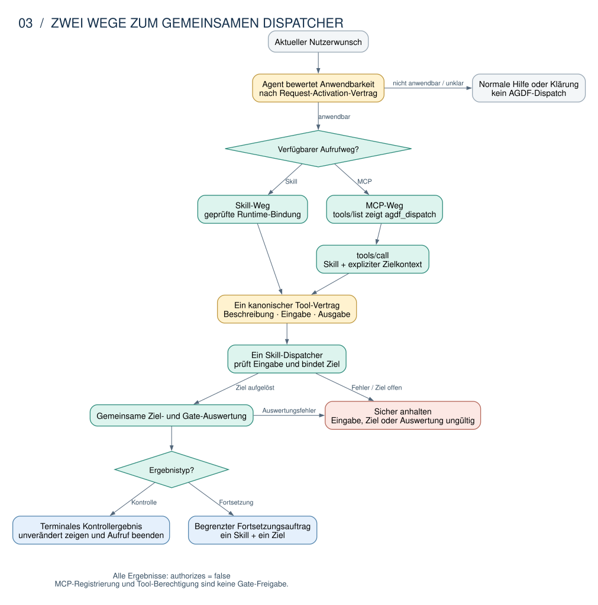
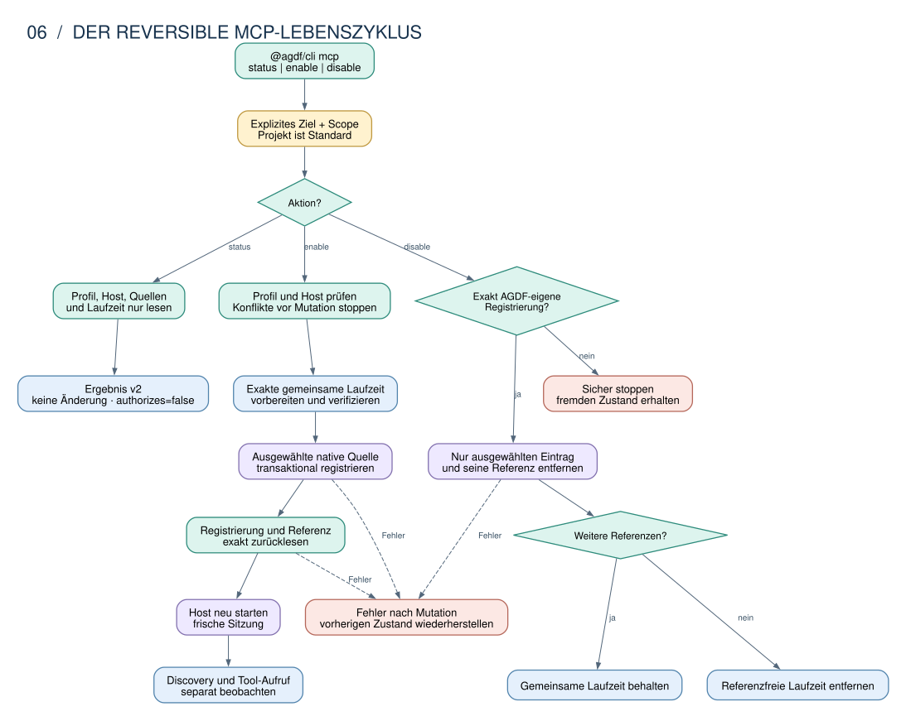

# Technische Architektur von AGDF

AGDF verbindet Anweisungen für Coding-Agenten, lokal ausführbare Prüfungen und einen dauerhaften
Kontrollzustand im Projekt. Der Agent arbeitet weiterhin in Codex, Claude Code, OpenCode oder GitHub
Copilot. AGDF liefert ihm einen gemeinsamen Governance-Pfad und kann diesen Pfad zusätzlich über
einen lokalen MCP-Server als Werkzeug bereitstellen.

Diese Dokumentation erklärt die vorhandene Implementierung für Einsteiger und Maintainer. Sie
beantwortet vier Fragen:

1. Welche Teile laufen im Coding-Agenten und welche gehören zu AGDF?
2. Wie gelangt ein Nutzerwunsch über einen Skill oder MCP zum gleichen Dispatcher?
3. Wie wird MCP für einen Host eingerichtet und wieder vollständig entfernt?
4. Welche Nachweise erlauben welche Aussage über die Unterstützung eines Hosts?

**Stand: 7. September 2026.** Beschrieben ist die kanonische Paketversion **0.14.5** auf Basis des
Implementierungscommits `c95874957ac78bbccd8b7b31a90b71dbe50ce677` und des Runs
[`agdf-cross-host-mcp-integration`](../../.agdf/control/runs/agdf-cross-host-mcp-integration/RUN_STATE.md).
Die Dokumentationsrevision ist für die QA-Entscheidung vorbereitet. Dieser Stand ist keine Aussage
über eine veröffentlichte Paketversion oder eine aktuell in einem Host geladene Installation.

Die normativen Regeln bleiben in den [Runtime-Verträgen](../../plugin/meta/contracts/). Die
verbindliche technische Ausgestaltung des MCP-Lebenszyklus steht im
[Solution Design](../../.agdf/control/artefacts/agdf-cross-host-mcp-integration/SD.md). Zuständigkeiten
sind im [Source-of-Truth-Register](../../.agdf/control/SOT_REGISTRY.md) und im
[Context Graph](../../.agdf/control/CONTEXT_GRAPH.md) festgehalten. Diese Architekturübersicht
erklärt die Zusammenhänge. Sie erzeugt keine eigenen Regeln.

## Der kürzeste Einstieg

Für das Verständnis helfen fünf Begriffe:

| Begriff | Einfache Bedeutung |
|---|---|
| **Host** | Das Programm, in dem der Coding-Agent läuft, zum Beispiel Codex oder Claude Code. Der Host besitzt Modellzugriff, Werkzeuge, Berechtigungen und Sitzungen. |
| **Plugin oder Skills** | Anweisungen und Host-Integration, die dem Agenten sagen, wann und wie AGDF anzuwenden ist. |
| **MCP-Server** | Ein lokaler Prozess, der dem Host das Werkzeug `agdf_dispatch` über den standardisierten MCP-Transport `stdio` anbietet. |
| **MCP-Lebenszyklus** | Die AGDF-Befehle `mcp status`, `mcp enable` und `mcp disable`. Sie lesen oder ändern ausschließlich die native MCP-Konfiguration des ausgewählten Hosts. |
| **Kontrollzustand** | Der ausgewählte Run mit Scope, Artefakten, Nachweisen und Freigaben unter `.agdf/control/`. |

Plugin und MCP erfüllen verschiedene Aufgaben. Das Plugin bringt Anweisungen und hostabhängige
Integration mit. MCP stellt einen ausführbaren, typisierten Werkzeugaufruf bereit. Beide Wege können
denselben Dispatcher erreichen. Weder Installation noch Registrierung erteilen eine AGDF-Freigabe.

```text
Nutzer -> Coding-Agent -> Skill oder agdf_dispatch -> Dispatcher -> Ziel- und Gate-Prüfung

Separat:
@agdf/cli -> mcp status | enable | disable -> Host-Konfiguration -> lokale MCP-Laufzeit
```

## Leseweg

- [Systemkontext](#1-systemkontext): Wo AGDF sitzt und wer handelt.
- [Bausteine](#2-bausteine-und-verantwortlichkeiten): Welche Quelle welche Bedeutung besitzt.
- [Aufrufwege](#3-zwei-wege-zum-gemeinsamen-dispatcher): Wie Skill und MCP zusammenlaufen.
- [MCP-Lebenszyklus](#4-der-mcp-lebenszyklus): Wie Registrierung, Laufzeit und Entfernung funktionieren.
- [Entscheidungsbefugnis](#5-regel-prüfung-und-durchsetzung): Was eine technische Aktion nicht autorisiert.
- [Verteilung](#6-vom-quellstand-zur-geladenen-sitzung): Warum Quelle, Paket und Host getrennt geprüft werden.
- [Nachweise](#7-protokoll-host-und-abnahmenachweise): Welche Evidenz eine Unterstützungszusage trägt.
- [Codeorientierung](#8-orientierung-im-quellcode): Wo Einsteiger die maßgeblichen Module finden.
- [Entscheidungen und Pflege](#9-architekturentscheidungen-grenzen-und-pflege): Welche Gründe die Struktur bestimmen.

## 1. Systemkontext


*Abbildung 1: Logische Systemgrenze. Die Pfeile zeigen Aufrufe und Datenbeziehungen. Der MCP-Server
ist ein lokaler `stdio`-Prozess und kein entfernter AGDF-Dienst.
[Diagrammquelle](diagrams/01-context.dot).*

Der **Mensch** bestimmt Ziel und Scope und erteilt die erforderlichen Freigaben. Der **Host** führt
den Coding-Agenten aus. Er entscheidet, welche Werkzeuge sichtbar sind, welche Prozesse gestartet
werden dürfen und welche Sitzung neu geladen werden muss.

AGDF hat zwei Verbindungen zum Host:

1. **Anweisungsweg:** Plugin und Skills erklären dem Agenten Aktivierung, Arbeitsweise und Grenzen.
2. **Werkzeugweg:** Der lokale MCP-Server stellt genau ein Werkzeug namens `agdf_dispatch` bereit.

Das **Zielprojekt** enthält den bearbeiteten Code und den Kontrollzustand unter `.agdf/control/`.
Ein Run beschreibt genau einen abgegrenzten Arbeitsumfang. Sein kanonischer Zustand liegt unter
`runs/<run_id>/RUN_STATE.md`, zugehörige Artefakte unter `artefacts/<run_id>/`.

Der MCP-Lebenszyklus steht neben diesen Aufrufwegen. Er registriert den Server in der nativen
Host-Konfiguration und verwaltet die lokale Laufzeit. Er entscheidet nicht, ob eine Nutzeranfrage
AGDF aktiviert, welches Projekt das Governance-Ziel ist oder ob ein Gate freigegeben wurde.

Git, Tests und CI können Ergebnisse belegen und Änderungen ausliefern. Ihr erfolgreicher Abschluss
erteilt keine AGDF-Freigabe. Ebenso besitzt AGDF keine allgemeine Kontrolle über jeden Dateizugriff,
jeden Unteragenten oder jeden Prozess des Hosts.

## 2. Bausteine und Verantwortlichkeiten


*Abbildung 2: Die Architektur hat gemeinsame semantische Eigentümer und dünne Host-Adapter.
[Diagrammquelle](diagrams/02-components.dot).*

| Bereich | Aufgabe | Maßgebliche Quelle |
|---|---|---|
| Verträge und Skills | Beschreiben Aktivierung, Arbeitsweise, Grenzen und erforderliche Nachweise. | [`plugin/meta/contracts/`](../../plugin/meta/contracts/), [`plugin/skills/`](../../plugin/skills/) |
| Tool-Semantik | Besitzt Name, Beschreibung, Eingabe- und Ausgabeschema sowie Annotationen von `agdf_dispatch`. | [`skill-dispatch/contract.js`](../../create-agdf/lib/skill-dispatch/contract.js) |
| Dispatch | Prüft Eingaben, bindet das Ziel und liefert ein terminales Kontrollergebnis oder einen begrenzten Fortsetzungsauftrag. | [`skill-dispatch/service.js`](../../create-agdf/lib/skill-dispatch/service.js) |
| MCP-Server | Übersetzt MCP `tools/list` und `tools/call` in den vorhandenen Dispatch-Aufruf. | [`agdf-mcp-server/`](../../agdf-mcp-server/), [`mcp-dispatch-runtime.js`](../../create-agdf/lib/mcp-dispatch-runtime.js) |
| MCP-Fähigkeitsprofil | Definiert Version, Hosts, Scopes, Zustandsvokabular, Laufzeitidentität und Qualifikationsfelder. | [`agdf-mcp-capability.json`](../../plugin/meta/agdf-mcp-capability.json), [`mcp-lifecycle/profile.js`](../../create-agdf/lib/mcp-lifecycle/profile.js) |
| MCP-Lebenszyklus | Orchestriert Status, Aktivierung, Deaktivierung, Migration, Referenzen und Rollback. | [`mcp-lifecycle/service.js`](../../create-agdf/lib/mcp-lifecycle/service.js) |
| MCP-Host-Adapter | Lesen und ändern ausschließlich die native Konfiguration eines Hosts. | [`mcp-lifecycle/adapters/`](../../create-agdf/lib/mcp-lifecycle/adapters/) |
| Gemeinsame MCP-Laufzeit | Hält die exakte Server- und Dispatcher-Version sowie Referenzen aller Registrierungen im gleichen Bereich. | [`mcp-lifecycle/package.js`](../../create-agdf/lib/mcp-lifecycle/package.js) |
| Kontrollzustand und Prüfung | Lesen und validieren Run, Artefakte, Freigaben und Voraussetzungen. | [`control-state/`](../../create-agdf/lib/control-state/), [`control-evaluation/`](../../create-agdf/lib/control-evaluation/) |
| Darstellung | Erzeugt menschliche Texte aus stabilen Codes. | [`interaction-presentation.js`](../../create-agdf/lib/interaction-presentation.js), [`mcp-lifecycle/presentation.js`](../../create-agdf/lib/mcp-lifecycle/presentation.js) |
| Plugin-Installation | Installiert Skills, Hooks und Host-Payloads. Sie bleibt vom MCP-Lebenszyklus getrennt. | [`installers/`](../../create-agdf/lib/installers/), [`host-adapters/`](../../create-agdf/lib/host-adapters/) |

Die wichtigste Eigentumsregel lautet: **Die vollständige Bedeutung von `agdf_dispatch` existiert nur
einmal.** Das Fähigkeitsprofil und die Host-Adapter dürfen den Tool-Namen referenzieren. Sie dürfen
Beschreibung oder Schemas nicht kopieren. Dadurch können ein besser formulierter Tool-Vertrag und
eine strengere Eingabeprüfung nicht unbemerkt zwischen Hosts auseinanderlaufen.

Die zweite wichtige Regel lautet: **Ein Adapter besitzt nur die Besonderheiten seines Hosts.** Er
kennt Konfigurationsorte, Prioritäten und native Scopes. Paketbeschaffung, Dispatcher-Semantik,
Gate-Auswertung und gemeinsame Ergebnisdarstellung bleiben außerhalb des Adapters.

## 3. Zwei Wege zum gemeinsamen Dispatcher



*Abbildung 3: Zwei Einstiegspunkte, ein semantischer Vertrag und ein Dispatcher.
[Diagrammquelle](diagrams/03-dispatch.dot).*

### 3.1 Agentennativer Skill-Weg

Der Agent beurteilt anhand des
[Aktivierungsvertrags](../../plugin/meta/contracts/request-activation.md), ob der Nutzer gerade eine
AGDF-relevante Umsetzung beauftragt. Eine Erklärung oder reine Diagnose aktiviert keinen
Delivery-Prozess. Bei positiver Aktivierung verwendet der Agent eine geprüfte Skill-Bindung mit
Programm, Validatorpfad, Host und erwarteter Version.

### 3.2 MCP-Werkzeugweg

Ein MCP-fähiger Host startet den lokalen Server und fragt mit `tools/list` nach verfügbaren
Werkzeugen. AGDF liefert genau `agdf_dispatch`. Ein anschließendes `tools/call` enthält den
Skill-Namen sowie expliziten Ziel- und Laufkontext. OpenCode zeigt das Werkzeug wegen seiner
Host-Namensbildung als `agdf_agdf_dispatch`; auf Serverebene bleibt der Name `agdf_dispatch`.

Der Server enthält keine zweite fachliche Funktion. Er importiert den kanonischen Vertrag und ruft
den vorhandenen Dispatcher auf. Damit erhalten Skill- und MCP-Weg dieselbe Zielauflösung, dieselbe
Gate-Auswertung und dieselben terminalen Fehlergrenzen.

### 3.3 Gemeinsame Grenzen

**Zielprojekt, Arbeitsverzeichnis und Belegquelle sind verschiedene Rollen.** Ein referenziertes
Repository wird nicht automatisch zum Governance-Ziel. Der Aufruf muss ein belastbares Ziel aus
`explicit_target`, `continued_target` oder `current_repository` tragen.

Jedes Dispatcher-Ergebnis trägt `authorizes: false`. Ein Ergebnis kann zeigen, was erlaubt oder
blockiert ist. Es kann keine menschliche Freigabe erzeugen. Ein terminales Ergebnis wird vom Host
unverändert dargestellt und beendet diesen Dispatch-Aufruf. Ein Fortsetzungsauftrag bindet genau
einen Skill und ein Ziel, er erteilt aber ebenfalls keine Gate-Freigabe.

## 4. Der MCP-Lebenszyklus



*Abbildung 4: Reversibler Lebenszyklus mit explizitem Scope und referenzgezählter Laufzeit.
[Diagrammquelle](diagrams/06-mcp-lifecycle.dot).*

Der öffentliche Einstieg ist für alle vier Hosts gleich:

```bash
npx --yes @agdf/cli@latest mcp status  --surface <codex|claude|opencode|copilot> --dir <projekt>
npx --yes @agdf/cli@latest mcp enable  --surface <codex|claude|opencode|copilot> --dir <projekt>
npx --yes @agdf/cli@latest mcp disable --surface <codex|claude|opencode|copilot> --dir <projekt>
```

Der Projektbereich ist Standard. Der Benutzerbereich muss mit `--scope user` ausdrücklich gewählt
werden. Das angegebene `--dir` ist das technische Lifecycle-Ziel. Es ersetzt keine semantische
Zielauflösung eines späteren Dispatch-Aufrufs.

### 4.1 `status` liest nur

`status` validiert das Profil, prüft den Host, liest alle relevanten nativen Quellen und untersucht
eine vorhandene AGDF-Laufzeit. Der Befehl erstellt kein Verzeichnis, installiert kein Paket, startet
keinen Login und ändert keine Konfiguration. Er unterscheidet unter anderem:

- keine Registrierung
- passende AGDF-Registrierung
- fremde Registrierung
- veraltete AGDF-eigene Registrierung
- Konflikt durch eine Quelle mit höherer Priorität
- ungültige Konfiguration

### 4.2 `enable` registriert kontrolliert

`enable` prüft zuerst Profil, Host, Scope und Quellenpriorität. Bei einer fremden Registrierung oder
einem Konflikt endet der Vorgang vor der ersten Änderung. Danach bereitet der Service eine exakte
Laufzeit vor, schreibt nur den ausgewählten nativen Konfigurationseintrag und liest ihn wieder ein.
Schlägt ein Schritt fehl, stellt die Transaktion den vorherigen Zustand wieder her.

Die vier Adapter verwenden ihre jeweiligen nativen Quellen:

| Host | Projekt | Benutzer | Besonderheit |
|---|---|---|---|
| Codex | `.codex/config.toml` | `$CODEX_HOME/config.toml` | Projekt- und Benutzerquelle werden getrennt geprüft. |
| Claude Code | nativer Scope `local` | nativer Scope `user` | Registrierung erfolgt über die native Claude-MCP-Schnittstelle. |
| OpenCode | `opencode.json` | `$OPENCODE_CONFIG_DIR/opencode.json` | 1.x verwendet `mcp.agdf`, 2.x `mcp.servers.agdf`. |
| GitHub Copilot | `.github/mcp.json` | `~/.copilot/mcp-config.json` | Eine Projektdatei `.mcp.json` besitzt höhere Priorität und kann die verwaltete Quelle blockieren. |

Eine erfolgreiche Registrierung bedeutet zunächst `configured_pending_restart` oder
`configured_unverified`. Erst eine frische Host-Sitzung kann zeigen, ob der Server entdeckt und das
Werkzeug tatsächlich aufgerufen wird.

### 4.3 Eine Laufzeit kann mehrere Registrierungen tragen

Alle Host-Registrierungen desselben Projektbereichs und derselben AGDF-Version verweisen auf eine
gemeinsame Laufzeit:

```text
<AGDF_DATA_ROOT>/mcp/project/<ziel-digest>/<agdf-version>/
<AGDF_DATA_ROOT>/mcp/user/<agdf-version>/
```

Die Laufzeit speichert ihre genaue Herkunft und eine sortierte Referenzmenge. Eine Referenz besteht
aus Host, nativem Scope und ausgewählter Konfigurationsquelle. Dadurch kann beispielsweise Codex
deaktiviert werden, während OpenCode dieselbe Laufzeit weiterhin verwendet.

Ältere hostspezifische Laufzeitpfade werden erkannt. `enable` kann eine exakt AGDF-eigene
Registrierung auf den gemeinsamen Pfad migrieren. Fremde oder nicht verifizierbare Laufzeiten werden
nicht übernommen.

### 4.4 `disable` entfernt nur AGDF-eigenen Zustand

`disable` entfernt ausschließlich die passende AGDF-eigene Registrierung aus der ausgewählten
Quelle. Andere MCP-Server und andere Host-Einstellungen bleiben erhalten. Anschließend entfernt der
Service die zugehörige Referenz. Die gemeinsame Laufzeit wird erst gelöscht, wenn keine weitere
Registrierung mehr auf sie verweist.

## 5. Regel, Prüfung und Durchsetzung

| Ebene | Was sie leistet | Was daraus nicht folgt |
|---|---|---|
| Anweisung | Ein Vertrag oder Skill sagt dem Agenten, wie er handeln soll. | Dass der Host jede Abweichung technisch verhindert. |
| MCP-Registrierung | Eine native Host-Konfiguration verweist auf den AGDF-Server. | Dass der Host die Konfiguration geladen oder das Werkzeug aufgerufen hat. |
| Werkzeugberechtigung | Der Host oder Nutzer erlaubt einen Prozess oder Tool-Aufruf. | Dass AGDF aktiviert oder ein Gate freigegeben wurde. |
| Maschinenprüfung | Ein Validator prüft konkrete Eingaben und liefert ein reproduzierbares Ergebnis. | Dass der Aufruf in jeder Sitzung stattgefunden hat. |
| Menschliche Freigabe | Eine bewusste Antwort wird gegen Run, Gate, Revision und Artefakt geprüft. | Eine allgemeine Werkzeug- oder Dateizugriffsberechtigung. |
| Technische Durchsetzung | Ein Host-Mechanismus kann eine Aktion auf seinem erfassten Pfad stoppen. | Eine vollständige Sperre aller Werkzeuge, Unteragenten oder externen Prozesse. |

Die [Freigabeprüfung](../../create-agdf/lib/control-state/gate-approval-validator.js) verlangt eine
bewusste Nutzereingabe mit `Approval: <Gate>` sowie unveränderte Run-, Gate- und Revisionsidentität.
Plugin-Installation, MCP-Registrierung, `tools/list`, `tools/call`, Prozessberechtigung und ein
erfolgreicher Test sind dafür keine Ersatzsignale.

Das gemeinsame MCP-Ergebnis macht diese Grenze maschinenlesbar. Es enthält immer
`authorizes: false` und unterscheidet Fähigkeit, Registrierung, Discovery und Endergebnis. Stabile
Codes besitzen die Bedeutung. Englische und deutsche Texte werden daraus abgeleitet und dürfen
keine zusätzlichen Zustände erfinden.

## 6. Vom Quellstand zur geladenen Sitzung


*Abbildung 5: Quelle, Paket, Installation, Registrierung und geladene Sitzung benötigen eigene
Nachweise. [Diagrammquelle](diagrams/04-distribution.dot).*

[`sync-package-assets.js`](../../create-agdf/scripts/sync-package-assets.js) und
[`sync-plugin-runtime.js`](../../create-agdf/scripts/sync-plugin-runtime.js) erzeugen verteilbare
Inhalte aus den Repository-Quellen. Generierte Dateien sind abgeleitete Build-Ergebnisse und werden
nicht als eigenständige semantische Eigentümer gepflegt.

Aus den Quellen entstehen zwei getrennte Lieferpfade:

1. **Plugin-Pfad:** Skills, Verträge, Hooks und Host-Metadaten werden erzeugt, paketiert und durch
   den jeweiligen Plugin-Installer installiert.
2. **MCP-Pfad:** Das Paket `@agdf/mcp-server` und die passende `create-agdf`-Laufzeit werden
   vorbereitet. Der Lifecycle-Service registriert den Einstieg anschließend in einer nativen
   Host-Konfiguration.

Ein Plugin darf auf `mcp status` oder `mcp enable` hinweisen. Es aktiviert MCP nicht automatisch.
Der öffentliche OpenAI-Kandidat bleibt ein Skills-only-Payload ohne MCP-Laufzeit und
Lifecycle-Metadaten.

Eine gleiche Versionsnummer belegt keine inhaltliche Gleichheit. AGDF unterscheidet deshalb Quelle,
erzeugtes Payload, Paket, installierten Root, native Registrierung, geladene Sitzung und beobachtetes
Verhalten. Nach Installation oder Registrierung ist ein vollständiger Host-Neustart mit einer neuen
Sitzung erforderlich. Eine wiederhergestellte alte Sitzung kann weiterhin veraltete Inhalte halten.

## 7. Protokoll-, Host- und Abnahmenachweise


*Abbildung 6: Keine Evidenzspur darf eine andere stillschweigend ersetzen.
[Diagrammquelle](diagrams/05-evidence.dot).*

AGDF trennt drei technische Evidenzspuren:

| Spur | Belegt | Belegt nicht |
|---|---|---|
| Repository- und Fixture-Tests | Verträge, Parser, Transaktionen, Rollback, Paketinhalt und erwartete Fehlerfälle. | Dass ein realer Host die Registrierung geladen hat. |
| Kontrollierte MCP-Protokolltests | Dass der Produktionsserver die geprüften MCP-Protokollgenerationen verhandelt und `tools/list` sowie `tools/call` verarbeitet. | Dass Codex, Claude, OpenCode oder Copilot genau dieses Protokoll verwendet haben. |
| Direkte Host-Evidenz | Verhalten eines benannten Hosts mit genauer Version, Variante, Betriebssystem, Scope, Quelle und Laufzeit. | Verhalten anderer Versionen, Varianten oder Betriebssysteme. |

Eine Host-Qualifikation benötigt ein vollständiges Tupel aus Host und Version, Client- und
Sitzungsvariante, Betriebssystem und Architektur, Scope und Konfigurationsquelle, Node-, Server-,
Dispatcher- und SDK-Version, Einstiegspunkt sowie Discovery-, Dispatch-, Fehler- und
Cleanup-Nachweis. Fehlt ein Pflichtfeld, bleibt die Fähigkeit `unverified`.

Der [direkte Nachweis dieses Runs](../../.agdf/control/artefacts/agdf-cross-host-mcp-integration/DIRECT_HOST_EVIDENCE.md)
enthält vier begrenzte macOS-Beobachtungen:

| Host | Direkt beobachtet | Offene Grenze |
|---|---|---|
| Codex CLI 0.145.0 | Registrierung, native Rücklesung, frische Sitzung, ein Dispatch sowie Entfernung. | Kein kontrollierter direkter Fehler- und Recovery-Pfad. |
| OpenCode 1.18.3 | Registrierung, native Liste, ein Dispatch, unveränderte Berechtigungen sowie Entfernung. | Kein kontrollierter direkter Fehlerpfad und keine 2.x-Beobachtung. |
| Claude Code 2.1.193 | Registrierung, native Rücklesung und Entfernung. | Authentifizierung scheiterte vor Discovery und Aufruf. |
| GitHub Copilot Desktop 1.1.15 | Projektdatei, Lifecycle-Status und Entfernung. | Kein aufrufbarer CLI- oder automatisierbarer frischer Desktop-Client. |

Alle vier exakten Tupel bleiben deshalb `unverified`. Die erfolgreichen Teilbeobachtungen werden
nicht zu einer allgemeinen Cross-Host-Unterstützungszusage hochgestuft.

Die menschliche UAT bewertet, ob Status, Aktivierung, Neustart-Hinweis, Recovery und Deaktivierung
verständlich und erwartbar sind. Sie ersetzt weder einen fehlenden Host-Aufruf noch ein fehlendes
Fehler- oder Cleanup-Signal.

## 8. Orientierung im Quellcode

Wer den MCP-Pfad erstmals untersucht, kann in dieser Reihenfolge lesen:

1. [`plugin/meta/agdf-mcp-capability.json`](../../plugin/meta/agdf-mcp-capability.json) zeigt den
   öffentlichen Fähigkeits- und Lifecycle-Vertrag.
2. [`skill-dispatch/contract.js`](../../create-agdf/lib/skill-dispatch/contract.js) besitzt die
   vollständige Semantik von `agdf_dispatch`.
3. [`agdf-mcp-server/`](../../agdf-mcp-server/) stellt diese Semantik über MCP und `stdio` bereit.
4. [`mcp-lifecycle/service.js`](../../create-agdf/lib/mcp-lifecycle/service.js) orchestriert
   `status`, `enable` und `disable`.
5. [`mcp-lifecycle/adapter-contract.js`](../../create-agdf/lib/mcp-lifecycle/adapter-contract.js)
   definiert die gemeinsame Adaptergrenze.
6. [`mcp-lifecycle/adapters/`](../../create-agdf/lib/mcp-lifecycle/adapters/) enthält nur die
   hostabhängigen Konfigurations- und Probewege.
7. [`mcp-lifecycle/result.js`](../../create-agdf/lib/mcp-lifecycle/result.js) und
   [`presentation.js`](../../create-agdf/lib/mcp-lifecycle/presentation.js) erzeugen das gemeinsame
   Ergebnis und seine menschliche Darstellung.
8. [`mcp-lifecycle/evidence.js`](../../create-agdf/lib/mcp-lifecycle/evidence.js) prüft, ob eine
   Host-Qualifikation vollständig genug für die behauptete Fähigkeit ist.

Für Plugin-Installation und Host-Payloads bleiben [`installers/`](../../create-agdf/lib/installers/)
und [`host-adapters/`](../../create-agdf/lib/host-adapters/) zuständig. Diese Module sind keine
zweite MCP-Lifecycle-Implementierung.

## 9. Architekturentscheidungen, Grenzen und Pflege

| Entscheidung | Nutzen | Grenze oder Folgekosten |
|---|---|---|
| Ein semantischer Owner für `agdf_dispatch` | Skill- und MCP-Weg können bei Beschreibung und Schemas nicht auseinanderlaufen. | Änderungen am Vertrag benötigen Konformitätsprüfungen für alle Projektionen. |
| Ein Lifecycle-Service mit geschlossenem Adapterregister | Gemeinsame Zustände, Transaktionen und Recovery werden nur einmal implementiert. | Jede native Host-Schemaänderung benötigt einen gezielten Adaptertest. |
| Native Host-Konfiguration statt AGDF-eigenem Universalformat | Der Host bleibt Eigentümer von Discovery, Trust und Berechtigungen. | Quellenprioritäten und Varianten müssen pro Host gepflegt werden. |
| Eine gemeinsame exakte Laufzeit je Scope-Root | Mehrere Hosts duplizieren den Server nicht und können Referenzen sicher teilen. | Migration und referenzgezählte Entfernung benötigen strenge Herkunftsprüfung. |
| Plugin- und MCP-Lebenszyklus bleiben getrennt | Installation erzeugt keine überraschende ausführbare Registrierung. | Der Nutzer muss MCP bewusst aktivieren und den Host neu starten. |
| Stabile Codes mit abgeleiteter Darstellung | Maschinen- und Menschenausgabe behalten dieselbe Bedeutung. | Neue Zustände benötigen Profil-, Ergebnis- und Locale-Änderungen gemeinsam. |
| Protokoll- und Host-Evidenz bleiben getrennt | Ein Server-Test wird nicht als reale Host-Unterstützung ausgegeben. | Direkte Qualifikation verursacht Prüfaufwand pro exaktem Host-Tupel. |
| Jede Ausgabe bleibt nicht autorisierend | Technische Integration kann keine Governance-Freigabe vortäuschen. | Menschliche Gate-Entscheidungen bleiben ein eigener bewusster Schritt. |

Weiterführende Entscheidungen und offene Lieferstände stehen im
[Context Graph](../../.agdf/control/CONTEXT_GRAPH.md) und
[Master Backlog](../../.agdf/control/MASTER_BACKLOG.md). Bedienungsabläufe erklärt das
[Handbuch](../handbook/de/README.md), Installationsschritte die
[Installationsanleitung](../../INSTALL.md), Befehle die
[CLI-Dokumentation](../../create-agdf/README.md).

Diese Übersicht muss aktualisiert werden, wenn sich Zuständigkeiten, Aufrufreihenfolgen,
Persistenzorte, Host-Quellen, Distributionsprofile, Ergebniszustände oder Nachweisgrenzen ändern.
Dabei sind Text, DOT-Quelle und gerendertes SVG gemeinsam zu prüfen. Aktuelle Testzahlen und
Host-Beobachtungen bleiben in den verlinkten Run-Artefakten maßgeblich.

Die Gliederung orientiert sich in reduziertem Umfang an [arc42](https://arc42.org/overview/) mit
Kontext, Bausteinen, Laufzeit, Verteilung, Entscheidungen und Qualität. Die Diagramme verwenden die
Idee mehrerer Betrachtungsebenen aus [C4](https://c4model.com/diagrams), ohne AGDF-Module als
getrennte Remote-Dienste oder formale C4-Container darzustellen.

### Diagramme bearbeiten

Die Abbildungen liegen als SVG-Dateien vor. Ihre Graphviz-DOT-Quellen liegen jeweils daneben. Alle
wesentlichen Aussagen stehen zusätzlich im Text. Farben unterstützen die Orientierung: Violett
steht für den Host, Gelb für Anweisungen oder Verträge, Grün für gemeinsame AGDF-Funktionen und Blau
für Zustand oder Nachweise.

Nach einer Änderung lässt sich eine Grafik beispielsweise so neu erzeugen:

```bash
dot -Tsvg docs/architecture/diagrams/06-mcp-lifecycle.dot \
  -o docs/architecture/diagrams/06-mcp-lifecycle.svg
```

Vor Übernahme sind Links, SVG-Erzeugung, Lesbarkeit und Übereinstimmung mit den maßgeblichen Quellen
zu prüfen. Eine Grafik ist selbst kein Nachweis für Host-Verhalten oder eine Gate-Freigabe.
