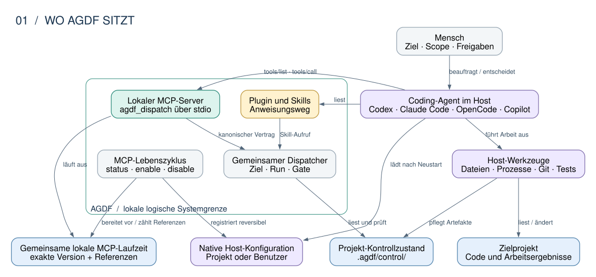
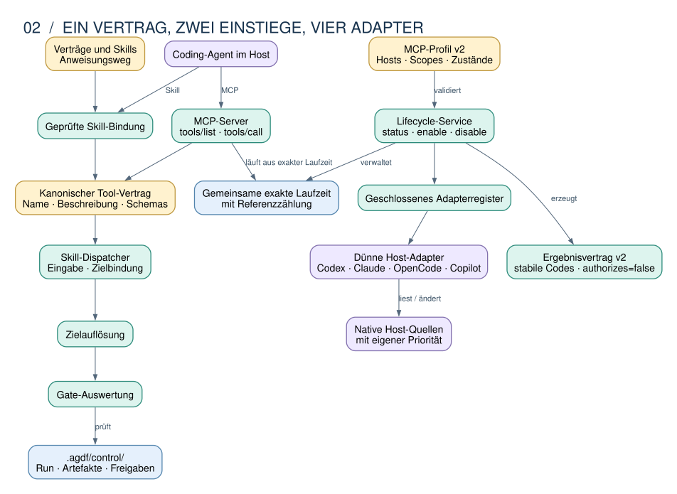
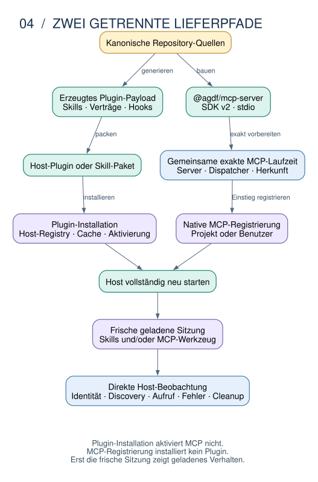

# Technische Architektur von AGDF

AGDF verbindet Arbeitsanweisungen für Agenten mit lokal ausführbaren Prüfungen und dauerhaftem Kontrollzustand im Projekt. Der Agent arbeitet im jeweiligen Host. AGDF strukturiert seine Arbeit, prüft Voraussetzungen und macht sichtbar, welche Schritte durch Scope, Nachweise und Freigaben gedeckt sind.

Diese Dokumentation erklärt die vorhandene Implementierung. Sie richtet sich an Entwickler und Maintainer, die verstehen wollen, wo eine Entscheidung entsteht, welcher Baustein dafür zuständig ist und was eine Prüfung tatsächlich nachweist.

**Stand: 5. September 2026.** Betrachtet wird das Arbeitsverzeichnis mit der kanonischen Paketversion **0.14.5**, auf Basis von Commit `4ae59725fc583b5816334af47b08e446f51739b6` und den lokalen Änderungen an Host-Adaptern und Kompatibilitätsnachweisen. Diese Änderungen befinden sich im [Run zur Host-Kompatibilität](../../.agdf/control/runs/agdf-host-adapter-compatibility/RUN_STATE.md) bei QA mit Agentenentscheidung `pass`. Die menschlichen QA- und UAT-Freigaben stehen aus. Der beschriebene Quellstand ist deshalb keine Aussage über eine veröffentlichte oder aktuell in einem Host geladene Installation.

Die normativen Regeln bleiben in den [Runtime-Verträgen](../../plugin/meta/contracts/). Zuständigkeiten sind im [Source-of-Truth-Register](../../.agdf/control/SOT_REGISTRY.md) und im [Context Graph](../../.agdf/control/CONTEXT_GRAPH.md) nachvollziehbar. Bei Widersprüchen haben diese Quellen und ihre jeweiligen Implementierungsverantwortlichen Vorrang vor dieser erklärenden Darstellung.

## Leseweg

- [Systemkontext](#1-systemkontext): Wo AGDF sitzt und wer tatsächlich handelt.
- [Bausteine](#2-bausteine-und-verantwortlichkeiten): Gemeinsamer Kern, Host-Anbindung und Projektzustand.
- [Laufzeit](#3-vom-nutzerwunsch-zum-skill): Wie ein Aufruf zu einem Ziel und einem Kontrollergebnis gelangt.
- [Entscheidungsbefugnis](#4-regel-prüfung-und-durchsetzung): Welche Aussagen Anweisungen, Prüfungen und Berechtigungen tragen.
- [Verteilung](#5-vom-quellstand-zur-geladenen-installation): Warum gleiche Versionsnummern allein nicht genügen.
- [Qualität](#6-kompatibilität-und-nachweise): Welche Unterstützung tatsächlich nachgewiesen ist.
- [Entscheidungen und Pflege](#7-architekturentscheidungen-grenzen-und-pflege): Begründungen, Grenzen und Quellen für Änderungen.

## 1. Systemkontext



*Abbildung 1: Logische Systemgrenze. Die Pfeile zeigen Aufrufe und Datenbeziehungen, keine eigenständigen Netzwerkdienste. [Diagrammquelle](diagrams/01-context.dot).*

Der **Mensch** bestimmt Ziel und Scope und erteilt die erforderlichen Freigaben. Der **Host** stellt Modellzugriff, Werkzeuge, Berechtigungen, Plugin-Erkennung und Sitzung bereit. AGDF liefert Skills, Verträge, Prüflogik und die Anbindung an diese Host-Funktionen.

Das **Zielprojekt** enthält den bearbeiteten Code und den Kontrollzustand unter `.agdf/control/`. Ein Run beschreibt einen abgegrenzten Arbeitsumfang. Seine kanonischen Angaben liegen unter `runs/<run_id>/RUN_STATE.md`, zugehörige Artefakte unter `artefacts/<run_id>/`. Ein Backlog oder eine Statuskarte hilft bei der Orientierung, ersetzt aber nicht den ausgewählten Run und seine Nachweise.

Git, Tests und CI können Ergebnisse belegen und Änderungen ausliefern. Ihr erfolgreicher Abschluss erteilt für sich genommen keine AGDF-Freigabe. Ebenso besitzt AGDF keine allgemeine Kontrolle über jeden Dateizugriff oder jeden Prozess des Hosts.

**Quellen:** [Plugin-Definition](../../plugin/meta/agdf-plugin.definition.json), [Control State](../../create-agdf/lib/control-state/), [CLI-Komposition](../../create-agdf/lib/cli/application.js).

## 2. Bausteine und Verantwortlichkeiten



*Abbildung 2: Verantwortungsbereiche im Repository. „Kern“ bezeichnet hier gemeinsame Funktionen, kein zusätzliches Paket. [Diagrammquelle](diagrams/02-components.dot).*

| Bereich | Aufgabe | Maßgebliche Quelle |
|---|---|---|
| Verträge und Skills | Beschreiben Aktivierung, Arbeitsweise, Grenzen und erforderliche Nachweise. | [`plugin/meta/contracts/`](../../plugin/meta/contracts/), [`plugin/skills/`](../../plugin/skills/) |
| Gemeinsame Definition und Erzeugung | Übertragen Skill-Identität, Routing und Inhalte in die jeweiligen Host-Formate. | [`agdf-plugin.definition.json`](../../plugin/meta/agdf-plugin.definition.json), [`sync-package-assets.js`](../../create-agdf/scripts/sync-package-assets.js) |
| Zielauflösung und Dispatch | Binden einen benannten Skill an das richtige Projekt und liefern Kontrollergebnis oder Fortsetzungsauftrag. | [`task-target-resolution.js`](../../create-agdf/lib/task-target-resolution.js), [`skill-dispatch/service.js`](../../create-agdf/lib/skill-dispatch/service.js) |
| Kontrollzustand und Prüfung | Lesen und validieren Run-Identität, Artefakte, Freigaben und Voraussetzungen. | [`control-state/`](../../create-agdf/lib/control-state/), [`control-evaluation/`](../../create-agdf/lib/control-evaluation/) |
| Darstellung | Erzeugen lokalisierte Status-, Ziel- und Freigabedarstellungen aus den Prüfergebnissen. | [`interaction-presentation.js`](../../create-agdf/lib/interaction-presentation.js) |
| Installation und Lebenszyklus | Koordinieren Vorbereitung, native Aufrufe, Status, Migration und Wiederherstellung. | [`installers/`](../../create-agdf/lib/installers/), [`lifecycle/`](../../create-agdf/lib/lifecycle/) |
| Host-Adapter | Kapseln konkrete Plugin-Befehle, Versionsprojektionen und hostabhängige Berechtigungsmechanismen. | [`host-adapters/`](../../create-agdf/lib/host-adapters/) |
| Laufzeit und Einwilligung | Prüfen die verwendete Laufzeit und verwalten die begrenzte Einwilligung zu automatischen Checks. | [`runtime/`](../../create-agdf/lib/runtime/), [`runtime-check-consent/`](../../create-agdf/lib/runtime-check-consent/) |

Die Trennung ist vorhanden, aber nicht jede Host-Besonderheit liegt bereits physisch unter `host-adapters/`. Beispielsweise bleiben OpenCode-Installation, Copilot-Transport, Skill-Erkennung und Claude-Cache-Recovery spezialisierte Module unter `installers/`. Der bisherige Plugin-Installer dient für Codex, Claude und Copilot als Fassade zu den ausgelagerten Adaptern. Das Diagramm beschreibt diese tatsächliche Verteilung und behauptet keine abgeschlossene Vereinheitlichung aller Pfade.

Für die Wartung folgt daraus eine praktische Orientierung: Eine Änderung am erlaubten nächsten Schritt gehört zum gemeinsamen Kontrollmodell. Eine andere native Installationssyntax gehört zur Host-Anbindung. Eine schönere Statuskarte darf keine zusätzliche Gate-Logik erhalten.

## 3. Vom Nutzerwunsch zum Skill


*Abbildung 3: Vereinfachter direkter Skill-Aufruf bei bereits vorhandenem Laufzeit-Binding. Die semantische Aktivierung durch den Agenten ist getrennt von der ausführbaren Prüfung dargestellt. [Diagrammquelle](diagrams/03-dispatch.dot).*

Zuerst beurteilt der Agent anhand des [Aktivierungsvertrags](../../plugin/meta/contracts/request-activation.md), welchen Effekt der aktuelle Wunsch hat. Eine Erklärung über AGDF aktiviert noch keinen Delivery-Prozess. Ein Änderungsauftrag, eine ausdrücklich benannte AGDF-Operation oder die Fortsetzung eines gebundenen Runs können die entsprechende Operation aktivieren. Diese Entscheidung gilt für die Anfrage und wird nicht als dauerhafte Prompt-Klassifikation gespeichert.

Nach positiver Aktivierung wird das Arbeitsziel gebunden. **Zielprojekt, aktuelle Arbeitsumgebung und bloße Belegquelle sind verschiedene Rollen.** Eine referenzierte Datei in einem anderen Repository macht dieses Repository nicht automatisch zum Änderungsziel. Bei mehreren plausiblen Zielen endet die Auflösung mit einem Klärungsbedarf.

Für den ausführbaren Skill-Aufruf wird ein geprüfter Aufrufkontext verwendet: Programm, Validatorpfad, erlaubte Argumentform, Host und erwartete Version. [`binding.js`](../../create-agdf/lib/skill-dispatch/binding.js) prüft diese Bindung und die ausführbare Laufzeit. Bei fehlender Bindung ist ein frei erfundener Ersatzpfad keine dokumentierte Recovery.

Der [`Skill-Dispatcher`](../../create-agdf/lib/skill-dispatch/service.js) prüft die Eingabe, löst das Ziel auf und ruft die gemeinsame Gate-Auswertung auf. Bei einem deterministischen Kontroll-Skill liefert er eine abschließende Darstellung. Bei einem fortzusetzenden Skill liefert er dessen Identität, das gebundene Ziel und gegebenenfalls einen Kontrollsnapshot. Die Fortsetzung ist ein Auftrag an den Agenten, den benannten Skill unter dessen Regeln auszuführen. Der Dispatcher implementiert nicht selbst sämtliche Review- oder QA-Arbeit.

Unaufgelöste Ziele, fehlerhafte Eingaben oder Evaluatorfehler liefern einen abschließenden Fehler- beziehungsweise Recovery-Pfad. Das Ergebnis trägt `authorizes: false`. Die nachfolgende Host-Interaktion muss diese Grenze einhalten.

**Beispiel:** „Prüfe den Task Plan von Projekt B“ aus einem Arbeitsverzeichnis von Projekt A verlangt eine Bindung an B. Eine Freigabe aus A und der dortige Run-Zustand liefern keine Entscheidungsgrundlage für B.

## 4. Regel, Prüfung und Durchsetzung

| Ebene | Was sie leistet | Was daraus nicht folgt |
|---|---|---|
| Anweisung | Ein Vertrag oder Skill sagt dem Agenten, wie er handeln soll. | Dass der Host jede Abweichung technisch verhindert. |
| Maschinenprüfung | Ein aufgerufener Validator prüft konkrete Eingaben und liefert ein reproduzierbares Kontrollergebnis. | Dass der Aufruf in jeder Sitzung tatsächlich stattgefunden hat. |
| Menschliche Freigabe | Eine bewusste Antwort wird gegen erwarteten Run, Gate, Revision und bereites Artefakt geprüft. | Eine allgemeine Werkzeug- oder Dateizugriffsberechtigung. |
| Technische Durchsetzung | Ein konkreter Host-Mechanismus kann eine bestimmte Aktion auf seinem erfassten Ausführungspfad stoppen. | Eine vollständige Sperre aller Werkzeuge, Unteragenten oder externen Prozesse. |

Die [Freigabeprüfung](../../create-agdf/lib/control-state/gate-approval-validator.js) verlangt unter anderem bewusste Nutzereingabe, die erwartete Formel `Approval: <Gate>` und unveränderte Run-, Gate- und Revisionsidentität. Die [Darstellung](../../create-agdf/lib/interaction-presentation.js) zeigt diesen Entscheidungsstand. Sie erfindet keine eigene Übergangsregel.

Automatische Laufzeitprüfungen haben eine separate Einwilligung. Der [Coordinator](../../create-agdf/lib/runtime-check-consent/coordinator.js) unterscheidet Aktivieren, manuelle Prüfung und Abbruch. Die Einwilligung und ihre Identitätsbindung werden gemeinsam verwaltet, die native Umsetzung hängt vom Host ab. Eine gespeicherte Einwilligung beweist weder wirksames Hook-Vertrauen noch einen erfolgten Check.

Der [erzeugte Session-Check](../../create-agdf/scripts/sync-plugin-runtime.js) dient einem begrenzten lokalen Einstieg ohne freie Argumente. Session-Kontext, automatische Prüfung, Aktivierung einer Nutzeranfrage und Gate-Freigabe sind getrennte Vorgänge. Das hilft etwa bei der Diagnose: „Plugin vorhanden“, „Prüfung erlaubt“, „Prüfung beobachtet“ und „Arbeit freigegeben“ können unterschiedliche Zustände haben.

## 5. Vom Quellstand zur geladenen Installation



*Abbildung 4: Jeder Übergang hat eigene Nachweise. Der Build bildet keinen automatischen Nachweis für die später geladene Sitzung. [Diagrammquelle](diagrams/04-distribution.dot).*

[`sync-package-assets.js`](../../create-agdf/scripts/sync-package-assets.js) und [`sync-plugin-runtime.js`](../../create-agdf/scripts/sync-plugin-runtime.js) erzeugen die verteilbaren Inhalte aus den Repository-Quellen. Generierte Laufzeitdateien sind abgeleitete Build-Ergebnisse. Änderungen werden an ihren Quellen vorgenommen.

Die [Distributionsprofile](../../create-agdf/lib/runtime/plugin-provenance.js) unterscheiden unter anderem ein Runtime-Plugin, das Copilot-Payload, OpenCodes konfigurationslokales Paket und portable Skills. Nicht jedes Profil enthält einen lokalen Validator. [`local-validator.js`](../../create-agdf/lib/runtime/local-validator.js) prüft passend zum Profil Version, verfügbare Einstiegspunkte und gegebenenfalls Digest und Herkunft. Sein lokaler Auflösungspfad weist ausdrücklich keinen Registry-Zugriff aus.

Beim Installieren werden die Unterschiede konkret:

| Host | Mechanismus im betrachteten Quellstand | Zweck |
|---|---|---|
| Codex | [Lokale Versionskennung mit Inhaltsdigest](../../create-agdf/lib/host-adapters/codex/identity.js) | Unterschiedliche lokale Inhalte erhalten unterscheidbare Installationsidentitäten. |
| Claude Code | [Erneute Installation bei Inhaltsänderungen](../../create-agdf/lib/host-adapters/claude/plugin.js) | Auch bei gleicher öffentlicher Versionsnummer wird der Inhalt erneuert. |
| GitHub Copilot | [Git-Transport](../../create-agdf/lib/installers/copilot-marketplace-transport.js) und [Skill-Erkennung](../../create-agdf/lib/installers/copilot-skill-discovery.js) | Der Adapter prüft mehr als einen sichtbaren Plugin-Eintrag. |
| OpenCode | [Konfigurationslokale Installation](../../create-agdf/lib/installers/opencode.js) und [Repository-Aktivierung](../../create-agdf/lib/installers/opencode-activation.js) | Globale Verfügbarkeit und Aktivierung für ein konkretes Projekt bleiben unterscheidbar. |

Diese Mechanismen sind Antworten der aktuellen AGDF-Implementierung auf die jeweiligen Integrationspfade. Sie sind keine zeitlose Zusage über jedes Host-Produkt und jede Version.

Eine erfolgreiche Wiederherstellung muss außerdem angeben, was wiederhergestellt wurde: Dateien, Registrierung, Einstellungen oder tatsächlich geladene Sitzung. Die [Marketplace-Vorbereitung](../../create-agdf/lib/installers/local-marketplace.js) und die Host-Installer behandeln eigene Zustände und Recovery. Daraus lässt sich kein allgemeiner atomarer Rollback über Host, Dateisystem und laufende Sitzung ableiten.

## 6. Kompatibilität und Nachweise


*Abbildung 5: Fähigkeiten werden einzeln belegt. Die Verbindung zwischen den Kästen ist keine automatische Höherstufung. [Diagrammquelle](diagrams/05-evidence.dot).*

Für alle vier Hosts fragt die gemeinsame Kompatibilitätsprüfung nach denselben fünf Ergebnissen:

1. **Installiert:** Der jeweilige Installationspfad wurde erfolgreich durchlaufen und geprüft.
2. **Entdeckt:** Die vorgesehenen Skills sind für den geprüften Pfad erkennbar.
3. **Aufrufbar:** Ein gebundener Aufruf erreicht das erwartete Ergebnis.
4. **Aktualisiert:** Der erwartete neue Inhalt wird wirksam, auch bei problematischen Versionskonstellationen.
5. **Wiederherstellbar:** Ein definierter Fehler führt zur vorgesehenen Recovery oder zu einem klaren manuellen Übergabepunkt.

Der [datierte Kompatibilitätsbericht](../compatibility/HOST_COMPATIBILITY.md) enthält für den betrachteten Stand **56 deterministische Szenarien ohne unerwarteten Fehler**. Diese Szenarien verwenden isolierte Produktions-Fixtures. Ein erwarteter Fehlerfall kann einen Test bestehen, während die darin beobachtete Fähigkeit gerade fehlgeschlagen ist.

Der Bericht weist die nativen Kombinationen aus Host, Version und Betriebssystem weiterhin als **nicht nachgewiesen** aus. Seine vier Zusagen bleiben getrennt: verfügbare Skills, automatische Checks, beobachtete Governance und technische Durchsetzung. Eine einzelne Fähigkeit schließt die übrigen nicht ein. Für Durchsetzung gehört auch der konkret erfasste Haupt- oder Unteragentenpfad zum Nachweis.

**Quellen:** [Gemeinsame Szenarien](../../create-agdf/scripts/host-compatibility-test.js), [Auswertung und Projektion](../../scripts/host-compatibility/), [Beobachtungsmanifest](../../evals/host-compatibility/manifest.json), [genaue Beobachtungen und Identitäten](../compatibility/evidence/snapshot.json).

## 7. Architekturentscheidungen, Grenzen und Pflege

Die folgenden Entscheidungen sind aus den vorhandenen Quellen zusammengefasst. Diese Tabelle führt keine neuen Architekturentscheidungen ein.

| Entscheidung | Nutzen | Grenze oder Folgekosten |
|---|---|---|
| Gemeinsame Kontrolllogik mit Host-Anbindung | Gate- und Zielregeln müssen nicht für jeden Host neu implementiert werden. | Native Aufrufe, Startbedingungen und Berechtigungen benötigen eigene Wartung und Tests. |
| Kanonischer Zustand im Repository | Run, Scope und Artefakte bleiben sichtbar und prüfbar. | Dateien sind keine manipulationssichere Datenbank. Mehrere Runs und widersprüchliche Zustände müssen ausdrücklich aufgelöst werden. |
| Erzeugte Host-Payloads aus gemeinsamen Quellen | Routing und Inhalte erhalten klare Verantwortliche. | Quelle, Paket, Cache und Sitzung können auseinanderlaufen. |
| Lokal gebundene Prüfung mit Version und Herkunft | Der geprüfte Validator und seine Grenzen lassen sich benennen. | Fehlende oder unpassende Laufzeit benötigt Reparatur statt eines stillen Ersatzes. |
| Statusdarstellung als abgeleitetes Ergebnis | Nutzer und Maschine beziehen sich auf dasselbe Kontrollmodell. | Die korrekte Übertragung durch den Host bleibt gesondert zu prüfen. |
| Fähigkeiten mit konkreten Belegen ausweisen | Ein erfolgreicher Teilnachweis wird nicht zur pauschalen Unterstützungszusage. | Reale Host- und Betriebssystembeobachtungen verursachen zusätzlichen Prüfaufwand. |

Weiterführende Entscheidungen und offene Lieferstände stehen im [Context Graph](../../.agdf/control/CONTEXT_GRAPH.md) und [Master Backlog](../../.agdf/control/MASTER_BACKLOG.md). Bedienungsabläufe erklärt das [Handbuch](../handbook/de/README.md), Installationsschritte die [Installationsanleitung](../../INSTALL.md), Befehle die [CLI-Dokumentation](../../create-agdf/README.md).

Für die Pflege dieser Architekturübersicht sind vor allem geänderte Zuständigkeiten, Aufrufreihenfolgen, Persistenzorte, Distributionsprofile und Nachweisgrenzen relevant. Dann sollten das zugehörige Diagramm, seine Quellen und die Standangabe gemeinsam überprüft werden. Aktuelle Testzahlen und Host-Beobachtungen bleiben im verlinkten Kompatibilitätsbericht maßgeblich.

Die Gliederung orientiert sich in reduziertem Umfang an [arc42](https://arc42.org/overview/) mit Kontext, Bausteinen, Laufzeit, Verteilung, Entscheidungen und Qualität. Die Diagramme verwenden die Idee mehrerer Betrachtungsebenen aus [C4](https://c4model.com/diagrams), ohne AGDF-Module als getrennte Dienste oder formale C4-Container darzustellen.

### Diagramme bearbeiten

Die Abbildungen liegen als skalierbare SVG-Dateien vor. Ihre bearbeitbaren Graphviz-DOT-Quellen liegen jeweils daneben. Alle Aussagen sind zusätzlich im Fließtext beschrieben. Farben unterstützen die Orientierung: Violett steht für den Host, Gelb für Anweisungen, Grün für gemeinsame Prüfungen und Blau für Zustand oder Belege.

Nach einer Änderung an einer DOT-Datei lässt sich die zugehörige Grafik mit Graphviz neu erzeugen, beispielsweise vom Repository-Wurzelverzeichnis aus:

```bash
dot -Tsvg docs/architecture/diagrams/01-context.dot -o docs/architecture/diagrams/01-context.svg
```

Vor Übernahme einer Änderung sind die Links, die Lesbarkeit der gerenderten Grafik und die Übereinstimmung mit den referenzierten Quellen zu prüfen. Eine neue Grafik ist selbst kein Nachweis für Host-Verhalten oder eine Gate-Freigabe.
